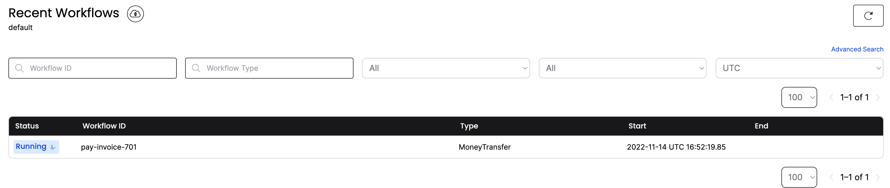
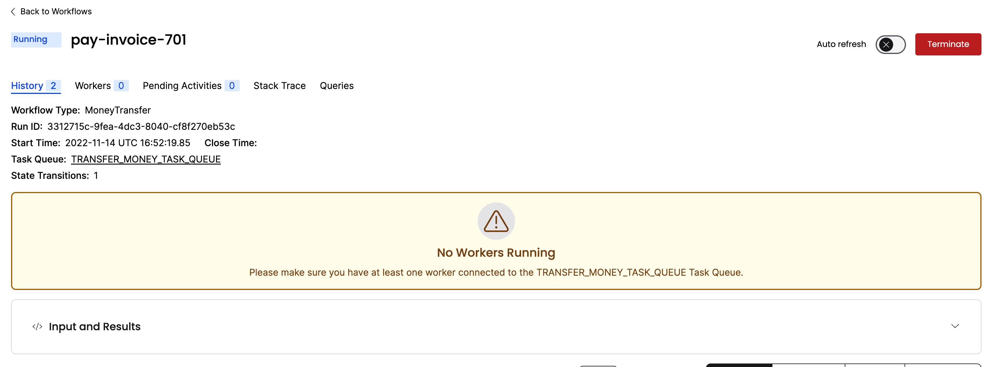
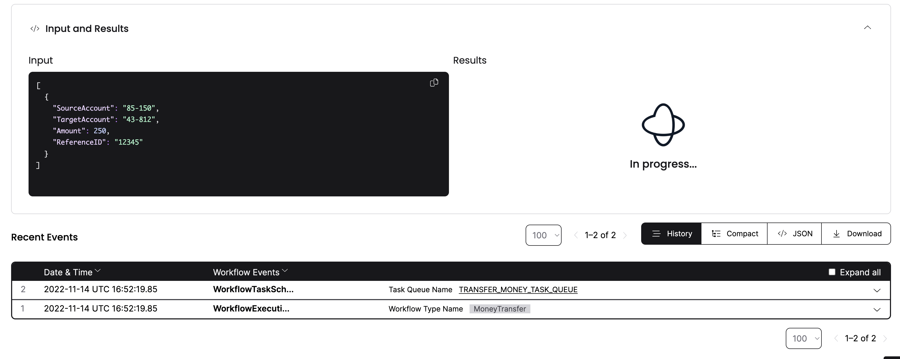
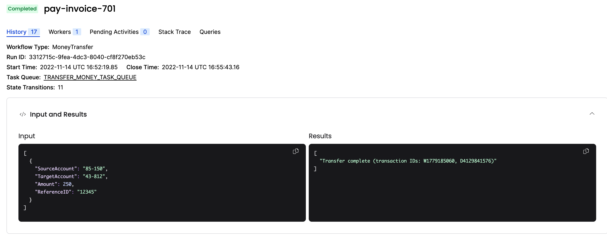
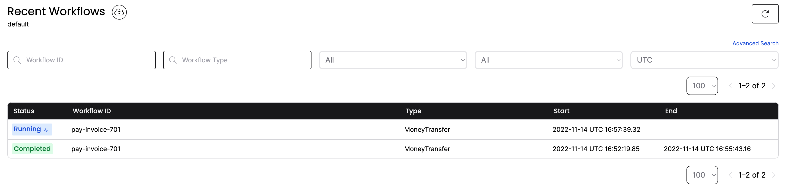
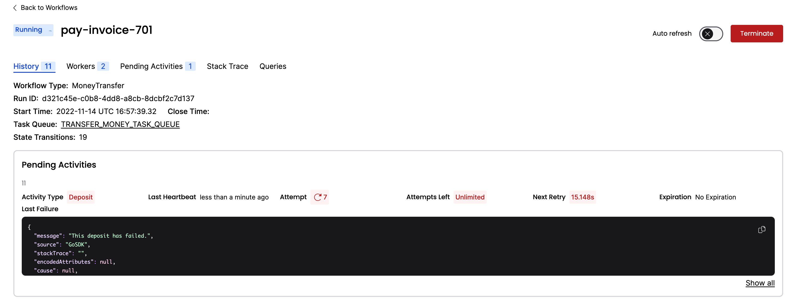
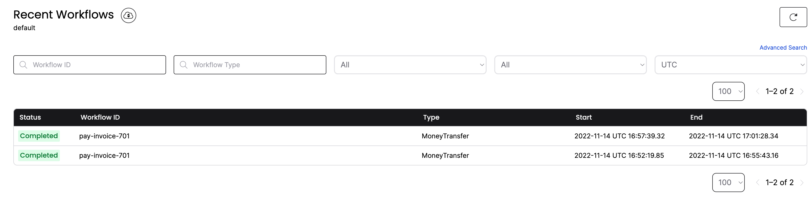

:::note Tutorial information


- **Level**: ⭐ Temporal beginner
- **Time**: ⏱️ ~10 minutes
- **Goals**: 🙌
- Explore Temporal's core terminology and concepts.
- Complete several runs of a Temporal Workflow application using a Temporal Cluster and the [.NET SDK](https://github.com/temporalio/sdk-dotnet).
- Practice reviewing the state of the Workflow.
- Understand the inherent reliability of Workflow methods.


:::


### Introduction


You can think of Temporal as a sort of "cure-all" for the pains you experience as a developer when trying to build reliable applications. Whether you're writing a complex transaction-based Workflow or working with remote APIs, you know that creating reliable applications is a complex process. Developing your application on the Temporal Platform guarantees that your code runs to completion no matter what.


The language-specific SDK, in this case the Temporal [.NET SDK](https://github.com/temporalio/sdk-dotnet), provides a comprehensive solution to the complexities that arise from modern application development.


Temporal provides reliability primitives to ensure durable execution of your code, such as seamless and fault-tolerant application state tracking, automatic retries, timeouts, rollbacks due to process failures, and more.


In this tutorial, you'll run your first Temporal Application. You'll use Temporal's Web UI for application state visibility, and then explore how Temporal helps you recover from a couple of common failures.


## Prerequisites


Before starting this tutorial:


- [Set up a local development environment for developing Temporal Applications using a .NET programming language](/getting_started/dotnet/dev_environment/index.md)
- Ensure you have Git installed to clone the project.


##  Application overview
In this tutorial, you will run a [Temporal Application](https://docs.temporal.io/temporal#temporal-application) using the [Temporal .NET SDK](https://github.com/temporalio/sdk-dotnet).


This project in this tutorial simulates a money transfer application, focusing on essential transactions such as withdrawals, deposits, and refunds. The importance of Temporal in this context lies in its ability to handle your code efficiently and reliably.


In this sample application, money comes out of one account and goes into another. However, there are a few things that can go wrong with this process. If the withdrawal fails, then there is no need to try to make a deposit. But if the withdrawal succeeds, but the deposit fails, then the money needs to go back to the original account.


One of Temporal's most important features is its ability to maintain the application state when something fails. When failures happen, Temporal recovers processes where they left off or rolls them back correctly. This allows you to focus on business logic, instead of writing application code to recover from failure.


Now that you know how the application will work, it's time to download the application to your local machine, so you can try it out yourself.


##  Download the example application


The application you'll use in this tutorial is available in a [GitHub repository](https://github.com/temporalio/money-transfer-project-template-dotnet).


Open a new terminal window and use `git` to clone the repository:


```command
git clone https://github.com/temporalio/money-transfer-project-template-dotnet
```


Once you have the repository cloned, change to the project directory:


```command
cd money-transfer-temporal-template-dotnet
```

Now that you've downloaded the project, let's dive into the code.


## Explore the application's Workflow and Activity Definitions


The Temporal Application will consist of the following pieces:


1. A [Workflow](https://docs.temporal.io/workflows) written in your programming language of choice such as C# using the .NET SDK. A Workflow defines the overall flow of the application.
2. An [Activity](https://docs.temporal.io/activities) is a method that encapsulates business logic prone to failure (e.g., calling a service that may go down). These Activities can be automatically retried upon some failure.
3. A [Worker](https://docs.temporal.io/workers), provided by the Temporal SDK, which runs your Workflow and Activities reliably and consistently.


Temporal applications are built using an abstraction called Workflows. You'll develop those Workflows by writing code in a general-purpose programming language such as C# using the .NET SDK. Conceptually, a Workflow defines a sequence of steps. With Temporal, those steps are defined by writing code, known as a [Workflow Definition](https://docs.temporal.io/workflows#workflow-definition), and are carried out by running that code, which results in a [Workflow Execution](https://docs.temporal.io/workflows#workflow-execution).


These Workflow Executions orchestrate the execution of [Activities](https://docs.temporal.io/activities), which execute a single, well-defined action, such as calling another service, transcoding a media file, or sending an email message. In the money transfer application, you have three Activity async methods, `WithdrawAsync`, `DepositAsync`, and `RefundAsync`. These symbolize the movement of funds between accounts. They operate asynchronously, ensuring that the application can handle other tasks while waiting for the banking operations to complete.


The following diagram illustrates what happens when you start the Workflow:


None of your application code runs on the Temporal Server. Your Worker, Workflow, and Activity run on your infrastructure, along with the rest of your applications.


### Workflow Definition


In the Temporal .NET SDK, a Workflow Definition is marked by the **`[Workflow]`** attribute placed above the class.


This is what the Workflow Definition looks like for this process:


<!--SNIPSTART money-transfer-project-template-dotnet-workflow-->
[MoneyTransferWorker/Workflow.cs](https://github.com/temporalio/money-transfer-project-template-dotnet/blob/main/MoneyTransferWorker/Workflow.cs)
```cs
namespace Temporalio.MoneyTransferProject.MoneyTransferWorker;
using Temporalio.MoneyTransferProject.BankingService.Exceptions;
using Temporalio.Workflows;
using Temporalio.Common;
using Temporalio.Exceptions;

[Workflow]
public class MoneyTransferWorkflow
{
    [WorkflowRun]
    public async Task<string> RunAsync(PaymentDetails details)
    {
        // Retry policy
        var retryPolicy = new RetryPolicy
        {
            InitialInterval = TimeSpan.FromSeconds(1),
            MaximumInterval = TimeSpan.FromSeconds(100),
            BackoffCoefficient = 2,
            MaximumAttempts = 3,
            NonRetryableErrorTypes = new[] { "InvalidAccountException", "InsufficientFundsException" }
        };

        string withdrawResult;
        try
        {
            withdrawResult = await Workflow.ExecuteActivityAsync(
                () => BankingActivities.WithdrawAsync(details),
                new ActivityOptions { StartToCloseTimeout = TimeSpan.FromMinutes(5), RetryPolicy = retryPolicy }
            );
        }
        catch (ApplicationFailureException ex) when (ex.ErrorType == "InsufficientFundsException")
        {
            throw new ApplicationFailureException("Withdrawal failed due to insufficient funds.", ex);
        }

        string depositResult;
        try
        {
            depositResult = await Workflow.ExecuteActivityAsync(
                () => BankingActivities.DepositAsync(details),
                new ActivityOptions { StartToCloseTimeout = TimeSpan.FromMinutes(5), RetryPolicy = retryPolicy }
            );
            // If everything succeeds, return transfer complete
            return $"Transfer complete (transaction IDs: {withdrawResult}, {depositResult})";
        }
        catch (Exception depositEx)
        {
            try
            {
                // if the deposit fails, attempt to refund the withdrawal
                string refundResult = await Workflow.ExecuteActivityAsync(
                    () => BankingActivities.RefundAsync(details),
                    new ActivityOptions { StartToCloseTimeout = TimeSpan.FromMinutes(5), RetryPolicy = retryPolicy }
                );
                // If refund is successful, but deposit failed
                throw new ApplicationFailureException($"Failed to deposit money into account {details.TargetAccount}. Money returned to {details.SourceAccount}.", depositEx);
            }
            catch (Exception refundEx)
            {
                // If both deposit and refund fail
                throw new ApplicationFailureException($"Failed to deposit money into account {details.TargetAccount}. Money could not be returned to {details.SourceAccount}. Cause: {refundEx.Message}", refundEx);
            }
        }
    }
}
```
<!--SNIPEND-->

- The **`[WorkflowRun]`** attribute is placed on the `RunAsync` method within the `MoneyTransferWorkflow` class.

- The `MoneyTransferWorkflow` class is designed to manage the transaction process, which entails withdrawing funds from one account and depositing the money into another through executing the Activities. It returns the results of the process.

- The `MoneyTransferWorkflow` class contains an asynchronous method, `RunAsync`, that takes a `PaymentDetails` object as input. This holds the transaction details to perform the money transfer.


This type is defined in the file `PaymentDetails.cs`:

<!--SNIPSTART money-transfer-project-template-dotnet-shared-->
[MoneyTransferWorker/PaymentDetails.cs](https://github.com/temporalio/money-transfer-project-template-dotnet/blob/main/MoneyTransferWorker/PaymentDetails.cs)
```cs
namespace Temporalio.MoneyTransferProject.MoneyTransferWorker;
public record PaymentDetails(
    string SourceAccount,
    string TargetAccount,
    int Amount,
    string ReferenceId);

```
<!--SNIPEND-->


:::tip


It's a good practice to send a single object into a Workflow as its input, rather than multiple, separate input variables. As your Workflows evolve, you may need to add inputs, and using a single argument will make it easier for you to change long-running Workflows in the future.


:::


:::note
Notice that the `PaymentDetails` record includes a `ReferenceId` field. Some APIs let you send a unique _idempotency key_ along with the transaction details. This guarantees that if a failure occurs and you have to retry the transaction, the API you're calling will use the key to ensure it only executes the transaction once.


:::


### Activity Definition


In the Temporal .NET SDK, you mark a method within a class as an Activity by adding the **`[Activity]`** attribute above the method.


Activities are where you perform the business logic for your application. In the money transfer application, you have three Activity methods, `WithdrawAsync()`, `DepositAsync()`, and `RefundAsync()`. The Workflow Definition calls the Activities `WithdrawAsync()` and `DepositAsync()` to handle the money transfers.


First, the `WithdrawAsync()` Activity takes the details about the transfer and calls a service to process the withdrawal:


<!--SNIPSTART money-transfer-project-template-dotnet-withdraw-activity-->
[MoneyTransferWorker/Activities.cs](https://github.com/temporalio/money-transfer-project-template-dotnet/blob/main/MoneyTransferWorker/Activities.cs)
```cs
namespace Temporalio.MoneyTransferProject.MoneyTransferWorker;
using Temporalio.Activities;
using Temporalio.Exceptions;

public class BankingActivities
{
    [Activity]
    public static async Task<string> WithdrawAsync(PaymentDetails details)
    {
        var bankService = new BankingService("bank1.example.com");
        Console.WriteLine($"Withdrawing ${details.Amount} from account {details.SourceAccount}.");
        try
        {
            return await bankService.WithdrawAsync(details.SourceAccount, details.Amount, details.ReferenceId).ConfigureAwait(false);
        }
        catch (Exception ex)
        {
            throw new ApplicationFailureException("Withdrawal failed", ex);
        }
    }
```
<!--SNIPEND-->


Second, if the transfer succeeded, the `WithdrawAsync()` method returns the confirmation.


Lastly, the `DepositAsync()` Activity method looks almost identical to the `WithdrawAsync()` method. It similarly takes the transfer details and calls a service to process the deposit, ensuring the money is successfully added to the receiving account:


<!--SNIPSTART money-transfer-project-template-dotnet-deposit-activity-->
[MoneyTransferWorker/Activities.cs](https://github.com/temporalio/money-transfer-project-template-dotnet/blob/main/MoneyTransferWorker/Activities.cs)
```cs
    [Activity]
    public static async Task<string> DepositAsync(PaymentDetails details)
    {
        var bankService = new BankingService("bank2.example.com");
        Console.WriteLine($"Depositing ${details.Amount} into account {details.TargetAccount}.");

        // Uncomment below and comment out the try-catch block below to simulate unknown failure
        /*
        return await bankService.DepositThatFailsAsync(details.TargetAccount, details.Amount, details.ReferenceId);
        */

        try
        {
            return await bankService.DepositAsync(details.TargetAccount, details.Amount, details.ReferenceId);
        }
        catch (Exception ex)
        {
            throw new ApplicationFailureException("Deposit failed", ex);
        }
    }
```
<!--SNIPEND-->


:::tip Why you use Activities


At first glance, you might think you can incorporate your logic into the Workflow Definition. However, Temporal Workflows have certain [deterministic constraints](https://docs.temporal.io/workflows#deterministic-constraints) and must produce the same output each time, given the same input. This means that any non-deterministic work such as interacting with the outside world, like accessing files or network resources, must be done by Activities.


In addition, by using Activities, you can take advantage of Temporal's ability to retry Activities indefinitely, which you'll explore later in this tutorial.


Use Activities for your business logic, and use Workflows to coordinate the Activities.


:::


## Set the Retry Policy


Temporal makes your software durable and fault tolerant by default which allows you to code more reliable systems.


If an Activity fails, Temporal Workflows automatically retry the failed Activity by default. You can also customize how those retries happen through the Retry Policy.


In the `MoneyTransferWorkflow` class, you define a Retry Policy right at the beginning of its main method, `RunAsync`.

You'll see a **Retry Policy** defined that looks like this:


<!--SNIPSTART money-transfer-project-template-dotnet-workflow {"selectedLines": ["13-20"]} -->
[MoneyTransferWorker/Workflow.cs](https://github.com/temporalio/money-transfer-project-template-dotnet/blob/main/MoneyTransferWorker/Workflow.cs)
```cs
// ...
        // Retry policy
        var retryPolicy = new RetryPolicy
        {
            InitialInterval = TimeSpan.FromSeconds(1),
            MaximumInterval = TimeSpan.FromSeconds(100),
            BackoffCoefficient = 2,
            MaximumAttempts = 3,
            NonRetryableErrorTypes = new[] { "InvalidAccountException", "InsufficientFundsException" }
```
<!--SNIPEND-->

By default, Temporal retries failed Activities forever, but you can specify some errors that Temporal should not attempt to retry. In this example, it'll retry the failed Activity for 3 attempts, but if the Workflow encounters an error, it will refund money to the sender's account.


In the case of an error with the `DepositAsync()` Activity, the Workflow will attempt to put the money back.


In this Workflow, each Activity uses the same Retry Policy options, but you could specify different options for each Activity.


:::caution This is a simplified example.


Transferring money is a tricky subject, and this tutorial's example doesn't cover all possible issues that can go wrong. It doesn't include logic to clean things up if a Workflow is cancelled, and it doesn't handle other edge cases where money would be withdrawn but not deposited. There's also the possibility that this Workflow can fail when refunding the money to the original account. In a production scenario, you'll want to account for those cases with more advanced logic, including adding a "human in the loop" step where someone is notified of the refund issue and can intervene.


This example only shows some core features of Temporal and is not intended for production use.
:::


When you _start_ a Workflow, you are telling the Temporal Server, "Track the state of the Workflow with this method signature." Workers execute the Workflow code piece by piece, relaying the execution events and results back to the server.


Let's see that in action.


## Start the Workflow


You have two ways to start a Workflow with Temporal, either through the [Temporal command-line tool](https://docs.temporal.io/cli) or the [SDK](https://docs.temporal.io/encyclopedia/temporal-sdks). In this tutorial, you use the SDK to start the Workflow, which is how most Workflows get started in a live environment.


First, make sure the local [Temporal Cluster](https://docs.temporal.io/clusters) is running in a Terminal from the [previous tutorial](https://learn.temporal.io/getting_started/dotnet/dev_environment/). This is done by opening a new terminal window and running the following command:
```command
temporal server start-dev
```


To start the Workflow, run the following command:
```command
dotnet run --project MoneyTransferClient
```

This command runs the `Program.cs` file within the MoneyTransferClient project, starting the Workflow process.

The Workflow is now running. Leave the program running.


To start a Workflow, you connect to the Temporal Cluster, specify the [Task Queue](https://docs.temporal.io/concepts/what-is-a-task-queue), the Workflow should use, and Activities it expects in your code. In this tutorial, this is a small command-line program that starts the Workflow Execution.


In a real application, you may invoke this code when someone submits a form, presses a button, or visits a certain URL.


The Temporal Server is an essential part of the overall system, but requires additional components for operation. The complete system is known as the Temporal Cluster, which is a deployment of the Temporal Server, plus the additional components used with it such as a database like Apache Cassandra, PostgreSQL, or MySQL.


The Task Queue is where Temporal Workers look for Workflows and Activities to execute. You define Task Queues by assigning a name as a string. You'll use this Task Queue name when you start a Workflow Execution, and you'll use it again when you define your Workers.


<!--SNIPSTART money-transfer-project-template-dotnet-shared-->
[MoneyTransferWorker/PaymentDetails.cs](https://github.com/temporalio/money-transfer-project-template-dotnet/blob/main/MoneyTransferWorker/PaymentDetails.cs)
```cs
namespace Temporalio.MoneyTransferProject.MoneyTransferWorker;
public record PaymentDetails(
    string SourceAccount,
    string TargetAccount,
    int Amount,
    string ReferenceId);

```
<!--SNIPEND-->


:::note


This tutorial uses a separate program to start the Workflow, but you don't have to follow this pattern. In fact, most real applications start a Workflow as part of another program. For example, you might start the Workflow in response to a button press or an API call.


:::


Next, you'll explore one of the unique value propositions Temporal offers: application state visibility.


## View the state of the Workflow with the Temporal Web UI


Temporal records every execution, its progress, and application state through Temporal's Web UI. This provides insights into errors and app performance.


Temporal's Web UI lets you see details about the Workflow you're running. You can use this tool to see the results of Activities and Workflows, and also identify problems with your Workflow Execution.


1. Visit the [Temporal Web UI](http://localhost:8233) where you will see your Workflow listed. The link will direct you to localhost:8233.





2. Click the **Workflow ID** for your Workflow.


Now you can see everything you want to know about the execution of the Workflow, including the input values it received, timeout configurations, scheduled retries, number of attempts, stack traceable errors, and more.





3. You can see the inputs and results of the Workflow Execution by clicking the **Input and Results** section:





You see your inputs, but the results are in progress.


You started the Workflow, and the interface shows that the Workflow is running, but the Workflow hasn't executed yet. As you see from the Web UI, there are no Workers connected to the Task Queue.


You need at least one Worker running to execute your Workflows. You'll start the Worker next.


## Start the Worker


A Worker is responsible for executing pieces of Workflow and Activity code. In this project, the file `Program.cs` contains the code for the Worker within the MoneyTransferWorker project.


Your `Program.cs` file within the MoneyTransferClient project is still running in your terminal, waiting for the Workflow to complete. Leave it running.


Open a new terminal window.


In this new terminal window, run the following command to start the Worker:


```command
dotnet run --project MoneyTransferWorker
```


In production environments, Temporal applications often operate with hundreds or thousands of Workers. This is because adding more Workers not only enhances your application's availability but also boosts its scalability.


One thing that people new to Temporal may find surprising is that the Temporal Cluster does not execute your code. The entity responsible for executing your code is known as a Worker, and it's common to run Workers on multiple servers.


A Worker:


- Can only execute Workflows and Activities registered to it.
- Knows which piece of code to execute based on the Tasks it gets from the Task Queue.
- Only listens to the Task Queue that it's registered to.


After the Worker executes code, it returns the results back to the Temporal Server. Note that the Worker listens to the same Task Queue you used when you started the Workflow Execution.


Like the program that started the Workflow, it connects to the Temporal Cluster and specifies the Task Queue to use. It also registers the Workflow and the three Activities:


<!--SNIPSTART money-transfer-project-template-dotnet-worker-->
[MoneyTransferWorker/Program.cs](https://github.com/temporalio/money-transfer-project-template-dotnet/blob/main/MoneyTransferWorker/Program.cs)
```cs
// This file is designated to run the worker
using Temporalio.Client;
using Temporalio.Worker;
using Temporalio.MoneyTransferProject.MoneyTransferWorker;

// Create a client to connect to localhost on "default" namespace
var client = await TemporalClient.ConnectAsync(new("localhost:7233"));

// Cancellation token to shutdown worker on ctrl+c
using var tokenSource = new CancellationTokenSource();
Console.CancelKeyPress += (_, eventArgs) =>
{
    tokenSource.Cancel();
    eventArgs.Cancel = true;
};

// Create an instance of the activities since we have instance activities.
// If we had all static activities, we could just reference those directly.
var activities = new BankingActivities();

// Create a worker with the activity and workflow registered
using var worker = new TemporalWorker(
    client, // client
    new TemporalWorkerOptions(taskQueue: "MONEY_TRANSFER_TASK_QUEUE")
        .AddAllActivities(activities) // Register activities
        .AddWorkflow<MoneyTransferWorkflow>() // Register workflow
);

// Run the worker until it's cancelled
Console.WriteLine("Running worker...");
try
{
    await worker.ExecuteAsync(tokenSource.Token);
}
catch (OperationCanceledException)
{
    Console.WriteLine("Worker cancelled");
}
```
<!--SNIPEND-->


When you start the Worker, it begins polling the Task Queue for Tasks to process. The terminal output from the Worker looks like this:


```output
Running worker...
Withdrawing $400 from account 85-150.
Depositing $400 into account 43-812.
```


The Worker continues running, waiting for more Tasks to execute.


Switch back to the terminal window where your `dotnet run --project MoneyTransferClient` program is running, and you'll see it's completed:


```output
Starting transfer from account 85-150 to account 43-812 for $400
Started Workflow pay-invoice-08829009-7e33-4d07-a60c-37ce1da28979
Workflow result: Transfer complete (transaction IDs: W-188e2f31-ac1e-4d87-9012-39d80fec77bf, D-fc212878-1884-4fe8-a16a-22b43272e992)
```


Check the Temporal Web UI again. You will see one Worker registered where previously there was none, and the Workflow status shows that it completed:





Here's what happens when the Worker runs and connects to the Temporal Cluster:


- The first Task the Worker finds is the one that tells it to execute the Workflow.
- The Worker executes the Workflow which requests Activity Execution and communicates the events back to the Server.
- This causes the Server to send Activity Tasks to the Task Queue.
- The Worker then grabs each of the Activity Tasks in sequence from the Task Queue and executes each of the corresponding Activities.


Each of these steps gets recorded in the Event History. You can audit them in Temporal Web by clicking on the **History** tab next to **Summary**.


After a Workflow completes, the full history persists for a set retention period (typically 7 to 30 days) before the history is deleted.


You just ran a Temporal Workflow application and saw how Workflows, Activities, and Workers interact. Now you'll explore how Temporal gives you tools to handle failures.


##  Simulate failures


Despite your best efforts, there's going to be a time when something goes wrong in your application. You might encounter a network glitch, a server might go offline, or you might introduce a bug into your code. One of Temporal's most important features is its ability to maintain the state of a Workflow when something fails. To demonstrate this, you will simulate some failures for your Workflow and see how Temporal responds.


### Recover from a server crash


Unlike many modern applications that require complex processes and external databases to handle failure, Temporal automatically preserves the state of your Workflow even if the server is down. You can test this by stopping the local Temporal Cluster while a Workflow is running.


Try it out by following these steps:


1. Make sure your Worker is stopped before proceeding, so your Workflow doesn't finish. Switch to the terminal that's running your Worker and stop it by pressing `CTRL+C`.
2. Switch back to the terminal where your Workflow ran. Start the Workflow again with `dotnet run --project MoneyTransferClient`.
3. Verify the Workflow is running in the [Web UI](http://localhost:8233).
4. Shut down the Temporal Server by either using `CTRL+C` in the terminal window running the server.
5. After the Temporal Cluster has stopped, restart it and visit the UI. This can be done by running `temporal server start-dev` in the terminal window and navigating to [localhost:8233](http://localhost:8233/).


Your Workflow is still listed:





If the Temporal Cluster goes offline, you can pick up where you left off when it comes back online again.


### Recover from an unknown error in an Activity


This demo application makes a call to an external service in an Activity. If that call fails due to a bug in your code, the Activity produces an error.


To test this out and see how Temporal responds, you'll simulate a bug in the `DepositAsync()` Activity method.


Let your Workflow continue to run but don't start the Worker yet.


1. Open the `Activities.cs` file and switch out the comments on the `return` statements so that the `DepositAsync()` method throws an exception:


<!--SNIPSTART money-transfer-project-template-dotnet-deposit-activity-->
[MoneyTransferWorker/Activities.cs](https://github.com/temporalio/money-transfer-project-template-dotnet/blob/main/MoneyTransferWorker/Activities.cs)
```cs
    [Activity]
    public static async Task<string> DepositAsync(PaymentDetails details)
    {
        var bankService = new BankingService("bank2.example.com");
        Console.WriteLine($"Depositing ${details.Amount} into account {details.TargetAccount}.");

        // Uncomment below and comment out the try-catch block below to simulate unknown failure
        /*
        return await bankService.DepositThatFailsAsync(details.TargetAccount, details.Amount, details.ReferenceId);
        */

        try
        {
            return await bankService.DepositAsync(details.TargetAccount, details.Amount, details.ReferenceId);
        }
        catch (Exception ex)
        {
            throw new ApplicationFailureException("Deposit failed", ex);
        }
    }
```
<!--SNIPEND-->


2. Save your changes and switch to the terminal that was running your Worker.


3. Start the Worker again:


```command
dotnet run --project MoneyTransferWorker
```


Note, that you must restart the Worker every time there's a change in code. You will see the Worker complete the `WithdrawAsync()` Activity method, but it errors when it attempts the `DepositAsync()` Activity method.


The important thing to note here is that the Worker keeps retrying the `DepositAsync()` method:


```output
Running worker...
Withdrawing $400 from account 85-150.
Depositing $400 into account 43-812.
Depositing $400 into account 43-812.
Depositing $400 into account 43-812.
Depositing $400 into account 43-812.
Depositing $400 into account 43-812.
...

```


The Workflow keeps retrying using the `RetryPolicy` specified when the Workflow first executes the Activity.


You can view more information about the process in the [Temporal Web UI](http://localhost:8233).


4. Click the Workflow. You'll see more details including the state, the number of attempts run, and the next scheduled run time:




:::note
Traditionally, you're forced to implement timeout and retry logic within the service code itself. This is repetitive and prone to errors. With Temporal, you can specify timeout configurations in the Workflow code as Activity options.

Temporal offers multiple ways to specify timeouts, including [Schedule-To-Start Timeout](https://docs.temporal.io/concepts/what-is-a-schedule-to-start-timeout), [Schedule-To-Close Timeout](https://docs.temporal.io/concepts/what-is-a-schedule-to-close-timeout), [Start-To-Close Timeout](https://docs.temporal.io/concepts/what-is-a-start-to-close-timeout), and [Heartbeat Timeout](https://docs.temporal.io/concepts/what-is-a-heartbeat-timeout). By default the code will be retried forever, unless a Schedule-To-Close Timeout or Start-To-Close Timeout is specified.

:::

In `Workflow.cs`, you can see that a **`StartToCloseTimeout`** is specified for the Activities, and a Retry Policy tells the server to retry the Activities up to 500 times:


<!--SNIPSTART money-transfer-project-template-dotnet-start-workflow-->
[MoneyTransferClient/Program.cs](https://github.com/temporalio/money-transfer-project-template-dotnet/blob/main/MoneyTransferClient/Program.cs)
```cs
// This file is designated to run the workflow
using Temporalio.MoneyTransferProject.MoneyTransferWorker;
using Temporalio.Client;

// Connect to the Temporal server
var client = await TemporalClient.ConnectAsync(new("localhost:7233") { Namespace = "default" });

// Define payment details
var details = new PaymentDetails(
    SourceAccount: "85-150",
    TargetAccount: "43-812",
    Amount: 400,
    ReferenceId: "12345"
);

Console.WriteLine($"Starting transfer from account {details.SourceAccount} to account {details.TargetAccount} for ${details.Amount}");

var workflowId = $"pay-invoice-{Guid.NewGuid()}";

try
{
    // Start the workflow
    var handle = await client.StartWorkflowAsync(
        (MoneyTransferWorkflow wf) => wf.RunAsync(details),
        new(id: workflowId, taskQueue: "MONEY_TRANSFER_TASK_QUEUE"));

    Console.WriteLine($"Started Workflow {workflowId}");

    // Await the result of the workflow
    var result = await handle.GetResultAsync();
    Console.WriteLine($"Workflow result: {result}");
}
catch (Exception ex)
{
    Console.Error.WriteLine($"Workflow execution failed: {ex.Message}");
}
```
<!--SNIPEND-->


You can read more about [Retries](https://docs.temporal.io/retry-policies) in the documentation.


Your Workflow is running, but only the `WithdrawAsync()` Activity method has succeeded. In any other application, you would likely have to abandon the entire process and perform a rollback.


With Temporal, you can debug and resolve the issue while the Workflow is running.


6. Pretend that you found a fix for the issue. Switch the comments back to the `return` statements of the `DepositAsync()` method in the `Activities.cs` file and save your changes.


How can you possibly update a Workflow that's already halfway complete? You restart the Worker.


7. To restart the Worker, go to the terminal where the Worker is running and cancel the Worker with `CTRL+C`:


```output
Running worker...
Withdrawing $400 from account 85-150.
Depositing $400 into account 43-812.
Depositing $400 into account 43-812.
Depositing $400 into account 43-812.
Depositing $400 into account 43-812.
Depositing $400 into account 43-812.
Depositing $400 into account 43-812.
Depositing $400 into account 43-812.
Depositing $400 into account 43-812.
^CWorker cancelled

```


8. Then restart the Worker by running the following command:


```command
dotnet run --project MoneyTransferWorker
```


The Worker starts again. On the next scheduled attempt, the Worker picks up right where the Workflow was failing and successfully executes the newly compiled `DepositAsync()` Activity method.


9. Switch back to the terminal where your `Program.cs` file in MoneyTransferClient folder is running, and you'll see it complete:


```output
Workflow result: Transfer complete (transaction IDs: W-caa90e06-3a48-406d-86ff-e3e958a280f8, D-1910468b-5951-4f1d-ab51-75da5bba230b)
```


10. Visit the [Web UI](http://localhost:8233) again, and you'll see the Workflow has completed:





You have just fixed a bug in a running application without losing the state of the Workflow or restarting the transaction!


## Conclusion


You now know how to run a Temporal Workflow and understand some value Temporal offers. You explored Workflows and Activities, you started a Workflow Execution, and you ran a Worker to handle that execution.


You also saw how Temporal recovers from failures and how it retries Activities.


Exploring the key advantages Temporal offers:


1. Temporal gives you **full visibility** in the state of your Workflow and code execution.
2. Temporal **maintains the state** of your Workflow, even through server outages and errors.
3. Temporal lets you **time out and retry Activity code** using options that exist outside your business logic.
4. Temporal enables you to **perform "live debugging" of your business logic** while the Workflow is running.


### Further exploration


Try the following things before moving on to get more practice working with a Temporal application:


- Change the Retry Policy in `Workflow.cs` so it only retries 1 time. Then change the `DepositAsync()` Activity in `Activities.cs`, so it uses the `RefundAsync()` method.
- Does the Workflow place the money back into the original account?


### Review


Answer the following questions to see if you remember some of the more important concepts from this tutorial:


<details>
<summary>


**Why do we recommend defining a shared constant to store the Task Queue name?**


</summary>


Because the Task Queue name is specified in two different parts of the code (the first starts the Workflow and the second configures the Worker). If their values differ, the Worker and Temporal Cluster would not share the same Task Queue, and the Workflow Execution would not progress.


</details>


<details>
<summary>


**What do you have to do if you modify Activity code for a Workflow that is running?**


</summary>


Restart the Worker.


</details>


