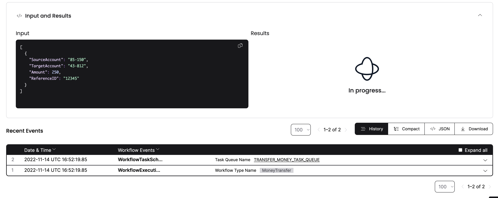

:::note Tutorial information

- **Level**: ⭐ Temporal beginner
- **Time**: ⏱️ ~20 minutes
- **Goals**: 🙌
  - Explore Temporal's core terminology and concepts.
  - Complete several runs of a Temporal Workflow application using the Temporal server and the [Go SDK](https://github.com/temporalio/go-sdk).
  - Practice reviewing the state of the Workflow.
  - Understand the inherent reliability of Workflow functions.

:::

## Introduction

Whether you're writing a complex transaction-based workflow, or working with remote APIs, you know that creating reliable applications is a complex process.

The Temporal server and a language-specific SDK, in this case the [Go SDK](https://github.com/temporalio/go-sdk), provide a comprehensive solution to the complexities which arise from modern application development. You can think of Temporal as a sort of "cure-all" for the pains you experience as a developer when trying to build reliable applications.

Temporal provides reliability primitives, such as seamless and fault-tolerant application state tracking, automatic retries, timeouts, rollbacks due to process failures, and more.

In this tutorial you'll run your first Temporal application and explore how Temporal Workflows and Activities work together. You'll use Temporal's Web UI to see how Temporal executed your Workflow, and then explore how Temporal helps you recover from a couple of common failures.

## Prerequisites

Before starting this tutorial:

- [Set up a local development environment for developing Temporal applications using the Go programming language](/getting_started/go/dev_environment/index.md)
- Ensure you have Git installed to clone the project.


##  Application overview

The project in this tutorial mimics a "money transfer" application that has a single [Workflow function](https://docs.temporal.io/application-development/foundations/?lang=go#develop-workflows) which orchestrates the execution of `Withdraw()` and `Deposit()` functions, representing a transfer of money from one account to another. Temporal calls these particular functions [Activity functions](https://docs.temporal.io/application-development/foundations/?lang=go#develop-activities).

To run the application you will do the following:

1. Send a signal to the Temporal Cluster to start the money transfer. The Temporal server will track the progress of your Workflow function execution.
2. Run a Worker. A Worker is a wrapper around your compiled Workflow and Activity code. A Worker's only job is to execute the Activity and Workflow functions and communicate the results back to the Temporal server.

The following diagram illustrates what happens when you start the Workflow:


Temporal's server does not run your code. Your Worker, Workflow, and Activity run on your infrastructure, along with the rest of your applications.

Now that you know how the application will work, it's time to download the application to your local machine so you can try it out yourself.

##  Download the example application

The application you'll use in this tutorial is available in a [GitHub repository](https://github.com/temporalio/money-transfer-project-template-go).

Open a new terminal window and use `git` to clone the repository:

```command
git clone https://github.com/temporalio/money-transfer-project-template-go
```

Once the files are cloned, change to the project directory:

```command
cd money-transfer-project-template-go
```

:::tip

The repository for this tutorial is a GitHub Template repository, which means you could clone it to your own account and use it as the foundation for your own Temporal application. Github's [Creating a Repository from a Template](https://docs.github.com/en/repositories/creating-and-managing-repositories/creating-a-repository-from-a-template#creating-a-repository-from-a-template) guide will walk you through the steps.

If you convert the template to a new repository and change the name, make sure you change the `go.mod` file to reflect the new project name.
:::


With the project downloaded, let's explore the code, starting with the Workflow.

## Explore the application's Workflow and Activity Definitions

A Temporal application is a set of [Temporal Workflow Executions](https://docs.temporal.io/workflows#workflow-execution), which are reliable, durable function executions. These Workflow Executions orchestrate the execution of [Activities](https://docs.temporal.io/activities), which execute a single, well-defined action, such as calling another service, transcoding a media file, or sending an email message. 

You use a [Workflow Definition](https://docs.temporal.io/workflows#workflow-definition) to define the Workflow Execution's constraints. A Workflow Definition in Go is a regular Go function that accepts a Workflow Context and some input values. This is what the money transfer Workflow Definition looks like:

<!--SNIPSTART money-transfer-project-template-go-workflow-->
<!--SNIPEND-->

In this case, the `MoneyTransfer` function accepts an `input` variable of the type `PaymentDetails` which is a data structure that holds the details the Workflow will use to perform the money transfer. This type is defined in the file `shared.go`: 

<!--SNIPSTART money-transfer-project-template-go-transferdetails-->
<!--SNIPEND-->

It's a good practice to send a single, serializable data structure into a Workflow as its input, rather than multiple, separate input variables.

The Workflow Definition then calls two Activities, `Withdraw` and `Deposit`. Activities are where you perform the business logic for your application. Like Workflows, you define Activities in Go by defining Go functions which receive a `context` and some input values.

The `withdraw` Activity takes in the details about the transfer and calls a service to process the withdrawal:

<!--SNIPSTART money-transfer-project-template-go-activity-withdraw-->
<!--SNIPEND-->

If the transfer succeeded, the `Withdraw` function returns the confirmation. If it's unsuccessful, it returns an empty string and the error from the banking service.

In this tutorial, the banking service simulates an external API call. You can inspect the code in the `banking-client.go` file.

The `Deposit` function looks almost identical:

<!--SNIPSTART money-transfer-project-template-go-activity-deposit-->
<!--SNIPEND-->

There's a commented line in this Activity definition which you'll use later in the tutorial to simulate an error in the Activity.

The Workflow executes both of these Activities, receives their results, and then completes. 

:::tip Why you use Activities
At first glance, you might think you can incorporate your logic into the Workflow definition. However, Temporal Workflows have certain [deterministic constraints](https://docs.temporal.io/workflows#deterministic-constraints). For example, they need to be repayable, and making changes to the Workflow code makes it much harder to replay. 

In addition, by using Activities, you can take advantage of Temporal's ability to retry Activities indefinitely, which you'll explore later in this tutorial.

Use Activities for your business logic, and use Workflows to coordinate the Activities.
:::

When you "start" a Workflow you are telling the Temporal server, "track the state of the Workflow with this function signature". Workers will execute the Workflow code piece by piece, relaying the execution events and results back to the server.

Let's see that in action.

## Start the Workflow 

There are two ways to start a Workflow with Temporal, either via the SDK or via the [tctl command-line tool](https://docs.temporal.io/tctl). In this tutorial you'll use the SDK to start the Workflow, which is how most Workflows get started in a live environment.

In this tutorial, the file `start/main.go` contains a program that connects to the Temporal server and starts the workflow:


<!--SNIPSTART money-transfer-project-template-go-start-workflow-->
<!--SNIPEND-->

:::note
This tutorial uses a separate program to start the workflow, but you don't have to follow this pattern. In fact, most real applications will start a Workflow as part of another program. For example, you may start the Workflow in response to a button press, or an API call. 
:::

You can make the call [synchronously or asynchronously](https://docs.temporal.io/go/workflows/#how-to-start-a-workflow). Here we do it synchronously by fetching the return value of the Workflow execution with `we.Get`.  This call waits for the Workflow execution to complete before continuing.

Now that you've seen how to use the SDK to start a Workflow Execution, try running the program yourself.

Make sure the [Temporal cluster](https://docs.temporal.io/clusters/quick-install) is running in a terminal, and then run `start/main.go` from the project root using the following command:

```command
go run start/main.go
```

If this is your first time running this application, Go may download some dependencies initially, but once those downloads complete, you'll see output that looks like the following:

```bash
2022/09/15 21:32:38 INFO  No logger configured for temporal client. Created default one.
2022/09/15 21:32:38 Starting transfer from account 85-150 to account 43-812 for 250
2022/09/15 21:32:38 WorkflowID: pay-invoice-701 RunID: d69e638f-93e2-418c-9b05-16ca63526940
```

The workflow is now running. Leave the program running.

Now it's time to check out one of the unique value propositions Temporal offers: application state visibility. 

## View the state of the Workflow with the Temporal Web UI

Temporal's Web UI lets you see details about the Workflow you're running. You can use this tool to see the results of Activities and Workflows, and also identify problems with your Workflow execution.

Visit the [Temporal Web UI](http://localhost:8080) where you will see your Workflow listed.


Click the **Workflow ID** for your Workflow. Now you can see everything you want to know about the execution of the Workflow, including the input values it received, timeout configurations, scheduled retries, number of attempts, stack traceable errors, and more.


You can see the inputs and results of the Workflow Execution by clicking the **Input and Results** section:



You see your inputs, but the results are in progress.

You started the Workflow, and the interface shows that the Workflow is running, but the Workflow hasn't executed yet. As you see from the Web UI, there are no Workers connected to the Task Queue.

You need at least one worker running in order to execute your workflows. You'll start the Worker next.

## Start the Worker

A Worker is responsible for executing pieces of Workflow and Activity code.

A worker:

- can only execute code that has been registered to it.
- knows which piece of code to execute from Tasks that it gets from the Task Queue.
- only listens to the Task Queue that it is registered to.

After the Worker executes code, it returns the results back to the Temporal Server.

In this project, the file `worker/main.go` contains the code for the Worker. Like the program that started the Workflow, it connects to the Temporal Cluster. It also registers the Workflow and the two Activities:

<!--SNIPSTART money-transfer-project-template-go-worker-->
<!--SNIPEND-->

Note that the Worker listens to the same Task Queue that the Workflow and Activity Tasks are sent to.

Task Queues are defined by a string name. To ensure your Task Queue names are consistent, place the Task Queue name in a variable you can share across your project.  In this project, you'll find the Task Queue name defined in the `shared.go` file:

<!--SNIPSTART money-transfer-project-template-go-shared-task-queue-->
<!--SNIPEND-->

Your `start/main.go` program is still running in your terminal, waiting for the Workflow to complete. Leave it running.

Open a new terminal window and switch to your project directory:

```command
cd money-transfer-project-template-go
```

In this new terminal window, run `worker/main.go` from the project root using the following command:

```command
go run worker/main.go
```

When you start the Worker it begins polling the Task Queue for Tasks to process. The terminal output from the Worker will look like this:

```bash
2022/09/15 21:35:43 INFO  No logger configured for temporal client. Created default one.
2022/09/15 21:35:43 INFO  Started Worker Namespace default TaskQueue TRANSFER_MONEY_TASK_QUEUE WorkerID 73813@temporal.local@
2022/09/15 21:35:43 DEBUG ExecuteActivity Namespace default TaskQueue TRANSFER_MONEY_TASK_QUEUE WorkerID 73813@temporal.local@ WorkflowType MoneyTransfer WorkflowID pay-invoice-701 RunID d69e638f-93e2-418c-9b05-16ca63526940 Attempt 1 ActivityID 5 ActivityType Withdraw
2022/09/15 21:35:43 Withdrawing $250 from account 85-150.

2022/09/15 21:35:43 DEBUG ExecuteActivity Namespace default TaskQueue TRANSFER_MONEY_TASK_QUEUE WorkerID 73813@temporal.local@ WorkflowType MoneyTransfer WorkflowID pay-invoice-701 RunID d69e638f-93e2-418c-9b05-16ca63526940 Attempt 1 ActivityID 11 ActivityType Deposit
2022/09/15 21:35:43 Depositing $250 into account 43-812.
```

The Worker continues running, waiting for more Tasks to execute. 

Switch back to the terminal window where your `start/main.go` program is running and you'll see it's completed:

```
...

2022/09/15 21:35:43 Transfer complete (transaction IDs: W1779185060, D4129841576)
```

Check the Temporal Web UI again and you will see one Worker registered where previously there was none, and the Workflow status shows that it is completed:


Here's what happens when the Worker runs and connects to the Temporal cluster:

- The first Task the Worker finds is the one that tells it to execute the Workflow function.
- The Worker communicates the event back to the server.
- This causes the server to send Activity Tasks to the Task Queue.
- The Worker then grabs each of the Activity Tasks in their respective order from the Task Queue and executes each of the corresponding Activities.

Each of these are **History Events** that you can audit in Temporal Web under the **History** tab next to **Summary**. 

Once a workflow is completed and closed, the full history will persist for a set retention period (typically 7-30 days) before being deleted. You can set up [the Archival feature](https://docs.temporal.io/concepts/what-is-archival) to send these entries to long term storage for compliance or audit needs.

You just ran a Temporal Workflow application and saw how Workflows, Activities, and Workers interact. Now you'll explore how Temporal gives you tools to handle failures.

##  Simulate failures

Despite your best efforts, there's going to be a time when something goes wrong in your application. You may encounter a network glitch, a server may go offline, or you might introduce a bug into your code. One of Temporal's most important features is its ability to maintain the state of a Workflow when something fails. To demonstrate this you will simulate some failures for your Workflow and see how Temporal responds.

### Recover from a server crash

Unlike many modern applications that require complex leader election processes and external databases to handle failure, Temporal automatically preserves the state of your Workflow even if the server is down. You can test this stopping the local Temporal Cluster while a workflow is running.

Try it out by following these steps:

1.  Make sure your Worker is stopped before proceeding so your Workflow doesn't finish). Switch to the terminal that's running your Worker and stop it by pressing `CTRL+C`. 
2. Switch back to the terminal where your Workflow ran. Start the Workflow again with `go run starter/main.go`.
3. Verify the Workflow is running in the UI.
4. Shut down the Temporal server by either using `CTRL+C` in the terminal window running the server or via the Docker dashboard.
5. After the Temporal cluster has stopped, restart it and visit the UI.

Your Workflow is still listed:


If the Temporal cluster goes offline, you'll be able to pick up where you left off when it comes back online again.

### Recover from an error in an Activity

This demo application makes a call to an external service in an activity. If that call fails due to a bug in your code, the Activity will produce an error. 

To test this out and see how Temporal responds, you'll simulate a bug in the `Deposit()` Activity function. Let your Workflow continue to run but don't start the Worker yet.

Open the `activity.go` file and switch out the comments on the `return` statements so that the `Deposit()` function returns an error:

<!--SNIPSTART money-transfer-project-template-go-activity-deposit-->
<!--SNIPEND-->

Ensure you're calling `bank.DepositThatFails`.

Save your changes and switch to the terminal that was running your Worker. Start the Worker again:

```command
go run worker/main.go
```

You will see the Worker complete the `Withdraw()` Activity function, but it errors when it attempts the `Deposit()` Activity function. The important thing to note here is that the Worker keeps retrying the `Deposit()` function:

```bash
2022/09/15 21:39:11 INFO  No logger configured for temporal client. Created default one.
2022/09/15 21:39:11 INFO  Started Worker Namespace default TaskQueue TRANSFER_MONEY_TASK_QUEUE WorkerID 74264@temporal.local@
2022/09/15 21:39:11 DEBUG ExecuteActivity Namespace default TaskQueue TRANSFER_MONEY_TASK_QUEUE WorkerID 74264@temporal.local@ WorkflowType MoneyTransfer WorkflowID pay-invoice-701 RunID 8ef06aed-417f-431e-bb6e-c5f62b36d4d2 Attempt 1 ActivityID 5 ActivityType Withdraw
2022/09/15 21:39:11 Withdrawing $250 from account 85-150.

2022/09/15 21:39:11 DEBUG ExecuteActivity Namespace default TaskQueue TRANSFER_MONEY_TASK_QUEUE WorkerID 74264@temporal.local@ WorkflowType MoneyTransfer WorkflowID pay-invoice-701 RunID 8ef06aed-417f-431e-bb6e-c5f62b36d4d2 Attempt 1 ActivityID 11 ActivityType Deposit
2022/09/15 21:39:12 Depositing $250 into account 43-812.

2022/09/15 21:39:12 ERROR Activity error. Namespace default TaskQueue TRANSFER_MONEY_TASK_QUEUE WorkerID 74264@temporal.local@ WorkflowID pay-invoice-701 RunID 8ef06aed-417f-431e-bb6e-c5f62b36d4d2 ActivityType Deposit Attempt 1 Error This deposit has failed.
2022/09/15 21:39:13 Depositing $250 into account 43-812.

2022/09/15 21:39:13 ERROR Activity error. Namespace default TaskQueue TRANSFER_MONEY_TASK_QUEUE WorkerID 74264@temporal.local@ WorkflowID pay-invoice-701 RunID 8ef06aed-417f-431e-bb6e-c5f62b36d4d2 ActivityType Deposit Attempt 2 Error This deposit has failed.
2022/09/15 21:39:15 Depositing $250 into account 43-812.

2022/09/15 21:39:15 ERROR Activity error. Namespace default TaskQueue TRANSFER_MONEY_TASK_QUEUE WorkerID 74264@temporal.local@ WorkflowID pay-invoice-701 RunID 8ef06aed-417f-431e-bb6e-c5f62b36d4d2 ActivityType Deposit Attempt 3 Error This deposit has failed.

...


```

The Workflow keeps retrying using the `RetryPolicy` specified when the Activity is executed. 

You can view more information about what is happening in the [UI](localhost:8080). Click on the Workflow. You'll see more details including the state, the number of times it has been attempted, and the next scheduled run time:


Click  the **Stack Trace** link to see a stack trace showing you the errors, as well as details about the pending Activity:


Traditionally, you're forced to implement timeout and retry logic within the service code itself.  This is repetitive and prone to errors.  With Temporal, you can specify timeout configurations in the Workflow code as Activity options. Temporal offers multiple ways to specify timeouts, including [Schedule-To-Start Timeout](https://docs.temporal.io/concepts/what-is-a-schedule-to-start-timeout), [Schedule-To-Close Timeout](https://docs.temporal.io/concepts/what-is-a-schedule-to-close-timeout), [Start-To-Close Timeout](https://docs.temporal.io/concepts/what-is-a-start-to-close-timeout), and [Heartbeat Timeout](https://docs.temporal.io/concepts/what-is-a-heartbeat-timeout). 

In `workflow.go`, you can see that there's a `StartToCloseTimeout` specified for the Activities, and there's a Retry Policy that tells the server to retry the activities up to 500 times. You can read more about [Retries](https://docs.temporal.io/concepts/what-is-a-retry-policy) in the documentation.

Your Workflow is running, but only the `Withdraw()` Activity function has succeeded. In any other application, the whole process would likely have to be abandoned and rolled back. 

With Temporal, you can debug and fix the issue while the Workflow is running.

Pretend that you found a fix for the issue. Switch the comments back on the `return` statements of the `Deposit()` function in the `activity.go` file and save your changes.

How can you possibly update a Workflow that is already halfway complete? You restart the Worker.

First, cancel the currently running worker with `CTRL+C`:

```bash
# continuing logs from previous retries...

2022/09/15 21:42:15 Depositing $250 into account 43-812.

2022/09/15 21:42:15 ERROR Activity error. Namespace default TaskQueue TRANSFER_MONEY_TASK_QUEUE WorkerID 74264@temporal.local@ WorkflowID pay-invoice-701 RunID 8ef06aed-417f-431e-bb6e-c5f62b36d4d2 ActivityType Deposit Attempt 9 Error This deposit has failed.

^C

2022/09/15 21:43:09 INFO  Worker has been stopped. Namespace default TaskQueue TRANSFER_MONEY_TASK_QUEUE WorkerID 74264@temporal.local@ Signal interrupt
2022/09/15 21:43:09 INFO  Stopped Worker Namespace default TaskQueue TRANSFER_MONEY_TASK_QUEUE WorkerID 74264@temporal.local@

```

Then restart the worker:

```command
go run worker/main.go
```

The Worker starts again. On the next scheduled attempt, the Worker will pick up right where the Workflow was failing and successfully execute the newly compiled `Deposit()` Activity function:

```bash
2022/09/15 21:43:13 INFO  No logger configured for temporal client. Created default one.
2022/09/15 21:43:13 INFO  Started Worker Namespace default TaskQueue TRANSFER_MONEY_TASK_QUEUE WorkerID 74606@temporal.local@
2022/09/15 21:43:15 Depositing $250 into account 43-812.

```

Switch back to the terminal where your `start/main.go` program is running and you'll see it complete:

```
...

2022/09/15 21:43:20 Transfer complete (transaction IDs: W1779185060, D1779185060)

```

Visit the [Web UI](http://localhost:8080) again and you'll see the workflow has completed:


You have just fixed a bug in a running application without losing the state of the Workflow or restarting the transaction.

## Conclusion

You now know how to run a Temporal Workflow and understand some of the key values Temporal offers. You explored Workflows and Activities, you started a Workflow Execution and then ran a Worker to handle that execution. You also saw how Temporal recovers from failures and how it retries Activities.

### Review

Answer the following questions to see if you remember some of the more important concepts from this tutorial:

<details>
<summary>

**What are four of Temporal's value propositions that you learned about in this tutorial?**

</summary>

1. Temporal gives you full visibility in the state of your Workflow and code execution.
2. Temporal maintains the state of your Workflow, even through server outages and errors.
3. Temporal makes it easy to time out and retry Activity code using options that exist outside of your business logic.
4. Temporal enables you to perform "live debugging" of your business logic while the Workflow is running.

</details>

<details>
<summary>


**Why do we recommend defining a shared constant to store the task queue name?**

</summary>

Because the task queue name is specified in two different parts of the code (the first starts the Workflow and the second configures the Worker). If their values differ, the then the Worker and Temporal Cluster would not share the same task queue, and the Workflow Execution would not progress.

</details>

<details>
<summary>

**What do you have to do if you make changes to Activity code for a Workflow that is running?**

</summary>

Restart the Worker.

</details>
