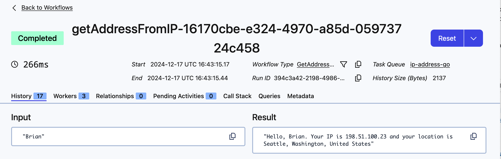
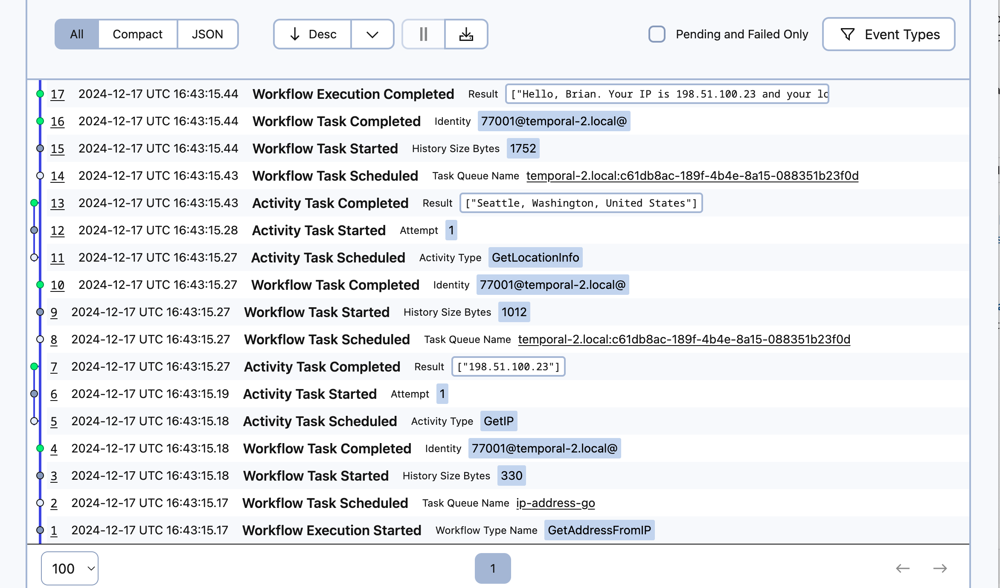
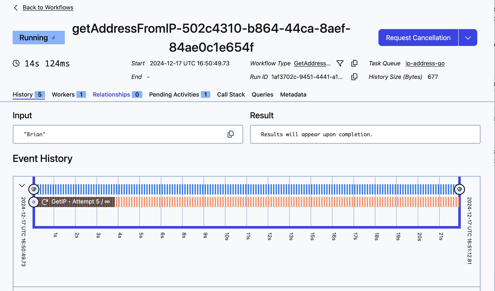
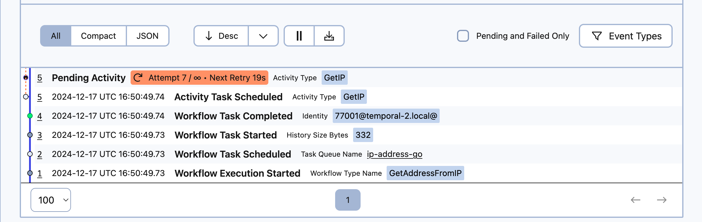
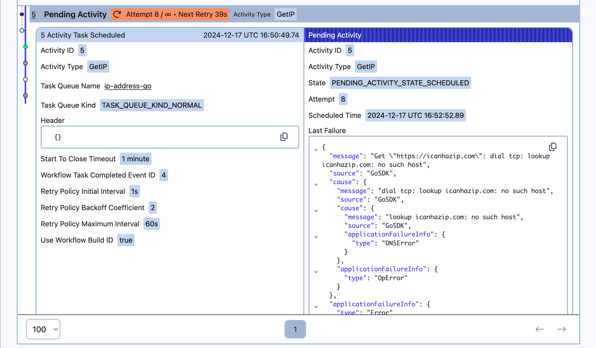
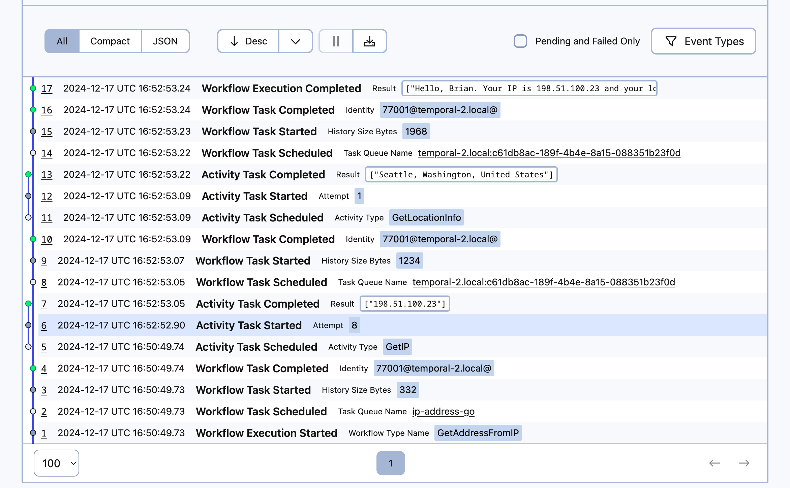

:::note Tutorial information

- **Level:** ⭐ Temporal beginner
- **Time:** ⏱️ ~15 minutes
- **Goals:** 🙌
  - Set up, build, and test a Temporal Application project from scratch using the [Go SDK](https://github.com/temporalio/sdk-go).
  - Identify the four parts of a Temporal Workflow application.
  - Describe how the Temporal Server gets information to the Worker.
  - Observe how Temporal recovers from failed Activities.

:::

### Introduction

Creating reliable applications is a difficult chore. [Temporal](https://temporal.io/) lets you create fault-tolerant, resilient applications using programming languages you already know, so you can build complex applications that execute reliably and recover from failures.

In this tutorial, you will build your first Temporal Application from scratch using the [Temporal Go SDK](https://github.com/temporalio/sdk-go). You'll develop a small application that asks for your name and then uses APIs to get your public IP address and your location based on that address. External requests can fail due to rate limiting, network interruptions, or other errors. Using Temporal for this application will let you automatically recover from these and other kinds of failures without having to write explicit error-handling code.

The app will consist of the following pieces:

1. Two [Activities](https://docs.temporal.io/activities): Activities are functions called by Workflows, and they contain any logic that might fail or behave differently at different times. The first Activity will get your IP address, and the second Activity will use that IP address to get your location.

1. A [Workflow](https://docs.temporal.io/workflows): Workflows are functions that define the overall flow of the application.  Your Workflow will execute both Activities you define. It will call the first Activity to fetch the IP address, and then use the result of that Activity to call the next Activity to find your location.
2. A [Worker](https://docs.temporal.io/workers): Workers host the Activity and Workflow code and execute the code piece by piece.
3. A client program: You'll need to start your Worfklow. In this tutorial you'll create a small program using the [Temporal Client](https://docs.temporal.io/encyclopedia/temporal-sdks#temporal-client) to start the Workflow.

You'll also write tests to ensure your Workflow executes successfully.

When you're done, you'll have a basic application and a clear understanding of how to build out the components you'll need in future Temporal applications in TypeScript.

## Prerequisites

Before starting this tutorial:

- [Set up a local development environment for developing Temporal applications using Go](https://learn.temporal.io/getting_started/go/dev_environment/)
  - Ensure that the Temporal Service is running in a terminal on your local machine and that you can access the Temporal Web UI. In this tutorial you'll use port `8233` for the Web UI, which is the default port.

- Follow the tutorial [Run your first Temporal application with the Go SDK](https://learn.temporal.io/getting_started/go/first_program_in_go/) to gain a better understanding of what Temporal is and how its components fit together.

## Create a New Temporal Go Project

To get started with the Temporal Go SDK, you'll create a new Go project and initialize it as a module, just like any other Go program you're creating. Then you'll add the Temporal SDK package to your project.

In a terminal, create a new project directory called `hello-world-temporal`:

```command
mkdir temporal-ip-geolocation
```

Switch to the new directory:

```command
cd temporal-ip-geolocation
```

From the root of your new project directory, initialize a new Go module. Make sure the module path (for example, `temporal-ip-geolocation`) matches that of the directory in which you are creating the module.

```command
go mod init temporal-ip-geolocation/iplocate
```

Then add the Temporal Go SDK as a project dependency:

```command
go get go.temporal.io/sdk
```

You'll see the following output, indicating that the SDK is now a project dependency:

```text
go: added go.temporal.io/sdk v1.17.0
```

With the project created, you'll create the application's core logic.

## Write functions to call external services

Your application will make two HTTP requests. The first request will return your current public IP, while the second request will use that IP to provide city, state, and country information.

You'll use Temporal Activities to make these requests. You use Activities in your Temporal Applications to execute [non-deterministic](https://docs.temporal.io/workflows#deterministic-constraints) code or perform operations that may fail, such as API requests or database calls.

If an Activity fails, Temporal can automatically retry it until it succeeds or reaches a specified retry limit. This ensures that transient issues, like network glitches or temporary service outages, don't result in data loss or incomplete processes.

Create the file `activities.go` in your project root:

```command
touch activities.go
```

Open the file `activities.go` in your editor and add the following code that imports dependencies and defines a struct to hold the Activities:


<!--SNIPSTART go-ipgeo-activity-setup-->
[activities.go](https://github.com/temporalio/temporal-tutorial-ipgeo-go/blob/v1/activities.go)
```go
package iplocate

import (
	"encoding/json"
	"fmt"
	"io"
	"net/http"
	"strings"
)

type HTTPGetter interface {
	Get(url string) (*http.Response, error)
}

type IPActivities struct {
	HTTPClient HTTPGetter
}

```
<!--SNIPEND-->

With the Go SDK, you can define Activities as regular Go functions, or you can create them as members of a struct. If you use a struct, you can then pass in shared objects like database connections or clients that all Activities can share. In this tutorial you'll pass an HTTP client into the struct. This will let you stub out the HTTP client implementation when you write tests for your Activities later.

Now add the following code to define a Temporal Activity that retrieves your IP address from `icanhazip.com`:

<!--SNIPSTART go-ipgeo-activity-ip-->
[activities.go](https://github.com/temporalio/temporal-tutorial-ipgeo-go/blob/v1/activities.go)
```go
// GetIP fetches the public IP address.
func (i *IPActivities) GetIP() (string, error) {
	resp, err := i.HTTPClient.Get("https://icanhazip.com")
	if err != nil {
		return "", err
	}
	defer resp.Body.Close()

	body, err := io.ReadAll(resp.Body)
	if err != nil {
		return "", err
	}

	ip := strings.TrimSpace(string(body))
	return ip, nil
}

```
<!--SNIPEND-->

The response from `icanhazip.com` is plain-text, and it includes a newline, so you trim off the newline character before returning the result.

Notice that there's no error-handling code in this function. When you build your Workflow, you'll use Temporal's Activity Retry policies to retry this code automatically if there's an error.

Now add the second Activity that accepts an IP address and retrieves location data. In `activities.go`, add the following code to define it:

<!--SNIPSTART go-ipgeo-activity-location-->
[activities.go](https://github.com/temporalio/temporal-tutorial-ipgeo-go/blob/v1/activities.go)
```go
// GetLocationInfo uses the IP address to fetch location information.
func (i *IPActivities) GetLocationInfo(ip string) (string, error) {
	url := fmt.Sprintf("http://ip-api.com/json/%s", ip)
	resp, err := i.HTTPClient.Get(url)
	if err != nil {
		return "", err
	}
	defer resp.Body.Close()

	body, err := io.ReadAll(resp.Body)
	if err != nil {
		return "", err
	}

	var data struct {
		City       string `json:"city"`
		RegionName string `json:"regionName"`
		Country    string `json:"country"`
	}

	err = json.Unmarshal(body, &data)
	if err != nil {
		return "", err
	}

	return fmt.Sprintf("%s, %s, %s", data.City, data.RegionName, data.Country), nil
}

```
<!--SNIPEND-->

This Activity follows the same pattern as the `getIP` Activity.  This time, the service returns JSON data rather than text, so you have to define a type to unmarshal the data.

While Activities can accept input arguments, it's a best practice to send a single argument rather than multiple arguments. In this case you only have a single String. If you have more than one argument, you should bundle them up in a serializable object. Review the [Activity parameters](https://docs.temporal.io/dev-guide/typescript/foundations/#activity-parameters) section of the Temporal documentation for more details, as there are some limitations you'll want to be aware of in more complex applications.

You've created your two Activities. Now you'll coordinate them using a Temporal Workflow.

## Control application logic with a Workflow

Workflows are where you configure and organize the execution of Activities. You define a Workflow by writing a *Workflow Definition* using one of the Temporal SDKs.

In the Temporal Go SDK, a Workflow Definition is an [exported function](https://go.dev/tour/basics/3) with two additional requirements: it must accept `workflow.Context` as the first input parameter, and it must return `error`. Your Workflow function can optionally return another value, which you'll use to return the result of the Workflow Execution. Review the [Develop Workflows](https://docs.temporal.io/develop/go/core-application#develop-workflows) section of the Temporal documentation for more about Workflows in Go.

Temporal Workflows [must be deterministic](https://docs.temporal.io/workflows#deterministic-constraints) so that Temporal can replay your Workflow in the event of a crash. That's why you call Activities from your Workflow code. Activities don't have the same determinism constraints that Workflows have.

Create the file `workflows.go` in the root of your project:

```command
touch workflows.go
```

Then add the following code to import the Activities and configure how the Workflow should handle failures with a [Retry Policy](https://docs.temporal.io/encyclopedia/retry-policies).

<!--SNIPSTART go-ipgeo-workflow-imports-->
[workflows.go](https://github.com/temporalio/temporal-tutorial-ipgeo-go/blob/v1/workflows.go)
```go
package iplocate

import (
	"fmt"
	"go.temporal.io/sdk/temporal"
	"go.temporal.io/sdk/workflow"
	"time"
)

```
<!--SNIPEND-->


With the imports and options in place, you can define the Workflow itself. In the Go SDK, you implement a Workflow by defining a public function. Add the following code to call both Activities, using the value of the first as the input to the second:

<!--SNIPSTART go-ipgeo-workflow-code-->
[workflows.go](https://github.com/temporalio/temporal-tutorial-ipgeo-go/blob/v1/workflows.go)
```go
// GetAddressFromIP is the Temporal Workflow that retrieves the IP address and location info.
func GetAddressFromIP(ctx workflow.Context, name string) (string, error) {
	// Define the activity options, including the retry policy
	ao := workflow.ActivityOptions{
		StartToCloseTimeout: time.Minute,
		RetryPolicy: &temporal.RetryPolicy{
			InitialInterval:    time.Second,
			MaximumInterval:    time.Minute,
			BackoffCoefficient: 2,
			// MaximumAttempts: 5, // Uncomment this if you want to limit attempts
		},
	}
	ctx = workflow.WithActivityOptions(ctx, ao)

	var ip string
	var ipActivities *IPActivities

	err := workflow.ExecuteActivity(ctx, ipActivities.GetIP).Get(ctx, &ip)
	if err != nil {
		return "", fmt.Errorf("Failed to get IP: %s", err)
	}

	var location string
	err = workflow.ExecuteActivity(ctx, ipActivities.GetLocationInfo, ip).Get(ctx, &location)
	if err != nil {
		return "", fmt.Errorf("Failed to get location: %s", err)
	}

	return fmt.Sprintf("Hello, %s. Your IP is %s and your location is %s", name, ip, location), nil
}

```
<!--SNIPEND-->

In this example, you have specified that the Start-to-Close Timeout for your Activity will be one minute, meaning that your Activity has one minute to complete before it times out. Of all the Temporal timeout options, `StartToCloseTimeout` is the one you should always set.

You also set the Retry Policy for Activities. In this example, you're using the default Retry Policy values, so you don't need to specify the values, but by leaving them in you have a more clear picture of what happens. Note that the `MaximumAttempts` is commented out, which means there's no limit to the number of times Temporal will retry your Activities if they fail.


This code does check for and handle errors, but because you've configured unlimited retries, there won't be any exceptions caught. However, if you change the Retry Policy's maximum retries, or you specify non-retryable exceptions, this code will be in place to handle those errors.

Next you'll create a Worker that executes the Workflow and Activities.

## Configure and run a Worker

When you start a Temporal Workflow, the Workflow and its Activities get scheduled on the Temporal Service's [Task Queue](https://docs.temporal.io/concepts/what-is-a-task-queue). A [Worker](https://docs.temporal.io/concepts/what-is-a-worker) hosts Workflow and Activity functions and polls the Task Queue for tasks related to those Workflows and Activities. After the Worker runs the code, it communicates the results back to the Temporal Service where they're stored in the Event History. This records the Workflow's entire execution, enabling features like fault tolerance by allowing the Workflow to replay in case of Worker crashes or restarts.

You use the Temporal SDK to define a Worker Program.

In your Worker Program, you need to specify the name of the Task Queue, which must match the Task Queue name used whenever you interact with a Workflow from a client application. This ensures that the Worker processes tasks for the correct Workflow. The Task Queue name is a case-insensitive string. To ensure consistency and avoid errors, define the Task Queue name as a constant that can be reused throughout your code.

Create the file `shared.go`:

```
touch shared.go
```

Open the file and add the following lines to the file to define the constant for the Task Queue:

<!--SNIPSTART go-ipgeo-shared-->
[src/shared.ts](https://github.com/temporalio/temporal-tutorial-ipgeo-ts/blob/main/src/shared.ts)
```ts
export const TASK_QUEUE_NAME="ip-address-ts";
```
<!--SNIPEND-->

Now you can create the Worker program.

Create a new directory called `worker` which will hold the program you'll create:

```command
mkdir worker
```

Now create the file `main.go` in that directory:

```command
touch worker/main.go
```

Then open `worker/main.go` in your editor and add the following code to define the Worker program:

<!--SNIPSTART go-ipgeo-worker-->
[worker/main.go](https://github.com/temporalio/temporal-tutorial-ipgeo-go/blob/v1/worker/main.go)

```go
package main

import (
	"iplocate"
	"log"
	"net/http"

	"go.temporal.io/sdk/client"
	"go.temporal.io/sdk/worker"
)

func main() {
	// Create the Temporal client
	c, err := client.Dial(client.Options{})
	if err != nil {
		log.Fatalln("Unable to create Temporal client", err)
	}
	defer c.Close()

	// Create the Temporal worker
	w := worker.New(c, iplocate.TaskQueueName, worker.Options{})

	// inject HTTP client into the Activities Struct
	activities := &iplocate.IPActivities{
		HTTPClient: http.DefaultClient,
	}

	// Register Workflow and Activities
	w.RegisterWorkflow(iplocate.GetAddressFromIP)
	w.RegisterActivity(activities)

	// Start the Worker
	err = w.Run(worker.InterruptCh())
	if err != nil {
		log.Fatalln("Unable to start Temporal worker", err)
	}
}

```
<!--SNIPEND-->

The code imports the `iplocate` package, which includes your Workflow and Activity Definitions. It then defines a `main` function that creates and runs a Worker.

You first create a client, and then you create a Worker that uses the client, along with the Task Queue it should listen on. By default, the client connects to the Temporal Cluster running at `localhost` on port `7233`, and connects to the `default` namespace. You can change this by setting values in `client.Options`.

Then you register your Workflow and Activities with the Worker. Since you defined your Activities as a struct, you use that instead of referencing your Activities directly. This is also where you inject the HTTP client so your Activities can access it.

In this case your Worker will run your Workflow and your two Activities, but there are cases where you could configure one Worker to run Activities, and another Worker to run the Workflows.

Now you will use an `npm` script to start your Worker with Nodemon. Nodemon automatically reloads whenever it detects changes in your file, hence the command name `start.watch`. Be sure you have started the local Temporal Service and execute the following command to start your Worker:

```command
go run worker/main.go
```

The Worker runs and you see the following output:

```output
2024/12/16 14:32:44 INFO  No logger configured for temporal client. Created default one.
2024/12/16 14:32:44 INFO  Started Worker Namespace default TaskQueue ip-address-go WorkerID 31530@temporal-2.local@
```

Your Worker is running and is polling the Temporal Service for Workflows to run, but before you start your Workflow, you'll write tests to prove it works as expected.

## Write tests to ensure things work

The Temporal Go SDK includes functions that help you test your Workflow executions. Let's add a basic unit test to the application to make sure the Workflow works as expected.

You'll use the [testify](https://github.com/stretchr/testify) package to build your test cases and mock the Activity so you can test the Workflow in isolation.

Add the `testify/require` package to your project by running the following commands in your terminal:

```command
go get github.com/stretchr/testify/require
```

```command
go mod tidy
```

Create the file `workflows_test.go` in your project root:

```command
touch workflows_test.go
```

Add the following code to set up the testing environment:

<!--SNIPSTART go-ipgeo-workflow-test-setup-->
[workflows_test.go](https://github.com/temporalio/temporal-tutorial-ipgeo-go/blob/v1/workflows_test.go)
```go
package iplocate_test

import (
	"iplocate"
	"testing"

	"github.com/stretchr/testify/require"

	"go.temporal.io/sdk/testsuite"
)

```
<!--SNIPEND-->

You'll use the [Testify](https://github.com/stretchr/testify) module, along with the Temporal Go SDK's testing libraries to build your tests.

Add the following code to test the Workflow execution:

<!--SNIPSTART go-ipgeo-workflow-test-workflow-->
[workflows_test.go](https://github.com/temporalio/temporal-tutorial-ipgeo-go/blob/v1/workflows_test.go)
```go

func Test_Workflow(t *testing.T) {
	testSuite := &testsuite.WorkflowTestSuite{}
	env := testSuite.NewTestWorkflowEnvironment()
	activities := &iplocate.IPActivities{}

	// Mock activity implementation
	env.OnActivity(activities.GetIP).Return("1.1.1.1", nil)
	env.OnActivity(activities.GetLocationInfo, "1.1.1.1").Return("Planet Earth", nil)

	env.ExecuteWorkflow(iplocate.GetAddressFromIP, "Temporal")

	var result string
	require.NoError(t, env.GetWorkflowResult(&result))

	require.Equal(t, "Hello, Temporal. Your IP is 1.1.1.1 and your location is Planet Earth", result)
}

```
<!--SNIPEND-->

This test creates a test execution environment and then mocks the Activity implementation so it returns a successful execution. The test then executes the Workflow in the test environment and checks for a successful execution. Finally, the test ensures the Workflow's return value returns the expected value.

Instead of using your actual Activities, you replace the Activities `getIP` and `getAddress` with mocks that return hard-coded values. This way you're testing the Workflow's logic independently of the Activities. If you wanted to test the Activities directly as part of an integration test, you would omit these mocks from the test.

Ensure you've saved all your files and execute your tests with the following command:

```command
go test
```

The test environment starts, spins up a Worker, and executes the Workflow in the test environment. At the end, you'll see that your test passes:

```output
```

With a Workflow test in place, you can write unit tests for the Activities.

Both of your Activities make external calls to services that will change their results based on who runs them. It will be challenging to test these Activities reliably. For example, the IP address may vary based on your machine's location.

To ensure you can test the Activities in isolation, you’ll stub out the HTTP calls.

Create the file `activities_test.go`

```command
touch activities_test.go
```

Add the following code to import the testing libraries you'll use:

<!--SNIPSTART go-ipgeo-activity-test-setup-->
[activities_test.go](https://github.com/temporalio/temporal-tutorial-ipgeo-go/blob/v1/activities_test.go)
```go
package iplocate_test

import (
	"io"
	"iplocate"
	"net/http"
	"strings"
	"testing"
)

type MockHTTPClient struct {
	Response *http.Response
	Err      error
}

func (m *MockHTTPClient) Get(url string) (*http.Response, error) {
	return m.Response, m.Err
}

```
<!--SNIPEND-->


To ensure you don't make real HTTP requests, you define a mock HTTP client struct with a `Get` function. When you write your tests you'll inject this mocked client into the Activity so you can control the response.

Next, write the test for the `getIP` Activity, using `sinon` to stub out actual HTTP calls so your tests are consistent. Notice that the stubbed response adds the newline character so it replicates the actual response:

<!--SNIPSTART go-ipgeo-activity-test-ip-->
[activities_test.go](https://github.com/temporalio/temporal-tutorial-ipgeo-go/blob/v1/activities_test.go)
```go
// TestGetIP tests the GetIP activity with a mock server.
func TestGetIP(t *testing.T) {
	// Create a mock server that returns the fake IP address

	mockResponse := &http.Response{
		StatusCode: 200,
		Body:       io.NopCloser(strings.NewReader("127.0.0.1\n")),
	}

	ipActivities := iplocate.IPActivities{
		HTTPClient: &MockHTTPClient{Response: mockResponse},
	}

	// Call the GetIP function
	ip, err := ipActivities.GetIP()
	if err != nil {
		t.Fatalf("Expected no error, got %v", err)
	}

	// Validate the returned IP
	expectedIP := "127.0.0.1"
	if ip != expectedIP {
		t.Fatalf("Expected IP to be '%s', but got '%s'", expectedIP, ip)
	}
}

```
<!--SNIPEND-->

To test the Activity itself, you use the `MockActivityEnvironment` to execute the Activity rather than directly calling the `getIP` function.

The `try/finally` block ensures that if the test fails, the tests restore the `fetch` stub to its original functionality.
This way other tests you write can also stub `fetch` with a different response.

To test the `getLocation` Activity, you use a similar approach. Add the following code to the `src/mocha/activities.ts` file:

<!--SNIPSTART go-ipgeo-activity-test-location-->
[activities_test.go](https://github.com/temporalio/temporal-tutorial-ipgeo-go/blob/v1/activities_test.go)
```go
// TestGetLocationInfo tests the GetLocationInfo activity with a mock server.
func TestGetLocationInfo(t *testing.T) {
	mockResponse := &http.Response{
		StatusCode: 200,
		Body: io.NopCloser(strings.NewReader(`{
            "city": "San Francisco",
            "regionName": "California",
            "country": "United States"
        }`)),
	}

	ipActivities := iplocate.IPActivities{
		HTTPClient: &MockHTTPClient{Response: mockResponse},
	}

	ip := "127.0.0.1"
	location, err := ipActivities.GetLocationInfo(ip)
	if err != nil {
		t.Fatalf("Expected no error, got %v", err)
	}

	expectedLocation := "San Francisco, California, United States"
	if location != expectedLocation {
		t.Errorf("Expected location %v, got %v", expectedLocation, location)
	}
}

```
<!--SNIPEND-->

This test looks similar to the previous test; you stub out the `fetch` method and ensure it returns the expected data, and then you execute the Actiity in the `MockActivityEnvironment`. Then you restore the stubbed `fetch` method.

Run the tests again to see them pass:

```command
go test
```

Now that you have your tests passing, it's time to start a Workflow Execution.

## Run the Workflow from a client

You can start a Workflow Execution by using the Temporal CLI or by writing code using the Temporal SDK.

Starting a Workflow Execution using the Temporal SDK involves connecting to the Temporal Server, configuring the Task Queue the Workflow should use, and starting the Workflow with the input parameters it expects. In a real application, you may invoke this code when someone submits a form, presses a button, or visits a certain URL. In this tutorial, you will create a `client.ts` file that triggers your Temporal Workflow.

Create a new directory called `client` to hold the program:

```command
mkdir client
```

Then create the file `start/main.go` :

```command
touch client/main.go
```

Open `client/main.go` in your editor and add the following code to the file to connect to the server and start the Workflow:

<!--SNIPSTART go-ipgeo-cli-client-->
[client/main.go](https://github.com/temporalio/temporal-tutorial-ipgeo-go/blob/v1/client/main.go)
```go
package main

import (
	"context"
	"fmt"
	"github.com/google/uuid"
	"go.temporal.io/sdk/client"
	"iplocate"
	"log"
	"os"
)

func main() {
	if len(os.Args) <= 1 {
		log.Fatalln("Must specify a name as the command-line argument")
	}
	name := os.Args[1]

	c, err := client.Dial(client.Options{})
	if err != nil {
		log.Fatalln("Unable to create client", err)
	}
	defer c.Close()

	workflowID := "getAddressFromIP-" + uuid.New().String()

	options := client.StartWorkflowOptions{
		ID:        workflowID,
		TaskQueue: iplocate.TaskQueueName,
	}

	we, err := c.ExecuteWorkflow(context.Background(), options, iplocate.GetAddressFromIP, name)
	if err != nil {
		log.Fatalln("Unable to execute workflow", err)
	}

	var result string
	err = we.Get(context.Background(), &result)
	if err != nil {
		log.Fatalln("Unable get workflow result", err)
	}

	fmt.Println(result)
}

```
<!--SNIPEND-->

Like the Worker you created, this program uses `client.Dial` to connect to the Temporal server. It then specifies a [Workflow ID](https://docs.temporal.io/dev-guide/go/foundations/#workflow-id) for the Workflow, as well as the Task Queue. The Worker you configured is looking for tasks on that Task Queue. Your shared constant ensures you're using the same Task Queue name here.

In the `run` function you check to see if there are at least two arguments passed. You need to check for two arguments because `process.argv` includes the Node.js executable path and the script path as the first two elements, so the actual command-line arguments start at index 2.

The `run` function then sets up a connection to your Temporal Server, invokes your Workflow, passes in an argument for the `name`, and assigns the Workflow a unique identifier with Nanoid. The client dispatches the Workflow on the same Task Queue that the Worker is polling on. That's why you used a constant to ensure the Task Queue name is consistent. If there's a mismatch, your Workflow will execute on a different Task Queue and there won't be any Workers polling for tasks.

:::note Specify a Workflow Id

A Workflow ID is unique in a Namespace and identifies a Workflow Execution. Using an identifier that reflects some business process or entity is a good practice. For example, you might use a customer identifier as part of the Workflow Id if you run one Workflow per customer. This would make it easier to find all Workflow Executions related to that customer later.

In this tutorial you're generating a UUID and appending it to a string that identifies the Workflow.
:::

You can [get the results](https://docs.temporal.io/dev-guide/go/foundations/#get-workflow-results) from your Workflow right away, or you can get the results at a later time. This implementation attempts to get the results immediately by calling `we.Get`, which blocks the program's execution until the Workflow Execution completes.


Now you can run your Workflow. First, ensure that your local Temporal Service is running, and that your Worker program is running also.

Then open a new terminal and switch to the project directory:

```command
cd temporal-ip-geolocation
```

Now run the following command to run the Workflow using the client program you wrote:

```command
go run client/main.go Brian
```

You'll see the following output:

```output
> temporal-hello-world@0.1.0 workflow
> ts-node src/client.ts Brian

Hello, Brian. Your IP is 198.51.100.23 and your location is Seattle,  Washington, United States
```

:::tip

To run your Temporal Application, you need to start the Workflow and the Worker. You can start these in any order, but you'll need to run each command from a separate terminal window, as the Worker needs to be constantly running to look for tasks to execute.

:::

Your Temporal Application works. Now review it in the Temporal Web UI.

## Exploring your application in the Web UI

The Temporal Web UI gives you insights into your Workflow's execution. Open the Temporal Web UI by visiting `http://localhost:8233` and click on your completed Workflow to view the execution history. You'll see results similar to the following image:



You'll see the dates the Workflow Exeuction ran, how long it took to run, the input to the Workflow, and the result.

After that, you see the Event History, detailing the entire flow, including the inputs and outputs of the Activity Executions:



The most recent event is at the top, so read the history from the bottom up to see each step in the process. Using this history, you can see exactly how your Workflow executed and pinpoint any places things might have gone wrong.

Temporal stores the results of each Activity in this history, as you can see in the image. If there was a system crash between the `getIP` and `getLocationInfo` Activity Executions, a new Worker would re-run the Workflow, but would use the previous Event History to reconstruct the Workflow's state. Instead of re-running the `getIP` function, it would use the previous run's value and continue on. This prevents duplicate executions. By relying on the stored Event History, Temporal ensures that the Workflow can recover seamlessly, maintaining reliability and consistency even after a crash.

In this application, this recovery isn't crucial. But imagine a situation where each Activity execution was a bank transaction. If a crash occurred between transactions, the Worker can pick up where the previous one failed. Nobody gets charged multiple times because something failed.

Next, you'll explore how Temporal handles failed Activities.

## Observe automatic retries

When you developed your Activities, you didn't include any error-handling code. So if there's a problem making the request, the Workflow will handle the error using the Retry Policy.

Test this out. Disconnect your local machine from the Internet by turning off your Wi-Fi connection or unplugging your network cable.

Then, with the local Temporal Service running and your Worker running, switch to the Terminal window where you ran your Workflow and run it again:

```command
go run client/main.go Brian
```

This time you don't get a response.

Visit `http://localhost:8233` to open the Temporal Web UI and locate the Workflow Execution that's currently running. When you select it, you'll see something like the following image, indicating that there's a problem:


As you can see, the `getIP` Activity has failed and Temporal is retrying it. Scroll down to the Event History and you'll see the failure represented there:


Select the **Pending Activity** item in the table to see why it failed and you'll see the stack trace:



In the **Last Failure** field, you can see there was a TypeScript error indicating that `fetch` failed.

Connect to the internet again and wait. After a few moments, the Workflow recovers and completes:



If you return to your terminal where you launched the Workflow, you'll find your results there as well.

You can recover from failures by letting Temporal handle them for you instead of writing complex error-handling logic. You can also decide that you only want to retry a fixed number of times, or that you only want to recover on certain kinds of errors.

## Conclusion

In this tutorial you built your first Temporal Application. You used the Temporal Go SDK to build a resilient application that recovered from failure. You wrote tests to verify that it works and reviewed the Event History for a working execution. You also tested your Workflow without an internet connection to understand how Temporal recovers from failures like network outages.

Take this application one step further and add a new Activity that gets the current weather for the location you found.

Then [get your application working on Temporal Cloud](https://learn.temporal.io/getting_started/typescript/run_workers_with_cloud_typescript/).

### Review

Answer the following questions to see whether you remember some important concepts from this tutorial:

<details>
<summary>

**What are the four parts of a Temporal Workflow application?**

</summary>

1. A Workflow function.
2. An Activity function.
3. A Worker to host the Workflow and Activity code.
4. Some way to start the Workflow.

</details>

<details>
<summary>

**How does the Temporal Server get information to the Worker?**

</summary>

The Temporal Server adds Tasks to a Task Queue, and the Worker polls the Task Queue.

</details>
