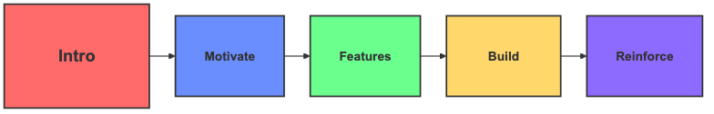
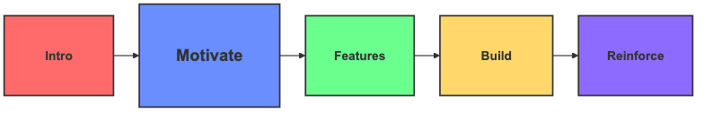
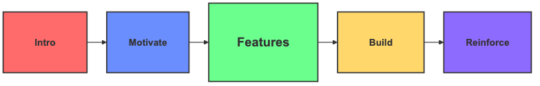
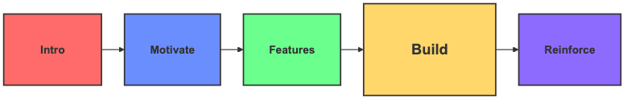
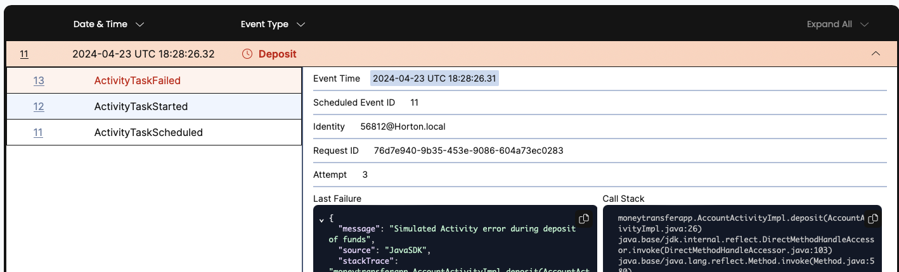
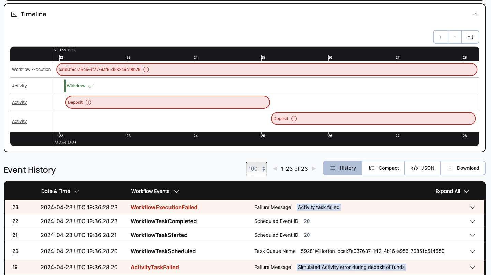
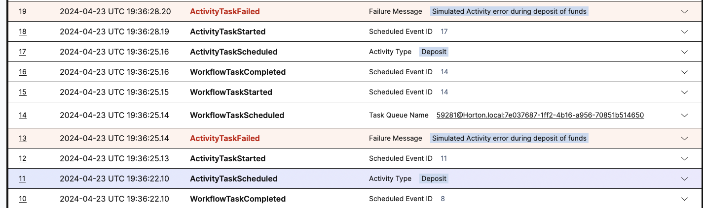
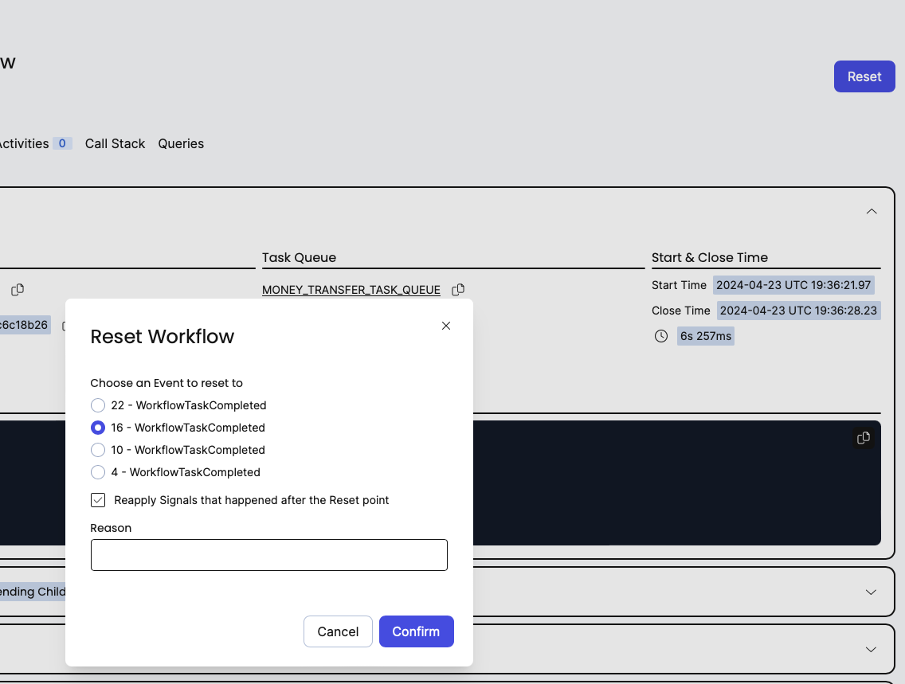
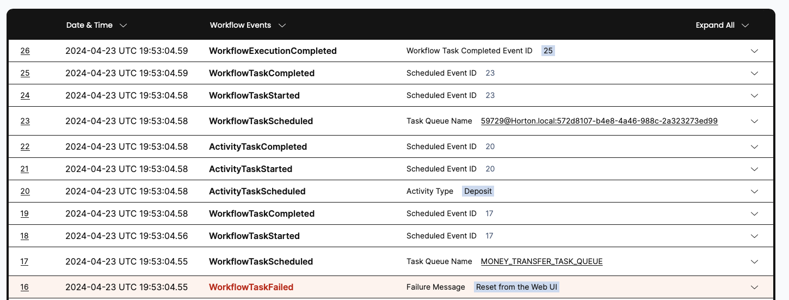
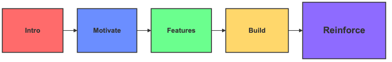

:::note Tutorial information

- **Level**: ⭐ Temporal beginner
- **Time**: ⏱️ ~30 minutes
- **Goals**: 🙌
- Explore Temporal's core terminology and concepts.
- Complete several runs of a Temporal Workflow application using a Temporal Cluster and the [Java SDK](https://github.com/temporalio/sdk-java).
- Practice reviewing the state of the Workflow.
- Understand the inherent reliability of Workflow methods.

:::

## Introduction

In this tutorial, you run your first Temporal Application.
It showcases how Temporal helps you recover from errors by simulating server failures and exploring ways to use Temporal to push through those obstacles.




###  Tutorial prerequisites

Before starting this tutorial:

- [Set up a local development environment for developing Temporal Applications using Java](/getting_started/java/dev_environment/index.md)
- Ensure you have Git installed to clone the project.
- Download the sample application

###  Download the sample 

The sample for this tutorial is hosted at the [money transfer ](https://github.com/temporalio/money-transfer-project-java) GitHub repository.
These steps enable you to download the code you'll use to work through this introduction project.

1. Open a new terminal window.
2. Use `git` to clone the repository:

   ```command
   git clone https://github.com/temporalio/money-transfer-project-java.git
   ```
   
   It will take a few seconds to download the code.
   Details will vary but the download will look something like this.
   
   ```command
   Cloning into 'money-transfer-project-java'...
   ...more output...
   Resolving deltas: 100% (125/125), done.
   ```

2. Move to the project directory:

   ```command
   cd money-transfer-temporal-java
   ```

## Why Temporal: Real-world deployment is prone to failure

Temporal minimizes the pains you experience as a developer when building reliable applications.
Whether you're writing a complex transaction-based Workflow or working with remote APIs, you know that ensuring reliability is a complex process.
The Temporal Platform helps your code runs to completion no matter what.

Each language-specific Temporal SDK, in this case the [Java SDK](https://github.com/temporalio/sdk-java), provides a comprehensive solution for complexities in modern application development.
Temporal's reliability primitives create durable execution of your code.
They add seamless and fault-tolerant application state tracking, automatic retries, timeouts, rollbacks due to process failures, and more.



###  Tutorial scenario
In this tutorial, you will build, adjust, and run a [Temporal Application](https://docs.temporal.io/temporal#temporal-application) using the [Temporal Java SDK](https://github.com/temporalio/sdk-java).
Follow along to discover how Temporal handles your code efficiently and reliably.

This project simulates a money transfer application.
The application focuses on essential transactions like withdrawals, deposits, and refunds.
This sample application withdraws money from one account and deposits it into another.
A few things might go wrong with this process.

* When a withdrawal fails, there's no need to attempt a deposit.
* If the withdrawal succeeds but the deposit fails, the money must be restored to the original account as a compensation.

This second transactional pattern uses recovery steps to ensure consistency across distributed micro-services.
In this project, the compensation counteracts or "rolls back" any steps that have already been processed.

One of Temporal's most important features is its ability to maintain the application state when something fails.
When failures happen, Temporal either recovers processes where they left off or enables you, like in this example, to roll them back.

Now that you know how the application will work, it's time to understand some key Temporal Features.

## Temporal features

Each Temporal SDK provides pre-built components that allow you to move external failure-point logic out of your code.
Temporal handles recovery by retrying these services on your behalf so your application can keep moving forward.
This section introduces important elements that make up a Temporal application.




###  Workflows, Activities, and Workers

A Temporal Application includes several key components that you use in all Temporal-based solutions:

1. A [Workflow](https://docs.temporal.io/workflows) defines the overall flow of an application.
   Write the Workflow using the language and SDK of your choice to best match your business needs. 
1. An [Activity](https://docs.temporal.io/activities) is a method that performs a focused piece of business logic that can fail.
   Each Activity handles just one point of possible failure where a checked exception might occur.
1. A [Worker](https://docs.temporal.io/workers) runs your Workflow and Activity Tasks reliably and consistently.

### Workflows
Temporal applications are built using an abstraction called [Workflows](https://docs.temporal.io/workflows).
You develop Workflows by writing code in a general-purpose programming language such as Java.
Each Workflow defines a sequence of steps.
Those steps are defined by writing code, known as a [Workflow Definition](https://docs.temporal.io/workflows#workflow-definition).
The steps include a mix of normal code and steps that might possibly fail.
These are called Activities.

When your code starts a Workflow, you create a [Workflow Execution](https://docs.temporal.io/workflows#workflow-execution).
The Workflow Execution lives on the Temporal Service.
The Workflow and Activity [Tasks](https://docs.temporal.io/workers#task) that occur during this Execution are orchestrated by the Server and processed by [Worker Programs](https://docs.temporal.io/workers#worker-program).

### Activities

[Activities](https://docs.temporal.io/activities) are prone to failures.
Any code that can "break" and could be re-attempted belongs in an Activity.
For example, your code might call a service that's temporarily unavailable or experiencing with an outage.
Or, it might try to adjust a servo mechanism that is not yet in position to respond.

Activities execute a single, well-defined action that can fail and where an exception may occur.
Examples of Activities include transcoding a media file, sending emails, calling third-party APIs, accessing files or network resources, querying a database, or interacting with a servo motor that might be unavailable at times.
An Activity is where you perform any business logic that is prone to failure.

Automatic retries and the retry policy you choose, allow Activities that fail to be attempted again.
This possibility of multiple attempts means that Temporal is built to work with APIs that "heal" over time and return to service.
Outages will end.
Misconfigurations can resolve.
Someone will plug in the cord that got pulled when they tripped over it.
If a failure can heal over time, Temporal handles the retries and recovery on your behalf.

Some failures are not recoverable and cannot self-heal.
If a service is no longer available -- for example, a provider has gone out of business and you did not design your application to use a backup activity -- you will need to re-write your code.
Temporal cannot fix unrecoverable errors.

### Workers

A [Worker](https://docs.temporal.io/concepts/what-is-a-worker) is responsible for initiating the execution of Workflow and Activity "Tasks".
Workers process tasks and return the results to the Temporal Service.
Tasks are scheduled by the Temporal Service and delivered to Workers. 
Your code executes on the systems where the Workers live.

The types of tasks a Worker deals with are:

* **Activity Tasks**: An Activity Task is a single Activity invocation. 
  It contains the information needed to execute an Activity.
* **Workflow Tasks**: A Workflow Task represents a decision point in the execution of a Workflow. 
  It contains the state of the Workflow.
  A Worker uses the state to decide what should happen next in the Workflow.
  
Adopters new to Temporal may be surprised that the Temporal Service does not execute your code.
The entity that initiates method execution is the Worker.
It runs on your deployments, whether you're working with your own hardware or using Cloud computing. 
It's common to run Workers on multiple servers.
It's also helpful to run Workers using multiple locations for improved security and reliability.

In production environments, Temporal applications often operate with hundreds or thousands of Workers.
Many Temporal adopters call these Worker farms.
Adding more Workers enhances your application's availability and boosts its scalability.

:::tip
- Application code does not run on a Temporal Service.
  The Temporal Service _orchestrates_ execution.
  It is responsible for tracking Workflow Execution state, overseeing failures, and providing Tasks to available Workers.
  Your Worker, Workflow, and Activity code, as well as the rest of your applications, run on your infrastructure and on the systems (such as Web and mobile) that you deploy to.

:::

Each Temporal Worker:

- May only execute Workflows and Activities registered to it.
- Knows which piece of code to execute based on the Tasks it gets from the [Task Queue](https://docs.temporal.io/concepts/what-is-a-task-queue).
- Only listens to the Task Queue that it's registered to.

After a Task completes -- successfully or not -- the Worker returns the results back to the Temporal Service.

:::tip
To pick up Workflow Execution tasks, a Worker must listen to the same Task Queue that the Workflow Execution was scheduled on.

:::

Now that you've read about several key features, it's time to see them in action in a real application.

## Build

The sample code you downloaded contains the source code for an application that simulates the operations of a small bank.
This sample emulates the transfer of money from one account to another.

The application uses two Activity methods, `withdraw` and `deposit`.
These symbolize the movement of funds between accounts.
They operate asynchronously, ensuring that the application can handle other tasks while waiting for the banking operations to complete.



The following diagram illustrates what happens when you start the Workflow:


### Workflow Definition

In the Temporal Java SDK, Workflow Definitions -- the code that implements a Workflow -- are marked by the **`@WorkflowInterface`** annotation.
This is placed just before the class interface.
Annotate each method in this type that will be orchestrated by Temporal with **`@WorkflowMethod`**  

This is what the Workflow Definition looks like for this application.

<!--SNIPSTART money-transfer-java-workflow-interface {"selectedLines": ["6-12"]}-->
<!--SNIPEND-->

- The `MoneyTransferWorkflow` class and its `MoneyTransforWorkflowImpl` implementation are designed to manage the transaction process.
  This includes withdrawing funds from one account and depositing the money into another by executing Activities.

- The `transfer` method's argument (`transaction`) stores the source Account Id, the target Account Id, a reference for the transaction, and the amount of money to transfer.
  These are the full transaction details used to perform the money transfer.
  The following getters enable you to retrieve this information:
  
  <!--SNIPSTART money-transfer-java-transactionDetails {"selectedLines": ["4-10"]}-->
  <!--SNIPEND-->

:::tip

- Sending a single object into a Workflow as its input is a Temporal best practice.
  When possible, avoid multiple, separate input variables.
  As Workflows evolve, you may need to add information to support increased complexity.
  A single argument can update Workflows, especially long-running Workflows, without affecting the calling signature.

:::

:::note

- The `TransactionDetails` record includes a `TransactionReferenceId` field.
  Some APIs let you send a unique _idempotency key_ along with the transaction details.
  This guarantees that if a failure occurs and you have to retry the transaction, the API you call can use the key to ensure it only executes the transaction once.

:::

### Activity Definition

In the Temporal Java SDK, you mark a method within a class interface as an Activity by adding the **`@ActivityMethod`** attribute above the method.
The interface provides two Activity methods `withdraw()` and `deposit()` to handle money transfers.

<!--SNIPSTART money-transfer-java-activity-interface {"selectedLines": ["6-15"]}-->
<!--SNIPEND-->

The implementation of these methods are called the "Activity Definition".
For example, the `withdraw` Activity uses the transfer details calls a service to process the withdrawal:

<!--SNIPSTART money-transfer-java-activity-implementation {"selectedLines": ["5-13"]}-->
<!--SNIPEND-->

The `deposit` Activity method looks almost identical to the `withdraw` method.
It uses the transfer details to call a service to process the deposit, ensuring the money is successfully added to the receiving account.
This implementation adds one non-standard parameter for this tutorial.
Setting `activityShouldSucceed` to `false` lets you explore what happens when activities fail.

<!--SNIPSTART money-transfer-java-activity-implementation {"selectedLines": ["15-27"]}-->
<!--SNIPEND-->

:::tip Why you use Activities

At first glance, you might ask, "Why not incorporate all this business logic into the Workflow Definition as part of the same type?"
Temporal Workflows have [deterministic constraints](https://docs.temporal.io/workflows#deterministic-constraints) they must adhere to.
That is, Workflows must produce the same output each time they run when given the same input.

The reason is this.
At times, Temporal uses the "event sourcing" design pattern to reconstruct Workflow state.
The Service creates event objects for every state change in a system and records this sequence of events in a log or event history. 
This approach builds failure resilience into your apps. 

When the Temporal Service replays saved history event data on the Workflow definition code, the Workflow's code must be deterministic to ensure consistent execution.
This means that any non-deterministic work such as interacting with the outside world, like accessing files or network resources, must be done by Activities.

Activities also take advantage of Temporal's ability to retry Activities.
This is a feature you'll explore in this tutorial using the `activityShouldSucceed` parameter you just saw.
:::

:::info Activity Rules
- Use Activities for business logic that might fail.
- Use Workflows to coordinate your Activities.
- Put at most _one_ fail point into each Activity.
  Retrying an activity with multiple fail-points means you may create unintended side effects and/or re-do work that's already been done.
  You do not want to start cooking three pizzas for a one-pizza order if the payment fails a few times.
  Separate each fail point and coordinate your retries around that fail point.
:::

### Retry Policies

Temporal makes your software durable and fault tolerant.
It enables you to code more reliable systems.
Retry policies play a role in how this happens.

All Activities can fail.
That's why their business logic was put into Activities to begin with.
The key to Temporal is to work with services that self-heal over time and/or provide alternate routes if needed.

Self healing may take time but that's what Temporal is all about. For example:

- A service will come back online after an outage.
- A deposit will clear so there are no longer insufficient funds to pay a bill.
- A motor will finish moving to a new position so the servo control can now operate properly.

Waiting for these events to resolve and retrying your activities means you create durable execution where failure is not the end-point.
Instead, failure and a coordinated attempt policy means you keep moving towards your goal while taking the pain points of reality into account.

When an Activity fails, Temporal Workflows automatically retry the failed Activity by default.
You can customize your retries by adjusting an Activity's Retry Policy.
You normally set these in Workflow implementation that calls the Activity.
This centralizes coordination and policy into your Workflow.

Retry Policies are not only important for keeping your activity moving forward.
The built-in "back off" coefficient uses an exponential approach by default.
Depending on your settings, your first retry may occur after a second, the next after two seconds, the next after four, and so forth.
This approach helps ensure that your retries won't overload the services you working with and rely on.
It also helps bring down costs if you are charged by usage.

You define your Retry Policy as a member variable in the `MoneyTransferWorkflowImpl` class:

<!--SNIPSTART money-transfer-java-workflow-implementation {"selectedLines": ["14-20"]} -->
<!--SNIPEND-->

### Activity Policy

By default, Temporal retries failed Activities forever.
You adjust this using the Activity Options policy.
For example, you might specify errors that Temporal should not attempt to retry or set a maximum number of attempts.
This example attempts an activity up to 5 times using the `maximumAttempts` from the retry policy you just saw.

<!--SNIPSTART money-transfer-java-workflow-implementation {"selectedLines": ["22-29"]}-->
<!--SNIPEND--> 

Include `ActivityOptions` for every activity you write and never omit the `scheduleToCloseTimeout`. 
This timeout controls the maximum time allowed for an Activity Execution, including all retries.
This is the total time that a workflow is willing to wait for an Activity to complete.

The `scheduleToCloseTimeout` is especially important when an Activity Execution has a RetryPolicy with MaximumAttempts > 1.
Temporal can retry a failing Activity Execution for a long time -- up to 10 years with exponential backoff up to a defined maximum interval.
To prevent indefinite retries and to balance the user experience against the unreliability of the Activity Execution, always set the `scheduleToCloseTimeout`.

The `startToCloseTimeout` provides a watchdog that limits the length of each `ActivityExecution`.
This prevents an activity from hanging and taking up more time than it should.
It allows retries to proceed in a more thoughtful manner.

### Activity-Specific Options

A Temporal feature enables you to set `ActivityOptions` that apply only to particular Activities.
The following code gives you a taste of what that looks like in use.
In addition to passing the default Activity options, you can pass a per-method `Map` that includes additional options for specific calls.
The `Map` uses `String`-based keys tied to the method name.

<!--SNIPSTART  money-transfer-java-workflow-implementation {"selectedLines": ["31-40"]}-->
<!--SNIPEND--> 

When setting up the Activity stub, these additional optional settings are passed as a third argument.

## Failed Activities

When the `deposit` Activity encounters an unrecoverable error, this tutorial's Workflow will try to put the money back.

:::caution This is a simplified example.

- Transferring money is a tricky subject.
  This tutorial's example doesn't begin to cover all possible issues that can go wrong.
  It doesn't include logic to clean things up if a Workflow is cancelled.
  It doesn't handle other edge cases where money would be withdrawn but not deposited.
  There's also the possibility that this Workflow can fail when refunding the money to the original account.
  In a production scenario, you'll want to account for those cases with more advanced logic.
  You might consider adding a "human in the loop" step where someone is notified by text or email of the refund issue so they can intervene.
  This example only shows some core features of Temporal. It is not intended for production use.
:::

You control whether the initial deposit (and any recovery compensation) takes place.
Set the Boolean `transferShouldSucceed` and `recoveryShouldSucceed` variables as desired.

<!--SNIPSTART money-transfer-java-workflow-implementation {"selectedLines": ["42-109"], "highlightedLines": ["65", "84"]}-->
<!--SNIPEND-->

This code handles Activity failure in the Workflow, using `try-catch`.
Here are the key points about this complex code:

* The withdrawal from the source account may fails after using all its retry attempts or exceeding the maximum allowed time limits.
  For example, consider the case of insufficient funds.
  In this case the method logs the issue and returns.
* If the withdrawal succeeds but the deposit fails, using its retry policy, the method attempts to refund the withdrawal.
  Think "service downtime."
* If the refund succeeds, the results are logged, and the method returns.
* If the refund fails, the transaction ends in an inconsistent state.
* If both the withdrawal and deposit succeed, the results are logged and the method returns.
  This is the "happy path."
  
:::note
- The deposit method uses the previously-mentioned success configuration variable that is not visible when calling the Workflow.
  It's a good thing for learning about and exploring Temporal.
  It's a bad thing for performing unit tests.
  For this reason, the deposit is not tested in this tutorial project.
  The tests will pass whether you've set the Boolean control values to true or false.
:::

## [](/img/icons/run.png) Start a Workflow

When you _start_ a Workflow Execution, you tell the Temporal Service, "Begin this Workflow and track its progress." 
Workers process Workflow code piece by piece.
All Workflows and Activities are considered "Tasks" that Workers initiate and control.
The Worker relays execution events and results back to the server and respond to Orchestration by, for example, retrying Activities or replaying Workflows.

In the Temporal ecosystem, Clients are responsible for starting Workflow Executions.
In the Java SDK, the Client wraps a gRPC "stub" that communicates with the Temporal Service.
It can tell the Temporal Service to begin a new Workflow Execution.
Another way is to use the ['temporal' CLI utility](https://docs.temporal.io/cli) during development.
This tutorial uses Java SDK calls to start the Workflow, which is how most Workflows get started in production environments.

Make sure the local [Temporal Service](https://docs.temporal.io/clusters) is running in a Terminal window. 
Issue the following command if it is not: 

```command
temporal server start-dev --log-level=never
```

This command starts the local development server.
The server will block as it runs.
Open another Terminal window or tab to continue and let the server continue running.

To create a Workflow execution, issue this command. 

```command
mvn compile exec:java -Dexec.mainClass="moneytransferapp.TransferApp" -Dorg.slf4j.simpleLogger.defaultLogLevel=warn
```

It starts an execution from the transfer initiation application for a random amount between $15 and $75. 

```command
MONEY TRANSFER PROJECT

Initiating transfer of $45 from [Account 711713707] to [Account 221056126].

[WorkflowID: money-transfer-workflow]
[RunID: 37688cca-ffa2-48cf-809b-f18f5119bca3]
```

Once the new Workflow Execution is created and begins to run asynchronously, control returns to you on the command line.
The WorkflowID and RunID will help you track this workflow's progress in the local development server.

:::note
- The Temporal Service is an essential part of Temporal's overall system, but requires additional components for operation.
  The complete system is known as the Temporal Cluster.
  This includes a deployment of a Temporal Service, plus additional components used with it such as a database like Apache Cassandra, PostgreSQL, or MySQL.

:::

## Create a Workflow Execution

The transfer app is a small Java program that builds a Workflow Execution.
In a real deployments, you might invoke similar code when someone submits a form, presses a button, or visits a certain URL.
Here is the code that performs this work:

<!--SNIPSTART money-transfer-java-initiate-transfer {"selectedLines": ["31-70"], "highlightedLines": ["46", "63"]}-->
<!--SNIPEND-->

This code builds a Temporal Client and uses it to create a new Workflow stub that points to the Workflow method to use.
With the details for the transfer all collected together into a single instance (`transaction`), the `WorkflowClient` type creates a new Workflow Execution using the stub and the `transaction` instance.
It runs asynchronously.
After printing out details, the application exits.   
The Workflow Execution lives on the Temporal Service
Ending the application does not affect the progress of this new undertaking.  

:::note Task Queues

- The Task Queue is where Temporal Workers look for Workflows and Activities to execute.
  You define Task Queues by assigning a name as a string.
  You use this Task Queue name when you start a Workflow Execution, and you'll use it again when you define your Workers.

:::

## [](/img/icons/harbor-crane.png) View Workflow state

Temporal records every execution, its progress, and application state through Temporal's Web UI.
This provides insights into errors and app performance.
You're ready to explore one of Temporal's unique value propositions: application state visibility.

Temporal's Web UI lets you visualize your Workflow Executions.
It enables you to inspect your Workflow Executions details as it runs.
You use this interface to track the results of Activities and Workflows.
It also helps you identify problems with your Workflow Execution.

1. Visit the [Temporal Web UI](http://localhost:8233).
   This is hosted by the local development server using 'localhost' on port 8233.
   When you open the page, you'll see your Workflow running in the list there.
   Notice that the Run ID matches the one printed out by running the transfer app.

   

1. Click either the **Workflow ID** or **Run ID** for your Workflow.
   The details page for your new Workflow Execution opens.
   Now you can see everything you want to know, including its input values, timeout configurations, scheduled retries, number of attempts, stack traceable errors, and more.
   At the top of the page a yellow message announces that you have not yet created any workers.
   The Workflow Execution will not make any forward progress until you do so.

   

1. You can see the inputs and results of the Workflow Execution by clicking the **Input and Results** section:

   

## [](/img/icons/run.png) Start a Worker

The Worker for this project is defined by the `MoneyTransferWorker` type.
You run a Worker by issuing the following command in the terminal.

```command
mvn compile exec:java -Dexec.mainClass="moneytransferapp.MoneyTransferWorker" -Dorg.slf4j.simpleLogger.defaultLogLevel=warn
```

The Worker does not return control to you until you quit out of it.

```command
Worker is running and actively polling the Task Queue.
To quit, use ^C to interrupt.
```

Since there's already Workflow Execution available on the Task Queue, the Worker begins to process its tasks.
It starts the Workflow Task and then the Activity Tasks.
As it does so, it prints out its state.

```command
Withdrawing $45 from account 711713707.
[ReferenceId: a0061bb5-a718-47cb]

Depositing $45 into account 221056126.
[ReferenceId: a0061bb5-a718-47cb]
[a0061bb5-a718-47cb] Transaction succeeded.
```

### Worker Code

Like the other application, your Worker app creates a stub to talk to the Temporal Service and wraps it into a Client.
In the Java SDK, a Worker Factory creates new Workers and assigns their Task Queue.
You register the implementations for the tasks the Worker will manage, both Workflow and Activity types.
Finally, you start the Factory to begin executing the Worker or Workers you have created.  

<!--SNIPSTART money-transfer-java-worker {"selectedLines": ["10-39"]}-->
<!--SNIPEND-->

When you start the Worker, it begins polling the Task Queue for Tasks to process.
The Worker continues running, waiting for Tasks to execute.

### [](/img/icons/harbor-crane.png) Use the Web UI to explore 

Return to the [Temporal development service Web UI](http://127.0.0.1:8233).
Now, there's one Worker registered.
Previously there was none.
The Workflow status shows completion:


A complete Event History appears on the bottom of the page, with the most recent events first.
Here you see the Workflow Execution start and complete.
You also see the Activity and Workflow Tasks being scheduled, started, and completed.

Here's what happens when the Worker ran:

- The first Task the Worker finds is the one that tells it to execute the Workflow.
- The Worker initiates the Workflow Execution by creating a new Workflow Task.
- The Workflow Task initiates the Workflow method execution.
- In turn, this method arrives at the Activity stubs. The first is 'Withdraw'.'
- The Worker schedules the Activity Task to request Activity Execution. 
- The Activity Task starts and completes. The Worker communicates these events back to the Server.
- Control returns to the Workflow by scheduling a new Workflow Task, allowing the Workflow Execution to continue to the next Activity, 'Deposit'.
- The Worker schedules the new Activity Task, which is then picked up, started, and completed.
- Again control goes back to the Workflow and a new Workflow Task.
- The Worker schedules the Workflow task, picks it up for execution, starts it and completes it.
- With this, the Workflow Execution completes as there is no more work to be done or Tasks to schedule. 

Each step is recorded in the Event History.

Now that you've seen an Execution run and complete, it's time to introduce a failure.

## Simulate a failure

Temporal is built to allow failure-prone processes to keep moving forward.
It provides the backbone and oversight (called "Orchestration") that enables this without you having to develop the technology in your own code.
This keeps your code focused on your business logic and not on recovery strategies. 

Despite your best efforts, services and other items will fail.
One of Temporal's most important features is its ability to maintain the state of a Workflow during a failure and continue on once that failure resolves.
To demonstrate this, you will simulate failures for your Workflow and see how Temporal responds.

## [](/img/icons/run.png) Recover from a server crash

Unlike many modern applications that require complex processes and external databases to handle failure, Temporal automatically preserves the state of your Workflow even if the server is down.
You can test this by stopping the local Temporal Cluster while a Workflow is running.

Try it out by following these steps:

1. Stop your Worker. 
   Switch to the terminal that's running your Worker and press `CTRL+C`.
1. Return to the terminal window running the development server.
   Shut it down with `CTRL+C`.
1. After the Temporal Cluster has stopped, restart it to use a local database.
   ```command
   temporal server start-dev --log-level=never --db-filename=temporal.db
   ```
1. Switch back to the terminal where your Workflow ran.
   Start a new Workflow Execution.

   ```command
   mvn compile exec:java -Dexec.mainClass="moneytransferapp.TransferApp" -Dorg.slf4j.simpleLogger.defaultLogLevel=warn
   ```
   
   Note the WorkflowID and RunID.
   They also appear in the WebUI and help you locate the process you were using.
   
   ```command
   [WorkflowID: money-transfer-workflow]
   [RunID: 079ca26e-0a60-4706-863b-02418f50e844]
   ```

1. Return to the development server terminal session.
   Shut it down with `CTRL+C`.
1. Re-start the server, using the same data.
   ```command
   temporal server start-dev --log-level=never --db-filename=temporal.db
   ```
1. Verify the Workflow is running in the [Development Service Web UI](http://localhost:8233).

   

When you add a database to your Temporal Service you can recover from where you left off, even when a service goes offline.
You pick up from where you left off when it comes back online again.

## [](/img/icons/run.png) Recover from an Activity error

The `deposit` Activity enables you to cause the deposit to fail by passing `false` to the final parameter.

<!--SNIPSTART money-transfer-java-activity-implementation {"selectedLines": ["17-17"]}-->
<!--SNIPEND-->

To explore how Temporal responds to failed Activities and works with your timeout and retry policies, set the `transferShouldSucceed` from `true` to `false` in MoneyTransferWorkflowImpl.java:

<!--SNIPSTART money-transfer-java-workflow-implementation {"selectedLines": ["65-65"]}-->
<!--SNIPEND-->

Your Worker app should not be running at this time.
Recompile it and run it to pick up this new logic.

```command
mvn clean install -Dorg.slf4j.simpleLogger.defaultLogLevel=info 2>/dev/null
mvn compile exec:java -Dexec.mainClass="moneytransferapp.MoneyTransferWorker" -Dorg.slf4j.simpleLogger.defaultLogLevel=warn
```

:::note
- You must compile and restart the Worker every time there's a change in code.

:::

### [](/img/icons/run.png) Continue or restart a Workflow Execution

Your Workflow Execution should still be waiting for a Worker.
If not, create a new Workflow Execution.

```command
mvn compile exec:java -Dexec.mainClass="moneytransferapp.TransferApp" -Dorg.slf4j.simpleLogger.defaultLogLevel=warn
```

This produces output like this:

```
Initiating transfer of $18 from [Account 728249840] to [Account 730350786].

[WorkflowID: money-transfer-workflow]
[RunID: afc7a36a-11bd-4211-b8f2-c956d7b1bb86]
```

With the Worker running, see how Temporal handles the failed Activity.

### Inspect Worker logs

First, visit the Worker running in the terminal window to see its log information.

```command
Withdrawing $18 from account 728249840.
[ReferenceId: e5e52289-d5e4-4f4b]

Depositing $18 into account 730350786.
[ReferenceId: e5e52289-d5e4-4f4b]
Deposit failed

Depositing $18 into account 730350786.
[ReferenceId: e5e52289-d5e4-4f4b]
Deposit failed

Depositing $18 into account 730350786.
[ReferenceId: e5e52289-d5e4-4f4b]
Deposit failed
[e5e52289-d5e4-4f4b] Deposit of $18 to account 730350786 failed.
[e5e52289-d5e4-4f4b] Refunding $18 to account 730350786.

Depositing $18 into account 728249840.
[ReferenceId: e5e52289-d5e4-4f4b]
[e5e52289-d5e4-4f4b] Refund to originating account was successful.
[e5e52289-d5e4-4f4b] Transaction is complete. No transfer made.
```

The Worker completed the `withdraw` activity but errored (as you set) with `deposit`.
In this log, the Activity ran out of time, stopped after 3 retries, and the Workflow moved onto the compensating activity.

### [](/img/icons/harbor-crane.png) Review the failed activity with the Development Server WebUI

Visit the [Temporal Web UI](http://localhost:8233) and click your Workflow Id to view the Workflow details.
The Event History is longer this time and contains an ActivityTaskFailed event.


Click on this to reveal the detail information about the failure call. 
Other than the call stack, there's not much here to tell you about where and why the failure happened.


Scroll up the page to the timeline.
Notice how the Deposit Activity (with a circled exclamation point) took much, much longer to execute than the Withdrawal.
That's because the Deposit encountered exceptions (that you requested) and executed its retry policy.
Select the underlined Activity link to the left of the Deposit bubble to open the details view shown here.


At the bottom, you see that the Activity ended due to `RETRY_STATE_TIMEOUT`.
If you scroll down the text in the left black field, you'll find the error you threw: `java.lang.RuntimeException`.
This was caught by the Workflow and is what allowed the execution to perform its recovery.
On the left, click ActivityTaskStarted (12 in this picture).
Another detail view opens.
Here you discover the Activities was attempted three times.
This is right in line with the log from the Worker.



Finally, click ActivityTaskScheduled.
This shows the original settings you set for your retry policy and Activity Options.
Use the tabs to reveal each piece of information.
Explore as deeply as you like. 
Reviewing a failed task can be fascinating.

### Understand and set Activity-specific Options

Without Temporal Orchestration, you implement timeout and retry logic within the service code itself.
This is repetitive and prone to errors.
It makes it hard to read and maintain your business logic with the recovery logic living right next to it.
With Temporal, you can specify timeout configurations in the Workflow code as Activity options.

Temporal offers multiple ways to specify timeouts, including [Schedule-To-Start Timeout](https://docs.temporal.io/concepts/what-is-a-schedule-to-start-timeout), [Schedule-To-Close Timeout](https://docs.temporal.io/concepts/what-is-a-schedule-to-close-timeout), [Start-To-Close Timeout](https://docs.temporal.io/concepts/what-is-a-start-to-close-timeout), and [Heartbeat Timeout](https://docs.temporal.io/concepts/what-is-a-heartbeat-timeout).
By default your code will be retried forever, unless a Schedule-To-Close Timeout or Start-To-Close Timeout is specified.
This is not a good outcome.
You want your code to complete (best outcome) or fail sensibly (an acceptable outcome), not to hang forever.

You can read more about [Retries](https://docs.temporal.io/retry-policies) in the documentation.

Failing "sensibly" means that you can revive your failed Workflows by changing the services it relies on or re-establishing other ways that ensure Workflow success.
Temporal makes it possible for you to rescussitate your failed Workflows and bring them back to life.

## [](/img/icons/run.png) Revive a failed Workflow Execution

In this section, you'll fail a Workflow Execution and then revive it so it completes.

### Preparations

Your development server must be running with a database for this sample to work.

```command
temporal server start-dev --log-level=never --db-filename=temporal.db
```

Quit out of your Worker if it is currently running.

### Set up the failure

In this example, you'll change your retry and Activity Option policies so they don't recover the way they originally did.

1. Change the Boolean value for `refundShouldSucceed` from `true` to `false`

   ```java
   boolean refundShouldSucceed = false;
   ```
   
1. Make these changes to your code so the exception is re-thrown.
   Add a throw to the recovery clause.
   Comment out the "Ended transaction" and flush line that follows, as they'll never be reached and won't compile properly.

   ```java
           } catch (Exception e) {
            // A recovery mechanism can fail too. Handle any exception
            System.out.printf("[%s] Deposit of $%d to account %s failed. Did not compensate withdrawal.\n",
                transactionReferenceId, amountToTransfer, destinationAccountId);
            System.out.flush();
            throw e; // ADD THIS
        }

        // COMMENT OUT THESE. UNREACHABLE NOW.
        // System.out.printf("[%s] Ended transaction in inconsistent state.\n",
        //         transactionReferenceId);
        // System.out.flush();
```

Quit your current worker. Compile and run it: 

```command
mvn clean install -DskipTests -Dorg.slf4j.simpleLogger.defaultLogLevel=info 2>/dev/null
mvn compile exec:java -Dexec.mainClass="moneytransferapp.MoneyTransferWorker" -Dorg.slf4j.simpleLogger.defaultLogLevel=warn
```

The Worker gives the same feedback as usual, even though its policies are now quite different:

```command
Worker is running and actively polling the Task Queue.
To quit, use ^C to interrupt.
```

Next, start a new Workflow Execution:

```
mvn compile exec:java -Dexec.mainClass="moneytransferapp.TransferApp" -Dorg.slf4j.simpleLogger.defaultLogLevel=warn
```

It produces a Workflow Id and Run Id

```
MONEY TRANSFER PROJECT

Initiating transfer of $41 from [Account 537815694] to [Account 339551693].

[WorkflowID: money-transfer-workflow]
[RunID: ca1d3f6c-a5e5-4f77-9af6-d532c6c18b26]
```

### [](/img/icons/harbor-crane.png) See the failure

Visit the [Web UI](http://127.0.0.1:8233) and give the Workflow Execution a little time so it can fail.



Make a note of the point in history where the Workflow first started its second `deposit` work to compensate back. 



After confirming the Workflow Execution failed, return to your code. 
It's time to bring this Workflow back to life.\

### [](/image/icons/run.png) Prepare to complete the failed Workflow

Restore your code by following these steps:

1. Remove the `throw e;` line you added.
1. Uncomment the lines after the clause.
1. Change `refundShouldSucceed` back to true.

Your Worker code is now back to where it was before these changes.

Quit the worker. Compile and run it.

```command
mvn clean install -DskipTests -Dorg.slf4j.simpleLogger.defaultLogLevel=info 2>/dev/null
mvn compile exec:java -Dexec.mainClass="moneytransferapp.MoneyTransferWorker" -Dorg.slf4j.simpleLogger.defaultLogLevel=warn
```

### [](/img/icons/harbor-crane.png) Reset the failed Workflow Execution
Back at the [Web UI](http://127.0.0.1:8233) click Reset at the top of the page.
Choose the initiation point closest to before where the bugged code was invoked, in this case the second deposit.
The second deposit is the one that attempts to reverse the initial withdrawal.
This returns the original account to its original state.
Add a reason why this action is being performed as prompted.
In production environments, it's always good to leave a decision trail behind you.



Select confirm.
The Workflow Execution resets and schedules its next Task, which is picked up by the restored Worker you're running.
The Workflow can now complete.

### [](/img/icons/harbor-crane.png) Visit the completed Workflow Execution

At the top of the page, follow the link to the reset Workflow Execution.


Here you'll find the rest of the story.
The Workflow history is inherited up to the step you selected.
Then the new Worker takes over and moves the task to completion.



With Temporal, almost no Workflow is ever truly "failed" to the point it cannot be recovered.
This applies to even those that might need re-engineering to use.
For example, swapping to a different micro-service provider in the Activity code might involve long nights of effort but these changes ensure that existing failed Workflows can be shepherded to completion.

Congratulations. You have just recovered a Workflow Execution without losing the state of the Workflow or restarting from scratch.
All the work previously performed was retained and you only moved forward from the point of failure.
With Temporal, there are no limits to what you can accomplish.

## [](/img/icons/check.png) Conclusion

You now know how to run a Temporal Workflow.
You understand some of the value Temporal offers its adopters.
You explored Workflows and Activities, you started a Workflow Execution, and you ran a Worker to handle that execution.
You saw Temporal recover from failures and how it can retry Activities to handle intermittent and unreliable services.

Keep in mind these advantages Temporal offers:

1. Temporal gives you **full visibility** in the state of your Workflow and code execution.
2. Temporal **maintains the state** of your Workflow, even through server outages and errors.
3. Temporal lets you **time out and retry Activity code** using options that exist outside your business logic.
4. Temporal enables you to **perform "live debugging" of your business logic** _while_ the Workflow is running or after it's already failed'.



### Further exploration

Here are ideas to try before moving on.
They'll give you practice working with a Temporal application:

- Tweak the Retry and start-to-end policies.
  Use the two Boolean variables to stress those policies. 
  How does changing the back-off policy affect the performance?
- Work out a strategy for an alternate provider fallback.
  Imagine if an Activity failed its attempts with its default provider.
  How would you update the Workflow?
- Explore how you can create Workflows from the command line.
  Challenge yourself to see if you can use 'temporal' CLI with JSON input to start a transfer.
  
### Review

Answer the following questions to see if you remember some of the more important concepts from this tutorial:

<details>
<summary>

**Why do we recommend defining a shared constant to store the Task Queue name?**

</summary>

The Task Queue name is specified in two different parts of the code.
The first starts the Workflow and the second configures the Worker.
If their values differ, the Worker and Temporal Cluster won't' share the same Task Queue and the Workflow Execution can't progress.

</details>

<details>
<summary>

**What do you have to do if you modify Activity code for a Workflow that is running?**

</summary>

Restart the Worker.
Workers help orchestrate Tasks, which is their unit of functionality.
A Workflow Execution lives in the Service, not on a specific Worker or machine.

</details>
