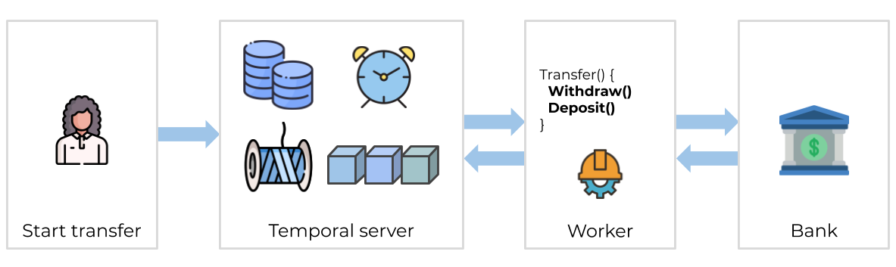
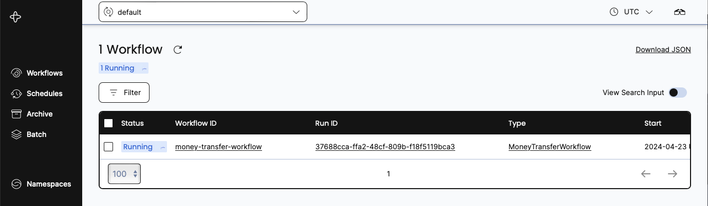
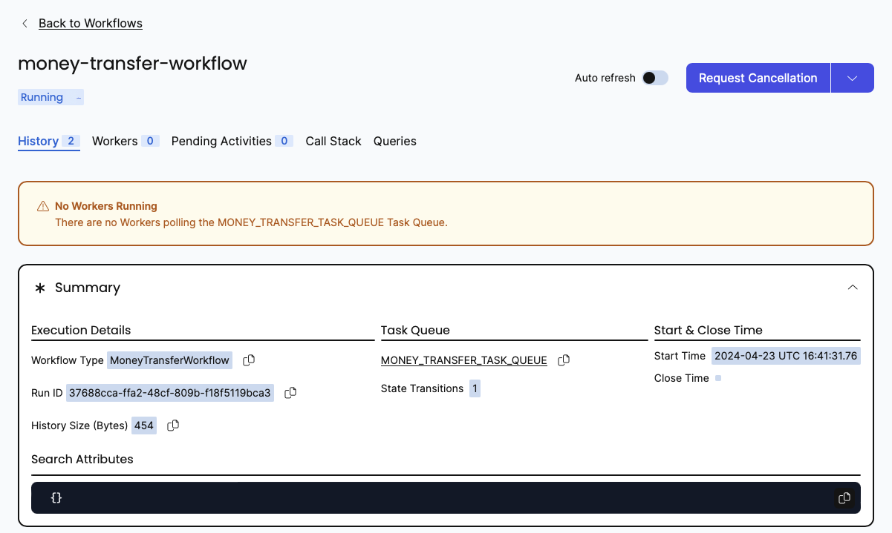
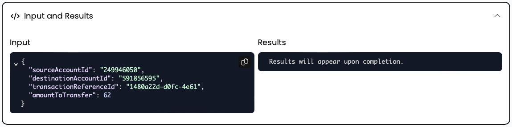
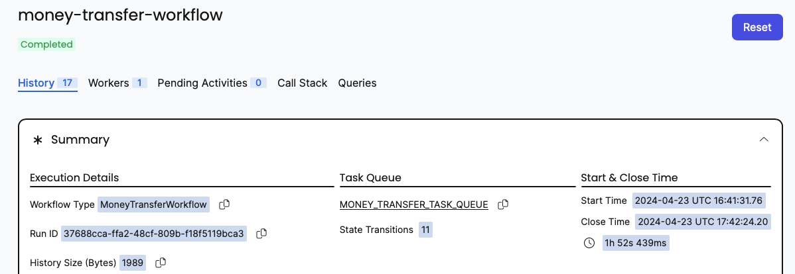
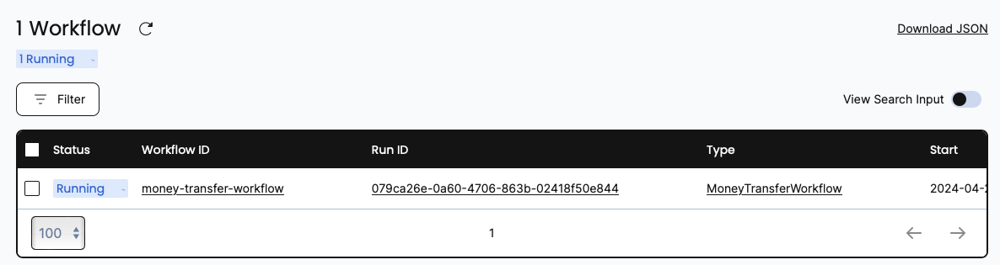
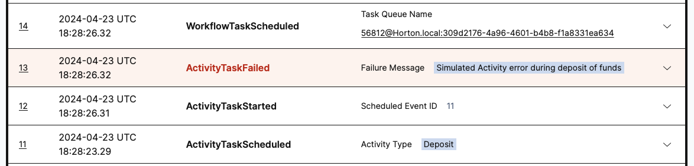
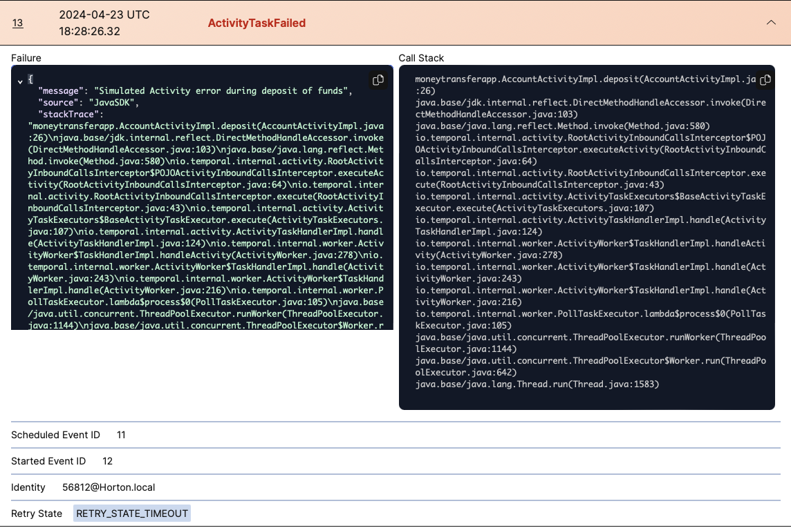

:::note Tutorial information

- **Level**: ⭐ Temporal beginner
- **Time**: ⏱️ ~20 minutes
- **Goals**: 🙌
  - Explore Temporal's core terminology and concepts.
  - Complete several runs of a Temporal Workflow application using a Temporal Cluster and the [Java SDK](https://github.com/temporalio/java-sdk).
  - Practice reviewing the state of the Workflow.
  - Understand the inherent reliability of Workflow methods.

:::


Temporal addresses many challenges developers face when building reliable applications.
Whether managing complex transaction-based processes or calling remote APIs, creating reliable applications involves significant overhead.
The Temporal Platform ensures your code runs to completion regardless of the circumstances your app encounters.
The Temporal [Java SDK](https://github.com/temporalio/java-sdk) provides comprehensive solutions for the complexities of modern application development.
Temporal offers reliability features to ensure durable execution of your code.
This including seamless and fault-tolerant state tracking, automatic retries, timeouts, rollbacks due to process failures, and more.

In this tutorial, you'll run your first Temporal Application.
You'll use Temporal's Web UI to explore application state visibility, and discover how Temporal helps you recover from common failures.

## Prerequisites

Before starting this tutorial:

- [Set up a local development environment](/getting_started/java/dev_environment/index.md) for developing Temporal applications using the Java programming language.
- Ensure you have installed Git to clone the project to your local file system.

:::note Package Management

This tutorial uses the Maven package manager.

:::

##  Application overview

This tutorial explores a Temporal Application built with the [Java SDK](https://github.com/temporalio/java-sdk).
The project simulates a money transfer application.
It focuses on essential transactions: withdrawals, deposits, and refunds.
You'll learn how Temporal features makes your code efficient and reliable.

This app handles money transfers between accounts:

* If the withdrawal fails (for example the account is unavailable or there are insufficient funds), the deposit isn't attempted.
* If the withdrawal succeeds but the deposit fails, a refund is issued to the source account.
  This ensures your system is consistent by rolling back changes from previous steps.

Temporal retains application context during a Workflow process, even when it encounters errors.
This context lets Temporal restart processes from where they left off or roll them back to a previous point in time.
This means you can retry failed attempts or recover Workflow progress to keep moving forward.

Removing recovery code from your apps with Temporal means simpler code.
You can focus on business logic without writing special-purpose code to handle and retry failures.
The result is cleaner apps with fewer management calls cluttering your process work.

Now that you know how this application works, download a copy of the tutorial code and try Temporal.

##  Download the example application

Copy the [Money Transfer Project](https://github.com/temporalio/money-transfer-project-java) from GitHub.
Open a new terminal window and use `git` to clone the repository:


```bash
git clone https://github.com/temporalio/money-transfer-project-java
```

Change directories into the project folder:


```bash
cd money-transfer-project-java
```

You're now ready to start exploring how Temporal breaks down applications into recoverable pieces.

## Explore the Workflow and Activity Definitions

Each Temporal application uses some or all of the following building blocks:

1. A [Workflow](https://docs.temporal.io/workflows) defines the overall flow of a business process from start to end.
   Each Workflow defines a process that needs to be resilient and run completely from start to finish.
   Workflows handle sequences of application stages or react to external events.
   They are also great for dealing with timers and schedules.
1. An [Activity](https://docs.temporal.io/activities) implements business logic that's prone to failure.
    For example, if you call a service that sometimes becomes unavailable, use an Activity.
    Activities can be automatically retried when they encounter failures that can be handled through additional attempts.
    This is because many failures are self-correcting over time, as outages are resolved or backup services are brought online.
1. A [Worker](https://docs.temporal.io/workers) interacts with the Temporal Service.
   It checks for available work and then initiates Workflow and Activity Tasks as needed.
   Workers report Task statuses and results back to the Temporal Service.

### Workflows

You build Temporal applications using an abstraction called Workflows.
Develop your Workflows by writing code in a general-purpose programming language like Java.
A [Workflow Definition](https://docs.temporal.io/workflows#workflow-definition) is Java code that defines the steps for a business process.
The Temporal Service runs these steps and monitors the Workflow progress.
This progress is stored as a [Workflow Execution](https://docs.temporal.io/workflows#workflow-execution) on the Service.

The Temporal Service manages and oversees Workflow Executions.
It breaks down each Workflow into Tasks: Workflow Tasks and Activity Tasks.
Each Activity Task executes a single well-defined but failable step, such as calling another service, transcoding a media file, or sending an email message.
The Service dispatches these tasks to a Task Queue, where a Worker can pick them up and run them.

The Money Transfer application uses one Workflow.
It transfers money by withdrawing from a source account and depositing to a destination account.
It defines two Activity methods: `withdraw` and `deposit`.
These are implemented as Activities because both processes have the possibility of failure.
The Workflow calls `withdraw` and then `deposit`.
The following diagram illustrates what happens when you start the Workflow:



:::caution SIMPLIFIED EXAMPLE

Transferring money is a tricky subject.
This Tutorial example doesn't cover all possible issues.
It can't clean up if a Workflow is cancelled, or handle edge cases where money is withdrawn but not deposited.
The Workflow might fail when refunding money to the original account.
In a production scenario, you'd want to account for these cases with advanced logic.
You might add a "human in the loop" step where someone is notified of any refund issue so they can manually intervene.
This example showcases some core Temporal features.
It is not intended for production use.

:::

### Where code lives

Your application code, including Workers, Workflows, and Activities, lives on your computers.
The code is written in your favorite SDK language.
None of that code runs on the Temporal Service.

What lives on the Service are Workflow Executions.
A Workflow Execution stores the progress of your code.
It keeps track of the Event History and state of your Workflow and Activity tasks.
As you'll see in this tutorial, Workflow Executions allow you to resume interrupted work.
This means you can always complete your tasks and you won't have to repeat work that's already been successfully finished.

### Workflow Definition

A Temporal Workflow uses attributes from the Temporal Java SDK to integrate Temporal Service's orchestration into code.
In Java, a Workflow Definition is broken down into the type interface and its implementation.
This section shows you how to integrate these pieces with the Temporal Service using SDK annotations.

#### Workflow interface

Mark your Workflow Definition with the **`@WorkflowInterface`** attribute:

<!--SNIPSTART money-transfer-java-workflow-interface {"selectedLines": ["3-12"]}-->
[src/main/java/moneytransfer/MoneyTransferWorkflow.java](https://github.com/temporalio/money-transfer-project-java/blob/main/src/main/java/moneytransfer/MoneyTransferWorkflow.java)
```java
// ...
import io.temporal.workflow.WorkflowInterface;
import io.temporal.workflow.WorkflowMethod;

@WorkflowInterface
public interface MoneyTransferWorkflow {
    // The Workflow Execution that starts this method can be initiated from code or
    // from the 'temporal' CLI utility.
    @WorkflowMethod
    void transfer(TransactionDetails transaction);
}
```
<!--SNIPEND-->

Mark each Workflow entry point with **`@WorkflowMethod`** attribute.
The Workflow Interface defines a single `transfer` method as its only point of entry.
It has one parameter, a `transaction` that stores the transfer details for this process.
Integrating transaction details into a single object means the method signature won't change, even if you later update your code implementation:

<!--SNIPSTART money-transfer-java-transaction-details {"selectedLines": ["5-10"]}-->
[src/main/java/moneytransfer/TransactionDetails.java](https://github.com/temporalio/money-transfer-project-java/blob/main/src/main/java/moneytransfer/TransactionDetails.java)
```java
// ...
public interface TransactionDetails {
    String getSourceAccountId();
    String getDestinationAccountId();
    String getTransactionReferenceId();
    int getAmountToTransfer();
}
```
<!--SNIPEND-->

A reference ID makes each transaction unique and trackable.
Some third party APIs let you send a unique key (sometimes called an _idempotency key_) with your transaction details.
The key ensures your transaction won't be run a second time, even if the external provider did not or could not report success.
Idempotency keys compensate for any mismatches between your application's state and an external service provider's state.

#### Workflow implementation

The `MoneyTransferWorkflow` implementation requests data be sent from one account to another.
This Workflow includes compensatory logic.
If the withdrawal or deposit fails, money is returned as needed:

<!--SNIPSTART money-transfer-java-workflow-implementation {"selectedLines": ["3-12", "42-105"]}-->
[src/main/java/moneytransfer/MoneyTransferWorkflowImpl.java](https://github.com/temporalio/money-transfer-project-java/blob/main/src/main/java/moneytransfer/MoneyTransferWorkflowImpl.java)
```java
// ...
import io.temporal.activity.ActivityOptions;
import io.temporal.workflow.Workflow;
import io.temporal.common.RetryOptions;

import java.time.Duration;
import java.util.HashMap;
import java.util.Map;

public class MoneyTransferWorkflowImpl implements MoneyTransferWorkflow {
    private static final String WITHDRAW = "Withdraw";
// ...
    // The transfer method is the entry point to the Workflow
    // Activity method executions can be orchestrated here or from within other Activity methods
    @Override
    public void transfer(TransactionDetails transaction) {
        // Retrieve transaction information from the `transaction` instance
        String sourceAccountId = transaction.getSourceAccountId();
        String destinationAccountId = transaction.getDestinationAccountId();
        String transactionReferenceId = transaction.getTransactionReferenceId();
        int amountToTransfer = transaction.getAmountToTransfer();

        // Stage 1: Withdraw funds from source
        try {
            // Launch `withdrawal` Activity
            accountActivityStub.withdraw(sourceAccountId, transactionReferenceId, amountToTransfer);
        } catch (Exception e) {
            // If the withdrawal fails, for any exception, it's caught here
            System.out.printf("[%s] Withdrawal of $%d from account %s failed", transactionReferenceId, amountToTransfer, sourceAccountId);
            System.out.flush();

            // Transaction ends here
            return;
        }

        // Stage 2: Deposit funds to destination
        try {
            // Perform `deposit` Activity
            accountActivityStub.deposit(destinationAccountId, transactionReferenceId, amountToTransfer);

            // The `deposit` was successful
            System.out.printf("[%s] Transaction succeeded.\n", transactionReferenceId);
            System.out.flush();

            //  Transaction ends here
            return;
        } catch (Exception e) {
            // If the deposit fails, for any exception, it's caught here
            System.out.printf("[%s] Deposit of $%d to account %s failed.\n", transactionReferenceId, amountToTransfer, destinationAccountId);
            System.out.flush();
        }

        // Continue by compensating with a refund

        try {
            // Perform `refund` Activity
            System.out.printf("[%s] Refunding $%d to account %s.\n", transactionReferenceId, amountToTransfer, sourceAccountId);
            System.out.flush();

            accountActivityStub.refund(sourceAccountId, transactionReferenceId, amountToTransfer);

            // Recovery successful. Transaction ends here
            System.out.printf("[%s] Refund to originating account was successful.\n", transactionReferenceId);
            System.out.printf("[%s] Transaction is complete. No transfer made.\n", transactionReferenceId);
            return;
        } catch (Exception e) {
            // A recovery mechanism can fail too. Handle any exception here
            System.out.printf("[%s] Deposit of $%d to account %s failed. Did not compensate withdrawal.\n",
                transactionReferenceId, amountToTransfer, destinationAccountId);
            System.out.printf("[%s] Workflow failed.", transactionReferenceId);
            System.out.flush();

            // Rethrowing the exception causes a Workflow Task failure
            throw(e);
        }
    }
```
<!--SNIPEND-->

Unlike a normal Java program, you don't call Activities directly in Temporal apps, you invoke them through an Activity stub.
This is part of the Temporal oversight mechanism, in which Temporal tracks progress and state.
Temporal tracks progress and state.
It supports features like automatic Activity retries when code encounters adverse conditions that prevent Activities from completing normally.

:::note

This code excerpt omits some implementation details before the `transfer` method.
These are discussed later in this tutorial.

:::

## Activities

Activities perform any business logic that is either subject to failure or non-deterministic.

### Fail points

Often, a failed call may be resolved by initiating a retry.
This allows a service to come back up, or the Internet to start working again, a backup system to be deployed, and so on.
Activities are retried by default and are ideal for executing calls that may potentially fail.
Common failure scenarios that should be placed in Activities include:

* **Network Calls**: Network issues, server unavailability, etc. This includes Web requests, database calls, and RPCs.
* **File System Calls**: Reading or writing files can fail because of insufficient permissions, disk space issues, and so forth.
* **External API Calls**: Third-party API calls can fail if the API is down, cannot be connected to, or it's slow to respond.
* **Resource-Intensive Operations**: Operations that use significant CPU or memory can fail due to resource exhaustion.
* **Hardware Interactions**: Interactions with devices like printers or IoT devices might fail.


:::note Determinism

Temporal Workflows must be deterministic.
That is, they must always produce the same outcome if run with the same starting conditions and state.
The "classic" definition is returning the same output given the same input.
Any non-deterministic work, such as interacting with the outside world, must be performed by Activities.

This means that once an Activity invocation completes, that point in the Workflow cannot be run again.
Whether fetching the time or reading an account balance, those results are now fixed and stored in the Workflow Execution Event History.
If run again, the Activity might return a different result.
That would break determinism.

:::

### Activity Attributes

When defining Activities, mark the interface with `@ActivityInterface` and methods with `@ActivityMethod`:

<!--SNIPSTART money-transfer-java-activity-interface {"selectedLines": ["3-19"]}-->
[src/main/java/moneytransfer/AccountActivity.java](https://github.com/temporalio/money-transfer-project-java/blob/main/src/main/java/moneytransfer/AccountActivity.java)
```java
// ...
import io.temporal.activity.ActivityInterface;
import io.temporal.activity.ActivityMethod;

@ActivityInterface
public interface AccountActivity {
    // Withdraw an amount of money from the source account
    @ActivityMethod
    void withdraw(String accountId, String referenceId, int amount);

    // Deposit an amount of money into the destination account
    @ActivityMethod
    void deposit(String accountId, String referenceId, int amount);

    // Compensate a failed deposit by refunding to the original account
    @ActivityMethod
    void refund(String accountId, String referenceId, int amount);
}
```
<!--SNIPEND-->

#### Activity Implementation

This `AccountActivity` class implements three Activity methods: `withdraw`, `deposit`, and `refund`:

<!--SNIPSTART money-transfer-java-activity-implementation {"selectedLines": ["3-42"]}-->
[src/main/java/moneytransfer/AccountActivityImpl.java](https://github.com/temporalio/money-transfer-project-java/blob/main/src/main/java/moneytransfer/AccountActivityImpl.java)
```java
// ...
import io.temporal.activity.*;

public class AccountActivityImpl implements AccountActivity {
    // Mock up the withdrawal of an amount of money from the source account
    @Override
    public void withdraw(String accountId, String referenceId, int amount) {
        System.out.printf("\nWithdrawing $%d from account %s.\n[ReferenceId: %s]\n", amount, accountId, referenceId);
        System.out.flush();
    }

    // Mock up the deposit of an amount of money from the destination account
    @Override
    public void deposit(String accountId, String referenceId, int amount) {
        boolean activityShouldSucceed = true;

        if (!activityShouldSucceed) {
            System.out.println("Deposit failed");
            System.out.flush();
            throw Activity.wrap(new RuntimeException("Simulated Activity error during deposit of funds"));
        }

        System.out.printf("\nDepositing $%d into account %s.\n[ReferenceId: %s]\n", amount, accountId, referenceId);
        System.out.flush();
    }

    // Mock up a compensation refund to the source account
    @Override
    public void refund(String accountId, String referenceId, int amount) {
        boolean activityShouldSucceed = true;

        if (!activityShouldSucceed) {
            System.out.println("Refund failed");
            System.out.flush();
            throw Activity.wrap(new RuntimeException("Simulated Activity error during refund to source account"));
        }

        System.out.printf("\nRefunding $%d to account %s.\n[ReferenceId: %s]\n", amount, accountId, referenceId);
        System.out.flush();
   }
}
```
<!--SNIPEND-->

* The `withdraw` method represents a process that calls a service to remove money from a source account.
  It always succeeds.
* The `deposit` process "attempts" to add money to a destination account.
  Its success is controlled by the `activityShouldSucceed` Boolean, which is set to `true`.
  If you change this to `false`, the "deposit" fails and throws an exception.
* The refund process mimics the `deposit` process.

:::note Recovering a failed Workflow

It is not part of this tutorial, but you can try setting both `activityShouldSucceed` Booleans to false to see a Workflow Task fail.
Temporal lets you recover the Workflow.
Stop the Worker, revert the changes, and restart
With the "fixed" Worker running, use the Temporal Web UI (you'll read about it shortly) to reset the failed Workflow Execution to a point in its Event History where it can pick up and complete its work.

:::

## Set the Retry Policy

Temporal makes software durable and fault-tolerant by design.
The Service can retry Activities, which are failable by nature.
That is, it can wait a little time for an issue to resolve, and then try running the Activity again, repeating as needed.
You customize how this happens in a retry policy.
That policy, along with time-out settings, is defined in the following Workflow implementation:

<!--SNIPSTART money-transfer-java-workflow-implementation {"selectedLines": ["12-37"]}-->
[src/main/java/moneytransfer/MoneyTransferWorkflowImpl.java](https://github.com/temporalio/money-transfer-project-java/blob/main/src/main/java/moneytransfer/MoneyTransferWorkflowImpl.java)
```java
// ...
    private static final String WITHDRAW = "Withdraw";

    // RetryOptions specify how to automatically handle retries when Activities fail
    private final RetryOptions retryoptions = RetryOptions.newBuilder()
        .setInitialInterval(Duration.ofSeconds(1)) // Wait 1 second before first retry
        .setMaximumInterval(Duration.ofSeconds(20)) // Do not exceed 20 seconds between retries
        .setBackoffCoefficient(2) // Wait 1 second, then 2, then 4, etc
        .setMaximumAttempts(5) // Fail after 5 attempts
        .build();

    // ActivityOptions specify the limits on how long an Activity can execute before
    // being interrupted by the Orchestration service
    private final ActivityOptions defaultActivityOptions = ActivityOptions.newBuilder()
        .setRetryOptions(retryoptions) // Apply the RetryOptions defined above
        .setStartToCloseTimeout(Duration.ofSeconds(2)) // Max execution time for single Activity
        .setScheduleToCloseTimeout(Duration.ofSeconds(5)) // Entire duration from scheduling to completion including queue time
        .build();

    private final Map<String, ActivityOptions> perActivityMethodOptions = new HashMap<String, ActivityOptions>() {{
        // A heartbeat time-out is a proof-of life indicator that an activity is still working.
        // The 5 second duration used here waits for up to 5 seconds to hear a heartbeat.
        // If one is not heard, the Activity fails.
        // The `withdraw` method is hard-coded to succeed, so this never happens.
        // Use heartbeats for long-lived event-driven applications.
        put(WITHDRAW, ActivityOptions.newBuilder().setHeartbeatTimeout(Duration.ofSeconds(5)).build());
    }};
```
<!--SNIPEND-->

This code includes several components:

* **`RetryOptions`** define how to automatically re-attempt an Activity that's failed.
  This includes backoff coefficients (`setBackoffCoefficient`) that treat service providers' endpoints with respect, so you don't slam them at once.
  Exponential backoffs allow a service time to recover.
  In this code, if an Activity fails, the Service waits a second, then two seconds, then four, etc.
  It fails after five attempts (`setMaximumAttempts`).
  It won't wait more than 20 seconds between attempts (`setMaximumInterval`).
* **`ActivityOptions`** define fixed limits for how long an Activity can keep trying before the Service shuts down further attempts.
  *Always* set a schedule-to-close timeout limit.
  Schedule-to-close includes the entire duration of an activity.
  Otherwise, by default, Temporal retries failed activities forever.
* **Activity-specific options** adjust options for specific Activity types.

:::note Retryable Errors

Although not shown in this code sample, you can specify Activity errors that Temporal should not attempt to retry.
Set the Retry Option's non-retryable errors field.
This provides you with the flexibility to choose the circumstances to retry.

:::

Now that you've seen the code, it's time to look at the Workflow in action.
In the next sections, you'll launch the Temporal Server and create a Workflow Execution.

## Start the Workflow

In this section, you'll run and observe a Workflow using the project code and the Temporal Web UI.


### Prepare to run

Start running a [Temporal Service](https://docs.temporal.io/clusters) by launching it from a Terminal session, as discussed in the [Getting Started tutorial](https://learn.temporal.io/getting_started/java/dev_environment/):


```bash
temporal server start-dev
```

If a Service is already running, you do not (and cannot) have to re-launch it again.
If you are running a Unix-like system, you can check for this by issuing `pgrep`:


```bash
pgrep -fl temporal
```

### Workflow Execution

When you _start_ a Workflow, you tell the Temporal Server, "Track the state of a Workflow that uses this method signature."
This tracked state is called a Workflow Execution, and follows the code from the Workflow and Activity definitions you just saw through their lifetimes.
The Workflow Execution represents a complete history of the Workflow's lifetime, including its intermediate states, its retries, and so forth.

The Service breaks down the Workflow Execution into pieces, called Tasks.
There are Workflow Tasks and Activity Tasks.
Workers look for those Tasks on "Task Queues" (called "polling" for Tasks).
That's why when you set up a Java Worker, you must tell it the Task Queue it should use to look for work.

A Worker runs each piece of the Workflow separately, Task by Task.
Whether that Task runs perfectly or it encounters issues, the Worker relays the execution events and results back to the Server.
This is recorded into the Event History for the Workflow Execution.

Workflow Executions "live" on the Temporal Server.
In the most basic form, a Workflow Execution consists of a set of set-up data and an Event history.
You initiate a Workflow Execution with the name of a Workflow Definition (the `MoneyTransferWorkflow` class), a Task Queue name to use, and optional input data.
Each Workflow Execution has an identifier.
If you do not supply one, the Service creates a random unique ID to use instead.

### The Transfer application

The "money transfer" app is a small Java program that creates a Workflow Execution.
In a real deployments, you might invoke similar code when someone submits a form, presses a button, or visits a certain URL.
Here is the code that performs this work:

<!--SNIPSTART money-transfer-java-initiate-transfer {"selectedLines": ["31-70"]}-->
[src/main/java/moneytransfer/TransferApp.java](https://github.com/temporalio/money-transfer-project-java/blob/main/src/main/java/moneytransfer/TransferApp.java)
```java
// ...
    public static void main(String[] args) throws Exception {

        // In the Java SDK, a stub represents an element that participates in
        // Temporal orchestration and communicates using gRPC.

        // A WorkflowServiceStubs communicates with the Temporal front-end service.
        WorkflowServiceStubs serviceStub = WorkflowServiceStubs.newLocalServiceStubs();

        // A WorkflowClient wraps the stub.
        // It can be used to start, signal, query, cancel, and terminate Workflows.
        WorkflowClient client = WorkflowClient.newInstance(serviceStub);

        // Workflow options configure  Workflow stubs.
        // A WorkflowId prevents duplicate instances, which are removed.
        WorkflowOptions options = WorkflowOptions.newBuilder()
                .setTaskQueue(Shared.MONEY_TRANSFER_TASK_QUEUE)
                .setWorkflowId("money-transfer-workflow")
                .build();

        // WorkflowStubs enable calls to methods as if the Workflow object is local
        // but actually perform a gRPC call to the Temporal Service.
        MoneyTransferWorkflow workflow = client.newWorkflowStub(MoneyTransferWorkflow.class, options);
        
        // Configure the details for this money transfer request
        String referenceId = UUID.randomUUID().toString().substring(0, 18);
        String fromAccount = randomAccountIdentifier();
        String toAccount = randomAccountIdentifier();
        int amountToTransfer = ThreadLocalRandom.current().nextInt(15, 75);
        TransactionDetails transaction = new CoreTransactionDetails(fromAccount, toAccount, referenceId, amountToTransfer);

        // Perform asynchronous execution.
        // This process exits after making this call and printing details.
        WorkflowExecution we = WorkflowClient.start(workflow::transfer, transaction);

        System.out.printf("\nMONEY TRANSFER PROJECT\n\n");
        System.out.printf("Initiating transfer of $%d from [Account %s] to [Account %s].\n\n",
                          amountToTransfer, fromAccount, toAccount);
        System.out.printf("[WorkflowID: %s]\n[RunID: %s]\n[Transaction Reference: %s]\n\n", we.getWorkflowId(), we.getRunId(), referenceId);
        System.exit(0);
    }
```
<!--SNIPEND-->

This code builds a Temporal Client, which is a type that can communicate with the Temporal Service.
The Client is used to create a new Workflow stub that points to the Workflow method.
With the details for the transfer collected together in a single instance (`transaction`), the `WorkflowClient` type creates a new Workflow Execution using the stub and the `transaction` instance.
The execution runs asynchronously.
After printing out details, the application exits.

The Workflow Execution (Event History and other metadata) lives on the Temporal Service.
Exiting the application does not affect this.

### Run the money transfer app

To run the app, issue this Maven command:

```
mvn compile exec:java \
    -Dexec.mainClass="moneytransferapp.TransferApp" \
    -Dorg.slf4j.simpleLogger.defaultLogLevel=warn
```

It creates a new transfer request for a random amount between $15 and $75:


```bash
MONEY TRANSFER PROJECT

Initiating transfer of $45 from [Account 711713707] to [Account 221056126].

[WorkflowID: money-transfer-workflow]
[RunID: 37688cca-ffa2-48cf-809b-f18f5119bca3]
[Transaction Reference: a0061bb5-a718-47cb]
```

The request is produced as a Workflow Execution and sent to the Temporal Server.
The Temporal Server is an essential part of the overall system, but requires additional components for operation.
The complete system is known as the Temporal Service, which is a deployment of the Temporal Server, plus the additional components used with it such as a database like Apache Cassandra, PostgreSQL, or MySQL.

:::note

This app uses a hard-coded "money-transfer-workflow" string for the Workflow ID.
If you run the transfer app a second time, you'll raise an error unless a Worker is running and has already processed the previous request.
If this happens to you, just ignore the error.

:::

Next, you'll explore one of the unique value propositions Temporal offers: application state visibility.

## View Workflow state with the Web UI

Temporal's Web UI helps visualize your Workflow Executions.
It enables you to inspect your Workflow Executions details as it runs.
You use this interface to track the results of Activities and Workflows.
It also helps you identify problems with your Workflow Execution.

1. Visit the [Temporal Web UI](http://localhost:8233).
   This is hosted by the local development server using 'localhost' on port 8233.
   When you open the page, you'll see your Workflow running in the list there.
   Notice that the Run ID matches the one printed out by running the transfer app.

   

1. Click either the **Workflow ID** or **Run ID** for your Workflow.
   The details page for your new Workflow Execution opens.
   Now you can see everything you want to know, including its input values, timeout configurations, scheduled retries, number of attempts, stack traceable errors, and more.
   At the top of the page a yellow message announces that you have not yet created any workers.
   The Workflow Execution won't progress until you do so.

   

1. You can see the inputs and results of the Workflow Execution by clicking the **Input and Results** section.
   This sample Workflow does not produce output.

   

You need at least one Worker running to execute your Workflows. You'll start the Worker next.

## Start a Worker

The Worker for this project is defined by the `MoneyTransferWorker` type.
You run a Worker by issuing the following command in the terminal.


```bash
mvn compile exec:java \
    -Dexec.mainClass="moneytransferapp.MoneyTransferWorker" \
    -Dorg.slf4j.simpleLogger.defaultLogLevel=warn
```

The Worker does not return control to you until you quit out of it.
It prints status updates to stdout, so you can keep track as it finds and processes Money Transfer tasks:


```bash
Worker is running and actively polling the Task Queue.
To quit, use ^C to interrupt.
```

In production environments, Temporal applications often operate with hundreds or thousands of Workers.
Adding more Workers boosts scalability.

### Worker Code

Like the transfer application, your Worker app creates a stub to talk to the Temporal Service and wraps it into a Client.
In the Java SDK, a Worker Factory creates new Workers and assigns their Task Queue.
You register the implementations for the tasks the Worker will manage, both Workflow and Activity types.
Finally, you start the Factory to begin executing the Worker or Workers you have created.

<!--SNIPSTART money-transfer-java-worker {"selectedLines": ["3-39"]}-->
[src/main/java/moneytransfer/MoneyTransferWorker.java](https://github.com/temporalio/money-transfer-project-java/blob/main/src/main/java/moneytransfer/MoneyTransferWorker.java)
```java
// ...
import io.temporal.client.WorkflowClient;
import io.temporal.serviceclient.WorkflowServiceStubs;
import io.temporal.worker.Worker;
import io.temporal.worker.WorkerFactory;

public class MoneyTransferWorker {

    public static void main(String[] args) {
        // Create a stub that accesses a Temporal Service on the local development machine
        WorkflowServiceStubs serviceStub = WorkflowServiceStubs.newLocalServiceStubs();

        // The Worker uses the Client to communicate with the Temporal Service
        WorkflowClient client = WorkflowClient.newInstance(serviceStub);

        // A WorkerFactory creates Workers
        WorkerFactory factory = WorkerFactory.newInstance(client);

        // A Worker listens to one Task Queue.
        // This Worker processes both Workflows and Activities
        Worker worker = factory.newWorker(Shared.MONEY_TRANSFER_TASK_QUEUE);

        // Register a Workflow implementation with this Worker
        // The implementation must be known at runtime to dispatch Workflow tasks
        // Workflows are stateful so a type is needed to create instances.
        worker.registerWorkflowImplementationTypes(MoneyTransferWorkflowImpl.class);

        // Register Activity implementation(s) with this Worker.
        // The implementation must be known at runtime to dispatch Activity tasks
        // Activities are stateless and thread safe so a shared instance is used.
        worker.registerActivitiesImplementations(new AccountActivityImpl());

        System.out.println("Worker is running and actively polling the Task Queue.");
        System.out.println("To quit, use ^C to interrupt.");

        // Start all registered Workers. The Workers will start polling the Task Queue.
        factory.start();
    }
```
<!--SNIPEND-->

When you start a Worker, it begins polling the Task Queue for Tasks to process.
The Worker continues running and blocks, waiting for Tasks to execute.
It does not exit and return control to the command line.

A Worker:

- Only processes Workflow and Activity Tasks registered to it.
- Knows which piece of code to execute based on the Tasks it gets from the Task Queue.
- Only listens to the Task Queue that it's registered to.

###  Use the Web UI to explore

Return to the [Temporal development service Web UI](http://127.0.0.1:8233).
Now, there's one Worker registered.
Before there was none.
The Workflow status shows completion:



A complete Event History appears on the bottom of the page, with the most recent events first.
Here you see the Workflow Execution start and complete.
You also see the Activity and Workflow Tasks being scheduled, started, and completed.

Here's what happens when the Worker ran:

- The first Task the Worker finds is the one that tells it to execute the Workflow.
- The Worker initiates the Workflow Execution by creating a new Workflow Task.
- The Workflow Task initiates the Workflow method execution.
- In turn, this method arrives at the Activity stubs. The first is 'Withdraw'.'
- The Worker schedules the Activity Task to request Activity Execution.
- The Activity Task starts and completes. The Worker communicates these events back to the Server.
- Control returns to the Workflow by scheduling a new Workflow Task, allowing the Workflow Execution to continue to the next Activity, 'Deposit'.
- The Worker schedules the new Activity Task, which is then picked up, started, and completed.
- Again control goes back to the Workflow and a new Workflow Task.
- The Worker schedules the Workflow task, picks it up for execution, starts it and completes it.
- With this, the Workflow Execution completes as there is no more work to be done or Tasks to schedule.

Each step is recorded in the Event History.

Now that you've seen an Execution run and complete, it's time to introduce a failure.

##  Simulate failures

Temporal is built to allow failure-prone processes to keep moving forward.
It provides the backbone and oversight (called "Orchestration") that enables this without you having to develop the technology in your own code.
This keeps your code focused on your business logic and not on recovery strategies.

Despite your best efforts, services and other items will fail.
One of Temporal's most important features is its ability to maintain the state of a Workflow during a failure and continue on once that failure resolves.
To demonstrate this, you will simulate failures for your Workflow and see how Temporal responds.

### Recover from a server crash

Unlike many modern applications that require complex processes and external databases to handle failure, Temporal preserves the state of your Workflow even if the server is down.
Test this by stopping the local Temporal Cluster while a Workflow is running.

Try it out by following these steps:

1. Stop your Worker.
   Switch to the terminal that's running your Worker and press `CTRL+C`.
1. Return to the terminal window running the development server.
   Shut it down with `CTRL+C`.
1. After the Temporal Cluster has stopped, restart it to use a local database.

   
```bash
   temporal server start-dev \
       --log-level=never \
       --db-filename=temporal.db
   ```

1. Switch back to the terminal where your Workflow ran.
   Start a new Workflow Execution.

   
```bash
   mvn compile exec:java \
       -Dexec.mainClass="moneytransferapp.TransferApp" \
       -Dorg.slf4j.simpleLogger.defaultLogLevel=warn
   ```

   Note the WorkflowID and RunID.
   They also appear in the WebUI and help you locate the process you were using.

1. Return to the development server terminal session.
   Shut it down with `CTRL+C`.
1. Re-start the server, using the same data.

   
```bash
   temporal server start-dev \
       --log-level=never \
       --db-filename=temporal.db
   ```

1. Verify the Workflow is running in the [Development Service Web UI](http://localhost:8233).

   

When you add a database to your Temporal Service you can recover from where you left off, even when a service goes offline.
You pick up from where you left off when it comes back online again.

### Recover from an Activity error

Explore how Temporal responds to failed Activities and works with your timeout and retry policies
The `deposit` Activity lets you "fail" a deposit when you set `activityShouldSucceed` to `false`.

Your Worker app should not be running at this time.
Recompile it and run it to pick up this new logic.


```bash
mvn clean install \
    -Dorg.slf4j.simpleLogger.defaultLogLevel=info 2>/dev/null
mvn compile exec:java \
    -Dexec.mainClass="moneytransferapp.MoneyTransferWorker" \
    -Dorg.slf4j.simpleLogger.defaultLogLevel=warn
```

:::note

You must compile and restart the Worker every time there's a change in code.

:::

Now visit the Worker running in the terminal window:


```bash
Withdrawing $63 from account 714985048.
[ReferenceId: cc935eb0-cfe1-421e]
Deposit failed
Deposit failed
Deposit failed
[cc935eb0-cfe1-421e] Deposit of $63 to account 993113084 failed.
[cc935eb0-cfe1-421e] Refunding $63 to account 714985048.

Refunding $63 to account 714985048.
[ReferenceId: cc935eb0-cfe1-421e]
[cc935eb0-cfe1-421e] Refund to originating account was successful.
[cc935eb0-cfe1-421e] Transaction is complete. No transfer made.
```

The Worker completed the `withdraw` activity but failed (as you set) with `deposit`.
In this log, the Activity ran out of time, stopped after 3 retries, and the Workflow moved onto the compensating activity.

### Review the failed Activity with the Development Server WebUI

Visit the [Temporal Web UI](http://localhost:8080) and click your Workflow Id to view the Workflow details.
The Event History is longer this time and contains an ActivityTaskFailed event.



Click on this to reveal the detail information about the failure call.



### Retry Logic

Without Temporal Orchestration, you must implement timeout and retry logic within the service code.
It makes it your code hard to read with your recovery logic living right next to business logic.
With Temporal, you can specify timeout configurations in the Workflow code as Activity options.

Temporal offers multiple ways to specify timeouts, including [Schedule-To-Start Timeout](https://docs.temporal.io/concepts/what-is-a-schedule-to-start-timeout), [Schedule-To-Close Timeout](https://docs.temporal.io/concepts/what-is-a-schedule-to-close-timeout), [Start-To-Close Timeout](https://docs.temporal.io/concepts/what-is-a-start-to-close-timeout), and [Heartbeat Timeout](https://docs.temporal.io/concepts/what-is-a-heartbeat-timeout).
By default your code will be retried forever, unless a Schedule-To-Close Timeout or Start-To-Close Timeout is specified.
This is not a good outcome.
You want your code to complete (best outcome) or fail sensibly (an acceptable outcome), not to hang forever.
Failing "sensibly" means that you can revive your failed Workflows by changing the services it relies on or re-establishing other ways that ensure Workflow success.

### Increase the bug severity

Next, you'll make the Workflow fail harder.
That is, you'll override some code that makes `deposit` continue to fail and prevent the timeout and recovery mechanisms from stepping in.

1. Quit the Worker if it is still running.

1. Make sure the `deposit` will still fail.

   ```java
   boolean activityShouldSucceed = false;
   ```

1. Increase out the maximum number of attempts from 5 to a much bigger number:

   ```
   .setMaximumAttempts(5000)
   ```

1. Increase the schedule-to-close timeout from 5 seconds to a much bigger number:

   ```
   .setScheduleToCloseTimeout(Duration.ofSeconds(5000))
   ```

1. Compile and run the updated Worker

   
```bash
   mvn clean install \
       -Dorg.slf4j.simpleLogger.defaultLogLevel=info 2>/dev/null
   mvn compile exec:java \
       -Dexec.mainClass="moneytransferapp.MoneyTransferWorker" \
       -Dorg.slf4j.simpleLogger.defaultLogLevel=warn
   ```

### Start a Workflow Execution

Next, you'll explore a Workflow Execution that cannot complete.

1. Start another Workflow:

   
```bash
   mvn compile exec:java -Dexec.mainClass="moneytransferapp.TransferApp" \
      -Dorg.slf4j.simpleLogger.defaultLogLevel=warn
   ```

1. Wait for the Workflow to fail a few times.
   The Workflow keeps retrying using the RetryPolicy.
   Then quit from the Worker.

   ```
   Withdrawing $48 from account 420011264.
   [ReferenceId: 29de07b9-c795-4dbb]
   Deposit failed
   Deposit failed
   Deposit failed
   Deposit failed
   Deposit failed
   ^C
   ```

1. Visit the Web UI and view the Workflow.
   It will still be "Running".
   The Timeline will show multiple deposit attempts.

1. Return to your editor and set `activityShouldSucceed` to `true` in the `deposit` method.

1. Once again, compile and run the Worker:

   
```bash
   mvn clean install \
       -Dorg.slf4j.simpleLogger.defaultLogLevel=info 2>/dev/null
   mvn compile exec:java \
       -Dexec.mainClass="moneytransferapp.MoneyTransferWorker" \
       -Dorg.slf4j.simpleLogger.defaultLogLevel=warn
   ```

Now, the transfer finally completes.
The Workflow picks up and continues from where it left off.

```
Depositing $48 into account 941350378.
[ReferenceId: 29de07b9-c795-4dbb]
[29de07b9-c795-4dbb] Transaction succeeded.
```

You have just fixed a bug in a running application.
You didn't lose the Workflow Execution state, didn't have to restart the transaction, and didn't have to repeat work.
The Workflow Execution picked up from where it left off.
It used the corrected code to move forward.

### Conclusion

You now know how to run a Temporal Workflow and understand a part of the value Temporal offers.
You explored Workflows and Activities, you started a Workflow Execution, and you ran a Worker to handle that execution.
You also saw how Temporal recovers from failures and how it retries Activities.

Temporal key advantages include:

1. Temporal gives you **full visibility** into the state of your Workflow and code execution.
1. Temporal **maintains the state** of your Workflow through server outages and errors.
1. Temporal lets you **time out and retry Activity code** with options outside your business logic.
1. Temporal helps you **perform "live debugging" of your business logic** while a Workflow is running.

Answer the following questions to see if you remember some of the more important concepts from this tutorial:

<details>
<summary>
Why should you define a shared constant to store the Task Queue name?
</summary>
The Task Queue name is used in two parts of the code.
The first starts the Workflow.
The second configures the Worker.
If their values differ, the Worker and Temporal Service would not share the same Task Queue.
The Workflow Execution could not progress.
</details>

<details>
<summary>
When you modify Activity code for a running Workflow, what do you need to do?
</summary>
Restart the Worker so it picks up the updated details and can apply them to Activity Tasks.
</details>
