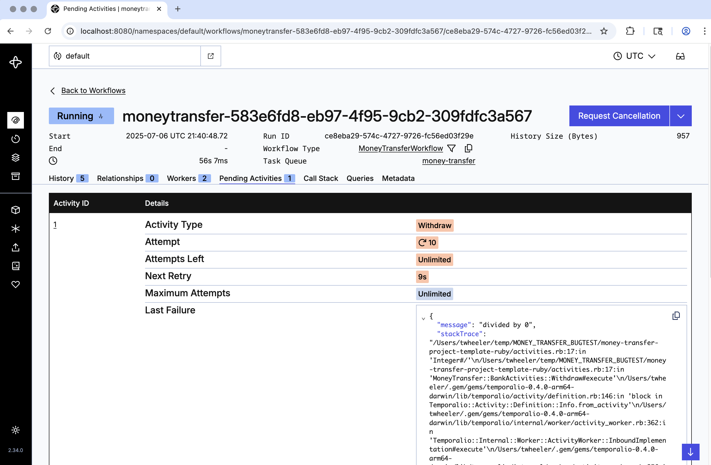

:::note Tutorial information
- **Level**: ⭐ Temporal beginner
- **Time**: ⏱️ ~20 minutes
- **Goals**: 🙌
  - Explore Temporal's core terminology and concepts
  - Start a local Temporal Service
  - Review Temporal application code written using the
    [Ruby SDK](https://github.com/temporalio/sdk-ruby)
  - Run the application multiple times, observing how it
    overcomes different failure scenarios
  - Use the Temporal Web UI to view details of each execution
:::

### Introduction

As a developer in today's world, many of the challenges that you face stem
from the fact that modern applications are effectively distributed systems.
The components from which applications are composed are deployed to multiple
machines, sometimes in different data centers or cloud providers, and often
rely on third-party services and APIs.  Unfortunately, networks go down,
services become unresponsive, hardware fails, and applications crash.

Most developers attempt to address this by developing workarounds for each
potential problem. For example, you might write code to handle retries and
timeouts in order to work around a service or network outage. Likewise, you
might rearchitect your application to use a database or message queue to avoid
losing state in case of a crash. All too often, the result is code that takes
longer to developer, is harder to debug, and becomes a burden to maintain.

Temporal provides a better way to address these challenges. Instead of adding
complexity to your application, you build on the foundation provided by the
Temporal platform. Durable Execution ensures that your application will survive
a crash—even if it was caused by hardware failure—recovering and then continuing
on as if it never even happened. Its built-in support for retries and timeouts
enables your application to overcome service and network outages. As a result,
you'll be able to create reliable and scalable applications that are faster to
develop and easier to maintain.

In this tutorial, you'll explore the code for a Temporal application and run
that application multiple times, observing how it works in both success and
failure scenarios. You'll also use Temporal's Web UI to gain visibility into
what took place during execution.

## Prerequisites

Before starting this tutorial:

<!-- TODO: Ensure that this content is available -->
- [Set up a local development environment for Temporal Applications written
  in the Ruby programming language](/getting_started/ruby/dev_environment/)
- Ensure you have Git installed to clone the project

## Application overview

The project in this tutorial mimics a "money transfer" application. It is
implemented with a single _Workflow_, which orchestrates the execution of
two _Activities_ (`Withdraw` and `Deposit`) that move money between the
accounts.

To perform a money transfer, you will do the following:

1. Launch a Worker.
   Since a Worker is responsible for executing the Workflow and Activity code,
   at least one Worker must be running for the money transfer to make progress.
2. Submit a Workflow Execution request to the Temporal Service.
   After the Worker communicates with the Temporal Service, the Worker will
   begin executing the Workflow and Activity code. It reports the results to
   the Temporal Service, which tracks the progress of the Workflow Execution.

The following diagram illustrates the communication that takes place when you
start the money transfer Workflow:


Notice that the Temporal Service doesn't run your code. Your Worker, Workflow,
and Activities run on your infrastructure, just like your other applications.

Now that you know how the application works, it's time to try it for yourself.

##  Retrieve the application source code

The application source code is available in a GitHub repository named
[money-transfer-project-template-ruby](https://github.com/temporalio/money-transfer-project-template-ruby/).

Open a new terminal window and clone the repository:

```command
git clone https://github.com/temporalio/money-transfer-project-template-ruby/
```

Once that's complete, change to the project directory:

```command
cd money-transfer-project-template-ruby
```

:::tip
This repository also serves as a GitHub Template, which means that you can
use it as the foundation for creating your own project. See
[Creating a Repository from a Template](https://docs.github.com/en/repositories/creating-and-managing-repositories/creating-a-repository-from-a-template#creating-a-repository-from-a-template)
in GitHub's documentation for details.
:::

Next, you'll use the `temporal`
[command-line interface](https://docs.temporal.io/cli/) (CLI) to start a
local Temporal Service.


## Start a local Temporal Service

Make sure you've [installed Temporal CLI on your local machine](/getting_started/ruby/dev_environment/index.md).

Run the following command:

```command
temporal server start-dev --db-filename temporal.db --ui-port 8080
```
This starts the Temporal Service, which will listen for connections on the
default port (7233). It specifies a custom port (8080) for the Temporal Web
UI. It also specifies the path to a file (`temporal.db`) where the Temporal
Service will store its data.

:::note
The Temporal Service started with the `temporal` CLI is intended for local
development, so it uses an in-memory database by default. The `--db-filename`
option overrides that behavior by specifying the path to a file where the
data should be persisted. This enables it to retain information after you
restart the service, as it would in a production deployment.

This file will be created if it does not exist. Be sure to specify the same
path each time you start the Temporal Service so that it will have access to
data saved during your previous session.
:::


## Explore the Workflow and Activity Definitions

### Workflow Definition Overview
The fundamental building block in a Temporal application is the
[Workflow Definition](https://docs.temporal.io/workflows#workflow-definition),
which is code that orchestrates a sequence of steps.

In the Ruby SDK, a Workflow Definition is a class that extends
`Temporalio::Workflow::Definition`. The `execute` method is its
entry point for execution and is invoked when the Workflow is started.
Data supplied as input to the Workflow Execution is available through
the parameter(s) defined in the `execute` method.


### Activity Definition Overview

When a step involves the possibility of failure, such as calling a
service, querying a database, or writing data to a file, its code
is not allowed in the Workflow Definition. Instead, that code goes
into a separate method, known as an
[Activity Definition](https://docs.temporal.io/activities).

:::tip Why you use Activities
At first glance, you might think you can incorporate your logic into the
Workflow Definition. However, Temporal Workflows have certain [deterministic
constraints](https://docs.temporal.io/workflows#deterministic-constraints).
Operations that could behave differently from one invocation to the next,
which includes any operations that interact with an external system, are
not allowed in the Workflow Definition—it must go in an Activity instead.
This separation of code is fundamental to how Temporal achieves
[Durable Execution](https://docs.temporal.io/evaluate/understanding-temporal#durable-execution).

Use Activities for your business logic, and use Workflows to orchestrate
the Activities.
:::

Activities are defined in much the same way as Workflows. The key
difference is that they derive from the `Temporalio::Activity::Definition`
class. They can accept input data through the parameter(s) defined in
the Activity's `execute` method.

As mentioned earlier, this Workflow relies on two Activities to move money
between two accounts. It uses the `Withdraw` Activity to debit the source
account and the `Deposit` Activity to credit the target account. However, it
also has a third Activity (`Refund`), which is used for failure handling.

To understand the role of the `Refund` Activity, imagine that the withdrawal
succeeds, but the deposit fails because the recipient closed their account.
A deposit that fails due to a network outage can be resolved by retrying the
deposit, but this is a permanent error. To ensure that the money isn't lost,
you must undo the transaction you started. A common technique for this in
distributed systems is known as the *saga pattern*, which uses one or more
*compensating transactions* to revert earlier operations. The `Refund`
Activity, which is called if the deposit fails, is an example of this. It
returns the withdrawn money back to the sender's account.

### Workflow Definition Code

Here is the Workflow Definition for the money transfer:

<!--SNIPSTART money-transfer-project-template-ruby-workflow-->
[workflow.rb](https://github.com/temporalio/money-transfer-project-template-ruby/blob/main/workflow.rb)
```ruby
TO BE REPLACED WITH SNIPSYNC'ED CODE
```
<!--SNIPEND-->

By default, every Activity Execution is associated with a
[Retry Policy](https://docs.temporal.io/encyclopedia/retry-policies), which
specifies that a Activity will be retried soon after it fails and will be
retried continuously (with a delay between each attempt) until it succeeds
or is requested to stop. You can change this behavior to suit your needs, as
this Workflow Definition does. For demonstration purposes, it specifies that
the delay between retry attempts should be limited to two seconds, that there
should be no more than three retry attempts, and that a failure caused by
`InsufficientFundsError` should not be retried at all.

As you see, most of the code is devoted to executing the sequence of steps
(Activities) for the money transfer. It first withdraws from the source
account, attempts to deposit into the target account, and refunds the money
to the source account if the deposit fails. Each of those Activities receives
input data (containing the account number and amount of the transfer) and
returns a result (a transaction ID provided by the bank as confirmation).


:::caution This is a simplified example.
We've chosen a money transfer scenario for this introductory tutorial because
it's a familiar concept and gives you an idea of how Temporal applications
can handle different types of failures. However, money movement is a complex
subject and this tutorial makes no attempt to handle every possible situation.
For example, it doesn't attempt to revert the transaction upon cancellation.
It also doesn't handle failure of the refund operation, which might involve
a human-in-the-loop step where in which someone is notified of the error
and can intervene directly.

This example is designed to demonstrate several core features to someone
learning the Temporal platform. It is not intended for production use.
:::


### Input Data

The Workflow's `execute` method is passed a struct called `TransferDetails`,
which defines the source (sender) account, target (recipient) account,
amount of the transfer, and a user-supplied reference ID that serves to
uniquely identify this transfer operation. Here is the definition of the
`TransferDetails` struct, which is defined at the bottom `shared.rb`, a
file that contains code used by multiple parts of this application:

<!--SNIPSTART money-transfer-project-template-ruby-shared-transfer-details-->
[shared.rb](https://github.com/temporalio/money-transfer-project-template-ruby/blob/main/shared.rb)
```ruby
TO BE REPLACED WITH SNIPSYNC'ED CODE
```
<!--SNIPEND-->

Although it's possible to specify a list of individual fields as input, it's
considered a best practice to define a single, serializable data structure
that will serve as input. This enables you to evolve your Workflows in the
future by changing the composition of the data structure instead of changing
the method signature.

Notice that the `TransferDetails` struct includes a `reference_id` field.
Some APIs let you send a unique _idempotency key_ along with the transaction
details to guarantee that if you retry the transaction due to some kind of
failure, the API you're calling will use the key to ensure it only executes
the transaction once. This example generates the reference ID using Ruby's
UUID support.


### Activity Definition Code

The Workflow Definition above shows when and how the Activities are invoked
during execution. The following excerpt from the `activities.rb` file shows
how they are defined:

<!--SNIPSTART money-transfer-project-template-ruby-activities-->
[activities.rb](https://github.com/temporalio/money-transfer-project-template-ruby/blob/main/activities.rb)
```ruby
TO BE REPLACED WITH SNIPSYNC'ED CODE
```
<!--SNIPEND-->

The `Withdraw` Activity takes the details about the transfer, simulates a
call to a service to process the withdrawal, and returns a transaction ID.
Note that while it happens to use the same input (the `TransferDetails`
struct) as the Workflow, that need not be the case. It was done here for
simplicity, since the Activity uses many of the same fields.

This Activity will fail with `InsufficientFundsError` if the amount exceeds
$1000. You may have observed in the Workflow Definition that this specific
type of error will not be retried. Most errors in Temporal are automatically
retried, enabling a Workflow to overcome intermittent failures and outages.
The custom Retry Policy used here declares that `InsufficientFundsError` will
not be retried, and since there's no custom code to trap the error, the
Workflow Execution will fail if this error occurs. We chose this design
in the tutorial to demonstrate how you can customize Retry Policies to
match your business logic. If you were implementing this in the real world,
you might instead consider letting the `Withdraw` retry until the source
account finally _does_ have sufficient funds, after which the money transfer
would automatically proceed.

The `Deposit` Activity is similar to the `Withdraw` Activity. It also has
a special case, which is that it will fail with `InvalidAccountError` if the
target account value is `B5555`. The Workflow Definition does trap this
(generically, as `Temporalio::Error::ActivityError`) and compensates the
source account by executing the `Refund` Activity to return the withdrawn
funds.

The `Refund` Activity Definition is almost identical to `Deposit`. While
you could reuse the existing `Deposit` Activity to refund the money, using
a separate Activity lets you add additional logic around the refund process,
such as logging, sending notifications, or making a call to a third-party
service.


## Explore the Worker configuration

As you learned earlier, a Worker is responsible for executing the Workflow
and Activity code.

A Worker:

- polls a specific [Task Queue](https://docs.temporal.io/concepts/what-is-a-task-queue)
  within the Temporal Service
- accepts Tasks that correspond to the Workflow and Activity
  Types that it has been configured to support
- knows how to execute the code (Workflow and Activity Definitions)
  based on details provided in those Tasks
- reports the results of execution to the Temporal Service, which
  tracks the history and progress of each Workflow Execution

The `worker.rb` file in this project contains the code used to configure
and start the Worker. It registers support for the money transfer Workflow
and the three Activities described earlier. It also specifies the name
of the Task Queue on the Temporal Service that the Worker should poll.


:::tip Defining Task Queues
A Task Queue is where Temporal Workers look for Tasks about Workflows and
Activities to execute. Each Task Queue is identified by a name, which you will
specify when you configure the Worker and again in the code that starts the
Workflow Execution. To ensure that the same name is used in both places, this
project follows the recommended practice of specifying the Task Queue name in
a constant referenced from both places. In this project, that constant is named
`TASK_QUEUE_NAME`, which is defined in the `shared.rb` file.
:::


Here is the code used to configure and start the Worker:

<!--SNIPSTART money-transfer-project-template-ruby-worker-->
[worker.rb](https://github.com/temporalio/money-transfer-project-template-ruby/blob/main/worker.rb)
```ruby
TO BE REPLACED WITH SNIPSYNC'ED CODE
```
<!--SNIPEND-->

Now that you've seen the code, you will launch a Worker so that it will
be ready to run the money transfer code when you submit a Workflow Execution
request later in the tutorial.


## Launch a Worker

Open a new terminal and change to the project directory:

```command
cd money-transfer-project-template-ruby
```

In this new terminal, launch a Worker by running the following command:

```command
bundle exec ruby worker.rb
```

The terminal output looks like this:

```output
Starting Worker (press Ctrl+C to exit)
```

There will be no further output for now. The Worker is now polling the Task
Queue, but since there haven't yet been any Workflow Execution requests, that
queue is currently empty.

In the next section, you will run a Ruby program to submit a request, which
will create Tasks for the Worker to perform.

## Review the code that starts the Workflow Execution

There are multiple ways to start a Workflow with Temporal. You can do it by 
using the `temporal` CLI or the Temporal Web UI. Another option is to do it 
through code, which is what you'll do in this tutorial since it's the typical
approach for real-world applications.

All three methods involve connecting to the Temporal Service, providing the
Task Queue name, and specifying the Workflow Type along with any input data.
In this tutorial, you'll run a small Ruby program that does these things.

:::note
This tutorial uses a program within the same project to start the Workflow, but
that's not required. In fact, it's common to request Workflow Execution from code
that lives in a separate project, or which is part of a different application, and
which might be implemented in a different programming language. For example, a web
application written in TypeScript could initiate a money transfer by submitting a
Workflow Execution request when a user clicks a button.
:::


<!--SNIPSTART money-transfer-project-template-ruby-starter-->
[starter.rb](https://github.com/temporalio/money-transfer-project-template-ruby/blob/main/starter.rb)
```ruby
THIS WILL BE REPLACED WITH SNIPSYNC'ED CODE
```
<!--SNIPEND-->

This code uses a Temporal Client to connect to the Temporal Service, calling its
`start_workflow` method to request execution. This returns a handle, and calling
`result` on that handle will block until execution is complete, at which point
it provides the result.


## Start the Workflow Execution

Open a new terminal and change to the project directory:

```command
cd money-transfer-project-template-ruby
```

In this new terminal, run the program to start the Workflow:

```command
bundle exec ruby starter.rb
```

You should see output similar to the following:

```output
Initiated transfer of $100 from A1001 to B2002
Workflow ID: moneytransfer-2926a650-1aaf-49d9-bf87-0e3a09ef7b32
Workflow result: Transfer complete (transaction IDs: OKW-100-A1001, OKD-100-B2002)
```

Next, you'll experience how Temporal provides visibility into your applications
through it Web UI.


## View the Workflow Execution in the Temporal Web UI

Temporal's Web UI provides a convenient way to see details about both current
and past Workflow Executions. You can use it to see the timeline of each
execution as well as the input parameters and return values of the Workflow
and all of its Activities. The Web UI will even help you to identify problems
in your application at runtime so that you can resolve them more quickly.

Visit the [Temporal Web UI](http://localhost:8080), where you will see your
Workflow Execution listed.


Click the **Workflow ID** for your Workflow Execution. This will show you the
detail page, which shows you much more information.


The top section shows the status (completed), Workflow ID, timestamps for
the start and end time, Task Queue name, and other details.

The **Input** and **Result** sections below that shows the input data supplied
to the Workflow Execution and the value that it returned upon completion.

The Event History section begins with a graphical timeline view, depicting
the points at which each Activity started and finished within the Workflow
Execution. Below that is a table with a detailed history of every event that
took place during the execution, which includes the inputs and result for
each Activity.


##  Simulate failures

Despite your best efforts, there will be times when something goes wrong in
your application. It might encounter a network glitch, a server might go
offline, or there might be bug that causes it to crash. One of Temporal's
most important features is its ability to maintain the Workflow Execution's
state when something fails. To observe this, you will simulate some failures
to see how the application responds.

### Recover from a server crash

Unlike many modern applications that require complex leader election processes
and external databases to handle failure, Temporal automatically preserves
the state of your Workflow even if the server is down. You can test this by
stopping the Temporal Service while a Workflow Execution is in progress.

Try it out by following these steps:

1. Press `Ctrl+C` in the terminal where your Worker is running. This will kill
   it, ensuring that a Workflow Execution cannot finish.
2. Switch back to the terminal where your Workflow ran. Start a new Workflow
   Execution by running `bundle exec ruby starter.rb` again.
3. Return to the [main page in the Temporal Web UI](http://localhost:8080/) and
   verify the new Workflow Execution has a status of "Running"
4. Switch to the terminal where you started the Temporal Service and press
   `Ctrl+C` to stop the service.
5. After the Temporal Service has stopped, run the previous command 
   (`temporal server start-dev --db-filename temporal.db --ui-port 8080`)
   to restart it, ensuring that it uses the same database file as before.

No data is lost when the Temporal Service went offline. When it came back
online, the work picked up where it left off before the outage. Keep in mind
that this example uses a single instance of the service running on a single
machine. In a production deployment, the Temporal Service can be deployed
as a cluster, spread across several machines for higher availability and
increased throughput.

Visit the Web UI. You should find that the Workflow Execution you started
in step 2 is still listed. However, when you view its detail page, you'll
see a message informing you that no Workers are currently polling the
Task Queue that it uses.


Although a Workflow Execution can not progress if no Workers are running,
it remains open. When a Worker becomes available, execution will continue
automatically. In production, it's common to run multiple Workers at once.
In this case, if a Worker happens to crash, other Workers automatically
take over any work that was already underway.

Now, switch to the terminal where your Worker was running and run the previous
command (`bundle exec ruby worker.rb`) to start the Worker. When you refresh
the Web UI, you should find that the status of the Workflow Execution changed
from "Running" to "Completed."


### Recover from an unknown error in an Activity

The `Withdraw` Activity contains a bug, although it hasn't been a problem yet
because that statement is currently commented out. You will now uncomment it
to expose the bug. You'll see that this causes the Activity to fail, but you'll
also see that it retries automatically. More importantly, you'll observe that
after you fix the bug, the Workflow Execution that was failing will complete
successfully.

By the way, the timeline view in the Web UI will show you that the Activity
is failing. In the screenshot below, the red line near the bottom indicates
that the `Withdraw` Activity has failed and is being retried.


The **Pending Activities** tab (above the **Input** section) is labeled
with a 1, which indicates that there is currently one failing Activity.
That tab shows additional information about the failure, including the
cause of the error and a stack trace that identifies the specific line
of code that is failing.




Try it out by following these steps:

1. Whenever you modify the code, you must restart the Worker for the changes to
   take effect. Press `Ctrl+C` in the terminal where your Worker is running to
   stop the Worker so that you can introduce the bug in the next step.
2. Edit the `activities.rb` file, uncomment the line in the `Withdraw` Activity
   that causes a divide-by-zero error, and save the change
3. Start the Worker again by running `bundle exec ruby worker.rb`
4. Start a new Workflow Execution by running `bundle exec ruby starter.rb`
5. Go to the [main page in the Temporal Web UI](http://localhost:8080/) and
   click the Workflow Execution you just started to view its detail page.
   You should see that the Withdraw Activity is failing. Click the **Pending
   Activities** tab to see the cause, and then click the **History** tab to
   return to the previous view.
6. Edit the `activities.rb` file, comment out the line with the divide-by-zero
   error, and then save the change.
7. Press `Ctrl+C` in the terminal where your Worker is running and then run
   `bundle exec ruby worker.rb` to start it again. The Worker will now use
   the code that contains the change you made in the previous step.

You should see that the Workflow Execution completes successfully. This will
be visible both in the Web UI and in the terminal where you started the
Workflow Execution.


## Conclusion

You now know how to run a Temporal Workflow and understand some of the value
that Temporal offers. You explored Workflows and Activities, you started a
Workflow Execution, and you ran a Worker to handle that execution. You also
saw how Temporal recovers from failures and how it retries Activities.


### Further exploration

Try the following things before moving on to learn more about Temporal
applications in Ruby.

The `starter.rb` file used in this example has built-in values for the source
account, target account, amount, and reference ID. However, it's designed so
that you can override those through positional command-line arguments. You'll
use some specific values to trigger special cases that are built into this
application.


#### Trigger a compensating transaction


The user who had account `B5555` closed their account. Attempting to deposit
there fails because the `Deposit` Activity raises an `InvalidAccountError`.
Normally, failures in an Activity will be automatically tried, but this type
of error has been designated as non-retryable in the Workflow's Retry Policy.

As mentioned above, the money transfer Workflow is designed to handle this
situation by refunding the money to the source account. To see this in action,
run the command below to transfer $100 from account `A1234` to `B5555`:

```command
bundle exec ruby starter.rb A1234 B5555 100
```

Afterwards, go to the [main page in the Temporal Web UI](http://localhost:8080/)
and click the Workflow Execution you just started to view its detail page. The
timeline view should show you that the withdrawal succeeded, the deposit failed,
and it was able to recover by running the `Refund` Activity.


Review the `workflow.rb` file to see how to implement this logic.

You should also note that despite the earlier failure, this Workflow Execution
ends with a "completed" status, which equates to success. Although that might
seem surprising at first, it's typical in Temporal. You should view it as an
indication that the Workflow completed the final step, which does not preclude
it from encountering (and overcoming) one or more problems along the way.


#### Trigger a non-retryable error that fails the Workflow Execution

If the transfer amount exceeds $1000, withdrawal will fail due to insufficient
funds. As per the custom Retry Policy in `workflow.rb`, this type of error is
also defined as non-retryable. Unlike the `InvalidAccountError` mentioned above,
however, the Workflow provides no special handling in this situation. Therefore,
when the Activity fails, it won't be retried, and the Workflow Execution will
immediately fail.

To see this in action, run the command below to transfer $5000 from account
 `A1234` to `B5678`:

```command
bundle exec ruby starter.rb A1234 B5678 5000
```

### Review

Answer the following questions to see if you remember some of the more important
concepts from this tutorial:

<details>
<summary>

**What are four of Temporal's value propositions that you learned about in this tutorial?**

</summary>

1. Temporal automatically maintains the state of your Workflow, despite crashes
   or even outages of the Temporal Service itself.
2. Temporal's built-in support for retries and timeouts enables your code to
   overcome transient and intermittent failures.
3. Temporal provides full visibility in the state of the Workflow Execution
   and its Web UI offers a convenient way to see the details of both current
   and past executions.
4. Temporal makes it possible to fix a bug in a Workflow Execution that you've
   already started. After updating the code and restarting the Worker, the
   failing Activity is retried using the code containing the bug fix, completes
   successfully, and execution continues with what comes next.

</details>

<details>
<summary>


**Why do we recommend defining a shared constant to store the Task Queue name?**

</summary>

Because the Task Queue name is specified in two different parts of the code
(the first starts the Workflow and the second configures the Worker). If their
values differ, the Worker and Temporal Cluster would not share the same Task
Queue, and the Workflow Execution would not progress.

</details>

<details>
<summary>

**What do you have to do if you make changes to Activity code for a
Workflow that is running?**

</summary>

Restart the Worker.

</details>

