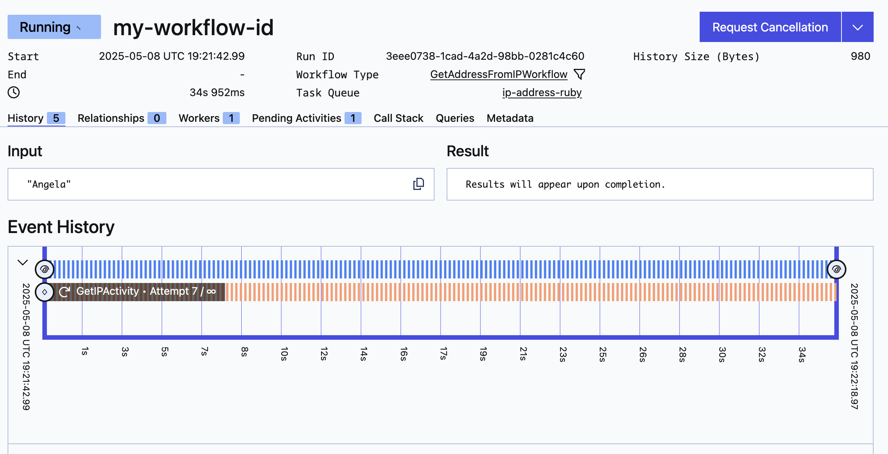
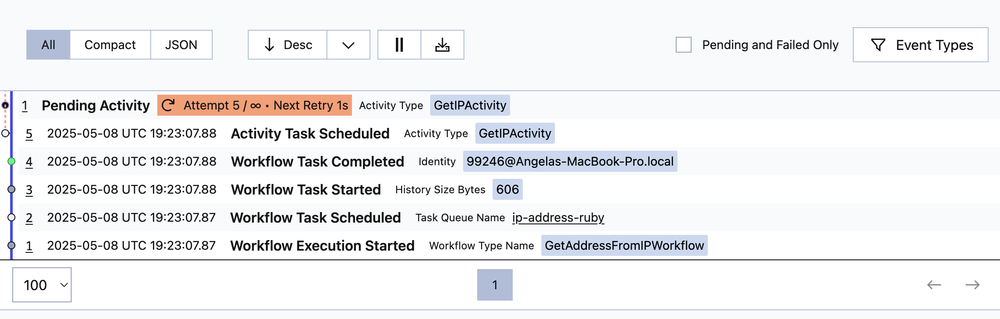

import Tabs from '@theme/Tabs';
import TabItem from '@theme/TabItem';


:::note Tutorial information

- **Level:** ⭐ Temporal beginner
- **Time:** ⏱️ ~15 minutes
- **Goals:** 🙌
  - Set up, build, and test a Temporal Application project from scratch using the [Ruby SDK](https://github.com/temporalio/sdk-ruby).
  - Identify the four parts of a Temporal Workflow application.
  - Describe how the Temporal Server gets information to the Worker.
  - Observe how Temporal recovers from failed Activities.

:::

### Introduction

Creating reliable applications is a difficult chore. [Temporal](https://temporal.io/) lets you create fault-tolerant, resilient applications using programming languages you already know, so you can build complex applications that execute reliably and recover from failures.

In this tutorial, you will build your first Temporal Application from scratch using the [Temporal Ruby SDK](https://github.com/temporalio/sdk-ruby). You'll develop a small application that asks for your name and then uses APIs to get your public IP address and your location based on that address. External requests can fail due to rate limiting, network interruptions, or other errors. Using Temporal for this application will let you automatically recover from these and other kinds of failures without having to write explicit error-handling code.

The app will consist of the following pieces:

1. Two [Activities](https://docs.temporal.io/activities): Activities are functions called by Workflows, and they contain any logic that might fail or behave differently at different times. The first Activity will get your IP address, and the second Activity will use that IP address to get your location.
2. A [Workflow](https://docs.temporal.io/workflows): Workflows are functions that define the overall flow of the application.  Your Workflow will execute both Activities you define. It will call the first Activity to fetch the IP address, and then use the result of that Activity to call the next Activity to find your location.
3. A [Worker](https://docs.temporal.io/workers): Workers host the Activity and Workflow code and execute the code piece by piece.
4. A client program: You'll need to start your Worfklow. In this tutorial you'll create a small program using the [Temporal Client](https://docs.temporal.io/encyclopedia/temporal-sdks#temporal-client) to start the Workflow.

You'll also write tests to ensure your Workflow executes successfully.

When you're done, you'll have a basic application and a clear understanding of how to build out the components you'll need in future Temporal applications in Ruby.

## Prerequisites

Before starting this tutorial:

- [Set up a local development environment for developing Temporal applications using Ruby](https://learn.temporal.io/getting_started/ruby/dev_environment/)
  - Ensure that the Temporal Service is running in a terminal on your local machine and that you can access the Temporal Web UI. In this tutorial you'll use port `8233` for the Web UI, which is the default port.

- Follow the tutorial [Run your first Temporal application with the Ruby SDK](https://learn.temporal.io/getting_started/ruby/first_program_in_ruby/) to gain a better understanding of what Temporal is and how its components fit together.

## Create a New Temporal Ruby Project

To get started with the Temporal Ruby SDK, you'll create a new Bundler project, just like any other Ruby program you're creating. Then you'll add the Temporal SDK package to your project.

In a terminal, create a new project directory called `temporal-ip-geolocation`:

```command
mkdir temporal-ip-geolocation
```

Switch to the new directory:

```command
cd temporal-ip-geolocation
```

From the root of your new project directory, set up a Bundler project. This creates a Gemfile in the current directory.

```command
bundle init
```

Then add the Temporal Ruby SDK to the Gemfile:

```command
bundle add temporalio
```

You'll see the following output, indicating that the SDK is now a project dependency:

```output
Fetching gem metadata from https://rubygems.org/.....
Resolving dependencies...
```

Next, install the Temporal SDK from the Gemfile:

```command
bundle install 
```

You'll see an output similar to the following:

```output
Installing temporalio 0.4.0 (arm64-darwin)
Bundle complete! 1 Gemfile dependency, 6 gems now installed.
Use `bundle info [gemname]` to see where a bundled gem is installed.
```

With the project created, you'll create the application's core logic.

## Write functions to call external services

Your application will make two HTTP requests. The first request will return your current public IP, while the second request will use that IP to provide city, state, and country information.

You'll use Temporal Activities to make these requests. You use Activities in your Temporal Applications to execute [non-deterministic](https://docs.temporal.io/workflows#deterministic-constraints) code or perform operations that may fail, such as API requests or database calls.

If an Activity fails, Temporal can automatically retry it until it succeeds or reaches a specified retry limit. This ensures that transient issues, like network glitches or temporary service outages, don't result in data loss or incomplete processes.

Create a new folder which will hold your Temporal logic

```command
mkdir -p lib
```
Within `lib`, create another folder - `ip_geolocate` - which will contain your Workflow and Activity logic.

```command
mkdir -p lib/ip_geolocate
```

Create the file `get_ip_activity.rb` which will return your current public IP.

```command
touch lib/ip_geolocate/get_ip_activity.rb
```

With the Ruby SDK, you can define Activities as regular Ruby methods. Open the file `get_ip_activity.rb` in your editor and add the following code to define a Temporal Activity that retrieves your IP address from `icanhazip.com`:

<!--SNIPSTART ruby-ipgeo-get-public-ip-->
[lib/ip_geolocate/get_ip_activity.rb](https://github.com/temporalio/temporal-tutorial-ipgeo-ruby/blob/main/lib/ip_geolocate/get_ip_activity.rb)
```rb
require 'json'
require 'net/http'
require 'uri'
require 'temporalio/activity'

module IPGeolocate
  class GetIPActivity < Temporalio::Activity::Definition
    def execute
      url = URI('https://icanhazip.com')
      
      # Create an HTTP session that can be reused
      http = Net::HTTP.new(url.host, url.port)
      http.use_ssl = (url.scheme == 'https')
      
      # Start a session
      http.start do |session|
        # Make the request within the session
        request = Net::HTTP::Get.new(url.request_uri)
        response = session.request(request)
        
        # Return the response body with whitespace removed
        response.body.strip
      end
    end
  end
end
```
<!--SNIPEND-->

The response from `icanhazip.com` is plain-text, and it includes a newline, so you trim off the newline character before returning the result.

Notice that there's no error-handling code in this function. When you build your Workflow, you'll use Temporal's Activity Retry policies to retry this code automatically if there's an error.

Now add the second Activity that accepts an IP address and retrieves location data. 

Create the file `get_location_activity.rb` which will return your current location.

```command
touch lib/ip_geolocate/get_location_activity.rb
```

Now add the following code to `get_location_activity.rb`:

<!--SNIPSTART ruby-ipgeo-get-location-->
[lib/ip_geolocate/get_location_activity.rb](https://github.com/temporalio/temporal-tutorial-ipgeo-ruby/blob/main/lib/ip_geolocate/get_location_activity.rb)
```rb
require 'temporalio/activity'
require 'net/http'
require 'uri'
require 'json'

module IPGeolocate
  class GetLocationActivity < Temporalio::Activity::Definition
    # Use the IP address to get the location
    def execute(ip)
      url = URI("http://ip-api.com/json/#{ip}")
      response = Net::HTTP.get(url)
      data = JSON.parse(response)
      "#{data['city']}, #{data['regionName']}, #{data['country']}"
    end
  end
end
```
<!--SNIPEND-->

This Activity follows the same pattern as the `GetIPActivity` Activity. It's a method that calls a remote service. This time, the service returns JSON data rather than text.

While Activities can accept input arguments, it's a best practice to send a single argument rather than multiple arguments. In this case you only have a single String. If you have more than one argument, you should bundle them up in a serializable object. Review the [Activity parameters](https://docs.temporal.io/dev-guide/typescript/foundations/#activity-parameters) section of the Temporal documentation for more details.

You've created your two Activities. Now you'll coordinate them using a Temporal Workflow.

## Control application logic with a Workflow

Workflows are where you configure and organize the execution of Activities. You define a Workflow by writing a *Workflow Definition* using one of the Temporal SDKs.

Temporal Workflows [must be deterministic](https://docs.temporal.io/workflows#deterministic-constraints) so that Temporal can replay your Workflow in the event of a crash. That's why you call Activities from your Workflow code. Activities don't have the same determinism constraints that Workflows have.

Create the file `get_address_from_ip_workflow.rb` in the `ip_geolocate` folder:

```command
touch lib/ip_geolocate/get_address_from_ip_workflow.rb
```

Then add the following code to import the Activities and configure how the Workflow should handle failures with a [Retry Policy](https://docs.temporal.io/encyclopedia/retry-policies).

<!--SNIPSTART ruby-ipgeo-get-address-from-ip-workflow {"selectedLines": ["13-19"]}-->
[lib/ip_geolocate/get_address_from_ip_workflow.rb](https://github.com/temporalio/temporal-tutorial-ipgeo-ruby/blob/main/lib/ip_geolocate/get_address_from_ip_workflow.rb)
```rb
# ...
        retry_policy: Temporalio::RetryPolicy.new(
          initial_interval: 2.0,      # amount of time that must elapse before the first retry occurs
          backoff_coefficient: 1.5,   # Coefficient used to calculate the next retry interval
          max_interval: 30.0          # maximum interval between retries
          # max_attempts: 5,          # Uncomment this if you want to limit attempts
          # non_retryable_error_types: # Defines non-retryable error types
        )
```
<!--SNIPEND-->

With the imports and options in place, you can define the Workflow itself.

With the imports and options in place, you can define the Workflow itself. In the Ruby SDK, you implement a Workflow the same way you define an Activity; using a method. Add the following code to call both Activities, using the value of the first as the input to the second:

Add the following code to define the `GetAddressFromIPWorkflow` Workflow, which will call both Activities, using the value of the first as the input to the second:

<!--SNIPSTART ruby-ipgeo-get-address-from-ip-workflow-->
[lib/ip_geolocate/get_address_from_ip_workflow.rb](https://github.com/temporalio/temporal-tutorial-ipgeo-ruby/blob/main/lib/ip_geolocate/get_address_from_ip_workflow.rb)
```rb
require 'temporalio/workflow'
require 'temporalio/retry_policy' 

require_relative 'get_ip_activity'
require_relative 'get_location_activity'

module IPGeolocate
  class GetAddressFromIPWorkflow < Temporalio::Workflow::Definition
    def execute(name)
      ip = Temporalio::Workflow.execute_activity(
        GetIPActivity,
        start_to_close_timeout: 300,
        retry_policy: Temporalio::RetryPolicy.new(
          initial_interval: 2.0,      # amount of time that must elapse before the first retry occurs
          backoff_coefficient: 1.5,   # Coefficient used to calculate the next retry interval
          max_interval: 30.0          # maximum interval between retries
          # max_attempts: 5,          # Uncomment this if you want to limit attempts
          # non_retryable_error_types: # Defines non-retryable error types
        )
      )
      
      location = Temporalio::Workflow.execute_activity(
        GetLocationActivity,
        ip,
        schedule_to_close_timeout: 300
      )
      
      "Hello, #{name}. Your IP is #{ip} and you are located in #{location}."
    end
  end
end
```
<!--SNIPEND-->

In this example, you have specified that the Start-to-Close Timeout for your Activities will be five minutes, meaning that your Activity has five minutes to complete before it times out. Of all the Temporal timeout options, `start_to_close_timeout` is the one you should always set.

Temporal's default behavior is to automatically retry an Activity that fails, which means that transient or intermittent failures require no action on your part. This behavior is defined by the Retry Policy. If you don't specify the values on your Retry policy, you will be automatically using Temporal's [default retry policy values](https://docs.temporal.io/encyclopedia/retry-policies#default-values-for-retry-policy). Note that the `max_attempts` is commented out, which means there's no limit to the number of times Temporal will retry your Activities if they fail. The `non_retryable_error_types` are also commented out, meaning that Temporal will retry all error types.

Next you'll create a Worker that executes the Workflow and Activities.

## Configure and run a Worker

When you start a Temporal Workflow, the Workflow and its Activities get scheduled on the Temporal Service's [Task Queue](https://docs.temporal.io/concepts/what-is-a-task-queue). A [Worker](https://docs.temporal.io/concepts/what-is-a-worker) hosts Workflow and Activity functions and polls the Task Queue for tasks related to those Workflows and Activities. After the Worker runs the code, it communicates the results back to the Temporal Service where they're stored in the Event History. This records the Workflow's entire execution, enabling features like fault tolerance by allowing the Workflow to replay in case of Worker crashes or restarts.

You use the Temporal SDK to define a Worker Program.

In your Worker Program, you need to specify the name of the Task Queue, which must match the Task Queue name used whenever you interact with a Workflow from a client application. This ensures that the Worker processes tasks for the correct Workflow. The Task Queue name is a case-insensitive string. To ensure consistency and avoid errors, define the Task Queue name as a constant that can be reused throughout your code.

Create the file `ip_geolcoate.rb` within your `lib` folder:

```command
touch lib/ip_geolocate.rb
```

This file should declare the `IpGeolocate` module, requires all children of the `IpGeolocate` module, and also defines the `Task_Queue_Name`. Open the file and add the following lines to the file to define the constant for the Task Queue:

<!--SNIPSTART ruby-ipgeo-shared-->
[lib/ip_geolocate.rb](https://github.com/temporalio/temporal-tutorial-ipgeo-ruby/blob/main/lib/ip_geolocate.rb)
```rb
# Load Bundler and load all your gems
require_relative "ip_geolocate/get_ip_activity"
require_relative "ip_geolocate/get_location_activity"
require_relative "ip_geolocate/get_address_from_ip_workflow"

module IPGeolocate
  TASK_QUEUE_NAME = "ip-address-ruby"
end
```
<!--SNIPEND-->

Now you can create the Worker program.

Now create the file `worker.rb` in that directory:

```command
touch lib/worker.rb
```

Then open `worker.rb` in your editor and add the following code to define the Worker program:

<!--SNIPSTART ruby-ipgeo-worker-->
[lib/worker.rb](https://github.com/temporalio/temporal-tutorial-ipgeo-ruby/blob/main/lib/worker.rb)
```rb
require_relative 'ip_geolocate'
require 'temporalio/client'
require 'temporalio/worker'

# Create a client
begin
  client = Temporalio::Client.connect('localhost:7233', 'default')
rescue StandardError => e
  puts e.message
  exit 1
end

# Create a worker with the client, activities, and workflows
worker = Temporalio::Worker.new(
  client:,
  task_queue: IPGeolocate::TASK_QUEUE_NAME,
  workflows: [IPGeolocate::GetAddressFromIPWorkflow],
  activities: [IPGeolocate::GetIPActivity, IPGeolocate::GetLocationActivity]
)

# Run the worker until SIGINT. This can be done in many ways, see "Workers" section for details.
worker.run(shutdown_signals: ['SIGINT'])
```
<!--SNIPEND-->

The code imports the `iplocate` package, which includes your Workflow and Activity Definitions. It also uses the `TASK_QUEUE_NAME` constant.

You first create a client, and then you create a Worker that uses the client, along with the Task Queue it should listen on. By default, the client connects to the Temporal Service running at `localhost` on port `7233`, and connects to the `default` namespace. You can change this by setting values in the Client Options.

In this case your Worker will run your Workflow and your two Activities, but there are cases where you could configure one Worker to run Activities, and another Worker to run the Workflows.

Now you'll start the Worker. Be sure you have started the local Temporal Service and execute the following command to start your Worker:

```command
bundle exec ruby lib/worker.rb
```

Your Worker will then begin running and is polling the Temporal Service for Workflows to run, but before you start your Workflow, you'll write tests to prove it works as expected.

## Write tests to ensure things work

The Temporal Ruby SDK includes methods that help you test your Workflow executions. Let's add a basic unit test to the application to make sure the Workflow works as expected.

You'll use the `@temporalio/testing` package, which will download a test server that provides a `TestWorkflowEnvironment`.

Create a test directory:

`mkdir test`

Then create the file `get_address_from_ip_workflow_test.rb` within the `test` directory:

```command
touch test/get_address_from_ip_workflow_test.rb
```

Add the following code to `get_ip_activity_test.rb` to test the Workflow execution:

<!--SNIPSTART ruby-get-address-from-ip-workflow-test-->
[test/get_address_from_ip_workflow_test.rb](https://github.com/temporalio/temporal-tutorial-ipgeo-ruby/blob/main/test/get_address_from_ip_workflow_test.rb)
```rb
require 'test_helper'
require 'securerandom'
require 'temporalio/testing'
require 'temporalio/worker'
require 'ip_geolocate'

class GetAddressFromIPWorkflowTest < Minitest::Test
  class MockGetIPActivity < Temporalio::Activity::Definition
    activity_name :GetIPActivity

    def execute
      "1.1.1.1"
    end
  end
  
  class MockGetLocationActivity < Temporalio::Activity::Definition
    activity_name :GetLocationActivity

    def execute(ip)
      "Planet Earth"
    end
  end

  def test_gets_location_from_ip_with_mocked_activities
    Temporalio::Testing::WorkflowEnvironment.start_local do |env|
      worker = Temporalio::Worker.new(
        client: env.client,
        task_queue: "test",
        workflows: [IPGeolocate::GetAddressFromIPWorkflow],
        activities: [MockGetIPActivity, MockGetLocationActivity],
        workflow_executor: Temporalio::Worker::WorkflowExecutor::ThreadPool.default
      )
      worker.run do
        result = env.client.execute_workflow(
          IPGeolocate::GetAddressFromIPWorkflow,
          "Testing",
          id: "test-#{SecureRandom.uuid}",
          task_queue: worker.task_queue
        )
        assert_equal 'Hello, Testing. Your IP is 1.1.1.1 and you are located in Planet Earth.', result
      end
    end
  end
end
```
<!--SNIPEND-->

`TestWorkflowEnvironment` is a runtime environment used to test a Workflow. You use it to connect the Client and Worker to the test server and interact with the test server. You'll use this to register your Workflow Type and access information about the Workflow Execution, such as whether it completed successfully and the result or error it returned. Since the TestWorkflowEnvironment will be shared across tests, you will set it up before all of your tests, and tear it down after your tests finish.

This test sets up a test environment to run Workflows that uses a lightweight Temporal Service specifically for testing. In the test itself, you create a Worker that connects to the test environment. This should look familiar, as it's similar to the code you wrote to define your Worker Program.

Instead of using your actual Activities, you replace the Activities `GetIPActivity` and `GetLocationActivity` with methods that return hard-coded values. This way you're testing the Workflow's logic independently of the Activities. If you wanted to test the Activities directly as part of an integration test, you'd specify them directly as you did when you wrote the Worker program.

```command
bundle exec ruby -Ilib:test test/get_address_from_ip_workflow_test.rb
```

The test environment starts, spins up a Worker, and executes the Workflow in the test environment. At the end, you'll see that your test passes:

```output
Finished tests in 2.358264s, 0.4240 tests/s, 0.4240 assertions/s.
1 tests, 1 assertions, 0 failures, 0 errors, 0 skips
```

With a Workflow test in place, you can write unit tests for the Activities.

Both of your Activities make external calls to services that will change their results based on who runs them. It will be challenging to test these Activities reliably. For example, the IP address may vary based on your machine's location.

To ensure you can test the Activities in isolation, you’ll stub out the HTTP calls.

Create the file `get_ip_activity_test.rb`:

```command
touch test/get_ip_activity_test.rb
```

The `MockActivityEnvironment` from the `@temporalio/testing` package lets you test Activities as if they were part of a Temporal Application.

Next, write the test for the `GetIPActivityActivity` Activity.

<!--SNIPSTART ruby-ip-activity-test-->
[test/get_ip_activity_test.rb](https://github.com/temporalio/temporal-tutorial-ipgeo-ruby/blob/main/test/get_ip_activity_test.rb)
```rb
require 'test_helper'
require 'securerandom'
require 'temporalio/testing'
require 'ip_geolocate/get_ip_activity'

class GetIPActivityTest < Minitest::Test
  def test_gets_ip
    env = Temporalio::Testing::ActivityEnvironment.new

    Net::HTTP.stub(:get, ->(*) { "1.1.1.1" }) do
      result = env.run(IPGeolocate::GetIPActivity)
      assert_equal "1.1.1.1", result
    end
  end

end
```
<!--SNIPEND-->

Now, create a test file for `get_location_activity_test.rb`:

```command
touch test/get_location_activity_test.rb
```

Next, write the test for the `GetLocationActivityActivity` Activity, using [`Net::HTTP`](https://ruby-doc.org/stdlib-2.7.0/libdoc/net/http/rdoc/Net/HTTP.html) to stub out actual HTTP calls so your tests are consistent.

<!--SNIPSTART ruby-get-location-activity-test-->
[test/get_location_activity_test.rb](https://github.com/temporalio/temporal-tutorial-ipgeo-ruby/blob/main/test/get_location_activity_test.rb)
```rb
require "test_helper"
require 'securerandom'
require 'temporalio/testing'
require "ip_geolocate/get_location_activity"

class GetLocationActivityTest < Minitest::Test
  def test_gets_ip
    env = Temporalio::Testing::ActivityEnvironment.new

    fake_location = {
      city: 'Sample City',
      regionName: 'Sample Region',
      country: 'Sample Country'
    }.to_json;

    Net::HTTP.stub(:get, ->(*) { fake_location }) do
      result = env.run(IPGeolocate::GetLocationActivity, "1.1.1.1")
      assert_equal "Sample City, Sample Region, Sample Country", result
    end
  end

end
```
<!--SNIPEND-->

To test the Activity itself, you use the test environment to execute the Activity rather than directly calling the `GetLocationActivityActivity` method. You get the result from the Activity Execution and then ensure it matches the value you expect.

This test looks similar to the previous test; you mock out the HTTP client and ensure it returns the expected data, and then you execute the Actiity in the test environment. Then you retrieve the value and ensure it's what you expect.

Run the tests again to see them pass. 

```command
bundle exec ruby -Ilib:test test/get_ip_activity_test.rb
```

```command
bundle exec ruby -Ilib:test test/get_location_activity_test.rb
```

```output
Finished tests in 0.000718s, 1392.7570 tests/s, 1392.7570 assertions/s.
1 tests, 1 assertions, 0 failures, 0 errors, 0 skips
```

Now that you have your tests passing, it's time to start a Workflow Execution.

## Run the Workflow from a client

You can start a Workflow Execution by using the Temporal CLI or by writing code using the Temporal SDK.

Starting a Workflow Execution using the Temporal SDK involves connecting to the Temporal Server, configuring the Task Queue the Workflow should use, and starting the Workflow with the input parameters it expects. In a real application, you may invoke this code when someone submits a form, presses a button, or visits a certain URL. In this tutorial, you will create a small CLI program that runs your Temporal Workflow.

Create a new directory called `client` to hold the program:

```command
touch lib/client.rb
```

Open `client.rb` in your editor and add the following code to the file to connect to the server and start the Workflow:

<!--SNIPSTART ruby-ipgeo-client-->
[lib/client.rb](https://github.com/temporalio/temporal-tutorial-ipgeo-ruby/blob/main/lib/client.rb)
```rb
require_relative 'ip_geolocate'
require 'temporalio/client'

name = ARGV[0]
unless name
  puts "Please provide your name when running the program."
  exit 1
end

# Create a client
begin
  client = Temporalio::Client.connect('localhost:7233', 'default')
rescue StandardError => e
  puts e.message
  exit 1
end

# Run workflow
result = client.execute_workflow(
  IPGeolocate::GetAddressFromIPWorkflow,
  name, # This is the input to the workflow
  id: 'my-workflow-id',
  task_queue: IPGeolocate::TASK_QUEUE_NAME,
)

puts result
```
<!--SNIPEND-->

In the `result` method you check to see if there is at least one argument passed and then capture the user's name from the arguments.

The client sets up a connection to your Temporal Server, invokes your Workflow, passes in an argument for the `name`, and assigns the Workflow a unique identifier using a UUID. The client dispatches the Workflow on the same Task Queue that the Worker is polling on. That's why you used a constant to ensure the Task Queue name is consistent. If there's a mismatch, your Workflow will execute on a different Task Queue and there won't be any Workers polling for tasks.

:::note Specify a Workflow Id

A Workflow ID is unique in a Namespace and identifies a Workflow Execution. Using an identifier that reflects some business process or entity is a good practice. For example, you might use a customer identifier as part of the Workflow Id if you run one Workflow per customer. This would make it easier to find all Workflow Executions related to that customer later.

In this tutorial you're generating a UUID and appending it to a string that identifies the Workflow.
:::

Now you can run your Workflow. First, ensure that your local Temporal Service is running, and that your Worker program is running also.

Then open a new terminal and switch to the project directory:

```command
cd temporal-tutorial-ipgeo-ruby
```

Now run the following command to run the Workflow using the client program you wrote:

```command
bundle exec ruby lib/client.rb Angela
```

You'll see the following output:

```output
Hello, Angela. Your IP is 204.148.195.242 and you are located in Washington, District of Columbia, United States.
```

:::tip

To run your Temporal Application, you need to start the Workflow and the Worker. You can start these in any order, but you'll need to run each command from a separate terminal window, as the Worker needs to be constantly running to look for tasks to execute.

:::

Your Temporal Application works. Now review it in the Temporal Web UI.

## Exploring your application in the Web UI

The Temporal Web UI gives you insights into your Workflow's execution. Open the Temporal Web UI by visiting `http://localhost:8233` and click on your completed Workflow to view the execution history. You'll see results similar to the following image:


You'll see the dates the Workflow Exeuction ran, how long it took to run, the input to the Workflow, and the result.

After that, you see the Event History, detailing the entire flow, including the inputs and outputs of the Activity Executions:


The most recent event is at the top, so read the history from the bottom up to see each step in the process. Using this history, you can see exactly how your Workflow executed and pinpoint any places things might have gone wrong.

Temporal stores the results of each Activity in this history, as you can see in the image. If there was a system crash between the `GetIPActivityActivity` and `GetLocationActivityActivity` Activity Executions, a new Worker would re-run the Workflow, but would use the previous Event History to reconstruct the Workflow's state. Instead of re-running the `GetIPActivity` function, it would use the previous run's value and continue on. This prevents duplicate executions. By relying on the stored Event History, Temporal ensures that the Workflow can recover seamlessly, maintaining reliability and consistency even after a crash.

In this application, this recovery isn't crucial. But imagine a situation where each Activity execution was a bank transaction. If a crash occurred between transactions, the Worker can pick up where the previous one failed. Nobody gets charged multiple times because something failed.

Next, you'll explore how Temporal handles failed Activities.

## Observe automatic retries

When you developed your Activities, you didn't include any error-handling code. So if there's a problem making the request, the Workflow will handle the error using the Retry Policy.

Test this out. Disconnect your local machine from the Internet by turning off your Wi-Fi connection or unplugging your network cable.

Then, with the local Temporal Service running and your Worker running, switch to the Terminal window where you ran your Workflow and run it again:

```command
bundle exec ruby lib/client.rb Angela
```

This time you don't get a response.

Visit `http://localhost:8233` to open the Temporal Web UI and locate the Workflow Execution that's currently running. When you select it, you'll see something like the following image, indicating that there's a problem:



As you can see, the `GetIPActivity` Activity has failed and Temporal is retrying it. Scroll down to the Event History and you'll see the failure represented there:


Select the **Pending Activity** item in the table to see why it failed and you'll see the stack trace:


Connect to the internet again and wait. After a few moments, the Workflow recovers and completes:


If you return to your terminal where you launched the Workflow, you'll find your results there as well.

You can recover from failures by letting Temporal handle them for you instead of writing complex error-handling logic. You can also decide that you only want to retry a fixed number of times, or that you only want to recover on certain kinds of errors.

## Conclusion

In this tutorial you built your first Temporal Application. You used the Temporal Ruby SDK to build a resilient application that recovered from failure. You wrote tests to verify that it works and reviewed the Event History for a working execution. You also tested your Workflow without an internet connection to understand how Temporal recovers from failures like network outages.

Take this application one step further and add a new Activity that gets the current weather for the location you found.

### Review

Answer the following questions to see whether you remember some important concepts from this tutorial:

<details>
<summary>

**What are the four parts of a Temporal Workflow application?**

</summary>

1. A Workflow function.
2. An Activity function.
3. A Worker to host the Workflow and Activity code.
4. Some way to start the Workflow.

</details>

<details>
<summary>

**How does the Temporal Server get information to the Worker?**

</summary>

The Temporal Server adds Tasks to a Task Queue, and the Worker polls the Task Queue.

</details>
