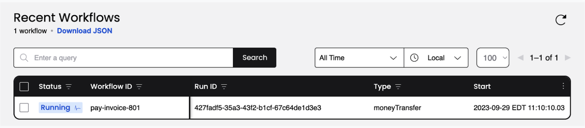
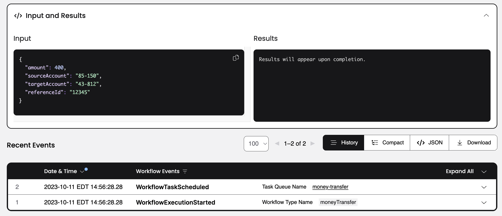
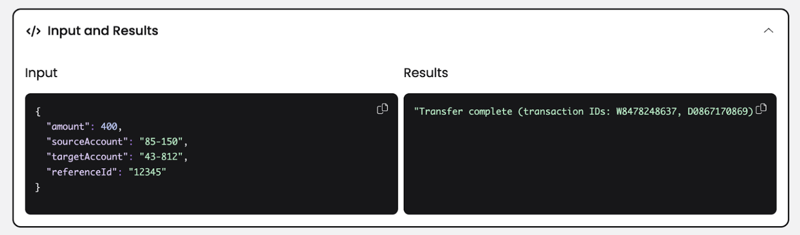
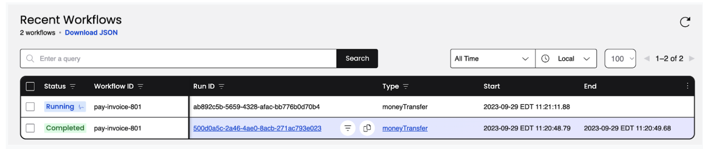
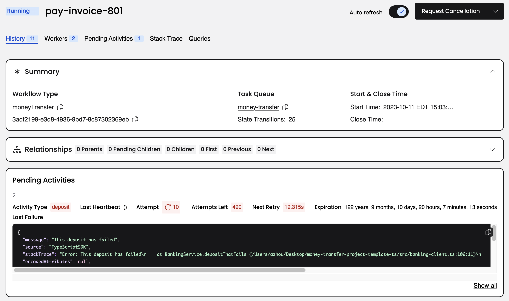
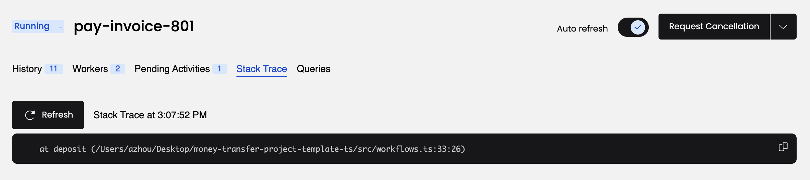
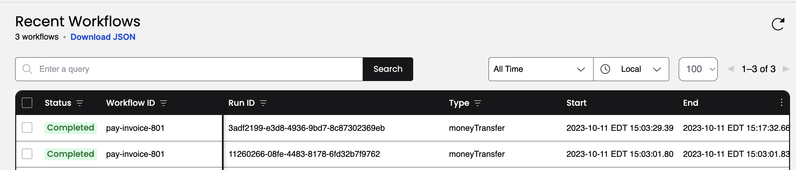

:::note Tutorial information

- **Level**: ⭐ Temporal beginner
- **Time**: ⏱️ ~10 minutes
- **Goals**: 🙌
  - Explore Temporal's core terminology and concepts.
  - Complete several runs of a Temporal Workflow application using a Temporal Cluster and the [TypeScript SDK](https://github.com/temporalio/sdk-typescript).
  - Practice reviewing the state of the Workflow.
  - Understand the inherent reliability of Workflow functions.

:::

### Introduction

Whether you're writing a complex transaction-based Workflow or working with remote APIs, creating reliable applications is a complex process.

The Temporal Cluster and a language-specific SDK, in this case the [TypeScript SDK](https://github.com/temporalio/sdk-typescript), provide a comprehensive solution to the complexities that arise from modern application development. You can think of Temporal as a sort of "cure-all" for the pains you experience as a developer when trying to build reliable applications.

Temporal provides reliability primitives, such as seamless and fault-tolerant application state tracking, automatic retries, timeouts, rollbacks due to process failures, and more.

In this tutorial, you'll run your first Temporal Application and explore how Temporal Workflows and Activities work together. You'll use Temporal's Web UI to see how Temporal executed your Workflow, and then explore how Temporal helps you recover from a couple of common failures.

## Prerequisites

Before starting this tutorial:

- [Set up a local development environment for developing Temporal Applications using the TypeScript programming language](/getting_started/typescript/dev_environment/)
- Ensure you have Git installed to clone the project.

##  Application overview

The project in this tutorial mimics a "money transfer" application that has a single [Workflow function](https://docs.temporal.io/dev-guide/typescript/foundations#develop-workflows) that orchestrates the execution of `withdraw` and `deposit` functions, representing a transfer of money from one account to another. Temporal calls these particular functions [Activity functions](https://docs.temporal.io/dev-guide/typescript/foundations#develop-activities).

To run the application, you do the following:

1. Send a message to the Temporal Cluster to start the money transfer. The Temporal Server tracks the progress of your Workflow function execution.
2. Run a Worker. A Worker is a wrapper around your compiled Workflow and Activity code. A Worker's only job is to execute the Activity and Workflow functions and communicate the results back to the Temporal Server.

The following diagram illustrates what happens when you start the Workflow:


The Temporal Server doesn't run your code. Your Worker, Workflow, and Activity run on your infrastructure, along with the rest of your applications.

Now that you know how the application will work, it's time to download the application to your local machine so you can try it out yourself.

##  Download the example application

The application you'll use in this tutorial is available in a [GitHub repository](https://github.com/temporalio/money-transfer-project-template-ts/).

Open a new terminal window and use `git` to clone the repository:

```command
git clone https://github.com/temporalio/money-transfer-project-template-ts/
```

Once you have the repository cloned, change to the project directory:

```command
cd money-transfer-project-template-ts
```

:::tip

The repository for this tutorial is a GitHub Template repository, which means you could clone it to your own account and use it as the foundation for your own Temporal application. Github's [Creating a Repository from a Template](https://docs.github.com/en/repositories/creating-and-managing-repositories/creating-a-repository-from-a-template#creating-a-repository-from-a-template) guide walks you through the steps.

:::

With the project downloaded, let's explore the code, starting with the Workflow.

## Explore the application's Workflow and Activity Definitions

A Temporal Application is a set of Temporal [Workflow Executions](https://docs.temporal.io/workflows#workflow-execution), which are reliable, durable function executions. These Workflow Executions orchestrate the execution of [Activities](https://docs.temporal.io/activities), which execute a single, well-defined action, such as calling another service, transcoding a media file, or sending an email message. 

You use a [Workflow Definition](https://docs.temporal.io/workflows#workflow-definition) to define the Workflow Execution's constraints. A Workflow Definition in TypeScript is a regular TypeScript function that accepts some input values. 

The sample application in this tutorial models a money transfer between two accounts. Money comes out of one account and goes into another. However, there are a few things that can go wrong with this process. If the withdrawal fails, then there's no need to attempt a deposit. But if the withdrawal works but the deposit fails, then the money needs to go back to the original account.

This is what the Workflow Definition looks like for this kind of process:

<!--SNIPSTART money-transfer-project-template-ts-workflow-->
[src/workflows.ts](https://github.com/temporalio/money-transfer-project-template-ts/blob/cloud/src/workflows.ts)
```ts
import { proxyActivities } from '@temporalio/workflow';
import { ApplicationFailure } from '@temporalio/common';

import type * as activities from './activities';
import type { PaymentDetails } from './shared';

export async function moneyTransfer(details: PaymentDetails): Promise<string> {
  // Get the Activities for the Workflow and set up the Activity Options.
  const { withdraw, deposit, refund } = proxyActivities<typeof activities>({
    // RetryPolicy specifies how to automatically handle retries if an Activity fails.
    retry: {
      initialInterval: '1 second',
      maximumInterval: '1 minute',
      backoffCoefficient: 2,
      maximumAttempts: 500,
      nonRetryableErrorTypes: ['InvalidAccountError', 'InsufficientFundsError'],
    },
    startToCloseTimeout: '1 minute',
  });

  // Execute the withdraw Activity
  let withdrawResult: string;
  try {
    withdrawResult = await withdraw(details);
  } catch (withdrawErr) {
    throw new ApplicationFailure(`Withdrawal failed. Error: ${withdrawErr}`);
  }

  //Execute the deposit Activity
  let depositResult: string;
  try {
    depositResult = await deposit(details);
  } catch (depositErr) {
    // The deposit failed; try to refund the money.
    let refundResult;
    try {
      refundResult = await refund(details);
      throw ApplicationFailure.create({
        message: `Failed to deposit money into account ${details.targetAccount}. Money returned to ${details.sourceAccount}. Cause: ${depositErr}.`,
      });
    } catch (refundErr) {
      throw ApplicationFailure.create({
        message: `Failed to deposit money into account ${details.targetAccount}. Money could not be returned to ${details.sourceAccount}. Cause: ${refundErr}.`,
      });
    }
  }
  return `Transfer complete (transaction IDs: ${withdrawResult}, ${depositResult})`;
}
```
<!--SNIPEND-->

The `moneyTransfer` function takes in the details about the transaction, executes Activities to withdraw and deposit the money, and returns the results of the process. If there's a problem with the deposit, the function calls another Activity to put the money back in the original account, but still returns an error so you know the process failed.

In this case, the `moneyTransfer` function accepts an `input` variable of the type `PaymentDetails`, which is a data structure that holds the details the Workflow uses to perform the money transfer. This type is defined in the file `shared.ts`: 

<!--SNIPSTART money-transfer-project-template-ts-shared-->
[src/shared.ts](https://github.com/temporalio/money-transfer-project-template-ts/blob/main/src/shared.ts)
```ts

export type PaymentDetails = {
  amount: number;
  sourceAccount: string;
  targetAccount: string;
  referenceId: string;
};

```
<!--SNIPEND-->

It's a good practice to send a single, serializable data structure into a Workflow as its input, rather than multiple, separate input variables. As your Workflows evolve, you may need to add additional inputs, and using a single argument will make it easier for you to change long-running Workflows in the future.

Notice that the `PaymentDetails` interface includes a `referenceId` field. Some APIs let you send a unique "idempotency key" along with the transaction details to guarantee that if you retry the transaction due to some kind of failure, the API you're calling will use the key to ensure it only executes the transaction once. 

The Workflow Definition calls the Activities `withdraw` and `deposit` to handle the money transfers. Activities are where you perform the business logic for your application. Like Workflows, you define Activities in Typescript by defining Typescript functions that receive some input values.

The `withdraw` Activity takes the details about the transfer and calls a service to process the withdrawal:

<!--SNIPSTART money-transfer-project-template-ts-withdraw-activity-->
[src/activities.ts](https://github.com/temporalio/money-transfer-project-template-ts/blob/cloud/src/activities.ts)
```ts
import type { PaymentDetails } from './shared';
import { BankingService } from './banking-client';

export async function withdraw(details: PaymentDetails): Promise<string> {
  console.log(
    `Withdrawing $${details.amount} from account ${details.sourceAccount}.\n\n`
  );
  const bank1 = new BankingService('bank1.example.com');
  return await bank1.withdraw(
    details.sourceAccount,
    details.amount,
    details.referenceId
  );
}
```
<!--SNIPEND-->

If the transfer succeeded, the `withdraw` function returns the confirmation. If it's unsuccessful, it returns the error from the banking service.

In this tutorial, the banking service simulates an external API call. You can inspect the code in the `banking-client.ts` file.

The `deposit` Activity function looks almost identical to the `withdraw` function:

<!--SNIPSTART money-transfer-project-template-ts-deposit-activity-->
[src/activities.ts](https://github.com/temporalio/money-transfer-project-template-ts/blob/cloud/src/activities.ts)
```ts
export async function deposit(details: PaymentDetails): Promise<string> {
  console.log(
    `Depositing $${details.amount} into account ${details.targetAccount}.\n\n`
  );
  const bank2 = new BankingService('bank2.example.com');
  // Uncomment lines 25-29 and comment lines 30-34 to simulate an unknown failure
  // return await bank2.depositThatFails(
  //   details.targetAccount,
  //   details.amount,
  //   details.referenceId
  // );
  return await bank2.deposit(
    details.targetAccount,
    details.amount,
    details.referenceId
  );
}
```
<!--SNIPEND-->

There are some commented lines in this Activity Definition that you'll use later in the tutorial to simulate an error in the Activity.

If the `withdraw` Activity fails, there's nothing else to do, but if the `deposit` Activity fails, the money needs to go back to the original account, so there's a third Activity called `refund` that does exactly that:

<!--SNIPSTART money-transfer-project-template-ts-refund-activity-->
[src/activities.ts](https://github.com/temporalio/money-transfer-project-template-ts/blob/cloud/src/activities.ts)
```ts
export async function refund(details: PaymentDetails): Promise<string> {
  console.log(
    `Refunding $${details.amount} to account ${details.sourceAccount}.\n\n`
  );
  const bank1 = new BankingService('bank1.example.com');
  return await bank1.deposit(
    details.sourceAccount,
    details.amount,
    details.referenceId
  );
}
```
<!--SNIPEND-->

This Activity function is almost identical to the `deposit` function, except that it uses the source account as the deposit destination. While you could reuse the existing `deposit` Activity to refund the money, using a separate Activity lets you add additional logic around the refund process, like logging. It also means that if someone introduces a bug in the `deposit` Activity, the `refund` won't be affected. You'll see this scenario shortly.

:::tip Why you use Activities

At first glance, you might think you can incorporate your logic into the Workflow Definition. However, Temporal Workflows have certain [deterministic constraints](https://docs.temporal.io/workflows#deterministic-constraints). For example, they need to be replayable, and making changes to the Workflow code makes it much harder to replay. 

In addition, by using Activities, you can take advantage of Temporal's ability to retry Activities indefinitely, which you'll explore later in this tutorial.

Use Activities for your business logic, and use Workflows to coordinate the Activities.

:::

Temporal Workflows automatically retry Activities that fail by default, but you can customize how those retries happen. At the top of the `moneyTransfer` Workflow Definition, you'll see a Retry Policy defined that looks like this:

<!--SNIPSTART money-transfer-project-template-ts-workflow {"selectedLines": ["9-20"]}-->
[src/workflows.ts](https://github.com/temporalio/money-transfer-project-template-ts/blob/cloud/src/workflows.ts)
```ts
// ...
  const { withdraw, deposit, refund } = proxyActivities<typeof activities>({
    // RetryPolicy specifies how to automatically handle retries if an Activity fails.
    retry: {
      initialInterval: '1 second',
      maximumInterval: '1 minute',
      backoffCoefficient: 2,
      maximumAttempts: 500,
      nonRetryableErrorTypes: ['InvalidAccountError', 'InsufficientFundsError'],
    },
    startToCloseTimeout: '1 minute',
  });

```
<!--SNIPEND-->

By default, Temporal retries failed Activities forever, but you can specify some errors that Temporal should not attempt to retry. In this example, there are two non-retryable errors: one for an invalid account number, and one for insufficient funds. If the Workflow encounters any error other than these, it'll retry the failed Activity indefinitely, but if it encounters one of these two errors, it will continue on with the Workflow. In the case of an error with the `deposit` Activity, the Workflow will attempt to put the money back.
.

In this Workflow, each Activity uses the same options, but you could specify different options for each Activity.

:::caution This is a simplified example.
Transferring money is a tricky subject, and this tutorial's example doesn't cover all of the possible issues that can go wrong. This simplified example doesn't cover all of the possible errors that could occur with a transfer. It doesn't include logic to clean things up if a Workflow is cancelled, and it doesn't handle other edge cases where money would be withdrawn but not deposited. There's also the possibility that this workflow can fail when refunding the money to the original account. In a production scenario, you'll want to account for those cases with more advanced logic, including adding a "human in the loop" step where someone is notified of the refund issue and can intervene.

This example only shows some core features of Temporal and is not intended for production use. 
:::

When you "start" a Workflow you are telling the Temporal Server, "Track the state of the Workflow with this function signature." Workers execute the Workflow code piece by piece, relaying the execution events and results back to the server.

Let's see that in action.

## Start the Workflow 

You have two ways to start a Workflow with Temporal, either via the SDK or via the [temporal command-line tool](https://docs.temporal.io/cli/). In this tutorial you use the SDK to start the Workflow, which is how most Workflows get started in a live environment.

To start a Workflow Execution, you connect to the Temporal Cluster, specify the [Task Queue](https://docs.temporal.io/concepts/what-is-a-task-queue) the Workflow should use, and start the Workflow with the input parameters it expects. In a real application, you may invoke this code when someone submits a form, presses a button, or visits a certain URL. In this tutorial, you'll create a small command-line program that starts the Workflow Execution.

The Task Queue is where Temporal Workers look for Workflows and Activities to execute. You define Task Queues by assigning a name as a string. You'll use this Task Queue name when you start a Workflow Execution, and you'll use it again when you define your Workers. To ensure your Task Queue names are consistent, place the Task Queue name in a variable you can share across your project. In this application you'll find the Task Queue defined in the `shared.ts` file:

<!--SNIPSTART money-transfer-project-template-ts-task-queue-->
<!--SNIPEND-->

In this tutorial, the file `client.ts` contains a program that connects to the Temporal Server and starts the Workflow:

<!--SNIPSTART money-transfer-project-template-ts-start-workflow-->
[src/client.ts](https://github.com/temporalio/money-transfer-project-template-ts/blob/cloud/src/client.ts)
```ts
import { Connection, WorkflowClient } from '@temporalio/client';
import { moneyTransfer } from './workflows';
import type { PaymentDetails } from './shared';

import { namespace, taskQueueName } from './shared';

async function run() {
  const connection = await Connection.connect();
  const client = new WorkflowClient({ connection, namespace });

  const details: PaymentDetails = {
    amount: 400,
    sourceAccount: '85-150',
    targetAccount: '43-812',
    referenceId: '12345',
  };

  console.log(
    `Starting transfer from account ${details.sourceAccount} to account ${details.targetAccount} for $${details.amount}`
  );

  const handle = await client.start(moneyTransfer, {
    args: [details],
    taskQueue: taskQueueName,
    workflowId: 'pay-invoice-801',
  });

  console.log(
    `Started Workflow ${handle.workflowId} with RunID ${handle.firstExecutionRunId}`
  );
  console.log(await handle.result());
}

run().catch((err) => {
  console.error(err);
  process.exit(1);
});
```
<!--SNIPEND-->

:::note

This tutorial uses a separate program to start the Workflow, but you don't have to follow this pattern. In fact, most real applications start a Workflow as part of another program. For example, you might start the Workflow in response to a button press or an API call.

:::

You can make the call [synchronously or asynchronously](https://docs.temporal.io/dev-guide/typescript/foundations#start-workflow-execution). Here we do it synchronously by fetching the return value of the Workflow execution with `await handle.result()`.  This call waits for the Workflow execution to complete before continuing.

Now that you've seen how to use the SDK to start a Workflow Execution, try running the program yourself.

Make sure you've [installed Temporal CLI on your local machine](/getting_started/typescript/dev_environment/index.md). 

Start the Temporal development server with the following command, which specifies a database file and sets the Temporal Web UI port to `8080`:

```command
temporal server start-dev --db-filename your_temporal.db --ui-port 8080
```

:::note
Temporal's development server uses an in-memory database by default, and that won't work for the demonstrations in this tutorial. Specifying a database file ensures that records persist when you restart the service.

When you stop and start the server again, remember to specify the same database file each time.
:::

Then run `client.ts` from the project root using the following command:

```command
npm run client
```

If this is your first time running this application, TypeScript might download some dependencies initially, but after those downloads complete, you'll see output that looks like the following:

```output
Starting transfer from account 85-150 to account 43-812 for $400
Started Workflow pay-invoice-801 with RunID 67fe2aff-3aa9-4239-af38-9460720832d3
Transfer complete (transaction IDs: W9860038178, D8057327891)
```

The Workflow is now running. Leave the program running.

Next you'll explore one of the unique value propositions Temporal offers: application state visibility. 

## View the state of the Workflow with the Temporal Web UI

Temporal's Web UI lets you see details about the Workflow you're running. You can use this tool to see the results of Activities and Workflows, and also identify problems with your Workflow execution.

Visit the [Temporal Web UI](http://localhost:8080), where you will see your Workflow listed.



Click the **Workflow ID** for your Workflow. Now you can see everything you want to know about the execution of the Workflow, including the input values it received, timeout configurations, scheduled retries, number of attempts, stack traceable errors, and more.


You can see the inputs and results of the Workflow Execution by clicking the **Input and Results** section:



You see your inputs, but the results are in progress.

You started the Workflow, and the interface shows that the Workflow is running, but the Workflow hasn't executed yet. As you see from the Web UI, there are no Workers connected to the Task Queue.

You need at least one Worker running to execute your Workflows. You'll start the Worker next.

## Start the Worker

A Worker is responsible for executing pieces of Workflow and Activity code.

A Worker

- listens only to the Task Queue that it is registered to.
- can only execute Workflows and Activities registered to it.
- knows which piece of code to execute from Tasks that it gets from the Task Queue.

After the Worker executes code, it returns the results back to the Temporal Server.

In this project, the file `worker.ts` contains the code for the Worker. Like the program that started the Workflow, it connects to the Temporal Cluster and specifies the Task Queue to use. It also registers the Workflow and the three Activities:

<!--SNIPSTART money-transfer-project-template-ts-worker-->
[src/worker.ts](https://github.com/temporalio/money-transfer-project-template-ts/blob/main/src/worker.ts)
```ts
import { Worker } from '@temporalio/worker';
import * as activities from './activities';
import { namespace, taskQueueName } from './shared';

async function run() {
  // Register Workflows and Activities with the Worker and connect to
  // the Temporal server.
  const worker = await Worker.create({
    workflowsPath: require.resolve('./workflows'),
    activities,
    namespace,
    taskQueue: taskQueueName,
  });

  // Start accepting tasks from the Task Queue.
  await worker.run();
}

run().catch((err) => {
  console.error(err);
  process.exit(1);
});
```
<!--SNIPEND-->

Note that the Worker listens to the same Task Queue you used when you started the Workflow Execution.

Your `client.ts` program is still running in your terminal, waiting for the Workflow to complete. Leave it running.

Open a new terminal window and switch to your project directory:

```command
cd money-transfer-project-template-ts
```

In this new terminal window, run `worker.ts` from the project root using the following command:

```command
npm run worker
```

When you start the Worker, it begins polling the Task Queue for Tasks to process. The terminal output from the Worker looks like this:

```output
2023-10-11T19:17:18.918501Z Workflow bundle created { size: '0.74MB' }
2023-10-11T19:17:18.918501Z INFO temporal_sdk_core::worker: Initializing worker task_queue=money-transfer namespace=default
2023-10-11T19:17:18.918501Z INFO [INFO] Worker state changed { state: 'RUNNING' }
```

The Worker continues running, waiting for more Tasks to execute. 

Switch back to the terminal window where your `cllient.ts` program is running, and you'll see it's completed:

```
...

2023/09/29 05:40:30 Transfer complete (transaction IDs: W8478248637, D0867170869)
```

Check the Temporal Web UI again. You will see one Worker registered where previously there was none, and the Workflow status shows that it completed:



Here's what happens when the Worker runs and connects to the Temporal Cluster:

- The first Task the Worker finds is the one that tells it to execute the Workflow function.
- The Worker communicates the event back to the Server.
- This causes the Server to send Activity Tasks to the Task Queue.
- The Worker then grabs each of the Activity Tasks in sequence from the Task Queue and executes each of the corresponding Activities.

Each of these steps is recorded in the Event History, which you can audit in Temporal Web under the **History** tab next to **Summary**. 

After a Workflow completes, the full history persists for a set retention period (typically 7 to 30 days) before the history is deleted. You can set up [the Archival feature](https://docs.temporal.io/concepts/what-is-archival) to send these entries to long-term storage for compliance or audit needs.

You just ran a Temporal Workflow application and saw how Workflows, Activities, and Workers interact. Now you'll explore how Temporal gives you tools to handle failures.

##  Simulate failures

Despite your best efforts, there's going to be a time when something goes wrong in your application. You might encounter a network glitch, a server might go offline, or you might introduce a bug into your code. One of Temporal's most important features is its ability to maintain the state of a Workflow when something fails. To demonstrate this, you will simulate some failures for your Workflow and see how Temporal responds.

### Recover from a server crash

Unlike many modern applications that require complex leader election processes and external databases to handle failure, Temporal automatically preserves the state of your Workflow even if the server is down. You can test this by stopping the local Temporal Cluster while a Workflow is running.

Try it out by following these steps:

1. Make sure your Worker is stopped before proceeding so your Workflow doesn't finish. Switch to the terminal that's running your Worker and stop it by pressing `CTRL+C`. 
2. Switch back to the terminal where your Workflow ran. Start the Workflow again with `npm run client`.
3. Verify the Workflow is running in the UI.
4. Shut down the Temporal Server by either using `CTRL+C` in the terminal window running the server or via the Docker dashboard.
5. After the Temporal cluster has stopped, restart it. If you are using Temporal CLI, run the same command you used previously to ensure you use the same database file.

Visit the UI. Your Workflow is still listed:



If the Temporal Cluster goes offline, you can pick up where you left off when it comes back online again.

### Recover from an unknown error in an Activity

This demo application makes a call to an external service in an Activity. If that call fails due to a bug in your code, the Activity produces an error. 

To test this out and see how Temporal responds, you'll simulate a bug in the `deposit` Activity function. Let your Workflow continue to run but don't start the Worker yet.

Open the `activities.ts` file and switch out the comments on the `return` statements so that the `deposit` function returns an error:

<!--SNIPSTART oney-transfer-project-template-ts-deposit-activity-->
<!--SNIPEND-->

Ensure you're calling `bank2.depositThatFails`.

Save your changes and switch to the terminal that was running your Worker. Start the Worker again:

```command
npm run worker
```

You will see the Worker complete the `withdraw` Activity function, but it errors when it attempts the `deposit` Activity function. The important thing to note here is that the Worker keeps retrying the `deposit` function:

```output
2023-10-11T19:03:25.778Z [INFO] Worker state changed { state: 'RUNNING' }
Withdrawing $400 from account 85-150.


Depositing $400 into account 43-812.


2023-10-11T19:03:29.445Z [WARN] Activity failed {
  ...
  attempt: 1,
  ...
  activityType: 'deposit',
  taskQueue: 'money-transfer',
  error: Error: This deposit has failed
  ...
}
Depositing $400 into account 43-812.


2023-10-11T19:03:30.455Z [WARN] Activity failed {
  ...
  attempt: 2,
  ...
  activityType: 'deposit',
  taskQueue: 'money-transfer',
  error: Error: This deposit has failed
  ...
}
Depositing $400 into account 43-812.


2023-10-11T19:03:32.461Z [WARN] Activity failed {
  ...
  attempt: 3,
  ...
  activityType: 'deposit',
  taskQueue: 'money-transfer',
  error: Error: This deposit has failed
  ...
}
Depositing $400 into account 43-812.

...

```

The Workflow keeps retrying using the `RetryPolicy` specified when the Workflow first executes the Activity.

You can view more information about the process in the [Temporal Web UI](localhost:8080). Click the Workflow. You'll see more details including the state, the number of times it has been attempted, and the next scheduled run time:



Click the **Stack Trace** link to see a stack trace showing you the errors, as well as details about the pending Activity:



Traditionally, you're forced to implement timeout and retry logic within the service code itself. This is repetitive and prone to errors.  With Temporal, you can specify timeout configurations in the Workflow code as Activity options. Temporal offers multiple ways to specify timeouts, including [Schedule-To-Start Timeout](https://docs.temporal.io/concepts/what-is-a-schedule-to-start-timeout), [Schedule-To-Close Timeout](https://docs.temporal.io/concepts/what-is-a-schedule-to-close-timeout), [Start-To-Close Timeout](https://docs.temporal.io/concepts/what-is-a-start-to-close-timeout), and [Heartbeat Timeout](https://docs.temporal.io/concepts/what-is-a-heartbeat-timeout). 

In `workflows.ts`, you can see that a `StartToCloseTimeout` is specified for the Activities, and a Retry Policy tells the server to retry the Activities up to 500 times:

<!--SNIPSTART money-transfer-project-template-ts-workflow {"selectedLines": ["9-20"]}-->
[src/workflows.ts](https://github.com/temporalio/money-transfer-project-template-ts/blob/cloud/src/workflows.ts)
```ts
// ...
  const { withdraw, deposit, refund } = proxyActivities<typeof activities>({
    // RetryPolicy specifies how to automatically handle retries if an Activity fails.
    retry: {
      initialInterval: '1 second',
      maximumInterval: '1 minute',
      backoffCoefficient: 2,
      maximumAttempts: 500,
      nonRetryableErrorTypes: ['InvalidAccountError', 'InsufficientFundsError'],
    },
    startToCloseTimeout: '1 minute',
  });

```
<!--SNIPEND-->

You can read more about [Retries](https://docs.temporal.io/retry-policies) in the documentation:

Your Workflow is running, but only the `withdraw` Activity function has succeeded. In any other application, the whole process would likely have to be abandoned and rolled back. 

With Temporal, you can debug and fix the issue while the Workflow is running.

Pretend that you found a fix for the issue. Switch the comments back on the `return` statements of the `deposit` function in the `activities.ts` file and save your changes.

How can you possibly update a Workflow that's already halfway complete? You restart the Worker.

First, cancel the currently running worker with `CTRL+C`:

Then restart the worker:

```command
npm run worker
```

The Worker starts again. On the next scheduled attempt, the Worker picks up right where the Workflow was failing and successfully executes the newly compiled `deposit` Activity function:

```output
2023-10-11T19:17:18.918501Z INFO temporal_sdk_core::worker: Initializing worker task_queue=money-transfer namespace=default
2023-10-11T19:17:18.918Z [INFO] Worker state changed { state: 'RUNNING' }
Depositing $400 into account 43-812.

```

Switch back to the terminal where your `npm run client` program is running, and you'll see it complete:

```output
...

Transfer complete (transaction IDs: W3436600150, D9270097234)

```

Visit the [Web UI](http://localhost:8080) again, and you'll see the Workflow has completed:



You have just fixed a bug in a running application without losing the state of the Workflow or restarting the transaction.

## Conclusion

You now know how to run a Temporal Workflow and understand some of the value Temporal offers. You explored Workflows and Activities, you started a Workflow Execution, and you ran a Worker to handle that execution. You also saw how Temporal recovers from failures and how it retries Activities.

### Further exploration

Try the following things before moving on to get more practice working with a Temporal application:

1. Verify that the Workflow fails with insufficient funds. Open `client.ts` and change the `Amount` to  `1000000`. Run `npm run client` and see the `withdraw` Activity fail. Since this is a non-retryable error, the Workflow does not retry the Activity. The Workflow stops because the logic returns right away and doesn't attempt to run the `deposit` Activity.
2. Verify that the Workflow fails with an invalid account number. Open `npm run client` and change the `targetAccount` number to an empty string. Run `npm run client` and see the Activity fail and that it puts the money back in the original account.
3. Change the retry policy in `workflows.ts` so it only retries 3 times. Then change the `deposit` Activity in `activities.ts` so it uses the `depositThatFails` function. Does the Workflow place the money back into the original account?

### Review

Answer the following questions to see if you remember some of the more important concepts from this tutorial:

<details>
<summary>

**What are four of Temporal's value propositions that you learned about in this tutorial?**

</summary>

1. Temporal gives you full visibility in the state of your Workflow and code execution.
2. Temporal maintains the state of your Workflow, even through server outages and errors.
3. Temporal lets you time out and retry Activity code using options that exist outside your business logic.
4. Temporal enables you to perform "live debugging" of your business logic while the Workflow is running.

</details>

<details>
<summary>


**Why do we recommend defining a shared constant to store the Task Queue name?**

</summary>

Because the Task Queue name is specified in two different parts of the code (the first starts the Workflow and the second configures the Worker). If their values differ, the Worker and Temporal Cluster would not share the same Task Queue, and the Workflow Execution would not progress.

</details>

<details>
<summary>

**What do you have to do if you make changes to Activity code for a Workflow that is running?**

</summary>

Restart the Worker.

</details>
