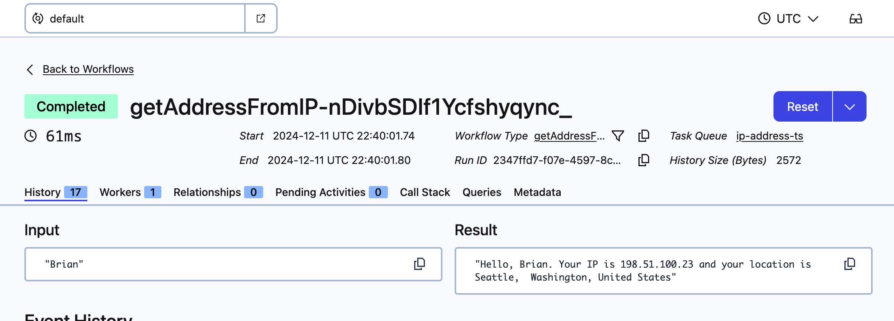
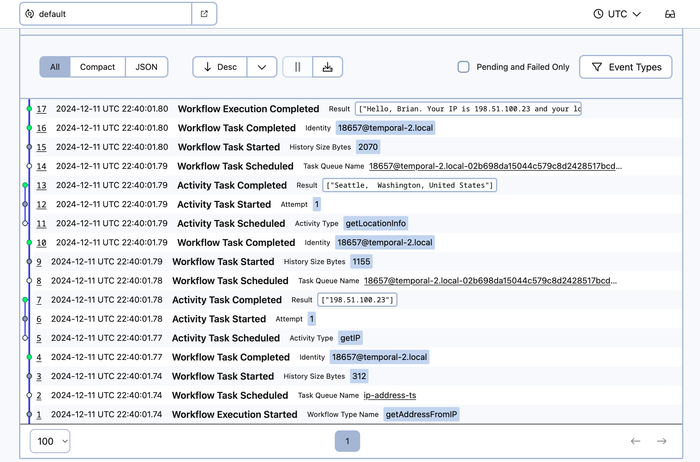
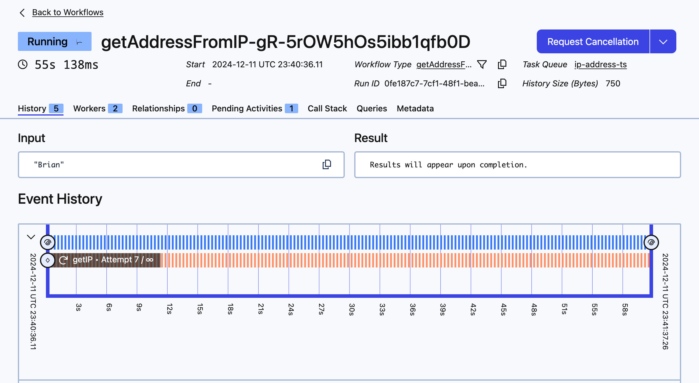
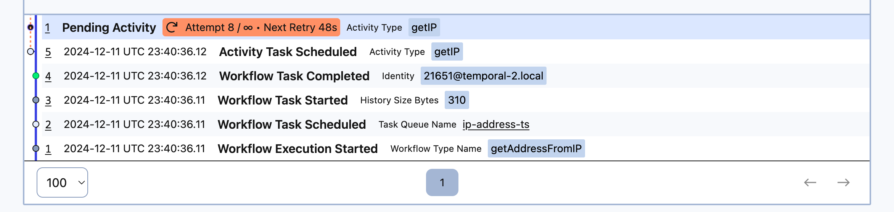
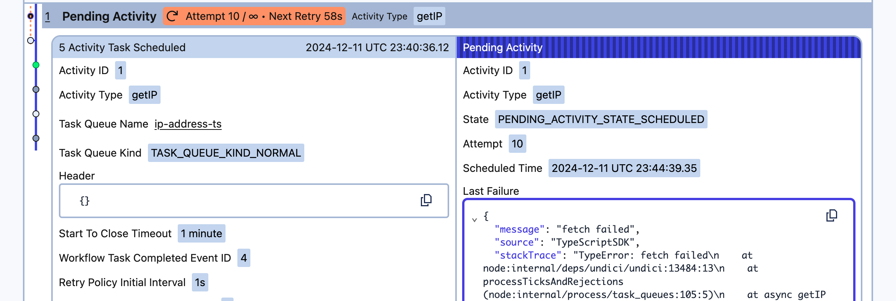
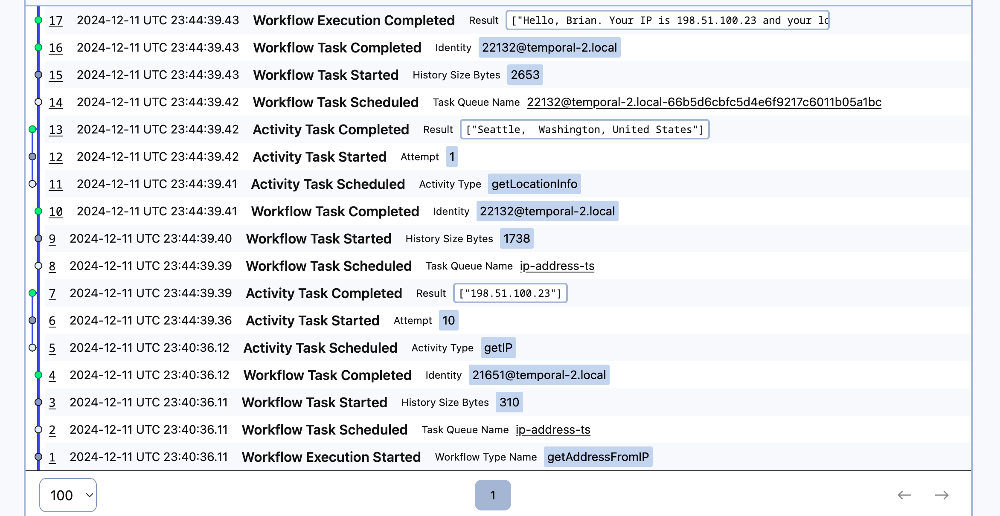

:::note Tutorial information

- **Level:** ⭐ Temporal beginner
- **Time:** ⏱️ ~15 minutes
- **Goals:** 🙌
  - Set up, build, and test a Temporal Application project from scratch using the [TypeScript SDK](https://github.com/temporalio/sdk-typescript).
  - Identify the four parts of a Temporal Workflow application.
  - Describe how the Temporal Server gets information to the Worker.
  - Observe how Temporal recovers from failed Activities.

:::

### Introduction

Creating reliable applications is a difficult chore. [Temporal](https://temporal.io/) lets you create fault-tolerant, resilient applications using programming languages you already know, so you can build complex applications that execute reliably and recover from failures.

In this tutorial, you will build your first Temporal Application from scratch using the [Temporal TypeScript SDK](https://github.com/temporalio/sdk-typescript). You'll develop a small application that asks for your name and then uses APIs to get your public IP address and your location based on that address. External requests can fail due to rate limiting, network interruptions, or other errors. Using Temporal for this application will let you automatically recover from these and other kinds of failures without having to write explicit error-handling code.

The app will consist of the following pieces:

1. Two [Activities](https://docs.temporal.io/activities): Activities are functions called by Workflows, and they contain any logic that might fail or behave differently at different times. The first Activity will get your IP address, and the second Activity will use that IP address to get your location.

1. A [Workflow](https://docs.temporal.io/workflows): Workflows are functions that define the overall flow of the application.  Your Workflow will execute both Activities you define. It will call the first Activity to fetch the IP address, and then use the result of that Activity to call the next Activity to find your location.
2. A [Worker](https://docs.temporal.io/workers): Workers host the Activity and Workflow code and execute the code piece by piece.
3. A client program: You'll need to start your Workflow. In this tutorial you'll create a small program using the [Temporal Client](https://docs.temporal.io/encyclopedia/temporal-sdks#temporal-client) to start the Workflow.

You'll also write tests to ensure your Workflow executes successfully.

When you're done, you'll have a basic application and a clear understanding of how to build out the components you'll need in future Temporal applications in TypeScript.

## Prerequisites

Before starting this tutorial:

- [Set up a local development environment for developing Temporal applications using Node.js and TypeScript](https://learn.temporal.io/getting_started/typescript/dev_environment/)
  - Ensure that the Temporal Service is running in a terminal on your local machine and that you can access the Temporal Web UI. In this tutorial you'll use port `8233` for the Web UI, which is the default port.

- Follow the tutorial [Run your first Temporal application with the TypeScript SDK](https://learn.temporal.io/getting_started/typescript/first_program_in_typescript/) to gain a better understanding of what Temporal is and how its components fit together.

## Create a New Temporal TypeScript Project

While you could create a new directory, initialize a TypeScript project, and configure things manually, the TypeScript SDK offers a project creation tool you can use to create a project folder and set up dependencies.

Run the following command in your shell:

```command
npx @temporalio/create --sample empty temporal-ip-geolocation
```

The command will ask you to confirm if you want to install `@temporalio/create`:

```output
Need to install the following packages:
@temporalio/create@1.11.5
Ok to proceed? (y) y
```

Enter `y` to continue. The process will then create your app:

```output
Creating a new Temporal project in /Users/temporal/temporal-ip-geolocation/

Downloading files for sample empty. This might take a moment.

Installing packages. This might take a couple of minutes.
```

It'll ask you if you'd like to create a Git repository:

```
✔ Would you like me to initialize a git repository for the project? … yes
Initialized a git repository.
```

Then it'll give you further instructions, including how to set up and start a local Temporal service and install a compatible version of NodeJS:

```output
Success! Created project temporal-ip-geolocation at:

/Users/temporal/temporal-ip-geolocation/

To begin development, install the Temporal CLI:

Mac: brew install temporal
Other: Download and extract the latest release from https://github.com/temporalio/cli/releases/latest

Start Temporal Server:

temporal server start-dev

Use Node version 18+ (v22.x is recommended):

Mac: brew install node@22
Other: https://nodejs.org/en/download/
```

Finally, you'll see how to run the Worker and Workflow, but don't do that yet.

Once the command completes, switch to the `temporal-ip-gelocation` folder:

```command
cd temporal-ip-geolocation
```

The generator created the following files and folders:

```output
├── README.md
├── node_modules
├── package-lock.json
├── package.json
├── src
│   ├── activities.ts
│   ├── client.ts
│   ├── mocha
│   ├── worker.ts
│   └── workflows.ts
└── tsconfig.json
```

Here's what each file does:

- The `package.json` file holds the project dependencies and a handful of scripts you'll use to run Workflows, Workflows, tests, and other tasks like linting and formatting your code.
- The `tsconfig.json` file holds the TypeScript configuration designed for working with Temporal's SDK.
- The `src/activities.ts` file is where you can define Activities.
- The `src/client.ts` file has the code for a small CLI program to execute a Workflow. You won't use this directly in this guide.
- The `src/mocha` folder is where you'll place your tests. We recommend using [Mocha](https://mochajs.org/) to test your Temporal Workflows and Activities.
- The `src/workflows.ts` file is where you can define Workflows.
- The `src/worker.ts` file has the code to configure and run your Worker process, which executes your Workflows and Activities.

You should review a few parts of the `package.json` before moving on.

First, review the `scripts` section. These are the `npm` commands you'll use to build, lint, test, and start your application code:

```json
  "scripts": {
    "build": "tsc --build",
    "build.watch": "tsc --build --watch",
    "lint": "eslint .",
    "start": "ts-node src/worker.ts",
    "start.watch": "nodemon src/worker.ts",
    "workflow": "ts-node src/client.ts",
    "format": "prettier --config .prettierrc 'src/**/*.ts' --write",
    "test": "mocha --exit --require ts-node/register --require source-map-support/register src/mocha/*.test.ts"
  },
```

Next, examine the packages listed as dependencies. These are the packages that compose the Temporal TypeScript SDK, and each package maps to the four parts of a Temporal application: an Activity, Client, Worker, and Workflow. There is also [Nanoid](https://npmjs.com/package/nanoid), an `npm` package which you'll use to generate a unique identifier for your Workflow.

```json
"dependencies": {
  "@temporalio/activity": "^1.11.5",
  "@temporalio/client": "^1.11.5",
  "@temporalio/worker": "^1.11.5",
  "@temporalio/workflow": "^1.11.5",
  "nanoid": "3.x"
},
```

You'll use Node.js's build-in `fetch` library in your application. To use it with TypeScript, open the file `tsconfig.json` and locate the `"lib"` key under `"compilerOptions"`and add the `DOM` library to the array:

```json
"compilerOptions": {
 ...
  "lib": ["es2020","DOM"],
 ...
}
```

This ensures that `fetch` will be available as a global module.

With the project created, you'll create the application's core logic.

## Write functions to call external services

Your application will make two HTTP requests. The first request will return your current public IP, while the second request will use that IP to provide city, state, and country information.

You'll use Temporal Activities to make these requests. You use Activities in your Temporal Applications to execute non-deterministic code or perform operations that may fail.

If an Activity fails, Temporal can automatically retry it until it succeeds or reaches a specified retry limit. This ensures that transient issues, like network glitches or temporary service outages, don't result in data loss or incomplete processes.

Open `src/activities.ts` and remove all the existing code in the file. You'll replace it with your own.

Add the following code to define a Temporal Activity that retrieves your IP address from `icanhazip.com`:

<!--SNIPSTART ts-ipgeo-activity-ip-->
[src/activities.ts](https://github.com/temporalio/temporal-tutorial-ipgeo-ts/blob/main/src/activities.ts)
```ts
// Get the IP address
export async function getIP(): Promise<string> {
  const url = 'https://icanhazip.com';
  const response = await fetch(url);
  const data = await response.text();
  return data.trim();
}
```
<!--SNIPEND-->

This function looks like a regular TypeScript function. With the Temporal TypeScript SDK, you define Activities using an exportable TypeScript module.

The response from `icanhazip.com` is plain-text, and it includes a newline, so you trim off the newline character before returning the result.

Notice that there's no error-handling code in this function. When you build your Workflow, you'll use Temporal's Activity Retry policies to retry this code automatically if there's an error.

Now add the second Activity that accepts an IP address and retrieves location data. In `src/activities.ts`, add the following code to define it:

<!--SNIPSTART ts-ipgeo-activity-location-->
[src/activities.ts](https://github.com/temporalio/temporal-tutorial-ipgeo-ts/blob/main/src/activities.ts)
```ts
// Use the IP address to get the location.
export async function getLocationInfo(ip: string): Promise<string> {
  const url = `http://ip-api.com/json/${ip}`;
  const response = await fetch(url);
  const data = await response.json();
  return `${data.city}, ${data.regionName}, ${data.country}`;
}
```
<!--SNIPEND-->

This Activity follows the same pattern as the `getIP` Activity. It's an exported async function that uses `fetch` to call a remote service. This time, the service returns JSON data rather than text.

While Activities can accept input arguments, it's a best practice to send a single argument rather than multiple arguments. In this case you only have a single String. If you have more than one argument, you should bundle them up in a serializable object. Review the [Activity parameters](https://docs.temporal.io/dev-guide/typescript/foundations/#activity-parameters) section of the Temporal documentation for more details, as there are some limitations you'll want to be aware of in more complex applications.

You've created your two Activities. Now you'll coordinate them using a Temporal Workflow.

## Control application logic with a Workflow

Workflows are where you configure and organize the execution of Activities. You define a Workflow by writing a *Workflow Definition* using one of the Temporal SDKs. Review the [Develop Workflows](https://docs.temporal.io/develop/typescript/core-application#develop-workflows) section of the Temporal documentation for more about Workflows in TypeScript.

Open the file `src/workflows.ts` and remove the code in the file since you'll add your own. Then add the following code to import the Activities and configure how the Workflow should handle failures with a [Retry Policy](https://docs.temporal.io/encyclopedia/retry-policies).

<!--SNIPSTART ts-ipgeo-workflow-imports-->
[src/workflows.ts](https://github.com/temporalio/temporal-tutorial-ipgeo-ts/blob/main/src/workflows.ts)
```ts
import * as workflow from '@temporalio/workflow';

// Only import the activity types
import type * as activities from './activities';

// Load Activities and assign the Retry Policy
const { getIP, getLocationInfo} = workflow.proxyActivities<typeof activities>({
  retry: {
    initialInterval: '1 second', // amount of time that must elapse before the first retry occurs.
    maximumInterval: '1 minute', // maximum interval between retries.
    backoffCoefficient: 2, // how much the retry interval increases.
    // maximumAttempts: 5, // maximum number of execution attempts. Unspecified means unlimited retries.
  },
  startToCloseTimeout: '1 minute', // maximum time allowed for a single Activity Task Execution.
});
```
<!--SNIPEND-->

The Temporal TypeScript SDK requires that Workflows and Activities run in separate environments. Temporal Workflows [must be deterministic](https://docs.temporal.io/workflows#deterministic-constraints) so that Temporal can replay your Workflow in the event of a crash,  and the TypeScript SDK runs Workflows in a sandbox that checks code for determinism to enforce this.

Since you run your non-deterministic operations in Activities, you configure your Workflow to call Activities through a proxy. That's why you import their types rather than the functions themselves.

The `proxyActivities` method is also where you set options for how Temporal works with Activities. In this example, you have specified that the Start-to-Close Timeout for your Activity will be one minute, meaning that your Activity has one minute to complete before it times out. Of all the Temporal timeout options, `startToCloseTimeOut` is the one you should always set.

You also set the Retry Policy for Activities this way. In this example, you're using the default Retry Policy values, so you don't need to specify the values, but by leaving them in you have a more clear picture of what happens. Note that the `maximumAttempts` is commented out, which means there's no limit to the number of times Temporal will retry your Activities if they fail.

With the imports and options in place, you can define the Workflow itself. In the TypeScript SDK, you implement a Workflow the same way you define an Activity; using an exportable async TypeScript function. Add the following code to call both Activities, using the value of the first as the input to the second:

<!--SNIPSTART ts-ipgeo-workflow-code-->
[src/workflows.ts](https://github.com/temporalio/temporal-tutorial-ipgeo-ts/blob/main/src/workflows.ts)
```ts
// The Temporal Workflow.
// Just a TypeScript function.
export async function getAddressFromIP(name: string): Promise<string> {

  try {
    const ip = await getIP();
    try {
      const location = await getLocationInfo(ip);
      return `Hello, ${name}. Your IP is ${ip} and your location is ${location}`;
    } catch (e) {
      throw new workflow.ApplicationFailure("Failed to get location");
    }
  } catch (e) {
    throw new workflow.ApplicationFailure("Failed to get IP");
  }

}
```
<!--SNIPEND-->

This code uses a `try/catch` block, but because you've configured unlimited retries, there won't be any exceptions caught. However, if you change the Retry Policy's maximum retries, or you specify non-retryable exceptions, this code will be in place to handle those errors.

Next you'll create a Worker that executes the Workflow and Activities.

## Configure and run a Worker

When you start a Temporal Workflow, the Workflow and its Activities get scheduled on the Temporal Service's [Task Queue](https://docs.temporal.io/concepts/what-is-a-task-queue). A [Worker](https://docs.temporal.io/concepts/what-is-a-worker) hosts Workflow and Activity functions and polls the Task Queue for tasks related to those Workflows and Activities. After the Worker runs the code, it communicates the results back to the Temporal Service where they're stored in the Event History. This records the Workflow's entire execution, enabling features like fault tolerance by allowing the Workflow to replay in case of Worker crashes or restarts.

You use the Temporal SDK to define a Worker Program.

In your Worker Program, you need to specify the name of the Task Queue, which must match the Task Queue name used whenever you interact with a Workflow from a client application. This ensures that the Worker processes tasks for the correct Workflow. The Task Queue name is a case-insensitive string. To ensure consistency and avoid errors, define the Task Queue name as a constant that can be reused throughout your code.

Open the file `temporal/src/shared.ts` and edit the following line to the file to define the constant for the Task Queue:

<!--SNIPSTART ts-ipgeo-shared-->
[src/shared.ts](https://github.com/temporalio/temporal-tutorial-ipgeo-ts/blob/main/src/shared.ts)
```ts
export const TASK_QUEUE_NAME="ip-address-ts";
```
<!--SNIPEND-->

When you created the project, the project generator created a Worker program for you.

Open the file `src/worker.ts` in your editor and you'll see the following code:

<!--SNIPSTART ts-ipgeo-worker-->
[src/worker.ts](https://github.com/temporalio/temporal-tutorial-ipgeo-ts/blob/main/src/worker.ts)
```ts
import { NativeConnection, Worker } from '@temporalio/worker';
import * as activities from './activities';
import { TASK_QUEUE_NAME } from './shared';

async function run() {
  // Step 1: Establish a connection with Temporal server.
  //
  // Worker code uses `@temporalio/worker.NativeConnection`.
  // (But in your application code it's `@temporalio/client.Connection`.)
  const connection = await NativeConnection.connect({
    address: 'localhost:7233',
    // TLS and gRPC metadata configuration goes here.
  });
  try {
    // Step 2: Register Workflows and Activities with the Worker.
    const worker = await Worker.create({
      connection,
      namespace: 'default',
      taskQueue: TASK_QUEUE_NAME,
      // Workflows are registered using a path as they run in a separate JS context.
      workflowsPath: require.resolve('./workflows'),
      activities,
    });

    // Step 3: Start accepting tasks on the Task Queue specified in TASK_QUEUE_NAME
    //
    // The worker runs until it encounters an unexpected error or the process receives a shutdown signal registered on
    // the SDK Runtime object.
    //
    // By default, worker logs are written via the Runtime logger to STDERR at INFO level.
    //
    // See https://typescript.temporal.io/api/classes/worker.Runtime#install to customize these defaults.
    await worker.run();
  } finally {
    // Close the connection once the worker has stopped
    await connection.close();
  }
}

run().catch((err) => {
  console.error(err);
  process.exit(1);
});
```
<!--SNIPEND-->

The code imports the `TASK_QUEUE_NAME` constant along with all the Activities in the `src/activities.ts` file. It then defines an async function named `run` that creates and runs a Worker that talks to the Temporal Service. The Worker takes a configuration object that specifies a connection to the Temporal Service,  `workflowsPath` (the location of your Workflow file), your Activity functions, and the name of the Task Queue.

In this case your Worker will run your Workflow and your two Activities, but there are cases where you could configure one Worker to run Activities, and another Worker to run the Workflows.

Now you will use an `npm` script to start your Worker with [Nodemon](https://nodemon.io/). Nodemon automatically reloads whenever it detects changes in your file, hence the command name `start.watch`. Be sure you have started the local Temporal Service and execute the following command to start your Worker:

```command
npm run start.watch
```

The Worker runs and you see the following output:

```output
> empty@0.1.0 start.watch
> nodemon src/worker.ts

[nodemon] 2.0.22
[nodemon] to restart at any time, enter `rs`
[nodemon] watching path(s): src/**/*
[nodemon] watching extensions: ts
[nodemon] starting `ts-node src/worker.ts`
2024-12-09T18:27:38.879Z [INFO] Creating worker {
  sdkComponent: 'worker',
  taskQueue: 'ip-address-ts',
  options: {
   ...
  }
}
...

2024-12-09T18:27:39.412Z [INFO] Workflow bundle created { sdkComponent: 'worker', taskQueue: 'ip-address-ts', size: '0.82MB' }
2024-12-09T18:27:39.493Z [INFO] Worker state changed {
  sdkComponent: 'worker',
  taskQueue: 'ip-address-ts',
  state: 'RUNNING'
}
```

In the output, you see the Worker options and their values, the Webpack bundling output, and the state of the Worker.

Your Worker is running and is polling the Temporal Service for Workflows to run, but before you start your Workflow, you'll write tests to prove it works as expected.

## Write tests to ensure things work

The Temporal TypeScript SDK includes functions that help you test your Workflow executions. Let's add a basic unit test to the application to make sure the Workflow works as expected.

You'll use the [mocha](https://mochajs.org/) package to build your test cases and mock the Activity so you can test the Workflow in isolation. You'll also use the `@temporalio/testing` package, which will download a test server that provides a `TestWorkflowEnvironment`.

Create the file `src/mocha/workflows-mocks.test.ts` and add the following code to set up the testing environment:

<!--SNIPSTART ts-ipgeo-workflow-test-setup-->
[src/mocha/workflows-mocks.test.ts](https://github.com/temporalio/temporal-tutorial-ipgeo-ts/blob/main/src/mocha/workflows-mocks.test.ts)
```ts
import { TestWorkflowEnvironment } from '@temporalio/testing';
import { after, before, it } from 'mocha';
import { Worker } from '@temporalio/worker';
import { getAddressFromIP } from '../workflows';
import assert from 'assert';
```
<!--SNIPEND-->

`TestWorkflowEnvironment` is a runtime environment used to test a Workflow. You use it to connect the Client and Worker to the test server and interact with the test server. You'll use this to register your Workflow Type and access information about the Workflow Execution, such as whether it completed successfully and the result or error it returned. Since the `TestWorkflowEnvironment` will be shared across tests, you will set it up before all of your tests, and tear it down after your tests finish.

Add the following code to configure the testing environment and test the Workflow execution:

<!--SNIPSTART ts-ipgeo-workflow-test-workflow-->
[src/mocha/workflows-mocks.test.ts](https://github.com/temporalio/temporal-tutorial-ipgeo-ts/blob/main/src/mocha/workflows-mocks.test.ts)
```ts
describe('getAddressFromIP', () => {
  let testEnv: TestWorkflowEnvironment;

  before(async () => {
    testEnv = await TestWorkflowEnvironment.createLocal();
  });

  after(async () => {
    await testEnv?.teardown();
  });

  it('successfully completes the Workflow with mocked Activities', async () => {
    const { client, nativeConnection } = testEnv;
    const taskQueue = 'test';

    const worker = await Worker.create({
      connection: nativeConnection,
      taskQueue,
      workflowsPath: require.resolve('../workflows'),
      activities: {
        getIP: async (): Promise<string> => '1.1.1.1',
        getLocationInfo: async (_ip: string): Promise<string> => "Planet Earth"
      },
    });

    const result = await worker.runUntil(
      client.workflow.execute(getAddressFromIP, {
        args: ['Temporal'],
        workflowId: 'test',
        taskQueue,
      })
    );
    assert.equal(result, "Hello, Temporal. Your IP is 1.1.1.1 and your location is Planet Earth");
  });
});
```
<!--SNIPEND-->

This test sets up a test environment to run Workflows that uses a lightweight Temporal Service specifically for testing. In the test itself, you create a Worker that connects to the test environment. This should look familiar, as it's similar to the code you wrote to define your Worker Program.

Instead of using your actual Activities, you replace the Activities `getIP` and `getAddress` with async functions that return hard-coded values. This way you're testing the Workflow's logic independently of the Activities. If you wanted to test the Activities directly as part of an integration test, you'd specify them directly as you did when you wrote the Worker program.

Running the tests requires using the `mocha` command along with requiring the following libraries and pointing the test runner to the appropriate folder. Here's what the command would look like to run the tests:

```command
npx  mocha \
  --require ts-node/register \
  --require source-map-support/register \
  src/mocha/*.test.ts
```

However, since this is a lot to type into the command line every time, you'll find a `test` script defined in `package.json` that runs this command for you.

Ensure you've saved all your files and execute your tests with the following command:

```command
npm test
```

The test environment starts, spins up a Worker, and executes the Workflow in the test environment. At the end, you'll see that your test passes:

```output
    ✓ successfully completes the Workflow with mocked Activities (543ms)

  1 passing (723ms)
```

:::tip
If you get an error that your test has timed out, run it again. The first time you run the tests on your local machine, the test server might not start quickly enough.
:::

With a Workflow test in place, you can write unit tests for the Activities.

Both of your Activities make external calls to services that will change their results based on who runs them. It will be challenging to test these Activities reliably. For example, the IP address may vary based on your machine's location.

To ensure you can test the Activities in isolation, you’ll stub out the `fetch` calls using the [`sinon`](https://sinonjs.org/) library.

Sinon.js is a JavaScript testing library that provides powerful tools like spies, stubs, and mocks, allowing you to replace dependencies with controlled, testable behavior.

Add `sinon` as a development dependency, along with its type definitions:

```command
npm i sinon @types/sinon --save-dev
```

Create the file `src/mocha/activities.test.ts` and add the following code to import the testing libraries you'll use:

<!--SNIPSTART ts-ipgeo-activity-test-setup-->
[src/mocha/activities.test.ts](https://github.com/temporalio/temporal-tutorial-ipgeo-ts/blob/main/src/mocha/activities.test.ts)
```ts
import { MockActivityEnvironment } from '@temporalio/testing';
import { describe, it } from 'mocha';
import * as activities from '../activities';
import assert from 'assert';
import sinon from 'sinon';
```
<!--SNIPEND-->


The `MockActivityEnvironment` from the `@temporalio/testing` package lets you test Activities as if they were part of a Temporal Application.

Next, write the test for the `getIP` Activity, using `sinon` to stub out actual HTTP calls so your tests are consistent. Notice that the stubbed response adds the newline character so it replicates the actual response:

<!--SNIPSTART ts-ipgeo-activity-test-ip-->
[src/mocha/activities.test.ts](https://github.com/temporalio/temporal-tutorial-ipgeo-ts/blob/main/src/mocha/activities.test.ts)
```ts
describe('ip activity', async () => {
  it('successfully gets the ip', async () => {
    const fakeIP = '123.45.67.89';
    const stub = sinon.stub(global, 'fetch').resolves({
      text: () => Promise.resolve(`${fakeIP}\n`),
    } as Response);

    try {
      const env = new MockActivityEnvironment();
      const ip = await env.run(activities.getIP);
      assert.strictEqual(ip, fakeIP);
    } finally {
      stub.restore();
    }
  });
});
```
<!--SNIPEND-->

To test the Activity itself, you use the `MockActivityEnvironment` to execute the Activity rather than directly calling the `getIP` function.

The `try/finally` block ensures that if the test fails, the tests restore the `fetch` stub to its original functionality.
This way other tests you write can also stub `fetch` with a different response.

To test the `getLocation` Activity, you use a similar approach. Add the following code to the `src/mocha/activities.ts` file:

<!--SNIPSTART ts-ipgeo-activity-test-location-->
[src/mocha/activities.test.ts](https://github.com/temporalio/temporal-tutorial-ipgeo-ts/blob/main/src/mocha/activities.test.ts)
```ts
describe('getLocation activity', async () => {
  it('successfully gets the location', async () => {
    const ip = '123.45.67.89';
    const fakeLocation = {
      city: 'Sample City',
      regionName: 'Sample Region',
      country: 'Sample Country'
    };

    const stub = sinon.stub(global, 'fetch').resolves({
      json: () => Promise.resolve(fakeLocation),
    } as Response);

    try {
      const env = new MockActivityEnvironment();
      const location = await env.run(activities.getLocationInfo, ip);
      assert.strictEqual(location, `${fakeLocation.city}, ${fakeLocation.regionName}, ${fakeLocation.country}`);
    } finally {
      stub.restore();
    }
  });
});
```
<!--SNIPEND-->

This test looks similar to the previous test; you stub out the `fetch` method and ensure it returns the expected data, and then you execute the Actiity in the `MockActivityEnvironment`. Then you restore the stubbed `fetch` method.

Run the tests again to see them pass:

```command
npm test
```

Now that you have your tests passing, it's time to start a Workflow Execution.

## Run the Workflow from a client

You can start a Workflow Execution by using the Temporal CLI or by writing code using the Temporal SDK.

Starting a Workflow Execution using the Temporal SDK involves connecting to the Temporal Server, configuring the Task Queue the Workflow should use, and starting the Workflow with the input parameters it expects. In a real application, you may invoke this code when someone submits a form, presses a button, or visits a certain URL. In this tutorial, you will create a `client.ts` file that triggers your Temporal Workflow.

The project generator created a `client.ts` file in the `src` directory, but it will need a couple changes to make it work for this application:

- You'll need to change the name of the Workflow.
- You'll need to add code that lets you specify the person's name as the command-line argument so you can pass it to the Workflow, instead of using the hard-coded value of `Temporal`.

Open the `src/client.ts` file in your editor. Remove its contents and replace it with the following code:

<!--SNIPSTART ts-ipgeo-cli-client-->
[src/client.ts](https://github.com/temporalio/temporal-tutorial-ipgeo-ts/blob/main/src/client.ts)
```ts
import { Connection, Client } from '@temporalio/client';
import { getAddressFromIP } from './workflows';
import { nanoid } from 'nanoid';
import { TASK_QUEUE_NAME } from './shared';
import process from 'process';

async function run() {

  if (process.argv.length <= 2) {
    console.error('Must specify a name as the command-line argument');
    process.exit(1);
  }

  const name = process.argv[2];
  const connection = await Connection.connect({ address: 'localhost:7233' });
  const client = new Client({ connection });

  const handle = await client.workflow.start(getAddressFromIP, {
    taskQueue: TASK_QUEUE_NAME,
    args: [name],
    workflowId: 'getAddressFromIP-' + nanoid(),
  });
  console.log(await handle.result());
}

run().catch((err) => {
  console.error(err);
  process.exit(1);
});
```
<!--SNIPEND-->

You import the `process` module so you can access command-line arguments you'll pass.

In the `run` function you check to see if there are at least two arguments passed. You need to check for two arguments because `process.argv` includes the Node.js executable path and the script path as the first two elements, so the actual command-line arguments start at index 2.

The `run` function then sets up a connection to your Temporal Server, invokes your Workflow, passes in an argument for the `name`, and assigns the Workflow a unique identifier with Nanoid. The client dispatches the Workflow on the same Task Queue that the Worker is polling on. That's why you used a constant to ensure the Task Queue name is consistent. If there's a mismatch, your Workflow will execute on a different Task Queue and there won't be any Workers polling for tasks.

:::note Specify a Workflow Id

A Workflow ID is unique in a Namespace and identifies a Workflow Execution. Using an identifier that reflects some business process or entity is a good practice. For example, you might use a customer identifier as part of the Workflow Id if you run one Workflow per customer. This would make it easier to find all Workflow Executions related to that customer later.

In this tutorial you're generating a UUID and appending it to a string that identifies the Workflow.
:::

Now you can run your Workflow. First, ensure that your local Temporal Service is running, and that your Worker program is running also.

Then open a new terminal and switch to the project directory:

```command
cd temporal-ip-geolocation
```

:::tip

To run your Temporal Application, you need to start the Workflow and the Worker. You can start these in any order, but you'll need to run each command from a separate terminal window, as the Worker needs to be constantly running to look for tasks to execute.

:::

Now run the following command to run the Workflow using the client program you wrote, using your name as the argument:

```command
npm run workflow Brian
```

You'll see the following output:

```output
> temporal-hello-world@0.1.0 workflow
> ts-node src/client.ts Brian

Hello, Brian. Your IP is 198.51.100.23 and your location is Seattle,  Washington, United States
```

Your Temporal Application works. Now review it in the Temporal Web UI.

## Exploring your application in the Web UI

The Temporal Web UI gives you insights into your Workflow's execution. Open the Temporal Web UI by visiting `http://localhost:8233` and click on your completed Workflow to view the execution history. You'll see results similar to the following image:



You'll see the dates the Workflow Execution ran, how long it took to run, the input to the Workflow, and the result.

After that, you see the Event History, detailing the entire flow, including the inputs and outputs of the Activity Executions:



The most recent event is at the top, so read the history from the bottom up to see each step in the process. Using this history, you can see exactly how your Workflow executed and pinpoint any places things might have gone wrong.

Temporal stores the results of each Activity in this history, as you can see in the image. If there was a system crash between the `getIP` and `getLocationInfo` Activity Executions, a new Worker would re-run the Workflow, but would use the previous Event History to reconstruct the Workflow's state. Instead of re-running the `getIP` function, it would use the previous run's value and continue on. This prevents duplicate executions. By relying on the stored Event History, Temporal ensures that the Workflow can recover seamlessly, maintaining reliability and consistency even after a crash.

In this application, this recovery isn't crucial. But imagine a situation where each Activity execution was a bank transaction. If a crash occurred between transactions, the Worker can pick up where the previous one failed. Nobody gets charged multiple times because something failed.

Next, you'll explore how Temporal handles failed Activities.

## Observe automatic retries

When you developed your Activities, you didn't include any error-handling code. So if there's a problem making the request, the Workflow will handle the error using the Retry Policy.

Test this out. Disconnect your local machine from the Internet by turning off your Wi-Fi connection or unplugging your network cable.

Then, with the local Temporal Service running and your Worker running, switch to the Terminal window where you ran your Workflow and run it again:

```command
npm run workflow
```

This time you don't get a response.

Visit `http://localhost:8233` to open the Temporal Web UI and locate the Workflow Execution that's currently running. When you select it, you'll see something like the following image, indicating that there's a problem:


As you can see, the `getIP` Activity has failed and Temporal is retrying it. Scroll down to the Event History and you'll see the failure represented there:


Select the **Pending Activity** item in the table to see why it failed and you'll see the stack trace:



In the **Last Failure** field, you can see there was a TypeScript error indicating that `fetch` failed.

Connect to the internet again and wait. After a few moments, the Workflow recovers and completes:



If you return to your terminal where you launched the Workflow, you'll find your results there as well.

You can recover from failures by letting Temporal handle them for you instead of writing complex error-handling logic. You can also decide that you only want to retry a fixed number of times, or that you only want to recover on certain kinds of errors.

## Conclusion

In this tutorial you built your first Temporal Application, using TypeScript functions to build a resilient application that recovered from failure. You wrote tests to verify that it works and reviewed the Event History for a working execution. You also tested your Workflow without an internet connection to understand how Temporal recovers from failures like network outages.

Take this application one step further and add a new Activity that gets the current weather for the location you found.

### Review

Answer the following questions to see whether you remember some important concepts from this tutorial:

<details>
<summary>

**What are the four parts of a Temporal Workflow application?**

</summary>

1. A Workflow function.
2. An Activity function.
3. A Worker to host the Workflow and Activity code.
4. Some way to start the Workflow.

</details>

<details>
<summary>

**How does the Temporal Server get information to the Worker?**

</summary>

The Temporal Server adds Tasks to a Task Queue, and the Worker polls the Task Queue.

</details>
