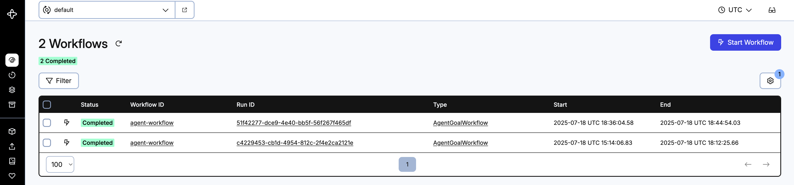
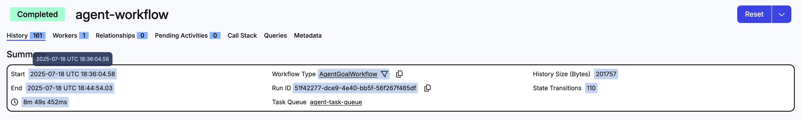
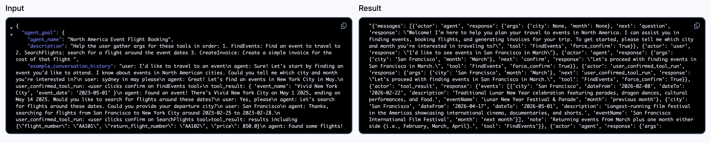
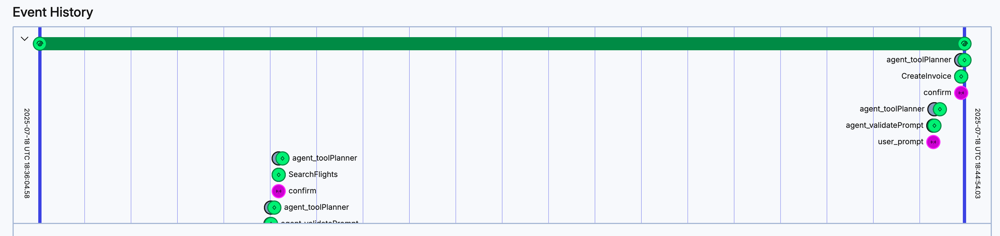
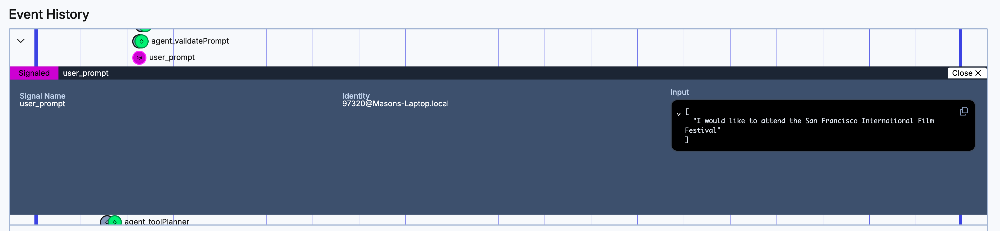
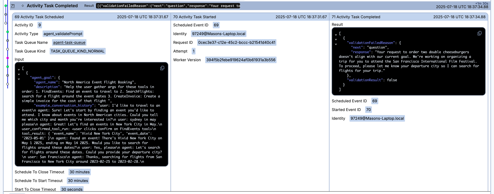

## Introduction

An AI agent uses large language models (LLMs) to plan and execute steps towards a goal.
While attempting to reach its goal, the agent can perform actions such as searching for information, interacting with external services, and even calling other agents. 
However, building reliable AI agents presents various challenges. 
Network failures, long-running workflows, observability challenges, and more make building AI agents a textbook distributed systems problem.

Temporal orchestrates long-running workflows, automatically handles failure cases from network outages to server crashes, provides insights into your running applications, and more.
These features provide the resiliency and durability necessary to build reliable agents that users can rely on.

In this tutorial you'll build an AI agent using Temporal that searches for events in a given city, helps you book a plane ticket, and creates an invoice for the trip. 
The user will interact with this application through a chatbot interface, communicating with the agent using natural language.
Throughout this tutorial you will implement the following components:

* Various **tools** the agent will use to search for events, find flights, and generate invoices.
* An **agent goal** that will specify what overall task the agent is trying to achieve and what tools it is allowed to use.
* **Temporal Workflows** that will orchestrate multi-turn conversations and ensure durability across failures
* **Temporal Activities** that execute tools and language model calls with automatic retry logic
* A **FastAPI backend** that connects the web interface to your Temporal Workflows
* A **web-based chat interface** that allows users to interact with the agent

By the end of this tutorial, you will have a modular, durable AI agent that you can extend to run any goal using any set of tools.
Your agent will be able to recover from failure, whether it's a hardware failure, a tool failure, or an LLM failure.
And you'll be able to use Temporal to build reliable AI applications that maintain state and provide consistent user experiences.

You can find the code for this tutorial on GitHub in the [tutorial-temporal-ai-agent](https://github.com/temporal-community/tutorial-temporal-ai-agent) repository.

## Prerequisites

Before starting this tutorial, ensure that you have the following on your local machine:

### Required

* [The Temporal CLI development service](https://learn.temporal.io/getting_started/python/dev_environment/#set-up-a-local-temporal-service-for-development-with-temporal-cli) installed and verified.
* [Python 3.9 or higher](https://www.python.org/downloads/) installed. 
Verify your installation by running `python3 --version` in your terminal.
* The [`uv` package and project manager installed](https://docs.astral.sh/uv/getting-started/installation/). `uv` is a modern, fast Python package manager that will handle virtual environments and dependencies. 
* The command line tool [curl](https://curl.se/) installed for downloading certain files.
* [Node.js 18 or higher installed](https://nodejs.org/en/download).
You can verify your installation with `node --version` and `npm --version`.
* An [OpenAI API key](https://platform.openai.com/api-keys) saved securely where you can access it.
You may need to create an [OpenAI](https://platform.openai.com/) account first.
You will use this key to configure the LLM integration.

:::note

OpenAI API Keys require purchasing credits to use.
You can succeed with this tutorial with minimal credits; in our experience, less than $1 will suffice.

:::

* Text editor or IDE of your choice to write code.

### Optional

You can opt to use real API services for your tools, or use provided mock functions. 

* A free [RapidAPI Sky Scrapper API Key](https://rapidapi.com/apiheya/api/sky-scrapper) saved securely where you can access it. You will use this to search for flights.
* A free [Stripe Account](https://stripe.com/lp/start-now) with a configured [sandbox](https://docs.stripe.com/sandboxes). You will use this to generate fake invoices for the flights that are being booked.

### Concepts

Additionally, this tutorial assumes you have basic familiarity with:

#### Programming Concepts

* Temporal fundamentals such as [Workflows](https://docs.temporal.io/develop/python/core-application#develop-workflows), [Activities](https://docs.temporal.io/develop/python/core-application#develop-activities), [Workers](https://docs.temporal.io/develop/python/core-application#run-a-dev-worker), [Signals](https://docs.temporal.io/develop/python/message-passing#signals), and [Queries](https://docs.temporal.io/develop/python/message-passing#queries)
* Python fundamentals such as functions, classes, [async/await syntax](https://docs.python.org/3/library/asyncio.html), and virtual environments
* Command line interface and running commands in a terminal or command prompt  
* REST API concepts including HTTP requests and JSON responses
* How to set and use environment variables in your operating system

#### AI Concepts

* [A Mental Model for Agentic AI Applications](https://temporal.io/blog/a-mental-model-for-agentic-ai-applications)
* [Building an agentic system that's actually production ready](https://temporal.io/blog/building-an-agentic-system-thats-actually-production-ready)
* [Why Agentic Flows Need Distributed Systems](https://temporal.io/blog/from-ai-hype-to-durable-reality-why-agentic-flows-need-distributed-systems)

## Setting up your development environment

Before you start coding, you need to set up your Python developer environment.
In this step, you will set up your project structure, install the necessary Python packages, and configure the Python environment needed to build your AI agent.

First, create your project using `uv`:

```command
uv init temporal-ai-agent --python ">=3.9"

```

Next, change directories into your newly created project:

```command
cd temporal-ai-agent
```

`uv` is a modern Python project and packaging tool that sets up a project structure for  you.
Running this command creates the following default Python package structure for you:

```
temporal-ai-agent/
├── .gitignore
├── .python-version
├── README.md
├── pyproject.toml
└── uv.lock
```

It automatically runs a `git init` command for you, provides you with the default `.gitignore` for Python, creates a `.python-version` file that has the project's default Python version, a README.md, a Hello World `main.py` program, and a `pyproject.toml` file for managing the projects packages and environment.

You won't need the `main.py` file, so delete it:

```command
rm main.py
```

Next, create your virtual environment by running the following command:

```bash
uv venv
```

This creates a virtual environment named `.venv` in the current working directory.

Now that you have a virtual environment created, add the dependencies needed to build your AI agent system:

```command
uv add python-dotenv fastapi jinja2 litellm stripe temporalio uvicorn requests
```

This installs all the necessary packages:
- `python-dotenv` - For loading environment variables from a `.env` file
- `fastapi` and `uvicorn` - Web framework and server for the API backend
- `jinja2` - Template engine
- `litellm` - Unified interface for different language model providers
- `stripe` - Payment processing library for the invoice generation demo
- `temporalio` - The Temporal Python SDK
- `requests` - HTTP library for API calls

Finally, add the following lines to the end of your `pyproject.toml` file:

```ini
[build-system]
requires = ["hatchling"]
build-backend = "hatchling.build"

# Tell hatchling what to include
[tool.hatch.build.targets.wheel]
packages = ["activities", "api", "models", "prompts", "shared", "tools", "workflows"]
```

This configures `uv` as to which packages to include and enable for execution.
You will create these packages later in the tutorial.

<details>

<summary>
The <code>pyproject.toml</code> is complete and will need no more revisions. You can review the complete file and copy the code here
</summary>

[pyproject.toml](https://github.com/temporal-community/tutorial-temporal-ai-agent/blob/main/pyproject.tom)

```ini
[project]
name = "temporal-ai-agent"
version = "0.1.0"
description = "Add your description here"
readme = "README.md"
requires-python = ">=3.9"
dependencies = [
    "python-dotenv>=1.0.0",
    "fastapi>=0.115.12",
    "jinja2>=3.1.6",
    "litellm>=1.72.2",
    "stripe>=12.2.0",
    "temporalio>=1.12.0",
    "uvicorn>=0.34.3",
    "requests>=2.32.4",
]

[build-system]
requires = ["hatchling"]
build-backend = "hatchling.build"

# Tell hatchling what to include
[tool.hatch.build.targets.wheel]
packages = ["activities", "api", "models", "prompts", "shared", "tools", "workflows"]

```
</details>

Next, create a `.env` file to store your configuration:

```command
touch .env
```

Next, copy the following configuration to your `.env` file.

```ini
# LLM Configuration
LLM_MODEL=openai/gpt-4o
LLM_KEY=YOUR_OPEN_AI_KEY

# Set if the user should click a Confirm button in the UI to allow the tool
# to execute
SHOW_CONFIRM=True

# Temporal Configuration
TEMPORAL_ADDRESS=localhost:7233
TEMPORAL_NAMESPACE=default
TEMPORAL_TASK_QUEUE=agent-task-queue

# (Optional) - Uncomment both lines and set RAPIDAPI_KEY if you plan on 
# using the real flights API
# RAPIDAPI_KEY=YOUR_RAPID_API_KEY
# RAPIDAPI_HOST_FLIGHTS=sky-scrapper.p.rapidapi.com

# (Optional) - Uncomment and set STRIPE_API_KEY if you plan on using the Stripe
# API to generate a fake invoice
# STRIPE_API_KEY=YOUR_STRIPE_API_KEY

# Uncomment if connecting to Temporal Cloud using mTLS (not needed for local dev server)
# TEMPORAL_TLS_CERT='path/to/cert.pem'
# TEMPORAL_TLS_KEY='path/to/key.pem'

# Uncomment if connecting to Temporal Cloud using API key (not needed for local dev server)
# TEMPORAL_API_KEY=abcdef1234567890
```

Once copied, replace `YOUR_OPEN_API_KEY` with your OpenAI API key.
Setting `SHOW_CONFIRM=True` requires the user to confirm each tool prior to it being executed.
This will allow you to see what the agent is doing step by step.
These are the only two mandatory variables to set.
This tutorial provides both an ability to create pseudo tools that perform simulations, or tools that use external APIs to achieve their goals.
If you plan on using the [RapidAPI SkyScraper API](#optional) to look up flight data or the [Stripe API](#optional) to generate an invoice, you can uncomment these lines and provide the API keys here.

Additionally, if you plan on connecting to Temporal Cloud, you will need to update the `TEMPORAL_ADDRESS` and `TEMPORAL_NAMESPACE` parameters to connect to your Temporal Cloud instance.
You will also need to uncomment and set the `TEMPORAL_TLS` or `TEMPORAL_API_KEY` variables, depending on which authentication method you are using.

:::note

As this project is using [LiteLLM](https://pypi.org/project/litellm/), it supports various different LLM providers.
This tutorial will use OpenAI's gpt-4o, but you are welcome to use whichever LLM you wish, so long as it is supported by LiteLLM.

:::

At this point, you have configured your developer environment to include a Python project managed by `uv` with all required dependencies to build a Temporal powered agentic AI, and all necessary environment variables. 

Now that you have set up your developer environment, you will build the tools that your agent will use to perform the various tasks it needs to accomplish its goal.

## Constructing the agent toolkit

In this step, you will acquire the tools that will be available to your agent.
Agents are aware of the tools they have available to them while attempting to achieve their goal.
The agent will evaluate which tools are available and execute a tool if the agent believes it will provide the result the agent needs to progress in its task. 

These tools can take various forms, but in this tutorial they're implemented as a series of independent Python scripts that provide data in a specific format that the agent can process. 
There are three tools: a `find_events` tool, a `search_flights` tool, and a `create_invoice` tool.
The LLM will decide when to use each tool as it interacts with the user who is trying to find an event and book a flight to attend it.
You could implement these tools yourself, or you could download a tool and provide it to an agent.
For this tutorial, you will download the tools directly from the [companion GitHub repository](https://github.com/temporal-community/tutorial-temporal-ai-agent).

### Setting up the `tools` package

To get started, first create the directory for your tools modules:

```command
mkdir tools
```

Then change directories into it:

```command
cd tools
```

However, for this to be an importable tools package, you will need to add a `__init__.py` file.
It can be blank for now, so create it with the following command:

```command
touch __init__.py
```

Now that you have set up the structure for your tools package, you'll acquire and test the tools needed to have the agent succeed with its goal.

### Acquiring the `find_events` tool

The `find_events` tool searches for events within a given city during a certain time of year.
The tool takes a month and city as inputs and provides events for not only the month that was provided, but the months before and after the given month as well. 
The LLM will use this tool to search for events when helping the user plan their trip.
This tool doesn't use an API, but rather simulates looking events up in a data store using mock data.

First, create a `data` directory within the `tools` directory to store the sample event data and change directories into it:

```command
mkdir data
cd data
```

Next, run the following command to download the sample data from the [companion GitHub repository](https://github.com/temporal-community/tutorial-temporal-ai-agent):

```command
curl -o find_events_data.json https://raw.githubusercontent.com/temporal-community/tutorial-temporal-ai-agent/main/tools/data/find_events_data.json
```

You can confirm you have the correct data by running the following command to sample the file and comparing it to the output:

```command
head -8 find_events_data.json
```

```json
{
  "New York": [
    {
      "eventName": "Winter Jazzfest",
      "dateFrom": "2025-01-10",
      "dateTo": "2025-01-19",
      "description": "A multi-venue jazz festival featuring emerging and established artists performing across Greenwich Village venues."
    },
```

:::note

If the dates appear to be far in the past, don't worry. 
There is logic within the `find_events` tool that automatically adjusts the date to ensure that no dates can be presented that are in the past.

:::

Next, change directories back up one directory to the `tools` directory:

```command
cd ..
```

Now that you have the data, download the `find_events` tool using the command:

```command
curl -o find_events_data.json https://raw.githubusercontent.com/temporal-community/tutorial-temporal-ai-agent/main/tools/find_events.py
```

Open the file and explore the logic; you should never download a file from the internet and just trust it.

Try to answer the following questions about the codebase:
* Where in the code does it determine the adjacent months?
* How does the tool prevent the data from `find_events_data.json` being presented with a date that has already passed?
* What is the schema for the data that will be returned?

Once you have finished reviewing the code, navigate to the root directory of your project and create a scripts directory for testing this tool.
The root of your project should be one level higher your current directory, so you can get there by running the following command:

```command
cd ..
```

Create the `scripts` directory:

```command
mkdir scripts
```

Now create a test script named `find_events_test.py` in the `scripts` directory and add the following to test your script:

```python
import json

from tools.find_events import find_events

if __name__ == "__main__":
    search_args = {"city": "Austin", "month": "December"}
    results = find_events(search_args)
    print(json.dumps(results, indent=2))
```

This script will check for events in Austin, TX in the month of December.

From the root of your project, run the script using the following command to verify it's configured correctly:

```command
uv run scripts/find_events_test.py
```

You should see the following output:

```output
{
  "note": "Returning events from December plus one month either side (i.e., November, December, January).",
  "events": [
    {
      "city": "Austin",
      "eventName": "Austin Celtic Festival",
      "dateFrom": "2025-11-08",
      "dateTo": "2025-11-09",
      "description": "Celebration of Celtic culture featuring traditional music, dance, crafts, and Irish food.",
      "month": "previous month"
    },
    {
      "city": "Austin",
      "eventName": "Trail of Lights",
      "dateFrom": "2025-12-05",
      "dateTo": "2025-12-23",
      "description": "Holiday light display in Zilker Park featuring festive decorations, food vendors, and family activities.",
      "month": "requested month"
    }
  ]
}
```

Now that you have the `find_events` tool functioning, it's time to do the same for the `search_flights` tool.

### Acquiring the `search_flights` tool

The `search_flights` tool searches roundtrip flights to a destination.
The tool takes the origin, destination, arrival date, and departure date as arguments and returns flight data containing details such as carrier, price, and flight code for the flights.
The LLM will use this tool to find flights to the location once the user has selected the dates they wish to travel.
This tool can either use the [RapidAPI SkyScraper API](#optional) if you have an API key configured in your `.env` file, or it will generate mock data if it's unable to detect the API key.

First, get the tool by running the following command to download it from the [companion GitHub repository](https://github.com/temporal-community/tutorial-temporal-ai-agent):

```command
curl -o find_events_data.json https://raw.githubusercontent.com/temporal-community/tutorial-temporal-ai-agent/main/tools/search_flights.py
```

Next, familiarize yourself with the tool by reviewing the code.
Try to answer the following questions about the code:
* What is the purpose of the `search_flights` function? (It's not as straightforward of an answer as it may appear)
* How many REST API calls does is it take to call complete the real flight API search?

Once you have finished reviewing the code, you will test it.

Create another test within the `scripts` directory named `search_flights_test.py` and add the following code:

```python
import json

from tools.search_flights import search_flights

if __name__ == "__main__":

    flights = search_flights(
        {
            "origin": "ORD",
            "destination": "DFW",
            "dateDepart": "2025-09-20",
            "dateReturn": "2025-09-22",
        }
    )
    print(json.dumps(flights, indent=2))
```

This test searches for a flight from Chicago to Dallas-Fort Worth.
However, since this tool can operate in either a mock mode or live API mode, there are two ways to verify it.

#### Testing the mocked `search_flight` tool

Let's start by testing it without the RapidAPI key. 
If you have that set in your `.env` file, comment it out for now, or skip this step.

Run the test using the following command:

```command
uv run scripts/search_flight_test.py
```

Your output will vary, as the mock data function randomly generates results.
The output should, however, look something like this with more items in the results list:

```output
{
  "currency": "USD",
  "destination": "DFW",
  "origin": "ORD",
  "results": [
    {
      "operating_carrier": "Southwest Airlines",
      "outbound_flight_code": "WN427",
      "price": 462.43,
      "return_flight_code": "WN744",
      "return_operating_carrier": "Southwest Airlines"
    }
  ]
}
```

If you aren't planning on using the Sky Scrapper API, you can skip this next step and continue if you'd like.

#### Testing the Sky Scrapper powered `search_flights` tool

Testing the API-powered version of the tool is similar to testing the mocked version.

First, if you haven't uncommented the `RAPID_API` lines in your `.env` file and added your API key, do this before running the test.
You will also need to uncomment the `RAPIDAPI_HOST_FLIGHTS` environment variable as this is the endpoint the tool will be accessing.

```bash
RAPIDAPI_KEY=YOUR_RAPID_API_KEY
RAPIDAPI_HOST_FLIGHTS=sky-scrapper.p.rapidapi.com
```

Next, review the code in `scripts/search_flights_test.py` and make sure that the `dateDepart` and `dateReturn` dates are both in the future.
At this point you have no way of determining if the dates are in the past, and the API will return an error if you try to search for flights in the past. 

Once you've reviewed the code, run the test using the following command:

```command
uv run scripts/search_flight_test.py
```

If you've changed the dates or cities, you may see different results, but the format should be similar to this:

```output
Searching for: ORD
Searching for: DFW
{
  "origin": "ORD",
  "destination": "DFW",
  "currency": "USD",
  "results": [
    {
      "outbound_flight_code": "NK824",
      "operating_carrier": "Spirit Airlines",
      "return_flight_code": "NK828",
      "return_operating_carrier": "Spirit Airlines",
      "price": 119.98
    },
  ]
}
```

:::warning

If the API gives you cryptic error messages such as **Something went wrong** or returns an incomplete response, you can try running it a few times and see if you get a different response.

:::

Now that you have finished testing the `search_flights` tool, you can add the final tool to the agent's toolkit.

### Acquiring the `create_invoice` tool

The final tool is the `create_invoice` tool.
The tool takes the customer's email and trip information such as the cost of the flight, the description of the event, the number of days until the invoice is due, and generates a sample invoice for that user showing the details of the flight and the cost.
The LLM will use this tool to invoice the customer once the customer has confirmed their travel plans.
This tool can either use the [Stripe API](#optional) if you have an API key configured in your `.env` file, or it will generate a mock invoice if it is unable to detect an API key.

First, get the tool by running the following command to download it from the [companion GitHub repository](https://github.com/temporal-community/tutorial-temporal-ai-agent):

```command
curl -o find_events_data.json https://raw.githubusercontent.com/temporal-community/tutorial-temporal-ai-agent/main/tools/create_invoice.py
```

Next, familiarize yourself with the tool by reviewing the code.
Try to answer the following questions about the code:
* What customer related verification does the tool do before creating the invoice?
* What does the tool do if this verification fails?

Once you have finished reviewing the code, test it.

Create another test within the `scripts` directory named `create_invoice_test.py` and add the following code:

```python
from tools.create_invoice import create_invoice

if __name__ == "__main__":

    args_create = {
        "email": "ziggy.tardigrade@example.com",
        "amount": 150.00,
        "description": "Flight to Replay",
        "days_until_due": 7,
    }
    invoice_details = create_invoice(args_create)
    print(invoice_details)
```

However, since this tool can operate in either a mock mode or live API mode, there are two ways to verify it.

#### Testing the mocked `create_invoice` tool

Start by testing it without the Stripe key. 
If you have it set in your `.env` file, comment it out for now, or skip this step.

Run the test using the following command:

```command
uv run scripts/search_flight_test.py
```

The output should be:

```output
[CreateInvoice] Creating invoice with: {'email': 'ziggy.tardigrade@example.com', 'amount': 150.0, 'description': 'Flight to Replay', 'days_until_due': 7}
{'invoiceStatus': 'generated', 'invoiceURL': 'https://pay.example.com/invoice/12345', 'reference': 'INV-12345'}
```

If you aren't planning on using the Stripe API, you can skip this next step and continue if you'd like.

#### Testing the Stripe-powered `create_invoice` tool

Testing the Stripe powered version of the tool is nearly identical to testing the mocked version of the tool.

First, if you haven't uncommented the `STRIPE_API_KEY` lines in your `.env` file and added your API key, do this before running the test.

```bash
STRIPE_API_KEY=YOUR_STRIPE_API_KEY
```

:::warning

Make sure you have set up your Stripe account as a [sandbox](https://docs.stripe.com/sandboxes) and are using an API key from there. If it is your first time setting up a Stripe account and you haven't added any billing information, this will be the default.
Otherwise the invoices will be real.

:::

Next, run the test using the following command the same way you would the mocked version:

```command
uv run scripts/search_flight_test.py
```

The result will contain an `invoiceURL`, as well as the status of the invoice and a reference.

```output
{'invoiceStatus': 'open', 'invoiceURL': 'https://invoice.stripe.com/i/acct_1RMFbIQej3CO0i8K/test_YWNjdF8xUk1GYklRZWozQ08waThLLF9TWVJpYWZ2WXREVXZrcDJqMGhIM0hSdkVEa2hVYmM0LDE0MTI2NjEwNg0200VaZpBdSc?s=ap', 'reference': 'FEUS4MXS-0001'}
```

By following that invoice link in a browser, Stripe will present you with a sample invoice in your sandbox environment. 

<details>

<summary>
Before you move on, verify that you have created all the necessary files in the correct structure.
</summary>

So far you've implemented and tested the agents tools.
Verify your directory structure and files look and are named appropriately according to the following diagram before continuing:

```
temporal-ai-agent/
├── .env.example
├── .gitignore
├── .python-version
├── README.md
├── pyproject.toml
├── uv.lock
├── scripts/
│   ├── create_invoice_test.py
│   ├── find_events_test.py
│   └── search_flights_test.py
└── tools/
    ├── __init__.py
    ├── create_invoice.py
    ├── find_events.py
    ├── search_flights.py
    └── data/
        └── find_events_data.json
```
</details>

And those are the three tools in this agent's toolkit to achieve its goal.
Other goals may have different tools, and you could add more tools.
Next, you'll make the tools available to the agent to use.

## Exposing the tools to the agent

Now that you have the tools necessary to complete the agent's goal, you need to implement a way to inform the agent that these tools are available.
To do this, you'll create a tool registry. 
The tool registry will contain a definition of each tool, along with information such as the tool's name, description, and what arguments it accepts. 

However, before you create the registry, you should define the tool definition and tool argument as models that can be shared across your codebase.

### Defining the core models

Defining the tool arguments, tool definition, and agent goal as custom types allows for better reusability and type hinting.
Temporal also recommends passing a single object between functions, and requires these objects to be serializable.
Given these requirements, you'll implement the `ToolArgument` and `ToolDefinition` types as a Python `dataclass`.

Before you define these models, navigate to the root directory of your project and create the `models` directory:

```command
mkdir models
```

Since this directory will be imported throughout your project, it needs to be configured as a module.
To do this, create a blank `__init__.py` file by running the following command:

```command
touch models/__init__.py
```

Next, create the file `core.py`. This file will contain the tool argument and definition models used to in your agent. 
Open `models/core.py` and add the following imports:

```python
from dataclasses import dataclass
from typing import List
```

Next, add the `ToolArgument` `dataclass` to the file:

```python
@dataclass
class ToolArgument:
    name: str
    type: str
    description: str
```

An instance of this `dataclass` will represent an argument that your tool can accept, including the name of the argument, a description of what the argument represents, and the type of the argument, such as an `int` or `str`. 

Next, add the `ToolDefinition` `dataclass` to the file:

```python
@dataclass
class ToolDefinition:
    name: str
    description: str
    arguments: List[ToolArgument]
```

This will hold information about the tool that's provided to the agent so it can determine what action to take.
It defines the name of the tool, a description of what the can do, and an argument list. This list is composed of your `ToolArgument` objects.

Now that you have the appropriate model to define your tools, you can create a registry of the tools for the agent to access.

### Creating the tool registry

Agents use LLMs to determine what action to take and then execute a tool from their toolkit.
However, you have to make those tools available to the agent.
Now that you have structure for defining your tools, you should create a registry that your agent reads to load the available tools.

Navigate back to the `tools` directory and create the file `tools/tool_registry.py`.
In this file you will define all of your tools using the models you defined in the previous step.

First, add the following import to the file to import the models:

```python
from models.core import ToolArgument, ToolDefinition
```

Next, add the first part of the `ToolDefinition` for the `find_events` tool:

```python
find_events_tool = ToolDefinition(
    name="FindEvents",
    description="Find upcoming events to travel to a given city (e.g., 'New York City') and a date or month. "
    "It knows about events in North America only (e.g. major North American cities). "
    "It will search 1 month either side of the month provided. "
    "Returns a list of events. ",
    # arguments to be inserted here in the next step
)
```

This defines your tool using the `ToolDefinition` model you defined, gives it a name and a description that the LLM can use to understand the tool and also use as a prompt.
Next you need to add the arguments to this instantiation.
The arguments in the `ToolDefinition` model were defined as a `List[ToolArgument]`, so you may have multiple arguments within your list.

To complete the definition, add the following code to your `find_events_tool` instantiation to add the arguments:

```python
    arguments=[
        ToolArgument(
            name="city",
            type="string",
            description="Which city to search for events",
        ),
        ToolArgument(
            name="month",
            type="string",
            description="The month to search for events (will search 1 month either side of the month provided)",
        ),
    ]
```

The `find_events` tool requires two arguments, the city and month in which to search, and it also provides a string description so the LLM would know how to prompt the user if an argument is missing.

Bringing it all together, the complete `ToolDefinition` would be:

```python
find_events_tool = ToolDefinition(
    name="FindEvents",
    description="Find upcoming events to travel to a given city (e.g., 'New York City') and a date or month. "
    "It knows about events in North America only (e.g. major North American cities). "
    "It will search 1 month either side of the month provided. "
    "Returns a list of events. ",
    arguments=[
        ToolArgument(
            name="city",
            type="string",
            description="Which city to search for events",
        ),
        ToolArgument(
            name="month",
            type="string",
            description="The month to search for events (will search 1 month either side of the month provided)",
        ),
    ],
)
```

Now that you have the first tool defined in your registry, implement the remaining tool definitions. 

Add the following code to register the `search_flights` tool. 
The structure is similar to the `find_events` tool, except that `search_flights` requires more arguments, to search for the origin, destination, departure date, return date, and confirmation status.
These arguments are a direct mapping of the required parameters to the RAPIDAPI REST API.
When creating a tool that maps to an API, be sure to include that APIs required parameters as `ToolArgument`s.

```python
search_flights_tool = ToolDefinition(
    name="SearchFlights",
    description="Search for return flights from an origin to a destination within a date range (dateDepart, dateReturn). "
    "You are allowed to suggest dates from the conversation history, but ALWAYS ask the user if ok.",
    arguments=[
        ToolArgument(
            name="origin",
            type="string",
            description="Airport or city (infer airport code from city and store)",
        ),
        ToolArgument(
            name="destination",
            type="string",
            description="Airport or city code for arrival (infer airport code from city and store)",
        ),
        ToolArgument(
            name="dateDepart",
            type="ISO8601",
            description="Start of date range in human readable format, when you want to depart",
        ),
        ToolArgument(
            name="dateReturn",
            type="ISO8601",
            description="End of date range in human readable format, when you want to return",
        ),
        ToolArgument(
            name="userConfirmation",
            type="string",
            description="Indication of the user's desire to search flights, and to confirm the details "
            + "before moving on to the next step",
        ),
    ],
)
```

And then add the following code to register the `create_invoice` tool. 
This tool requires three arguments: the amount to be paid, the details of the trip, and a user confirmation.

```python
create_invoice_tool = ToolDefinition(
    name="CreateInvoice",
    description="Generate an invoice for the items described for the total inferred by the conversation history so far. Returns URL to invoice.",
    arguments=[
        ToolArgument(
            name="amount",
            type="float",
            description="The total cost to be invoiced. Infer this from the conversation history.",
        ),
        ToolArgument(
            name="tripDetails",
            type="string",
            description="A description of the item details to be invoiced, inferred from the conversation history.",
        ),
        ToolArgument(
            name="userConfirmation",
            type="string",
            description="Indication of user's desire to create an invoice",
        ),
    ],
)
```

You now have a tool registry your agent imports to inform it of what tools it has available to execute.
Finally, you need to create a mapping between the tool registered in `tool_registry.py` with the actual functions the Activity will invoke during Workflow execution.

### Mapping the registry to the functions

Your agent will use the registry to identify which tool it should use, but it still needs to translate the string `name` of the tool to the function definition the code will execute.
You will modify the code in `tool_registry` to add this functionality.

First, add the following imports with the other imports in `tool_registry.py`:

```python
from typing import Any, Callable, Dict

from tools.create_invoice import create_invoice
from tools.find_events import find_events
from tools.search_flights import search_flights
```

These handle the appropriate typings, as well as import the function from each of the tool files.

Next, go to the bottom of the file after the previous tool definitions and add the code to map the string representation of the `ToolDefinition` to the function:

```python
# Dictionary mapping tool names to their handler functions
TOOL_HANDLERS: Dict[str, Callable[..., Any]] = {
    "SearchFlights": search_flights,
    "CreateInvoice": create_invoice,
    "FindEvents": find_events,
}
```

Finally, add a function named `get_handler` that returns the function given the tool name:

```python
def get_handler(tool_name: str) -> Callable[..., Any]:
    """Get the handler function for a given tool name.

    Args:
        tool_name: The name of the tool to get the handler for.

    Returns:
        The handler function for the specified tool.

    Raises:
        ValueError: If the tool name is not found in the registry.
    """
    if tool_name not in TOOL_HANDLERS:
        raise ValueError(f"Unknown tool: {tool_name}")

    return TOOL_HANDLERS[tool_name]
```

You have now successfully implemented a structured model for expressing tools available to your AI agent. 
This is necessary for building a robust, capable agent.

<details>

<summary>
The <code>tools/tool_registry.py</code> is complete and will need no more revisions. You can review the complete file and copy the code here.
</summary>

[tools/tool_registry](https://github.com/temporal-community/tutorial-temporal-ai-agent/blob/main/tools/tool_registry.py)

```python
from typing import Any, Callable, Dict

from models.core import ToolArgument, ToolDefinition
from tools.create_invoice import create_invoice
from tools.find_events import find_events
from tools.search_flights import search_flights

find_events_tool = ToolDefinition(
    name="FindEvents",
    description="Find upcoming events to travel to a given city (e.g., 'New York City') and a date or month. "
    "It knows about events in North America only (e.g. major North American cities). "
    "It will search 1 month either side of the month provided. "
    "Returns a list of events. ",
    arguments=[
        ToolArgument(
            name="city",
            type="string",
            description="Which city to search for events",
        ),
        ToolArgument(
            name="month",
            type="string",
            description="The month to search for events (will search 1 month either side of the month provided)",
        ),
    ],
)


search_flights_tool = ToolDefinition(
    name="SearchFlights",
    description="Search for return flights from an origin to a destination within a date range (dateDepart, dateReturn). "
    "You are allowed to suggest dates from the conversation history, but ALWAYS ask the user if ok.",
    arguments=[
        ToolArgument(
            name="origin",
            type="string",
            description="Airport or city (infer airport code from city and store)",
        ),
        ToolArgument(
            name="destination",
            type="string",
            description="Airport or city code for arrival (infer airport code from city and store)",
        ),
        ToolArgument(
            name="dateDepart",
            type="ISO8601",
            description="Start of date range in human readable format, when you want to depart",
        ),
        ToolArgument(
            name="dateReturn",
            type="ISO8601",
            description="End of date range in human readable format, when you want to return",
        ),
        ToolArgument(
            name="userConfirmation",
            type="string",
            description="Indication of the user's desire to search flights, and to confirm the details "
            + "before moving on to the next step",
        ),
    ],
)

create_invoice_tool = ToolDefinition(
    name="CreateInvoice",
    description="Generate an invoice for the items described for the total inferred by the conversation history so far. Returns URL to invoice.",
    arguments=[
        ToolArgument(
            name="amount",
            type="float",
            description="The total cost to be invoiced. Infer this from the conversation history.",
        ),
        ToolArgument(
            name="tripDetails",
            type="string",
            description="A description of the item details to be invoiced, inferred from the conversation history.",
        ),
        ToolArgument(
            name="userConfirmation",
            type="string",
            description="Indication of user's desire to create an invoice",
        ),
    ],
)


# Dictionary mapping tool names to their handler functions
TOOL_HANDLERS: Dict[str, Callable[..., Any]] = {
    "SearchFlights": search_flights,
    "CreateInvoice": create_invoice,
    "FindEvents": find_events,
}


def get_handler(tool_name: str) -> Callable[..., Any]:
    """Get the handler function for a given tool name.

    Args:
        tool_name: The name of the tool to get the handler for.

    Returns:
        The handler function for the specified tool.

    Raises:
        ValueError: If the tool name is not found in the registry.
    """
    if tool_name not in TOOL_HANDLERS:
        raise ValueError(f"Unknown tool: {tool_name}")

    return TOOL_HANDLERS[tool_name]
```
</details>


<details>

<summary>
Before moving on to the next section, verify that your file and directory structure is correct.
</summary>

You just implemented a model for defining your tools in a way that your agent could discover and use them.
Verify that your directory structure and file names are correct according to the following diagram before continuing:

```
temporal-ai-agent/
├── .env.example
├── .gitignore
├── .python-version
├── README.md
├── pyproject.toml
├── uv.lock
├── models/
│   ├── __init__.py
│   └── core.py
├── scripts/
│   ├── create_invoice_test.py
│   ├── find_events_test.py
│   └── search_flights_test.py
└── tools/
    ├── __init__.py
    ├── create_invoice.py
    ├── find_events.py
    ├── search_flights.py
    ├── tool_registry.py
    └── data/
        └── find_events_data.json
```
</details>

In the next step, you will use the tool definitions you just created to define the agent's goal. 

## Designating the agent's goal

An agent's goal is the definition of the task it's trying to achieve.
It achieves this goal by executing tools, analyzing the results, and using an LLM to decide what to do next.
In this tutorial you will define the goal as a combination of several fields, including a description, a starter prompt, an example conversation history, and the list of tools the agent can use to achieve its goal.
Now that you've defined the `ToolDefinition` that will be available for your agent, you can define the `AgentGoal` type and create your agent's goal.

### Definining the `AgentGoal` type

To define the `AgentGoal` type, open `models/core.py` and add the following code:

```python
@dataclass
class AgentGoal:
    agent_name: str
    tools: List[ToolDefinition]
    description: str
    starter_prompt: str
    example_conversation_history: str
```

This `dataclass` defines your `AgentGoal` as a combination of a few attributes:
* `agent_name` - A human readable name for the agent
* `tools` - A list of tools, defined as `ToolDefinition` types, that the agent can use to achieve its goal
* `description` - A description of the goal, in a bulleted list format specifying how to achieve it.
* `starter_prompt` - A starter prompt for the AI agent to run
* `example_conversation_history` - A sample conversation history of what a successful interaction with this agent would look like

<details>

<summary>
The <code>models/core.py</code> is complete and will need no more revisions. You can review the complete file and copy the code here.
</summary>

<br />
Hover your cursor over the code block to reveal the copy-code option.
<br />
<br />

[models/core.py](https://github.com/temporal-community/tutorial-temporal-ai-agent/blob/main/models/core.py)

```python
from dataclasses import dataclass
from typing import List


@dataclass
class ToolArgument:
    name: str
    type: str
    description: str


@dataclass
class ToolDefinition:
    name: str
    description: str
    arguments: List[ToolArgument]


@dataclass
class AgentGoal:
    id: str
    category_tag: str
    agent_name: str
    agent_friendly_description: str
    tools: List[ToolDefinition]
    description: str = "Description of the tools purpose and overall goal"
    starter_prompt: str = "Initial prompt to start the conversation"
    example_conversation_history: str = (
        "Example conversation history to help the AI agent understand the context of the conversation"
    )
```
</details>

Now that you have the type available to define the goal, you will implement the goal for your agent.

### Implementing the goal registry

Similar to implementing the `tool_registry`, next you will implement a `goal_registry` to define your agent's goal and make it available to the Workflow. 
You will do this by creating an instance of your `AgentGoal` type for every goal you wish to implement.
For this tutorial you will only implement a single goal, but you may want to use this framework going forward to create your own agent goals at a later date.

To implement your agent's goal, create the file `models/goal_registry.py` and add the following imports to the file:

```python
import tools.tool_registry as tool_registry
from models.core import AgentGoal
```

To create the goal, first create an instance of the `AgentGoal` `dataclass` and add the first parameter, `agent_name`, to identify the goal:

```python
goal_event_flight_invoice = AgentGoal(
    agent_name="North America Event Flight Booking",
    # ...
```

Next, pass in the tools that the agent is allowed to use to accomplish its goal to the `tools` parameter.
Add the following code as the next parameter:

```python
    # ...
    tools=[
        tool_registry.find_events_tool,
        tool_registry.search_flights_tool,
        tool_registry.create_invoice_tool,
    ],
    # ...
```

The following parameter defines a detailed description of what the goal is and the ideal path for the agent to take to achieve its goal.
Add the following code to the file:

```python
    # ...
    description="Help the user gather args for these tools in order: "
    "1. FindEvents: Find an event to travel to "
    "2. SearchFlights: search for a flight around the event dates "
    "3. CreateInvoice: Create a simple invoice for the cost of that flight ",
    # ...
```

The next parameter provides a starter prompt for the agent, detailing how it should begin its interaction with every user.
Add the following code to the file:

```python
    # ...
    starter_prompt="Welcome me, give me a description of what you can do, then ask me for the details you need to do your job.",
    # ...
```

Finally, draft an example conversation of a successful interaction with your agent to pass in.
LLMs perform better when they have an example of expected output, so providing this aids the LLM in its goal.
Since this is a `str` type, but the conversation is long, you will define each statement as a line in a list and then use `"\n ".join()` to create a string from your conversation.
Add the conversation as the final parameter.

```python
    # ...
    example_conversation_history="\n ".join(
        [
            "user: I'd like to travel to an event",
            "agent: Sure! Let's start by finding an event you'd like to attend. I know about events in North American cities. Could you tell me which city and month you're interested in?",
            "user: sydney in may please",
            "agent: Great! Let's find an events in New York City in May.",
            "user_confirmed_tool_run: <user clicks confirm on FindEvents tool>",
            "tool_result: { 'event_name': 'Vivid New York City', 'event_date': '2023-05-01' }",
            "agent: Found an event! There's Vivid New York City on May 1 2025, ending on May 14 2025. Would you like to search for flights around these dates?",
            "user: Yes, please",
            "agent: Let's search for flights around these dates. Could you provide your departure city?",
            "user: San Francisco",
            "agent: Thanks, searching for flights from San Francisco to New York City around 2023-02-25 to 2023-02-28.",
            "user_confirmed_tool_run: <user clicks confirm on SearchFlights tool>"
            'tool_result: results including {"flight_number": "AA101", "return_flight_number": "AA102", "price": 850.0}',
            "agent: Found some flights! The cheapest is AA101 for $850. Would you like to generate an invoice for this flight?",
            "user_confirmed_tool_run: <user clicks confirm on CreateInvoice tool>",
            'tool_result: { "status": "success", "invoice": { "flight_number": "AA101", "amount": 850.0 }, invoiceURL: "https://example.com/invoice" }',
            "agent: Invoice generated! Here's the link: https://example.com/invoice",
        ]
    ),
)
```

<details>

<summary>
The <code>tools/goal_registry.py</code> is complete and will need no more revisions. You can review the complete file and copy the code here.
</summary>

<br />
Hover your cursor over the code block to reveal the copy-code option.
<br />
<br />

[tools/goal_registry.py](https://github.com/temporal-community/tutorial-temporal-ai-agent/blob/main/tools/goal_registry.py)

```python
import tools.tool_registry as tool_registry
from models.core import AgentGoal

goal_event_flight_invoice = AgentGoal(
    agent_name="North America Event Flight Booking",
    tools=[
        tool_registry.find_events_tool,
        tool_registry.search_flights_tool,
        tool_registry.create_invoice_tool,
    ],
    description="Help the user gather args for these tools in order: "
    "1. FindEvents: Find an event to travel to "
    "2. SearchFlights: search for a flight around the event dates "
    "3. CreateInvoice: Create a simple invoice for the cost of that flight ",
    starter_prompt="Welcome me, give me a description of what you can do, then ask me for the details you need to do your job.",
    example_conversation_history="\n ".join(
        [
            "user: I'd like to travel to an event",
            "agent: Sure! Let's start by finding an event you'd like to attend. I know about events in North American cities. Could you tell me which city and month you're interested in?",
            "user: sydney in may please",
            "agent: Great! Let's find an events in New York City in May.",
            "user_confirmed_tool_run: <user clicks confirm on FindEvents tool>",
            "tool_result: { 'event_name': 'Vivid New York City', 'event_date': '2023-05-01' }",
            "agent: Found an event! There's Vivid New York City on May 1 2025, ending on May 14 2025. Would you like to search for flights around these dates?",
            "user: Yes, please",
            "agent: Let's search for flights around these dates. Could you provide your departure city?",
            "user: San Francisco",
            "agent: Thanks, searching for flights from San Francisco to New York City around 2023-02-25 to 2023-02-28.",
            "user_confirmed_tool_run: <user clicks confirm on SearchFlights tool>"
            'tool_result: results including {"flight_number": "AA101", "return_flight_number": "AA102", "price": 850.0}',
            "agent: Found some flights! The cheapest is AA101 for $850. Would you like to generate an invoice for this flight?",
            "user_confirmed_tool_run: <user clicks confirm on CreateInvoice tool>",
            'tool_result: { "status": "success", "invoice": { "flight_number": "AA101", "amount": 850.0 }, invoiceURL: "https://example.com/invoice" }',
            "agent: Invoice generated! Here's the link: https://example.com/invoice",
        ]
    ),
)
```
</details>

Now that you have defined your agent's goal, you can begin implementing the Activities.

<details>

<summary>
Before moving on to the next section, verify your files and directory structure is correct.
</summary>

```
temporal-ai-agent/
├── .env.example
├── .gitignore
├── .python-version
├── README.md
├── pyproject.toml
├── uv.lock
├── models/
│   ├── __init__.py
│   └── core.py
├── scripts/
│   ├── create_invoice_test.py
│   ├── find_events_test.py
│   └── search_flights_test.py
└── tools/
    ├── __init__.py
    ├── create_invoice.py
    ├── find_events.py
    ├── goal_registry.py
    ├── search_flights.py
    ├── tool_registry.py
    └── data/
        └── find_events_data.json
```
</details>

## Building Temporal Activities to execute non-deterministic agent code

Now that you have built the agent's goal, and the tools it needs to achieve it, you can start building the agent code. 
In this step, you will create Activities that execute code in your AI agent that can behave non-deterministically, such as making the LLM calls or calling tools.
Because tools can call out to external services, have the possibility to fail, be rate limited, or perform other non-deterministic operations, it's safer to always call them in an Activity.
When an Activity fails, it's automatically retried by default until it succeeds or is canceled.

Another added benefit of executing your tool as an Activity is that after the Activity completes, the result is saved to an Event History managed by Temporal.
If your application were to then crash after executing a few tools, it could reconstruct the state of the execution and use the previous execution's results, without having to re-execute the tools.
This provides durability to your agent for intermittent issues, which are common in distributed systems.

Before you can proceed to creating the Activities, however, you need to create the custom types that you'll use for Activity communication.

### Creating the `requests` data models

Your agent will require specific types for input and output for both the Activities and the Workflow.
You will put all request-based models in a new file in the models directory named `requests.py`.

First, open `models/requests.py` and add the following import statements:

```python
from dataclasses import dataclass, field
from typing import Any, Deque, Dict, List, Literal, Optional, TypedDict, Union

from models.core import AgentGoal
```

You will use these when creating the new types for your agent.

Next, add the following single attribute data types to the file:

```python
Message = Dict[str, Union[str, Dict[str, Any]]]
ConversationHistory = Dict[str, List[Message]]
NextStep = Literal["confirm", "question", "done"]
CurrentTool = str
```

These types are used to compose other, multi-attribute `dataclass` types, or sent as a single parameter.
They are used in the following context of the agent:

* `Message` - A nested dictionary that represents one turn of a conversation between the LLM and the user
* `ConversationHistory` - A dictionary containing an `str` key and a `List` of `Messages` that keeps track of the conversation between the LLM and the user
* `NextStep` - A `Literal` containing four options, picked by the agent to decide the next action to take and interpreted by the Workflow
* `CurrentTool` - An `str` representation of the current tool the agent is using

Next, add the following `dataclass`es for handling the primary agent parameters:

```python
@dataclass
class AgentGoalWorkflowParams:
    conversation_summary: Optional[str] = None
    prompt_queue: Optional[Deque[str]] = None


@dataclass
class CombinedInput:
    agent_goal: AgentGoal
    tool_params: AgentGoalWorkflowParams
```

The `AgentWorkflowParams` type contains a summary of the conversation and a queue of prompts that the agent needs to process via the LLM. 
The `CombinedInput` type contains the agent's goal and the parameters.
This type is the input that is passed to the main agent Workflow and is used to start the initial Workflow Execution.

Next, add the `dataclass` that handles the input for calling the LLM for tool planning:

```python
@dataclass
class ToolPromptInput:
    prompt: str
    context_instructions: str
```

`ToolPromptInput` contains the prompt the Activity will issue to the LLM, along with any context that the LLM needs when executing the prompt.

To go along with the this type, you need to add types that store the results of validation of the prompt:

```python
@dataclass
class ValidationInput:
    prompt: str
    conversation_history: ConversationHistory
    agent_goal: AgentGoal


@dataclass
class ValidationResult:
    validationResult: bool
    validationFailedReason: Dict[str, Any] = field(default_factory=dict)
```

The `ValidationInput` type contains the prompt given by the user, the conversation history, and the agent's goal.
An Activity will use this type as input and validate the prompt against the agent's goal.
Conversely, the `ValidationResult` type will contain the results of this validation Activity and will return a boolean signifying if the prompt passed or failed, and if it did fail a reason why.

Next, add two more `dataclass`es for handling the input and output of reading environment variables into the Workflow:

```python
@dataclass
class EnvLookupInput:
    show_confirm_env_var_name: str
    show_confirm_default: bool


@dataclass
class EnvLookupOutput:
    show_confirm: bool
```

Since reading from the filesystem is a non-deterministic operation, this action must be done from an Activity, so it is best practice to define types to handle this in case you ever need to add more environment variables.

Finally, add the class that will contain the next step the agent should take and the data the tool needs to execute:

```python
class ToolData(TypedDict, total=False):
    next: NextStep
    tool: str
    response: str
    args: Dict[str, Any]
    force_confirm: bool
```

`ToolData` contains the `NextStep` that the agent shoudl take, along with the tool that should be used, the arguments for the tool, the response from the LLM, and a `force_confirm` boolean.
You may notice this type is different from the previous types, as it is a subclass of `TypedDict` and not a `dataclass`.
This is done to handle converting the type to JSON for use in the API later, because `dataclass`es don't support conversion of nested custom types to JSON.

<details>

<summary>
The <code>models/requests.py</code> is complete and will need no more revisions. You can review the complete file and copy the code here.
</summary>

<br />
Hover your cursor over the code block to reveal the copy-code option.
<br />
<br />

[models/requests.py](https://github.com/temporal-community/tutorial-temporal-ai-agent/blob/main/models/requests.py)

```python
from dataclasses import dataclass, field
from typing import Any, Deque, Dict, List, Literal, Optional, TypedDict, Union

from models.core import AgentGoal

# Common type aliases

Message = Dict[str, Union[str, Dict[str, Any]]]
ConversationHistory = Dict[str, List[Message]]
NextStep = Literal["confirm", "question", "pick-new-goal", "done"]
CurrentTool = str


class ToolData(TypedDict, total=False):
    next: NextStep
    tool: str
    response: str
    args: Dict[str, Any]
    force_confirm: bool


@dataclass
class AgentGoalWorkflowParams:
    conversation_summary: Optional[str] = None
    prompt_queue: Optional[Deque[str]] = None


@dataclass
class CombinedInput:
    tool_params: AgentGoalWorkflowParams
    agent_goal: AgentGoal


@dataclass
class ToolPromptInput:
    prompt: str
    context_instructions: str


@dataclass
class ValidationInput:
    prompt: str
    conversation_history: ConversationHistory
    agent_goal: AgentGoal


@dataclass
class ValidationResult:
    validationResult: bool
    validationFailedReason: Dict[str, Any] = field(default_factory=dict)


@dataclass
class EnvLookupInput:
    show_confirm_env_var_name: str
    show_confirm_default: bool


@dataclass
class EnvLookupOutput:
    show_confirm: bool

```
</details>

Now that you have your custom types defined for Activity communication, you can implement the Activities.

### Creating the Activities submodule

First, create the directory structure for your Activities and make it a module:

```command
mkdir activities
touch activities/__init__.py
```

Next, create the file `activities/activities.py` and add the necessary `import` statements and a statement to load the environment variables:

```python
import inspect
import json
import os
from datetime import datetime
from typing import Sequence

from dotenv import load_dotenv
from litellm import completion
from temporalio import activity
from temporalio.common import RawValue

from models.requests import (
    EnvLookupInput,
    EnvLookupOutput,
    ToolPromptInput,
    ValidationInput,
    ValidationResult,
)

load_dotenv(override=True)
```

This imports various system packages, Temporal libraries, the `litellm` package for making LLM calls, the `dotenv` package for loading environment variables, and a number of custom types you defined in `models/requests.py`. 
Next, you'll create the `AgentActivities` class, which contains activities the agent will call to achieve its goal. 

### Constructing the `AgentActivities` Class

The `AgentActivities` class enables the Workflow to plan which tools to use, validate prompts, read in environment variables, and more.

To implement it, open `activities/activities.py` and create the class and define the `__init__` method:

```python
class AgentActivities:
    def __init__(self):
        """Initialize LLM client using LiteLLM."""
        self.llm_model = os.environ.get("LLM_MODEL", "openai/gpt-4")
        self.llm_key = os.environ.get("LLM_KEY")
        self.llm_base_url = os.environ.get("LLM_BASE_URL")
        activity.logger.info(
            f"Initializing AgentActivities with LLM model: {self.llm_model}"
        )
        if self.llm_base_url:
            activity.logger.info(f"Using custom base URL: {self.llm_base_url}")
```

Temporal Activities can be implemented as either a function or a class and method.
As the agent requires a persistent object for communication, in this case, communicating to the LLM, it's good practice to use a class and set the parameters as part of the initialization of the Activity, so to not waste resources re-initializing the object for every LLM call.
The `__init__` method reads the LLM configuration from environment variables and assigns the values to instance variables.

#### Implementing various helper methods

Before you implement the Activities, implement the following helper functions:

The first method sanitizes the JSON response you get from the LLM and sanitizing it to a proper JSON string.
The LLM may return a string with extra whitespace, or formatted as markdown, so sanitizing the string is necessary before parsing it.

Add the following helper method to the bottom of your `activities.py` file:

```python
    def sanitize_json_response(self, response_content: str) -> str:
        """
        Sanitizes the response content to ensure it's valid JSON.
        """
        # Remove any markdown code block markers
        response_content = response_content.replace("```json", "").replace("```", "")

        # Remove any leading/trailing whitespace
        response_content = response_content.strip()

        return response_content
```

The second helper function takes a string as input and returns a dictionary after attempting to parse the string as valid JSON.
Add this method to the bottom of your `activities.py` file:

```python
    def parse_json_response(self, response_content: str) -> dict:
        """
        Parses the JSON response content and returns it as a dictionary.
        """
        try:
            data = json.loads(response_content)
            return data
        except json.JSONDecodeError as e:
            activity.logger.error(f"Invalid JSON: {e}")
            raise
```

Now that you have the helper methods implemented, you can implement the Activity responsible for making LLM calls.

#### Implementing the Activity for making LLM calls

The `agent_toolPlanner` Activity handles all interactions with your chosen LLM.
It makes the call to the LLM, parses the response and returns JSON on success, and raises an Exception on failure.

Add the method header with the appropriate decorator to your `activities.py` file, underneath the `__init__` method:

```python
    @activity.defn
    async def agent_toolPlanner(self, input: ToolPromptInput) -> dict:
```

Next, create the `messages` list, which contains various dictionaries to the specification of the LLM for prompting.
This format is specifically OpenAI's format, which you can use for any LLM, because you are using `LiteLLM` to as your LLM abstraction library.

Add the following code to craft the `messages` list:

```python
        messages = [
            {
                "role": "system",
                "content": input.context_instructions
                + ". The current date is "
                + datetime.now().strftime("%B %d, %Y"),
            },
            {
                "role": "user",
                "content": input.prompt,
            },
        ]
```

The `agent_toolPlanner` Activity constructs standard OpenAI-format messages with system context and user input. 
It automatically includes the current date, which helps the language model provide accurate responses for time-sensitive queries.

Continue the method with the LLM call implementation:

```python
        try:
            completion_kwargs = {
                "model": self.llm_model,
                "messages": messages,
                "api_key": self.llm_key,
            }

            # Add base_url if configured
            if self.llm_base_url:
                completion_kwargs["base_url"] = self.llm_base_url

            response = completion(**completion_kwargs)

            response_content = response.choices[0].message.content
            activity.logger.info(f"LLM response: {response_content}")

            # Use the new sanitize function
            response_content = self.sanitize_json_response(response_content)

            return self.parse_json_response(response_content)
        except Exception as e:
            activity.logger.error(f"Error in LLM completion: {str(e)}")
            raise
```

This call is wrapped in a `try/except` statement to handle a potential failure.
It creates a dictionary containing the arguments for calling the LLM, including the model choice, the messages, the API key, and a custom base URL if set.
Next it performs the call to the LLM using the `completion` function, passing in the arguments dictionary.
It then extracts the message you want from the response content, sanitizes the JSON and returns it as properly parsed JSON upon success.
Upon failure, it will raise an exception.

The complete implementation of `agent_toolPlanner` is as follows:

```python
    @activity.defn
    async def agent_toolPlanner(self, input: ToolPromptInput) -> dict:
        messages = [
            {
                "role": "system",
                "content": input.context_instructions
                + ". The current date is "
                + datetime.now().strftime("%B %d, %Y"),
            },
            {
                "role": "user",
                "content": input.prompt,
            },
        ]

        try:
            completion_kwargs = {
                "model": self.llm_model,
                "messages": messages,
                "api_key": self.llm_key,
            }

            # Add base_url if configured
            if self.llm_base_url:
                completion_kwargs["base_url"] = self.llm_base_url

            response = completion(**completion_kwargs)

            response_content = response.choices[0].message.content
            activity.logger.info(f"LLM response: {response_content}")

            # Use the new sanitize function
            response_content = self.sanitize_json_response(response_content)

            return self.parse_json_response(response_content)
        except Exception as e:
            activity.logger.error(f"Error in LLM completion: {str(e)}")
            raise
```

Now that you have implemented the Activity to call the LLM, you will implement the Activity to validate the user's prompts.


#### Implementing the Activity for prompt validation

It is important to not let the user take your agent off on a tangent, sending prompts that are not related to the goal.
To do this, you must validate the prompt against your agent's goal and context prior to executing the LLM with the user's input.

Next, create the `agent_validatePrompt` Activity to validate any prompt sent to the LLM in the context of the conversation history and agent goal.

Within the `AgentActivities` class, add the following method header:

```python
    @activity.defn
    async def agent_validatePrompt(
        self, validation_input: ValidationInput
    ) -> ValidationResult:
        """
        Validates the prompt in the context of the conversation history and agent goal.
        Returns a ValidationResult indicating if the prompt makes sense given the context.
        """
```

This Activity takes in a single argument, using the custom `ValidationInput` type you specified, and returns a single value, `ValidationResult`, in accordance with Temporal best practices.

Next, add the code following code to iterate over the tools specified in the agent's goal and add them to a list.

```python
        # Create simple context string describing tools and goals
        tools_description = []
        for tool in validation_input.agent_goal.tools:
            tool_str = f"Tool: {tool.name}\n"
            tool_str += f"Description: {tool.description}\n"
            tool_str += "Arguments: " + ", ".join(
                [f"{arg.name} ({arg.type})" for arg in tool.arguments]
            )
            tools_description.append(tool_str)
        tools_str = "\n".join(tools_description)
```

By doing this, you are creating a string the LLM can use as context to validate against.
This context helps the LLM understand what capabilities are available to the agent, and whether or not the prompt the user sent makes sense.

Continue the validation method by adding conversation context:

```python
        # Convert conversation history to string
        history_str = json.dumps(validation_input.conversation_history, indent=2)

        # Create context instructions
        context_instructions = f"""The agent goal and tools are as follows:
            Description: {validation_input.agent_goal.description}
            Available Tools:
            {tools_str}
            The conversation history to date is:
            {history_str}"""
```

This section gathers the past conversation history and concatenates it with the available tool context, creating a complete context for the LLM.

Next, add the following prompt for the LLM to use to validate the prompt:

```python
        # Create validation prompt
        validation_prompt = f"""The user's prompt is: "{validation_input.prompt}"
            Please validate if this prompt makes sense given the agent goal and conversation history.
            If the prompt makes sense toward the goal then validationResult should be true.
            If the prompt is wildly nonsensical or makes no sense toward the goal and current conversation history then validationResult should be false.
            If the response is low content such as "yes" or "that's right" then the user is probably responding to a previous prompt.  
             Therefore examine it in the context of the conversation history to determine if it makes sense and return true if it makes sense.
            Return ONLY a JSON object with the following structure:
                "validationResult": true/false,
                "validationFailedReason": "If validationResult is false, provide a clear explanation to the user in the response field 
                about why their request doesn't make sense in the context and what information they should provide instead.
                validationFailedReason should contain JSON in the format
                {{
                    "next": "question",
                    "response": "[your reason here and a response to get the user back on track with the agent goal]"
                }}
                If validationResult is true (the prompt makes sense), return an empty dict as its value {{}}"
            """
```

Finally, instantiate a `ToolPromptInput` object and pass that to `agent_toolPlanner` to execute:

```python
        # Call the LLM with the validation prompt
        prompt_input = ToolPromptInput(
            prompt=validation_prompt, context_instructions=context_instructions
        )

        result = await self.agent_toolPlanner(prompt_input)

        return ValidationResult(
            validationResult=result.get("validationResult", False),
            validationFailedReason=result.get("validationFailedReason", {}),
        )
```

The complete implementation of `agent_validatePrompt` is as follows:

```python
@activity.defn
    async def agent_validatePrompt(
        self, validation_input: ValidationInput
    ) -> ValidationResult:
        """
        Validates the prompt in the context of the conversation history and agent goal.
        Returns a ValidationResult indicating if the prompt makes sense given the context.
        """
        # Create simple context string describing tools and goals
        tools_description = []
        for tool in validation_input.agent_goal.tools:
            tool_str = f"Tool: {tool.name}\n"
            tool_str += f"Description: {tool.description}\n"
            tool_str += "Arguments: " + ", ".join(
                [f"{arg.name} ({arg.type})" for arg in tool.arguments]
            )
            tools_description.append(tool_str)
        tools_str = "\n".join(tools_description)

        # Convert conversation history to string
        history_str = json.dumps(validation_input.conversation_history, indent=2)

        # Create context instructions
        context_instructions = f"""The agent goal and tools are as follows:
            Description: {validation_input.agent_goal.description}
            Available Tools:
            {tools_str}
            The conversation history to date is:
            {history_str}"""

        # Create validation prompt
        validation_prompt = f"""The user's prompt is: "{validation_input.prompt}"
            Please validate if this prompt makes sense given the agent goal and conversation history.
            If the prompt makes sense toward the goal then validationResult should be true.
            If the prompt is wildly nonsensical or makes no sense toward the goal and current conversation history then validationResult should be false.
            If the response is low content such as "yes" or "that's right" then the user is probably responding to a previous prompt.  
             Therefore examine it in the context of the conversation history to determine if it makes sense and return true if it makes sense.
            Return ONLY a JSON object with the following structure:
                "validationResult": true/false,
                "validationFailedReason": "If validationResult is false, provide a clear explanation to the user in the response field 
                about why their request doesn't make sense in the context and what information they should provide instead.
                validationFailedReason should contain JSON in the format
                {{
                    "next": "question",
                    "response": "[your reason here and a response to get the user back on track with the agent goal]"
                }}
                If validationResult is true (the prompt makes sense), return an empty dict as its value {{}}"
            """

        # Call the LLM with the validation prompt
        prompt_input = ToolPromptInput(
            prompt=validation_prompt, context_instructions=context_instructions
        )

        result = await self.agent_toolPlanner(prompt_input)

        return ValidationResult(
            validationResult=result.get("validationResult", False),
            validationFailedReason=result.get("validationFailedReason", {}),
        )
```


Calling an Activity within another Activity won't invoke that Activity, but will call the method like a typical Python method.
The Activity then returns a `ValidationResult` for the agent to interpret and continue with its execution.

#### Implementing the Activity for retrieving environment variables

The final Activity within the `AgentActivities` class is the `get_wf_env_vars` Activity.
This Activity reads certain environment variables that need to be known within the Workflow.
Since reading from the file system is a potentially non-deterministic operation, this must happen within an Activity.

Add the following code within the `AgentActivities` class to implement the Activity:

```python
    @activity.defn
    async def get_wf_env_vars(self, input: EnvLookupInput) -> EnvLookupOutput:
        """gets env vars for workflow as an activity result so it's deterministic
        handles default/None
        """
        output: EnvLookupOutput = EnvLookupOutput(
            show_confirm=input.show_confirm_default
        )
        show_confirm_value = os.getenv(input.show_confirm_env_var_name)
        if show_confirm_value is None:
            output.show_confirm = input.show_confirm_default
        elif show_confirm_value is not None and show_confirm_value.lower() == "false":
            output.show_confirm = False
        else:
            output.show_confirm = True

        return output
```

This Activity reads the environment variables and ensures that `show_confirm_value` is set, returning your custom `EnvLookupOutput` type.
While this type may only contain one value at the moment, having it designed with this custom type allows you to expand this method later if necessary.

You have implemented all Activities within the `AgentActivities` class, but there is still one Activity left to implement, the Activity for executing the tools.

### Implementing dynamic tool execution

The final Activity enables runtime execution of any tool from your registry. 
To enable this, you must use [Dynamic Activities](https://docs.temporal.io/develop/python/message-passing#set-a-dynamic-activity), which are necessary when you request execution of an Activity with an unknown [Activity Type](https://docs.temporal.io/activity-definition#activity-type).
Since your tools are loaded in dynamically, this is a perfect example of when to use Temporal's Dynamic Activities.

This Activity will **not** be implemented as a method within the class, but rather a function within the same `activities.py` file.

Add this function outside the class definition:

```python
@activity.defn(dynamic=True)
async def dynamic_tool_activity(args: Sequence[RawValue]) -> dict:
    from tools import get_handler

    tool_name = activity.info().activity_type  # e.g. "FindEvents"
    tool_args = activity.payload_converter().from_payload(args[0].payload, dict)
    activity.logger.info(f"Running dynamic tool '{tool_name}' with args: {tool_args}")

    # Delegate to the relevant function
    handler = get_handler(tool_name)
    if inspect.iscoroutinefunction(handler):
        result = await handler(tool_args)
    else:
        result = handler(tool_args)

    # Optionally log or augment the result
    activity.logger.info(f"Tool '{tool_name}' result: {result}")
    return result
```

This dynamic Activity uses Temporal's runtime information to determine which tool to execute. 
It retrieves the tool name from the Activity type and loads arguments from the payload.
It then inspects the handler to determine if the implementation of the tool is an asynchronous Python function. If it is, it `await`s its execution, otherwise it directly invokes the function.
This means the Activity handles both synchronous and asynchronous tool functions.

<details>

<summary>
The <code>activities/activities.py</code> is complete and will need no more revisions. You can review the complete file and copy the code here.
</summary>

<br />
Hover your cursor over the code block to reveal the copy-code option.
<br />
<br />

[activities/activities.py](https://github.com/temporal-community/tutorial-temporal-ai-agent/blob/main/activities/activities.py)


```python
import inspect
import json
import os
from datetime import datetime
from typing import Sequence

from dotenv import load_dotenv
from litellm import completion
from temporalio import activity
from temporalio.common import RawValue

from models.requests import (
    EnvLookupInput,
    EnvLookupOutput,
    ToolPromptInput,
    ValidationInput,
    ValidationResult,
)

load_dotenv(override=True)


class AgentActivities:
    def __init__(self):
        """Initialize LLM client using LiteLLM."""
        self.llm_model = os.environ.get("LLM_MODEL", "openai/gpt-4")
        self.llm_key = os.environ.get("LLM_KEY")
        self.llm_base_url = os.environ.get("LLM_BASE_URL")
        activity.logger.info(
            f"Initializing AgentActivities with LLM model: {self.llm_model}"
        )
        if self.llm_base_url:
            activity.logger.info(f"Using custom base URL: {self.llm_base_url}")

    @activity.defn
    async def agent_toolPlanner(self, input: ToolPromptInput) -> dict:
        messages = [
            {
                "role": "system",
                "content": input.context_instructions
                + ". The current date is "
                + datetime.now().strftime("%B %d, %Y"),
            },
            {
                "role": "user",
                "content": input.prompt,
            },
        ]

        try:
            completion_kwargs = {
                "model": self.llm_model,
                "messages": messages,
                "api_key": self.llm_key,
            }

            # Add base_url if configured
            if self.llm_base_url:
                completion_kwargs["base_url"] = self.llm_base_url

            response = completion(**completion_kwargs)

            response_content = response.choices[0].message.content
            activity.logger.info(f"LLM response: {response_content}")

            # Use the new sanitize function
            response_content = self.sanitize_json_response(response_content)

            return self.parse_json_response(response_content)
        except Exception as e:
            activity.logger.error(f"Error in LLM completion: {str(e)}")
            raise

    @activity.defn
    async def agent_validatePrompt(
        self, validation_input: ValidationInput
    ) -> ValidationResult:
        """
        Validates the prompt in the context of the conversation history and agent goal.
        Returns a ValidationResult indicating if the prompt makes sense given the context.
        """
        # Create simple context string describing tools and goals
        tools_description = []
        for tool in validation_input.agent_goal.tools:
            tool_str = f"Tool: {tool.name}\n"
            tool_str += f"Description: {tool.description}\n"
            tool_str += "Arguments: " + ", ".join(
                [f"{arg.name} ({arg.type})" for arg in tool.arguments]
            )
            tools_description.append(tool_str)
        tools_str = "\n".join(tools_description)

        # Convert conversation history to string
        history_str = json.dumps(validation_input.conversation_history, indent=2)

        # Create context instructions
        context_instructions = f"""The agent goal and tools are as follows:
            Description: {validation_input.agent_goal.description}
            Available Tools:
            {tools_str}
            The conversation history to date is:
            {history_str}"""

        # Create validation prompt
        validation_prompt = f"""The user's prompt is: "{validation_input.prompt}"
            Please validate if this prompt makes sense given the agent goal and conversation history.
            If the prompt makes sense toward the goal then validationResult should be true.
            If the prompt is wildly nonsensical or makes no sense toward the goal and current conversation history then validationResult should be false.
            If the response is low content such as "yes" or "that's right" then the user is probably responding to a previous prompt.  
             Therefore examine it in the context of the conversation history to determine if it makes sense and return true if it makes sense.
            Return ONLY a JSON object with the following structure:
                "validationResult": true/false,
                "validationFailedReason": "If validationResult is false, provide a clear explanation to the user in the response field 
                about why their request doesn't make sense in the context and what information they should provide instead.
                validationFailedReason should contain JSON in the format
                {{
                    "next": "question",
                    "response": "[your reason here and a response to get the user back on track with the agent goal]"
                }}
                If validationResult is true (the prompt makes sense), return an empty dict as its value {{}}"
            """

        # Call the LLM with the validation prompt
        prompt_input = ToolPromptInput(
            prompt=validation_prompt, context_instructions=context_instructions
        )

        result = await self.agent_toolPlanner(prompt_input)

        return ValidationResult(
            validationResult=result.get("validationResult", False),
            validationFailedReason=result.get("validationFailedReason", {}),
        )

    @activity.defn
    async def get_wf_env_vars(self, input: EnvLookupInput) -> EnvLookupOutput:
        """gets env vars for workflow as an activity result so it's deterministic
        handles default/None
        """
        output: EnvLookupOutput = EnvLookupOutput(
            show_confirm=input.show_confirm_default
        )
        show_confirm_value = os.getenv(input.show_confirm_env_var_name)
        if show_confirm_value is None:
            output.show_confirm = input.show_confirm_default
        elif show_confirm_value is not None and show_confirm_value.lower() == "false":
            output.show_confirm = False
        else:
            output.show_confirm = True

        return output

    def sanitize_json_response(self, response_content: str) -> str:
        """
        Sanitizes the response content to ensure it's valid JSON.
        """
        # Remove any markdown code block markers
        response_content = response_content.replace("```json", "").replace("```", "")

        # Remove any leading/trailing whitespace
        response_content = response_content.strip()

        return response_content

    def parse_json_response(self, response_content: str) -> dict:
        """
        Parses the JSON response content and returns it as a dictionary.
        """
        try:
            data = json.loads(response_content)
            return data
        except json.JSONDecodeError as e:
            activity.logger.error(f"Invalid JSON: {e}")
            raise


@activity.defn(dynamic=True)
async def dynamic_tool_activity(args: Sequence[RawValue]) -> dict:
    from tools.tool_registry import get_handler

    tool_name = activity.info().activity_type  # e.g. "FindEvents"
    tool_args = activity.payload_converter().from_payload(args[0].payload, dict)
    activity.logger.info(f"Running dynamic tool '{tool_name}' with args: {tool_args}")

    # Delegate to the relevant function
    handler = get_handler(tool_name)
    if inspect.iscoroutinefunction(handler):
        result = await handler(tool_args)
    else:
        result = handler(tool_args)

    # Optionally log or augment the result
    activity.logger.info(f"Tool '{tool_name}' result: {result}")
    return result
```
</details>


The Activities you implemented handle LLM communication, user input validation, environment configuration, and dynamic tool execution. 

<details>

<summary>
Before moving on to the next section, verify your files and directory structure is correct.
</summary>

```
temporal-ai-agent/
├── .env.example
├── .gitignore
├── .python-version
├── README.md
├── pyproject.toml
├── uv.lock
├── activities/
|   ├── __init__.py
|   └── activities.py
├── models/
│   ├── __init__.py
│   ├── core.py
│   └── requests.py
├── scripts/
│   ├── create_invoice_test.py
│   ├── find_events_test.py
│   └── search_flights_test.py
└── tools/
    ├── __init__.py
    ├── create_invoice.py
    ├── find_events.py
    ├── goal_registry.py
    ├── search_flights.py
    ├── tool_registry.py
    └── data/
        └── find_events_data.json
```
</details>

In the next step, you will create a submodule that stores and renders the main prompts the agent uses to communicate with the LLM. 

## Developing the necessary prompts

Your agent communicates with an LLM to determine what steps it should take and which tool it should use.
However, LLM output is non-determinstic, so how do you ensure that you receive data that you can rely on so your agent can interpret it and continue execution?
To do this, you need to carefully craft a prompt explicitly stating what the LLM should do and what format it should return.
These prompts can often be complex, and since your agent dynamically loads tools, will also need to be dynamically generated.
In this section, you will implement the code to generate these prompts.

### Creating the submodule

First, create a new directory named `prompts`:

```bash
mkdir prompts
```

Then create the `__init__.py` file in the `prompts` director to make it a submodule:

```bash
touch __init__.py
```

Next, you'll craft your prompt templates that the LLM will use.

### Crafting the prompts templates

The prompts templates you create will vary in the amount of customization they allow.
For templates with minimal customization, for example, templates that only require a few variable subsitutions, Python's string formatting syntax will suffice.
However, if your template requiries iteration, conditional logic, or variable interpolation, you should use a more advanced templating system, such as `Jinja2`.

#### Defining the primary context prompt

The primary context that the LLM uses to determine the next action requires multiple steps, conditionals, and loops to implement, so you will implement it using `Jinja2`.

Create the file `prompts/prompts.py` and add the import for `Jinja2`:

```python
from jinja2 import Template
```

Next, add the first part of the primary prompt, which you'll name `GENAI_PROMPT`:

```python
GENAI_PROMPT = Template(
    """
You are an AI agent that helps fill required arguments for the tools described below. 
You must respond with valid JSON ONLY, using the schema provided in the instructions.

=== Conversation History ===
This is the ongoing history to determine which tool and arguments to gather:
*BEGIN CONVERSATION HISTORY*
{{ conversation_history_json }}
*END CONVERSATION HISTORY*
REMINDER: You can use the conversation history to infer arguments for the tools.


=== Example Conversation With These Tools ===
Use this example to understand how tools are invoked and arguments are gathered.
BEGIN EXAMPLE
{{ agent_goal.example_conversation_history }}
END EXAMPLE


"""
```

This section of the prompt sets the primary role for the LLM, provides the current conversation history for the LLM to analyze, and if an example conversation was provided, provides that as an example for the LLM to use as well.

Continue adding this prompt by adding the following lines:

```python
"""
=== Tools Definitions ===
There are {{ agent_goal.tools|length }} available tools:
{{ agent_goal.tools|map(attribute='name')|join(', ') }}
Goal: {{ agent_goal.description }}
Gather the necessary information for each tool in the sequence described above.
Only ask for arguments listed below. Do not add extra arguments.


Tool name: {{ tool.name }}
  Description: {{ tool.description }}
  Required args:

    - {{ arg.name }} ({{ arg.type }}): {{ arg.description }}



When all required args for a tool are known, you can propose next='confirm' to run it.
"""
```

The segment of the prompt definitions section lists the agent's goal and the available tools with their descriptions and argument specifications. 
This provides the LLM with information about what the agent is attempting to accomplish, and its capabilities and constraints.

Next, it's vital that the LLM provides its response in a consistent way that your agent can parse.
Add the following instructions for output formatting and guardrails:

```python
"""
=== Instructions for JSON Generation ===
Your JSON format must be:
{
  "response": "<plain text>",
  "next": "<question|confirm|pick-new-goal|done>",
  "tool": "<tool_name or null>",
  "args": {
    "<arg1>": "<value1 or null>",
    "<arg2>": "<value2 or null>",
    ...
  }
}
1) If any required argument is missing, set next='question' and ask the user.
2) If all required arguments are known, set next='confirm' and specify the tool.
   The user will confirm before the tool is run.
3) {{ toolchain_complete_guidance }}
4) response should be short and user-friendly.

Guardrails (always remember!)
1) If any required argument is missing, set next='question' and ask the user.
2) ALWAYS ask a question in your response if next='question'.
3) ALWAYS set next='confirm' if you have arguments
 And respond with "let's proceed with <tool> (and any other useful info)" 
 DON'T set next='confirm' if you have a question to ask.
EXAMPLE: If you have a question to ask, set next='question' and ask the user.
4) You can carry over arguments from one tool to another.
 EXAMPLE: If you asked for an account ID, then use the conversation history to infer that argument going forward.
5) If ListAgents in the conversation history is force_confirm='False', you MUST check if the current tool contains userConfirmation. If it does, please ask the user to confirm details with the user. userConfirmation overrides force_confirm='False'.
EXAMPLE: (force_confirm='False' AND userConfirmation exists on tool) Would you like me to <run tool> with the following details: <details>?
"""
```

This segment provides strict rules on the exact format the LLM should respond with, as well as guardrails to ensure that fields are set properly.
The guardrails section is particularly important as it provides detailed behavioral constraints that enable consistent responses. 
These rules prevent issues such as asking questions while proposing tool execution or forgetting to use the conversation history for argument inference.

Finally, complete the template with a validation prompt:

```python
"""


=== Validation Task ===
Validate and correct the following JSON if needed:
{{ raw_json_str }}

Check syntax, 'tool' validity, 'args' completeness, and set 'next' appropriately. Return ONLY corrected JSON.



Begin by validating the provided JSON if necessary.

Begin by producing a valid JSON response for the next tool or question.

""".strip()
)
```

The validation section enables the template to handle both correct and incorrectly JSON formatted strings.
If the JSON is improperly formatted, the LLM is prompted to correct it before continuing with its other tasks.

All together, the template should look like this:

```python
GENAI_PROMPT = Template(
    """
You are an AI agent that helps fill required arguments for the tools described below. 
You must respond with valid JSON ONLY, using the schema provided in the instructions.

=== Conversation History ===
This is the ongoing history to determine which tool and arguments to gather:
*BEGIN CONVERSATION HISTORY*
{{ conversation_history_json }}
*END CONVERSATION HISTORY*
REMINDER: You can use the conversation history to infer arguments for the tools.


=== Example Conversation With These Tools ===
Use this example to understand how tools are invoked and arguments are gathered.
BEGIN EXAMPLE
{{ agent_goal.example_conversation_history }}
END EXAMPLE


=== Tools Definitions ===
There are {{ agent_goal.tools|length }} available tools:
{{ agent_goal.tools|map(attribute='name')|join(', ') }}
Goal: {{ agent_goal.description }}
Gather the necessary information for each tool in the sequence described above.
Only ask for arguments listed below. Do not add extra arguments.


Tool name: {{ tool.name }}
  Description: {{ tool.description }}
  Required args:

    - {{ arg.name }} ({{ arg.type }}): {{ arg.description }}



When all required args for a tool are known, you can propose next='confirm' to run it.

=== Instructions for JSON Generation ===
Your JSON format must be:
{
  "response": "<plain text>",
  "next": "<question|confirm|done>",
  "tool": "<tool_name or null>",
  "args": {
    "<arg1>": "<value1 or null>",
    "<arg2>": "<value2 or null>",
    ...
  }
}
1) If any required argument is missing, set next='question' and ask the user.
2) If all required arguments are known, set next='confirm' and specify the tool.
   The user will confirm before the tool is run.
3) {{ toolchain_complete_guidance }}
4) response should be short and user-friendly.

Guardrails (always remember!)
1) If any required argument is missing, set next='question' and ask the user.
2) ALWAYS ask a question in your response if next='question'.
3) ALWAYS set next='confirm' if you have arguments
 And respond with "let's proceed with <tool> (and any other useful info)" 
 DON'T set next='confirm' if you have a question to ask.
EXAMPLE: If you have a question to ask, set next='question' and ask the user.
4) You can carry over arguments from one tool to another.
 EXAMPLE: If you asked for an account ID, then use the conversation history to infer that argument going forward.
5) If ListAgents in the conversation history is force_confirm='False', you MUST check if the current tool contains userConfirmation. If it does, please ask the user to confirm details with the user. userConfirmation overrides force_confirm='False'.
EXAMPLE: (force_confirm='False' AND userConfirmation exists on tool) Would you like me to <run tool> with the following details: <details>?



=== Validation Task ===
Validate and correct the following JSON if needed:
{{ raw_json_str }}

Check syntax, 'tool' validity, 'args' completeness, and set 'next' appropriately. Return ONLY corrected JSON.



Begin by validating the provided JSON if necessary.

Begin by producing a valid JSON response for the next tool or question.

""".strip()
)
```

Next, you'll create the prompt that will determine the next steps for your agent to take.

#### Defining the tool completion prompt

The `TOOL_COMPLETION_PROMPT` instructs the LLM to analyze the successful tool results and determine the appropriate next steps. 
This prompt only requires minimal substituion, so a Python string formatting will suffice.

Add the following constant to your `prompts/prompts.py` file:

```python
TOOL_COMPLETION_PROMPT = """### The '{current_tool}' tool completed successfully 
with {dynamic_result}. 
INSTRUCTIONS: Parse this tool result as plain text, and use the system prompt 
containing the list of tools in sequence and the conversation history (and 
previous tool_results) to figure out next steps, if any. 
You will need to use the tool_results to auto-fill arguments for subsequent 
tools and also to figure out if all tools have been run. 
{{"next": "<question|confirm|pick-new-goal|done>", "tool": "<tool_name or null>", "args": {{"<arg1>": "<value1 or null>", "<arg2>": "<value2 or null>"}}, "response": "<plain text (can include \\n line breaks)>"}}
ONLY return those json keys (next, tool, args, response), nothing else. 
Next should be "question" if the tool is not the last one in the sequence. 
Next should be "done" if the user is asking to be done with the chat."""
```

This template handles successful tool completion scenarios, instructing the LLM to use the results of the execution when determining the next step.
It also gives explicit instructions on exactly how to respond, which keys should be present, and the format of the output.

Next, you'll implement the prompt for handling missing user arguments.

#### Defining the missing arguments prompt

If the user doesn't provide enough information to the agent, the agent needs to detect this and set the next action to prompt the user for the missing arguments.
This prompt only has a few variable substitutions, so a Python string formatting will suffice.

Add the missing arguments template to your `prompts/prompts.py` file:

```python
MISSING_ARGS_PROMPT = """### INSTRUCTIONS set next='question', combine 
this response response='{response}' and following missing arguments for tool 
{current_tool}: {missing_args}. Only provide a valid JSON response without any 
comments or metadata."""
```

This template provides the response, sets the next key to `question` to instruct the agent to prompt the user for more information, and specifies which tool is missing which argument.

#### Defining the toolchain complete prompt

Finally, define the prompt that details what the LLM should do if no more tools are needed to complete the agent's goal.

```python
TOOLCHAIN_COMPLETE_GUIDANCE_PROMPT = "If no more tools are needed (user_confirmed_tool_run has been run for all), set next='done' and tool=''."
```

<details>

<summary>
The <code>prompts/prompts.py</code> is complete and will need no more revisions. You can review the complete file and copy the code here.
</summary>

<br />
Hover your cursor over the code block to reveal the copy-code option.
<br />
<br />

[prompts/prompts](https://github.com/temporal-community/tutorial-temporal-ai-agent/blob/main/prompts/prompts.py)

```python
from jinja2 import Template

# Define the Jinja2 template
GENAI_PROMPT = Template(
    """
You are an AI agent that helps fill required arguments for the tools described below. 
You must respond with valid JSON ONLY, using the schema provided in the instructions.

=== Conversation History ===
This is the ongoing history to determine which tool and arguments to gather:
*BEGIN CONVERSATION HISTORY*
{{ conversation_history_json }}
*END CONVERSATION HISTORY*
REMINDER: You can use the conversation history to infer arguments for the tools.


=== Example Conversation With These Tools ===
Use this example to understand how tools are invoked and arguments are gathered.
BEGIN EXAMPLE
{{ agent_goal.example_conversation_history }}
END EXAMPLE


=== Tools Definitions ===
There are {{ agent_goal.tools|length }} available tools:
{{ agent_goal.tools|map(attribute='name')|join(', ') }}
Goal: {{ agent_goal.description }}
Gather the necessary information for each tool in the sequence described above.
Only ask for arguments listed below. Do not add extra arguments.


Tool name: {{ tool.name }}
  Description: {{ tool.description }}
  Required args:

    - {{ arg.name }} ({{ arg.type }}): {{ arg.description }}



When all required args for a tool are known, you can propose next='confirm' to run it.

=== Instructions for JSON Generation ===
Your JSON format must be:
{
  "response": "<plain text>",
  "next": "<question|confirm|done>",
  "tool": "<tool_name or null>",
  "args": {
    "<arg1>": "<value1 or null>",
    "<arg2>": "<value2 or null>",
    ...
  }
}
1) If any required argument is missing, set next='question' and ask the user.
2) If all required arguments are known, set next='confirm' and specify the tool.
   The user will confirm before the tool is run.
3) {{ toolchain_complete_guidance }}
4) response should be short and user-friendly.

Guardrails (always remember!)
1) If any required argument is missing, set next='question' and ask the user.
1) ALWAYS ask a question in your response if next='question'.
2) ALWAYS set next='confirm' if you have arguments
 And respond with "let's proceed with <tool> (and any other useful info)" 
 DON'T set next='confirm' if you have a question to ask.
EXAMPLE: If you have a question to ask, set next='question' and ask the user.
3) You can carry over arguments from one tool to another.
 EXAMPLE: If you asked for an account ID, then use the conversation history to infer that argument going forward.
4) If ListAgents in the conversation history is force_confirm='False', you MUST check if the current tool contains userConfirmation. If it does, please ask the user to confirm details with the user. userConfirmation overrides force_confirm='False'.
EXAMPLE: (force_confirm='False' AND userConfirmation exists on tool) Would you like me to <run tool> with the following details: <details>?



=== Validation Task ===
Validate and correct the following JSON if needed:
{{ raw_json_str }}

Check syntax, 'tool' validity, 'args' completeness, and set 'next' appropriately. Return ONLY corrected JSON.



Begin by validating the provided JSON if necessary.

Begin by producing a valid JSON response for the next tool or question.

""".strip()
)

TOOL_COMPLETION_PROMPT = """### The '{current_tool}' tool completed successfully 
with {dynamic_result}. 
INSTRUCTIONS: Parse this tool result as plain text, and use the system prompt 
containing the list of tools in sequence and the conversation history (and 
previous tool_results) to figure out next steps, if any. 
You will need to use the tool_results to auto-fill arguments for subsequent 
tools and also to figure out if all tools have been run. 
{{"next": "<question|confirm|done>", "tool": "<tool_name or null>", "args": {{"<arg1>": "<value1 or null>", "<arg2>": "<value2 or null>"}}, "response": "<plain text (can include \\n line breaks)>"}}
ONLY return those json keys (next, tool, args, response), nothing else. 
Next should be "question" if the tool is not the last one in the sequence. 
Next should be "done" if the user is asking to be done with the chat."""


MISSING_ARGS_PROMPT = """### INSTRUCTIONS set next='question', combine 
this response response='{response}' and following missing arguments for tool 
{current_tool}: {missing_args}. Only provide a valid JSON response without any 
comments or metadata."""

TOOLCHAIN_COMPLETE_GUIDANCE_PROMPT = "If no more tools are needed (user_confirmed_tool_run has been run for all), set next='done' and tool=''."
```
</details>

Next, you'll build the functions that use these prompt templates to generate the actual prompts.

### Building the prompt generation functions

Now that you have the prompt templates built, you need to implement functions the agent can call to render them.

First, create `prompts/agent_prompt_generators.py` and add the following imports:

```python
import json
from typing import Optional

from models.core import AgentGoal
from models.requests import ConversationHistory, ToolData
from prompts.prompts import (
    GENAI_PROMPT,
    MISSING_ARGS_PROMPT,
    TOOL_COMPLETION_PROMPT,
    TOOLCHAIN_COMPLETE_GUIDANCE_PROMPT,
)

```

Next, create the function to render the `GENAI_PROMPT`:

```python
def generate_genai_prompt(
    agent_goal: AgentGoal,
    conversation_history: ConversationHistory,
    raw_json: Optional[ToolData] = None,
) -> str:
    """
    Generates a concise prompt for producing or validating JSON instructions
    with the provided tools and conversation history.
    """

    # Prepare template variables
    template_vars = {
        "agent_goal": agent_goal,
        "conversation_history_json": json.dumps(conversation_history, indent=2),
        "toolchain_complete_guidance": generate_toolchain_complete_guidance(),
        "raw_json": raw_json,
        "raw_json_str": (
            json.dumps(raw_json, indent=2) if raw_json is not None else None
        ),
    }

    return GENAI_PROMPT.render(**template_vars)
```

This function creates the `template_vars` dictionary, assigns the parameters to the appropriate template variables, and then renders the `Jinja2` template, passing in the dictionary as `kwargs` to the `render` function.


Next, add the tool completion prompt generator:

```python
def generate_tool_completion_prompt(current_tool: str, dynamic_result: dict) -> str:
    """
    Generates a prompt for handling tool completion and determining next steps.

    Args:
        current_tool: The name of the tool that just completed
        dynamic_result: The result data from the tool execution

    Returns:
        str: A formatted prompt string for the agent to process the tool completion
    """
    return TOOL_COMPLETION_PROMPT.format(
        current_tool=current_tool, dynamic_result=dynamic_result
    )
```

This function takes in the current tool, along with the dynamic result system prompt and returns the formatted `TOOL_COMPLETION_PROMPT` using the `.format` function.

Finally, add the prompt for handling missing arguments:

```python
def generate_missing_args_prompt(
    current_tool: str, tool_data: dict, missing_args: list[str]
) -> str:
    """
    Generates a prompt for handling missing arguments for a tool.

    Args:
        current_tool: The name of the tool that needs arguments
        tool_data: The current tool data containing the response
        missing_args: List of argument names that are missing

    Returns:
        str: A formatted prompt string for requesting missing arguments
    """
    return MISSING_ARGS_PROMPT.format(
        response=tool_data.get("response"),
        current_tool=current_tool,
        missing_args=missing_args,
    )
```

This function gets the response from the current tool, and the arguments missing, then returns a the formatted `MISSING_ARGS_PROMPT`.

<details>

<summary>
The <code>prompts/agent_prompt_generators.py</code> is complete and will need no more revisions. You can review the complete file and copy the code here.
</summary>

<br />
Hover your cursor over the code block to reveal the copy-code option.
<br />
<br />

[prompts/agent_prompt_generators.py](https://github.com/temporal-community/tutorial-temporal-ai-agent/blob/main/prompts/agent_prompt_generators.py)

```python
import json
from typing import Optional

from models.core import AgentGoal
from models.requests import ConversationHistory, ToolData
from prompts.prompts import (
    GENAI_PROMPT,
    MISSING_ARGS_PROMPT,
    TOOL_COMPLETION_PROMPT,
    TOOLCHAIN_COMPLETE_GUIDANCE_PROMPT,
)


def generate_genai_prompt(
    agent_goal: AgentGoal,
    conversation_history: ConversationHistory,
    raw_json: Optional[ToolData] = None,
) -> str:
    """
    Generates a concise prompt for producing or validating JSON instructions
    with the provided tools and conversation history.
    """

    # Prepare template variables
    template_vars = {
        "agent_goal": agent_goal,
        "conversation_history_json": json.dumps(conversation_history, indent=2),
        "toolchain_complete_guidance": TOOLCHAIN_COMPLETE_GUIDANCE_PROMPT,
        "raw_json": raw_json,
        "raw_json_str": (
            json.dumps(raw_json, indent=2) if raw_json is not None else None
        ),
    }

    return GENAI_PROMPT.render(**template_vars)


def generate_tool_completion_prompt(current_tool: str, dynamic_result: dict) -> str:
    """
    Generates a prompt for handling tool completion and determining next steps.

    Args:
        current_tool: The name of the tool that just completed
        dynamic_result: The result data from the tool execution

    Returns:
        str: A formatted prompt string for the agent to process the tool completion
    """
    return TOOL_COMPLETION_PROMPT.format(
        current_tool=current_tool, dynamic_result=dynamic_result
    )


def generate_missing_args_prompt(
    current_tool: str, tool_data: dict, missing_args: list[str]
) -> str:
    """
    Generates a prompt for handling missing arguments for a tool.

    Args:
        current_tool: The name of the tool that needs arguments
        tool_data: The current tool data containing the response
        missing_args: List of argument names that are missing

    Returns:
        str: A formatted prompt string for requesting missing arguments
    """
    return MISSING_ARGS_PROMPT.format(
        response=tool_data.get("response"),
        current_tool=current_tool,
        missing_args=missing_args,
    )
```
</details>

<details>

<summary>
Before moving on to the next section, verify your files and directory structure is correct.
</summary>

```
temporal-ai-agent/
├── .env.example
├── .gitignore
├── .python-version
├── README.md
├── pyproject.toml
├── uv.lock
├── activities/
|   ├── __init__.py
|   └── activities.py
├── models/
│   ├── __init__.py
│   ├── core.py
│   └── requests.py
├── prompts/
│   ├── __init__.py
│   ├── agent_prompt_generators.py
│   └── prompts.py
├── scripts/
│   ├── create_invoice_test.py
│   ├── find_events_test.py
│   └── search_flights_test.py
└── tools/
    ├── __init__.py
    ├── create_invoice.py
    ├── find_events.py
    ├── goal_registry.py
    ├── search_flights.py
    ├── tool_registry.py
    └── data/
        └── find_events_data.json
```
</details>

Now that you have the prompt rendering submodule implemented, you can implement the main agent Workflow.

## Building the agent Workflow

Agents need to manage conversations that involve multiple turns including user interaction, tool execution, and state management. 
The challenge is maintaining coherence across these sessions while handling failures, retries, and long-running interactions.
Your agent must coordinate several concurrent concerns such as validating user input against conversation context, determining when to execute tools, managing user input for tool execution, and maintaining conversation history that persists in the event of system failures. 
A traditional application would lose conversation state during failures, but Temporal Workflows provide durable execution that preserves context through any system interruption.

In this step, you will create the Temporal Workflow that orchestrates your agent's conversation loop. 
This Workflow handles user interactions, validates prompts, manages tool execution, and maintains conversation state, all while providing durability to the agent.


### Creating the workflows submodule

First, create the directory structure for your Workflow implementations:

```command
mkdir workflows
```

Next, create an empty `__init__.py` file in the directory to enable it as a submodule:

```command
touch __init__.py
```

Now that your `workflows` directory is a submodule, you will create a few helper functions for your Workflow.

### Implementing a few Workflow helper functions

Before implementing the Workflow, you will implement a few helper functions that perform repetitive operations like tool execution, argument validation, and conversation continuation.

First, create `workflows/workflow_helpers.py` and add the following import statements:

```python
from datetime import timedelta
from typing import Any, Callable, Deque, Dict

from temporalio import workflow
from temporalio.common import RetryPolicy
from temporalio.exceptions import ActivityError

with workflow.unsafe.imports_passed_through():
    from activities.activities import AgentActivities
    from models.requests import ConversationHistory, ToolData, ToolPromptInput
    from prompts.agent_prompt_generators import (
        generate_missing_args_prompt,
        generate_tool_completion_prompt,
    )
```

Like previous `import` statements, this section includes libraries from the Python standard library and Temporal libraries. 
However, there are also libraries being imported with the `with workflow.unsafe.imports_passed_through()` statement.
This statement is necessary when importing third-party libraries, including ones you implement, into a Workflow (or in this case, imported into a file that will be imported by the Workflow).
This is done for performance and determinism safety reasons, which you can read more about [in the Temporal documentation](https://docs.temporal.io/develop/python/python-sdk-sandbox#passthrough-modules).

Next, declare the following timeout constants:

```python
TOOL_ACTIVITY_START_TO_CLOSE_TIMEOUT = timedelta(seconds=30)
TOOL_ACTIVITY_SCHEDULE_TO_CLOSE_TIMEOUT = timedelta(minutes=30)
LLM_ACTIVITY_START_TO_CLOSE_TIMEOUT = timedelta(seconds=30)
LLM_ACTIVITY_SCHEDULE_TO_CLOSE_TIMEOUT = timedelta(minutes=30)
```

These timeout constants set sensible limits for tool execution and LLM calls, ensuring the calls have enough time to respond, but that the Workflow detects a failure within a reasonable amount of time.

#### Defining the tool execution Activitity invocation function

The first function you'll implement is the `handle_tool_execution` function.
Add the method header to the file:

```python
async def handle_tool_execution(
    current_tool: str,
    tool_data: ToolData,
    add_message_callback: Callable[..., Any],
    prompt_queue: Deque[str],
) -> None:
```

This function takes in the current tool to execute, the tool data, a callback that stores the conversation history, and a queue for prompts that the agent will execute later to continue its goal.
The function executes the tool as a dynamic Activity, and processes the results for the LLM to handle.

Add the code to invoke the Activity and process the results:

```python
    """Execute a tool after confirmation and handle its result."""
    workflow.logger.info(f"Confirmed. Proceeding with tool: {current_tool}")
    try:
        dynamic_result = await workflow.execute_activity(
            current_tool,
            tool_data["args"],
            schedule_to_close_timeout=TOOL_ACTIVITY_SCHEDULE_TO_CLOSE_TIMEOUT,
            start_to_close_timeout=TOOL_ACTIVITY_START_TO_CLOSE_TIMEOUT,
            retry_policy=RetryPolicy(
                initial_interval=timedelta(seconds=5), backoff_coefficient=1
            ),
        )
        dynamic_result["tool"] = current_tool
    except ActivityError as e:
        workflow.logger.error(f"Tool execution failed: {str(e)}")
        dynamic_result = {"error": str(e), "tool": current_tool}

    add_message_callback("tool_result", dynamic_result)
    prompt_queue.append(generate_tool_completion_prompt(current_tool, dynamic_result))
```
It executes the tool by calling the name of the tool, which gets handled by the dynamic Activity you implemented.
When calling the Activity, you specify the Activity timeouts using the constants you defined earlier.
Whether the Activity succeeds or fails, the result is stored to the conversation history using the `add_message_callback` that was passed in.
Then, the method invokes the `generate_tool_completion_prompt` function with the `current_tool` and result of the tool execution to create a prompt and add it to the `prompt_queue`, which the agent will handle on its next iteration.

#### Defining the missing argument handler function

Next you'll create the function that checks and handles missing tool arguments.
Add the function header with the following arguments:

```python
async def handle_missing_args(
    current_tool: str,
    args: Dict[str, Any],
    tool_data: Dict[str, Any],
    prompt_queue: Deque[str],
) -> bool:
```

This function takes in the `current_tool`, the `args` that were passed to the tool, the `tool_data` containing all data related to the tool, and the `prompt_queue` containing prompts the LLM still needs to act on.

Add the remaining code to check for any missing arguments:

```python
    """Check for missing arguments and handle them if found."""
    missing_args = [key for key, value in args.items() if value is None]

    if missing_args:
        prompt_queue.append(
            generate_missing_args_prompt(current_tool, tool_data, missing_args)
        )
        workflow.logger.info(
            f"Missing arguments for tool: {current_tool}: {' '.join(missing_args)}"
        )
        return True
    return False
```

The tool arguments are checked, and if any are missing, the `generate_missing_args_prompt` is invoked and the result is added to the `prompt_queue` for the agent to execute on its next turn. The function then returns `True`.
Otherwise, no arguments were missing and the function returns `False`.

#### Defining the history formatting function

Next you'll define functions for formatting the conversation history.

Add the following function to your code:

```python
def format_history(conversation_history: ConversationHistory) -> str:
    """Format the conversation history into a single string."""
    return " ".join(str(msg["response"]) for msg in conversation_history["messages"])
```

This function compacts responses from every message in the conversation history and returns it as a single string.

#### Defining the history summarization prompt function

Now you'll use the previous function to generate a prompt for the LLM to summarize the conversation.

Add the following function to your code:

```python
def prompt_summary_with_history(
    conversation_history: ConversationHistory,
) -> tuple[str, str]:
    """Generate a prompt for summarizing the conversation.
    Used only for continue as new of the workflow."""
    history_string = format_history(conversation_history)
    context_instructions = f"Here is the conversation history between a user and a chatbot: {history_string}"
    actual_prompt = (
        "Please produce a two sentence summary of this conversation. "
        'Put the summary in the format { "summary": "<plain text>" }'
    )
    return (context_instructions, actual_prompt)
```

The code calls the `format_history` function, then creates two variables, one containing the history and another containing the prompt.
It then returns both variables as a tuple.

#### Defining the function to handle long Event Histories

Temporal Workflows have a limit on the length and size of a single Workflow Execution's Event History.
A Temporal Workflow will [`Continue-As-New`](https://docs.temporal.io/workflow-execution/continue-as-new) when the Event History reaches this limits, and will _continue_ the execution in a _new_ Workflow Execution, which in turn creates new Event History.
Due to the length of LLM responses, you will implement a function to determine if a `Continue-As-New` is needed.

First, define the function header:

```python
async def continue_as_new_if_needed(
    conversation_history: ConversationHistory,
    prompt_queue: Deque[str],
    agent_goal: Any,
    max_turns: int,
    add_message_callback: Callable[..., Any],
) -> None:
```

The function receives the `conversation_history` as your custom type, the `prompt_queue` as the pass-by-object `Deque` used to control the flow of prompts, the agent's goal, how many turns the conversation should last for, and a function callback to add this interaction to the conversation history.


Next, add the function implementation:

```python
    """Handle workflow continuation if message limit is reached."""
    if len(conversation_history["messages"]) >= max_turns:
        summary_context, summary_prompt = prompt_summary_with_history(
            conversation_history
        )
        summary_input = ToolPromptInput(
            prompt=summary_prompt, context_instructions=summary_context
        )
        conversation_summary = await workflow.start_activity_method(
            AgentActivities.agent_toolPlanner,
            summary_input,
            schedule_to_close_timeout=LLM_ACTIVITY_SCHEDULE_TO_CLOSE_TIMEOUT,
        )
        workflow.logger.info(f"Continuing as new after {max_turns} turns.")
        add_message_callback("conversation_summary", conversation_summary)
        workflow.continue_as_new(
            args=[
                {
                    "tool_params": {
                        "conversation_summary": conversation_summary,
                        "prompt_queue": prompt_queue,
                    },
                    "agent_goal": agent_goal,
                }
            ]
        )
```

The function first checks if the conversation history's length is greater than or equal to the maximum number of turns specified.
If this evaluates to `true`, the function proceeds with its `Continue-As-New` process.
First it calls `prompt_summary_with_history` to create a summary and prompt context using the current history.
It then uses this output to create an input type, `ToolPromptInput`, based off of this summary for the agent to process.
Next it calls the `agent_toolPlanner` Activity with this input to invoke the LLM with this summarized context.
It then calls the `add_message_callback` function, which adds this event to the conversation history.
Finally, it invokes `workflow.continue_as_new` to perform the `Continue-As-New` operation, which results in a new Workflow Execution starting at this point in the Event History, and the current Workflow Execution closing.

#### Defining the prompt entity identification function

Finally, add a function that returns a boolean it the prompt came from a user or not:

```python
# LLM-tagged prompts start with "###"
# all others are from the user
def is_user_prompt(prompt) -> bool:
    if prompt.startswith("###"):
        return False
    else:
        return True
```

LLM prompts start with `###`, so any prompt that doesn't begin with that character sequence is a user prompt.

<details>

<summary>
The <code>workflows/workflow_helpers.py</code> is complete and will need no more revisions. You can review the complete file and copy the code here.
</summary>

<br />
Hover your cursor over the code block to reveal the copy-code option.
<br />
<br />

[workflows/workflow_helpers.py](https://github.com/temporal-community/tutorial-temporal-ai-agent/blob/main/workflows/workflow_helpers.py)

```python
from datetime import timedelta
from typing import Any, Callable, Deque, Dict

from temporalio import workflow
from temporalio.common import RetryPolicy
from temporalio.exceptions import ActivityError

with workflow.unsafe.imports_passed_through():
    from activities.activities import AgentActivities
    from models.requests import ConversationHistory, ToolData, ToolPromptInput
    from prompts.agent_prompt_generators import (
        generate_missing_args_prompt,
        generate_tool_completion_prompt,
    )


TOOL_ACTIVITY_START_TO_CLOSE_TIMEOUT = timedelta(seconds=30)
TOOL_ACTIVITY_SCHEDULE_TO_CLOSE_TIMEOUT = timedelta(minutes=30)
LLM_ACTIVITY_START_TO_CLOSE_TIMEOUT = timedelta(seconds=30)
LLM_ACTIVITY_SCHEDULE_TO_CLOSE_TIMEOUT = timedelta(minutes=30)


async def handle_tool_execution(
    current_tool: str,
    tool_data: ToolData,
    add_message_callback: Callable[..., Any],
    prompt_queue: Deque[str],
) -> None:
    """Execute a tool after confirmation and handle its result."""
    workflow.logger.info(f"Confirmed. Proceeding with tool: {current_tool}")

    try:
        dynamic_result = await workflow.execute_activity(
            current_tool,
            tool_data["args"],
            schedule_to_close_timeout=TOOL_ACTIVITY_SCHEDULE_TO_CLOSE_TIMEOUT,
            start_to_close_timeout=TOOL_ACTIVITY_START_TO_CLOSE_TIMEOUT,
            retry_policy=RetryPolicy(
                initial_interval=timedelta(seconds=5), backoff_coefficient=1
            ),
        )
        dynamic_result["tool"] = current_tool
    except ActivityError as e:
        workflow.logger.error(f"Tool execution failed: {str(e)}")
        dynamic_result = {"error": str(e), "tool": current_tool}

    add_message_callback("tool_result", dynamic_result)
    prompt_queue.append(generate_tool_completion_prompt(current_tool, dynamic_result))


async def handle_missing_args(
    current_tool: str,
    args: Dict[str, Any],
    tool_data: Dict[str, Any],
    prompt_queue: Deque[str],
) -> bool:
    """Check for missing arguments and handle them if found."""
    missing_args = [key for key, value in args.items() if value is None]

    if missing_args:
        prompt_queue.append(
            generate_missing_args_prompt(current_tool, tool_data, missing_args)
        )
        workflow.logger.info(
            f"Missing arguments for tool: {current_tool}: {' '.join(missing_args)}"
        )
        return True
    return False


def format_history(conversation_history: ConversationHistory) -> str:
    """Format the conversation history into a single string."""
    return " ".join(str(msg["response"]) for msg in conversation_history["messages"])


def prompt_summary_with_history(
    conversation_history: ConversationHistory,
) -> tuple[str, str]:
    """Generate a prompt for summarizing the conversation.
    Used only for continue as new of the workflow."""
    history_string = format_history(conversation_history)
    context_instructions = f"Here is the conversation history between a user and a chatbot: {history_string}"
    actual_prompt = (
        "Please produce a two sentence summary of this conversation. "
        'Put the summary in the format { "summary": "<plain text>" }'
    )
    return (context_instructions, actual_prompt)


async def continue_as_new_if_needed(
    conversation_history: ConversationHistory,
    prompt_queue: Deque[str],
    agent_goal: Any,
    max_turns: int,
    add_message_callback: Callable[..., Any],
) -> None:
    """Handle workflow continuation if message limit is reached."""
    if len(conversation_history["messages"]) >= max_turns:
        summary_context, summary_prompt = prompt_summary_with_history(
            conversation_history
        )
        summary_input = ToolPromptInput(
            prompt=summary_prompt, context_instructions=summary_context
        )
        conversation_summary = await workflow.start_activity_method(
            AgentActivities.agent_toolPlanner,
            summary_input,
            schedule_to_close_timeout=LLM_ACTIVITY_SCHEDULE_TO_CLOSE_TIMEOUT,
        )
        workflow.logger.info(f"Continuing as new after {max_turns} turns.")
        add_message_callback("conversation_summary", conversation_summary)
        workflow.continue_as_new(
            args=[
                {
                    "tool_params": {
                        "conversation_summary": conversation_summary,
                        "prompt_queue": prompt_queue,
                    },
                    "agent_goal": agent_goal,
                }
            ]
        )


# LLM-tagged prompts start with "###"
# all others are from the user
def is_user_prompt(prompt) -> bool:
    if prompt.startswith("###"):
        return False
    else:
        return True
```
</details>

Now that you have built out the supporting functions, you can build the agent Workflow.

### Preparing the core agent Workflow

The core agent Workflow is the primary driver of your agent.
It orchestrates LLM and tool execution, maintains conversation state, and makes decisions about what step to take next.
The Workflow will consist of the primary Workflow class and method, as well as a few Signals, Queries, and class methods.

First, create `workflows/agent_goal_workflow.py`, and add the necessary imports:

```python
from collections import deque
from datetime import timedelta
from typing import Any, Deque, Dict, Optional, Union

from temporalio import workflow
from temporalio.common import RetryPolicy

from models.core import AgentGoal, ConversationHistory, CurrentTool
from models.requests import EnvLookupInput, EnvLookupOutput, ToolData, ValidationInput
from workflows import workflow_helpers as helpers
from workflows.workflow_helpers import (
    LLM_ACTIVITY_SCHEDULE_TO_CLOSE_TIMEOUT,
    LLM_ACTIVITY_START_TO_CLOSE_TIMEOUT,
)

with workflow.unsafe.imports_passed_through():
    from activities.activities import AgentActivities
    from models.requests import CombinedInput, ToolPromptInput
    from prompts.agent_prompt_generators import generate_genai_prompt

# Constants
MAX_TURNS_BEFORE_CONTINUE = 250
```

These imports bring in the necessary types, helper functions, and constants you have defined so far, as well as libraries from the Temporal and Python standard library. 
You also added the `MAX_TURNS_BEFORE_CONTINUE` constant, and set the value to `250`.
The agent will use this value with the `continue_as_new_if_needed` helper function you implemented to decide if it should [`Continue-As-New`](https://docs.temporal.io/workflow-execution/continue-as-new).
For the sake of this agent and its goal, `250` turns should be an adequate number 

#### Defining the agent class and constructor

You define a Temporal Workflow by creating a Python class.
Create the `AgentGoalWorkflow` class, decorate it with `@workflow.defn`, and define the `__init__` method:

```python
@workflow.defn
class AgentGoalWorkflow:
    """Workflow that manages tool execution with user confirmation and conversation history."""

    def __init__(self) -> None:
        self.conversation_history: ConversationHistory = {"messages": []}
        self.prompt_queue: Deque[str] = deque()
        self.chat_ended: bool = False
        self.tool_data: Optional[ToolData] = None
        self.goal: Optional[AgentGoal] = None
        self.waiting_for_confirm: bool = False
        self.show_tool_args_confirmation: bool = (
            True  # set from env file in activity lookup_wf_env_settings
        )
        self.confirmed: bool = (
            False  # indicates that we have confirmation to proceed to run tool
        )
```

Your Workflow must be decorated with the `@workflow.defn` decorator.
This is what distinguishes it as a Temporal Workflow.
While a Workflow isn't required to have a `__init__` method, your agent will benefit from instance variables.

| Variable | Description |
|----------|-------------|
| `conversation_history` | A record of the entire chat conversation history |
| `prompt_queue` | A queue maintaining tasks left for the agent to process |
| `chat_ended` | A boolean to determine if the chat has ended or not |
| `tool_data` | A record of the current tool data |
| `goal` | The agent's goal |
| `waiting_for_confirm` | A boolean signifying if the agent is ready to execute the tool |
| `show_tool_args_confirmation` | A boolean to determine if extra confirmation is necessary before executing tools |
| `confirmed` | A boolean for determining if the agent is confirmed to proceed |

Next, you'll begin implementing the main Workflow method.

#### Defining the agent control variables

Every Temporal Workflow has a singular entry point, also known as the Workflow method.
This method is decorated with the `@workflow.run` decorator.
Your Workflow method will contain the primary business logic for your agent.


Declare the method header for your agent's Workflow method:

```python
    @workflow.run
    async def run(self, combined_input: CombinedInput) -> str:
```

The Workflow method must be decorated with the `@workflow.run` decorator, and must be implemented using Python's `asyncio` library.
This method takes in one argument, a type you defined named `CombinedInput`, and returns a `str`.
Recall that `CombinedInput` contains the `AgentGoal` and `AgentGoalWorkflowParams` types.

Add the next few lines of code to the `run` method to assign values to a few parameters:

```python
        """Main workflow execution method."""
        # setup phase, starts with blank tool_params and agent_goal prompt as defined in tools/goal_registry.py
        params = combined_input.tool_params
        self.goal = combined_input.agent_goal

        await self.lookup_wf_env_settings()
```

The last line calls a method, `lookup_wf_env_settings`, that hasn't been defined yet, so define that as a method within the `AgentGoalWorkflow` class but not within the scope of your `run` method:

```python
    # look up env settings in an activity so they're part of history
    async def lookup_wf_env_settings(self) -> None:
        env_lookup_input = EnvLookupInput(
            show_confirm_env_var_name="SHOW_CONFIRM",
            show_confirm_default=True,
        )
        env_output: EnvLookupOutput = await workflow.execute_activity_method(
            AgentActivities.get_wf_env_vars,
            env_lookup_input,
            start_to_close_timeout=LLM_ACTIVITY_START_TO_CLOSE_TIMEOUT,
            retry_policy=RetryPolicy(
                initial_interval=timedelta(seconds=5), backoff_coefficient=1
            ),
        )
        self.show_tool_args_confirmation = env_output.show_confirm
```

This method invokes the `get_wf_env_vars` Activity to read the environment variables and store them appropriately.

<details>

<summary>
Checkpoint: Your file should currently look like this:
</summary>
Hover your cursor over the code block to reveal the copy-code option.
<br />

```python
from collections import deque
from datetime import timedelta
from typing import Any, Deque, Dict, Optional, Union

from temporalio import workflow
from temporalio.common import RetryPolicy

from models.core import AgentGoal, ConversationHistory, CurrentTool
from models.requests import EnvLookupInput, EnvLookupOutput, ToolData, ValidationInput
from workflows import workflow_helpers as helpers
from workflows.workflow_helpers import (
    LLM_ACTIVITY_SCHEDULE_TO_CLOSE_TIMEOUT,
    LLM_ACTIVITY_START_TO_CLOSE_TIMEOUT,
)

with workflow.unsafe.imports_passed_through():
    from activities.activities import AgentActivities
    from models.requests import CombinedInput, ToolPromptInput
    from prompts.agent_prompt_generators import generate_genai_prompt

# Constants
MAX_TURNS_BEFORE_CONTINUE = 250

@workflow.defn
class AgentGoalWorkflow:
    """Workflow that manages tool execution with user confirmation and conversation history."""

    def __init__(self) -> None:
        self.conversation_history: ConversationHistory = {"messages": []}
        self.prompt_queue: Deque[str] = deque()
        self.chat_ended: bool = False
        self.tool_data: Optional[ToolData] = None
        self.goal: Optional[AgentGoal] = None
        self.waiting_for_confirm: bool = False
        self.show_tool_args_confirmation: bool = (
            True  # set from env file in activity lookup_wf_env_settings
        )
        self.confirmed: bool = (
            False  # indicates that we have confirmation to proceed to run tool
        )

    @workflow.run
    async def run(self, combined_input: CombinedInput) -> str:
        """Main workflow execution method."""
        # setup phase, starts with blank tool_params and agent_goal prompt as defined in tools/goal_registry.py
        params = combined_input.tool_params
        self.goal = combined_input.agent_goal

        await self.lookup_wf_env_settings()

    # look up env settings in an activity so they're part of history
    async def lookup_wf_env_settings(self) -> None:
        env_lookup_input = EnvLookupInput(
            show_confirm_env_var_name="SHOW_CONFIRM",
            show_confirm_default=True,
        )
        env_output: EnvLookupOutput = await workflow.execute_activity_method(
            AgentActivities.get_wf_env_vars,
            env_lookup_input,
            start_to_close_timeout=LLM_ACTIVITY_START_TO_CLOSE_TIMEOUT,
            retry_policy=RetryPolicy(
                initial_interval=timedelta(seconds=5), backoff_coefficient=1
            ),
        )
        self.show_tool_args_confirmation = env_output.show_confirm
```
</details>

Next, add the final lines of code to finish instantiating the instance and local variables:

```python
        if params and params.prompt_queue:
            self.prompt_queue.extend(params.prompt_queue)

        waiting_for_confirm: bool = False
        current_tool: Optional[CurrentTool] = None
```

If the parameters include a prompt, they are added to the `prompt_queue` for the agent to process.
The `prompt_queue` is source of truth for tasks that the agent needs to execute to complete its goal.
Tasks will be added throughout the lifecycle, which will drive execution forward.

Finally, you set the waiting for confirmation variable to false and the current tool to None.
These variables will change as the agent processes the various tasks to complete its goal.

Now that you've defined the class and instantiated the control variables, you can build the core agent loop.

### Implementing the core agent loop

The core of the agent's logic, processing, and validation takes place within a single main loop.
Every iteration of the loop is considered a turn.
The agent may perform an action in a turn, or set up an action to be performed on the next turn, and `continue` the loop to end its turn.
This loop will run indefinitely until the agent determines it achieved its goal and returns the final result.

#### Handling the await conditions and exit condition

The first step is to create the loop and handle the await and exit conditions.
Add the following lines of code within the run method directly following the `await self.lookup_wf_env_settings()` line:

```python
        while True:
            # wait indefinitely for input from signals - user_prompt, end_chat, or confirm as defined below
            await workflow.wait_condition(
                lambda: bool(self.prompt_queue) or self.chat_ended or self.confirmed
            )

            # handle chat should end. When chat ends, push conversation history to workflow results.
            if self.chat_ended:
                return f"{self.conversation_history}"
```

This section creates the loop, and then immediately awaits for a condition to become true so it can proceed.
The conditions it's waiting on is for either something to be added to the `prompt_queue` so the agent has something to process,
the chat end either later in the loop or via Signal, or for the user to confirm execution.
Once any of these three conditions is met, it continues execution. 
The agent then checks to see if the `self.chat_ended` instance variable is `True`, indicating that the agent can halt execution.
If so, the agent will return the conversation history stored in the `self.conversation` instance variable, and the Workflow Execution will close.

#### Executing the tool

Next, your agent will determine if it is appropriate to execute a the tool, and if it is, invoke an Activity to do so.

Continue by adding the following code to execute the tool:

```python
            # Execute the tool
            if self.ready_for_tool_execution() and current_tool is not None:
                await self.execute_tool(current_tool)
                continue
```

Before the agent executes a tool, the agent confirms that the tool meets the requirements for execution and that the current tool is not `None`.
If both of these checks evaluate to `True`, the agent executes the tool.
Once the tool has completed execution, it `continue`s the loop, meaning it skips all further execution and returns to the top of the loop, ready to begin another iteration.

#### Adding in a few more helper methods

Next, implement three helper method that the tool execution code block called, but had not yet implemented.

The first checks if the tool is ready for execution.
Add this method within your class but outside of the `run` method, underneath any other previously defined methods.

```python
    # define if we're ready for tool execution
    def ready_for_tool_execution(self) -> bool:

        return (
            self.confirmed and self.waiting_for_confirm and self.tool_data is not None
        )
```

This method checks if the user confirmed execution via `self.confirmed`, if the agent has confirmed it has the data it needs to execute via `self.waiting_for_confirm`, and if `self.tool_data` is set.
If this evaluates to `True`, the tool is ready for execution and the method returns `True`.


The second method executes the tool.
Add this method within your class but outside of the `run` method, underneath any other previously defined methods.

```python
    # execute the tool - set self.waiting_for_confirm to False if we're not waiting for confirm anymore
    # (always the case if it works successfully)
    async def execute_tool(self, current_tool: CurrentTool) -> None:
        workflow.logger.info(
            f"workflow step: user has confirmed, executing the tool {current_tool}"
        )
        self.confirmed = False
        confirmed_tool_data = self.tool_data.copy()
        confirmed_tool_data["next"] = "user_confirmed_tool_run"
        self.add_message("user_confirmed_tool_run", confirmed_tool_data)

        # execute the tool by key as defined in tools/__init__.py
        await helpers.handle_tool_execution(
            current_tool,
            self.tool_data,
            self.add_message,
            self.prompt_queue,
        )

        self.waiting_for_confirm = False
```

This method resets the `self.confirmed` variable, makes a copy of the tool data to then modify, and adds a message to the conversation history with this modified tool data.
It then uses the `handle_tool_execution` function to invoke the tool as an Activity.
Once the Activity has completed, it returns the `waiting_for_confirm` variable.
On a successful execution, the `self.waiting_for_confirm` instance variable is set to `False`, resetting it and preparing the agent for its next turn in the conversation.

And finally, the `execute_tool` helper method called yet another helper method, the `add_message` method.
This method adds messages to the conversation history.

```python
    def add_message(self, actor: str, response: Union[str, Dict[str, Any]]) -> None:
        """Add a message to the conversation history.

        Args:
            actor: The entity that generated the message (e.g., "user", "agent")
            response: The message content, either as a string or structured data
        """
        if isinstance(response, dict):
            response_str = str(response)
            workflow.logger.debug(f"Adding {actor} message: {response_str[:100]}...")
        else:
            workflow.logger.debug(f"Adding {actor} message: {response[:100]}...")

        self.conversation_history["messages"].append(
            {"actor": actor, "response": response}
        )
```

The method checks to see if the `response` parameter passed in is a `dict` or `str`.
It then removes the first 100 characters, which contain boilerplate LLM response, and adds the message to the `self.conversation_history` instance variable.

<details>

<summary>
Checkpoint: Your file should currently look like this:
</summary>
Hover your cursor over the code block to reveal the copy-code option.
<br />

```python
from collections import deque
from datetime import timedelta
from typing import Any, Deque, Dict, Optional, Union

from temporalio import workflow
from temporalio.common import RetryPolicy

from models.core import AgentGoal, ConversationHistory, CurrentTool
from models.requests import EnvLookupInput, EnvLookupOutput, ToolData, ValidationInput
from workflows import workflow_helpers as helpers
from workflows.workflow_helpers import (
    LLM_ACTIVITY_SCHEDULE_TO_CLOSE_TIMEOUT,
    LLM_ACTIVITY_START_TO_CLOSE_TIMEOUT,
)

with workflow.unsafe.imports_passed_through():
    from activities.activities import AgentActivities
    from models.requests import CombinedInput, ToolPromptInput
    from prompts.agent_prompt_generators import generate_genai_prompt

# Constants
MAX_TURNS_BEFORE_CONTINUE = 250

@workflow.defn
class AgentGoalWorkflow:
    """Workflow that manages tool execution with user confirmation and conversation history."""

    def __init__(self) -> None:
        self.conversation_history: ConversationHistory = {"messages": []}
        self.prompt_queue: Deque[str] = deque()
        self.chat_ended: bool = False
        self.tool_data: Optional[ToolData] = None
        self.goal: Optional[AgentGoal] = None
        self.waiting_for_confirm: bool = False
        self.show_tool_args_confirmation: bool = (
            True  # set from env file in activity lookup_wf_env_settings
        )
        self.confirmed: bool = (
            False  # indicates that we have confirmation to proceed to run tool
        )

    @workflow.run
    async def run(self, combined_input: CombinedInput) -> str:
        """Main workflow execution method."""
        # setup phase, starts with blank tool_params and agent_goal prompt as defined in tools/goal_registry.py
        params = combined_input.tool_params
        self.goal = combined_input.agent_goal

        await self.lookup_wf_env_settings() 

        if params and params.prompt_queue:
            self.prompt_queue.extend(params.prompt_queue)

        waiting_for_confirm: bool = False
        current_tool: Optional[CurrentTool] = None

        while True:
            # wait indefinitely for input from signals - user_prompt, end_chat, or confirm as defined below
            await workflow.wait_condition(
                lambda: bool(self.prompt_queue) or self.chat_ended or self.confirmed
            )

            # handle chat should end. When chat ends, push conversation history to workflow results.
            if self.chat_ended:
                workflow.logger.info("Chat-end signal received. Chat ending.")
                return f"{self.conversation_history}"

            # Execute the tool
            if self.ready_for_tool_execution() and current_tool is not None:
                await self.execute_tool(current_tool)
                continue

    # look up env settings in an activity so they're part of history
    async def lookup_wf_env_settings(self) -> None:
        env_lookup_input = EnvLookupInput(
            show_confirm_env_var_name="SHOW_CONFIRM",
            show_confirm_default=True,
        )
        env_output: EnvLookupOutput = await workflow.execute_activity_method(
            AgentActivities.get_wf_env_vars,
            env_lookup_input,
            start_to_close_timeout=LLM_ACTIVITY_START_TO_CLOSE_TIMEOUT,
            retry_policy=RetryPolicy(
                initial_interval=timedelta(seconds=5), backoff_coefficient=1
            ),
        )
        self.show_tool_args_confirmation = env_output.show_confirm

    # define if we're ready for tool execution
    def ready_for_tool_execution(self) -> bool:

        return (
            self.confirmed and self.waiting_for_confirm and self.tool_data is not None
        )

    # execute the tool - set self.waiting_for_confirm to False if we're not waiting for confirm anymore
    # (always the case if it works successfully)
    async def execute_tool(self, current_tool: CurrentTool) -> None:
        workflow.logger.info(
            f"workflow step: user has confirmed, executing the tool {current_tool}"
        )
        self.confirmed = False
        confirmed_tool_data = self.tool_data.copy()
        confirmed_tool_data["next"] = "user_confirmed_tool_run"
        self.add_message("user_confirmed_tool_run", confirmed_tool_data)

        # execute the tool by key as defined in tools/__init__.py
        await helpers.handle_tool_execution(
            current_tool,
            self.tool_data,
            self.add_message,
            self.prompt_queue,
        )

        self.waiting_for_confirm = False

    def add_message(self, actor: str, response: Union[str, Dict[str, Any]]) -> None:
        """Add a message to the conversation history.

        Args:
            actor: The entity that generated the message (e.g., "user", "agent")
            response: The message content, either as a string or structured data
        """
        if isinstance(response, dict):
            response_str = str(response)
            workflow.logger.debug(f"Adding {actor} message: {response_str[:100]}...")
        else:
            workflow.logger.debug(f"Adding {actor} message: {response[:100]}...")

        self.conversation_history["messages"].append(
            {"actor": actor, "response": response}
        )
```
</details>

#### Validating user prompts

Before processing any input from the user, the agent needs to validate it.
You defined Activities in a prior section to validate the data, and now your Workflow will invoke them.

Continue by adding the prompt processing logic within the core agent loop:

```python
            # process forward on the prompt queue if any
            if self.prompt_queue:
                # get most recent prompt
                prompt = self.prompt_queue.popleft()
                workflow.logger.info(
                    f"workflow step: processing message on the prompt queue, message is {prompt}"
                )

                # Validate user-provided prompts
                if self.is_user_prompt(prompt):
                    self.add_message("user", prompt)

                    # Validate the prompt before proceeding
                    validation_input = ValidationInput(
                        prompt=prompt,
                        conversation_history=self.conversation_history,
                        agent_goal=self.goal,
                    )
                    validation_result = await workflow.execute_activity_method(
                        AgentActivities.agent_validatePrompt,
                        args=[validation_input],
                        schedule_to_close_timeout=LLM_ACTIVITY_SCHEDULE_TO_CLOSE_TIMEOUT,
                        start_to_close_timeout=LLM_ACTIVITY_START_TO_CLOSE_TIMEOUT,
                        retry_policy=RetryPolicy(
                            initial_interval=timedelta(seconds=5), backoff_coefficient=1
                        ),
                    )

                    # If validation fails, provide that feedback to the user - i.e., "your words make no sense, puny human" end this iteration of processing
                    if not validation_result.validationResult:
                        workflow.logger.warning(
                            f"Prompt validation failed: {validation_result.validationFailedReason}"
                        )
                        self.add_message(
                            "agent", validation_result.validationFailedReason
                        )
                        continue
```

The validation code first checks to see if there are any prompts in the queue.
If so, it removes the most recent prompt for processing.
Next is calls the `is_user_prompt` helper function you defined earlier to determine who the author of the prompt is.
If the prompt is from the agent, the validation step is skipped.
However, if the prompt is from a user, it is validated.
The agent creates a `ValidationInput` variable containing the prompt, the conversation history, and the agent's goal.
The agent then executes the `agent_validatePrompt` Activity, passing the `ValidationInput` variable as input.
If the validation passes, the Workflow proceeds execution.
However, if the validation fails, the agent logs the error, adds it to conversation history and, resets to the beginning using `continue`, where it will inform the user of the error and await a reponse.

It's important to recall that within `agent_validatePrompt`, regardless of success the Activity calls the `agent_toolPlanner` method.
This provides a reason why the validation failed, if necessary.


#### Generating a context-aware prompt

Upon successful validation, the Workflow invokes another Activity to generate a context-aware prompt for the LLM to use.

Continue by adding the call to the `generate_genai_prompt` function you implemented in the `prompts` submodule to your code:

```python
                # If valid, proceed with generating the context and prompt
                context_instructions = generate_genai_prompt(
                    agent_goal=self.goal,
                    conversation_history=self.conversation_history,
                    raw_json=self.tool_data,
                )
```

This function call takes the agent's goal, the current conversation history, and the tool's data as input to generate the prompt.
Recall that the tool data may be blank, for example, on the first iteration as a tool hasn't been selected.
The prompt template handles this and only renders the data if it exists.

#### Executing the tool planner

Now that the prompt is constructed, you can use the LLM to plan which tool to use.

Add the following code call the `agent_toolPlanner` Activity and process the results:

```python
                prompt_input = ToolPromptInput(
                    prompt=prompt, context_instructions=context_instructions
                )

                # connect to LLM and execute to get next steps
                tool_data = await workflow.execute_activity_method(
                    AgentActivities.agent_toolPlanner,
                    prompt_input,
                    schedule_to_close_timeout=LLM_ACTIVITY_SCHEDULE_TO_CLOSE_TIMEOUT,
                    start_to_close_timeout=LLM_ACTIVITY_START_TO_CLOSE_TIMEOUT,
                    retry_policy=RetryPolicy(
                        initial_interval=timedelta(seconds=5), backoff_coefficient=1
                    ),
                )

                tool_data["force_confirm"] = self.show_tool_args_confirmation
                self.tool_data = ToolData(**tool_data)

                # process the tool as dictated by the prompt response - what to do next, and with which tool
                next_step = tool_data.get("next")
                current_tool: Optional[CurrentTool] = tool_data.get("tool")

                workflow.logger.info(
                    f"next_step: {next_step}, current tool is {current_tool}"
                )
```

Before the agent executes the Activity, it creates a variable using your type `ToolPromptInput` that contains the prompt and context.
It then invokes the `agent_toolPlanner` Activity, passing in this variable.
The Activity makes a call to the LLM with the prompt to determine what tool the agent should use to proceed with the next step of its goal, and returns the response as a `dict`.
If the `SHOW_CONFIRM` environment variable was set to `True`, then the `force_confirm` key is also set to `True`.
Next, the `self.tool_data` instance variable is updated with the data returned from the Activity execution.
It then sets the `next_step` and `current_tool` variables to prepare for the next phase of execution.

#### Determining the `next_step`

The `next_step` variable contains the next action the LLM decided the agent should take to achieve its goal.
This variable can only contain the value `question`, `confirm`, and `done`, which the agent interprets and acts on.
When the value is `question`, the agent asks a clarifying question of the user, such as requesting a missing parameter.
This is handled automatically via the prompt.
However, `confirm` and `done` require custom logic.

Add the following code to implement the path for these options:

```python
                # make sure we're ready to run the tool & have everything we need
                if next_step == "confirm" and current_tool:
                    args = tool_data.get("args", {})
                    # if we're missing arguments, ask for them
                    if await helpers.handle_missing_args(
                        current_tool, args, tool_data, self.prompt_queue
                    ):
                        continue

                    waiting_for_confirm = True

                    # We have needed arguments, if we want to force the user to confirm, set that up
                    if self.show_tool_args_confirmation:
                        self.confirmed = False  # set that we're not confirmed
                        workflow.logger.info("Waiting for user confirm signal...")
                    # if we have all needed arguments (handled above) and not holding for a debugging confirm, proceed:
                    else:
                        self.confirmed = True

                # else if the next step is to be done with the conversation such as if the user requests it via asking to "end conversation"
                elif next_step == "done":
                    self.add_message("agent", tool_data)

                    # here we could send conversation to AI for analysis

                    # end the workflow
                    return str(self.conversation_history)
```

If `next_step` is set to `confirm`, then the user confirmed their choice and the LLM has chosen to continue executing.
If both `confirm` and `current_tool` have something assigned to them, the agent checks for missing arguments using the `handle_missing_args` function.
Remember that if the `handle_missing_args` function determines an argument is missing, it adds a new prompt to the `prompt_queue` so the agent asks the user on the next turn.
If an argument is missing, the prompt is added and the agent `continue`s, leading to the user being asked for the missing argument.
If no argument is missing, then `self.waiting_for_confirm` is set to `True`, which indicates that the agent is ready to execute the tool.

It then checks if `self.show_tools_args_confirmation` was set.
If so, `self.confirmed` is set to `False`, forcing the user to confirm again on the next turn.
Otherwise, `self.confirmed` is set to `True`, and the user approved the tool execution on the next turn.

However, if `next_step` is set to `done`, the LLM determined that the goal is complete, and no more work is necessary.
The agent wraps up by adding a final message to the conversation history, and then returns the conversation history, closing the Workflow Execution.

#### Handling a long running execution

The final segment of the agent loop handles long running execution.
Temporal Workflows have a limit on the size of a single Workflow Execution's Event History.
If the Event History is too long, then the agent should perform a [`Continue-As-New`](https://docs.temporal.io/workflow-execution/continue-as-new) operation to prevent a potential failure.

Add the following code to check and execute a `Continue-As-New` if necessary:

```python
                self.add_message("agent", tool_data)
                await helpers.continue_as_new_if_needed(
                    self.conversation_history,
                    self.prompt_queue,
                    self.goal,
                    MAX_TURNS_BEFORE_CONTINUE,
                    self.add_message,
                )
```

First, the current tool data is added to the conversation history.
Before, you defined a helper function `continue_as_new_if_needed` to determine if the Workflow should perform the `Continue-As-New` operation.
This function makes its decision based on the number of turns the agent completed prior to calling the function.
If it is greater, then the agent performs the `Continue-As-New` operation.

<details>

<summary>
Checkpoint: Your file should currently look like this:
</summary>
Hover your cursor over the code block to reveal the copy-code option.
<br />

```python
from collections import deque
from datetime import timedelta
from typing import Any, Deque, Dict, Optional, Union

from temporalio import workflow
from temporalio.common import RetryPolicy

from models.core import AgentGoal
from models.requests import (
    ConversationHistory,
    CurrentTool,
    EnvLookupInput,
    EnvLookupOutput,
    ToolData,
    ValidationInput,
)
from workflows import workflow_helpers as helpers
from workflows.workflow_helpers import (
    LLM_ACTIVITY_SCHEDULE_TO_CLOSE_TIMEOUT,
    LLM_ACTIVITY_START_TO_CLOSE_TIMEOUT,
)

with workflow.unsafe.imports_passed_through():
    from activities.activities import AgentActivities
    from models.requests import CombinedInput, ToolPromptInput
    from prompts.agent_prompt_generators import generate_genai_prompt

# Constants
MAX_TURNS_BEFORE_CONTINUE = 250


@workflow.defn
class AgentGoalWorkflow:
    """Workflow that manages tool execution with user confirmation and conversation history."""

    def __init__(self) -> None:
        self.conversation_history: ConversationHistory = {"messages": []}
        self.prompt_queue: Deque[str] = deque()
        self.chat_ended: bool = False
        self.tool_data: Optional[ToolData] = None
        self.goal: Optional[AgentGoal] = None
        self.waiting_for_confirm: bool = False
        self.show_tool_args_confirmation: bool = (
            True  # set from env file in activity lookup_wf_env_settings
        )
        self.confirmed: bool = (
            False  # indicates that we have confirmation to proceed to run tool
        )

    # see ../api/main.py#temporal_client.start_workflow() for how the input parameters are set
    @workflow.run
    async def run(self, combined_input: CombinedInput) -> str:
        """Main workflow execution method."""
        # setup phase, starts with blank tool_params and agent_goal prompt as defined in tools/goal_registry.py
        params = combined_input.tool_params
        self.goal = combined_input.agent_goal

        await self.lookup_wf_env_settings()

        if params and params.prompt_queue:
            self.prompt_queue.extend(params.prompt_queue)

        current_tool: Optional[CurrentTool] = None

        # This is the main interactive loop. Main responsibilities:
        #   - reacting to user input (from signals)
        #   - validating user input to make sure it makes sense with the current goal and tools
        #   - calling the LLM through activities to determine next steps and prompts
        #   - executing the selected tools via Activities
        while True:
            # wait indefinitely for input from signals - user_prompt, end_chat, or confirm as defined below
            await workflow.wait_condition(
                lambda: bool(self.prompt_queue) or self.chat_ended or self.confirmed
            )

            # handle chat should end. When chat ends, push conversation history to workflow results.
            if self.chat_ended:
                workflow.logger.info("Chat-end signal received. Chat ending.")
                return f"{self.conversation_history}"

            # Execute the tool
            if self.ready_for_tool_execution() and current_tool is not None:
                await self.execute_tool(current_tool)
                continue

            # process forward on the prompt queue if any
            if self.prompt_queue:
                # get most recent prompt
                prompt = self.prompt_queue.popleft()
                workflow.logger.info(
                    f"workflow step: processing message on the prompt queue, message is {prompt}"
                )

                # Validate user-provided prompts
                if helpers.is_user_prompt(prompt):
                    self.add_message("user", prompt)

                    # Validate the prompt before proceeding
                    validation_input = ValidationInput(
                        prompt=prompt,
                        conversation_history=self.conversation_history,
                        agent_goal=self.goal,
                    )
                    validation_result = await workflow.execute_activity_method(
                        AgentActivities.agent_validatePrompt,
                        args=[validation_input],
                        schedule_to_close_timeout=LLM_ACTIVITY_SCHEDULE_TO_CLOSE_TIMEOUT,
                        start_to_close_timeout=LLM_ACTIVITY_START_TO_CLOSE_TIMEOUT,
                        retry_policy=RetryPolicy(
                            initial_interval=timedelta(seconds=5), backoff_coefficient=1
                        ),
                    )

                    # If validation fails, provide that feedback to the user - i.e., "your words make no sense, puny human" end this iteration of processing
                    if not validation_result.validationResult:
                        workflow.logger.warning(
                            f"Prompt validation failed: {validation_result.validationFailedReason}"
                        )
                        self.add_message(
                            "agent", validation_result.validationFailedReason
                        )
                        continue

                # If valid, proceed with generating the context and prompt
                context_instructions = generate_genai_prompt(
                    agent_goal=self.goal,
                    conversation_history=self.conversation_history,
                    raw_json=self.tool_data,
                )

                prompt_input = ToolPromptInput(
                    prompt=prompt, context_instructions=context_instructions
                )

                # connect to LLM and execute to get next steps
                tool_data = await workflow.execute_activity_method(
                    AgentActivities.agent_toolPlanner,
                    prompt_input,
                    schedule_to_close_timeout=LLM_ACTIVITY_SCHEDULE_TO_CLOSE_TIMEOUT,
                    start_to_close_timeout=LLM_ACTIVITY_START_TO_CLOSE_TIMEOUT,
                    retry_policy=RetryPolicy(
                        initial_interval=timedelta(seconds=5), backoff_coefficient=1
                    ),
                )

                tool_data["force_confirm"] = self.show_tool_args_confirmation
                self.tool_data = ToolData(**tool_data)

                # process the tool as dictated by the prompt response - what to do next, and with which tool
                next_step = tool_data.get("next")
                current_tool: Optional[CurrentTool] = tool_data.get("tool")

                workflow.logger.info(
                    f"next_step: {next_step}, current tool is {current_tool}"
                )

                # make sure we're ready to run the tool & have everything we need
                if next_step == "confirm" and current_tool:
                    args = tool_data.get("args", {})
                    # if we're missing arguments, ask for them
                    if await helpers.handle_missing_args(
                        current_tool, args, tool_data, self.prompt_queue
                    ):
                        continue

                    self.waiting_for_confirm = True

                    # We have needed arguments, if we want to force the user to confirm, set that up
                    if self.show_tool_args_confirmation:
                        self.confirmed = False  # set that we're not confirmed
                        workflow.logger.info("Waiting for user confirm signal...")
                    # if we have all needed arguments (handled above) and not holding for a debugging confirm, proceed:
                    else:
                        self.confirmed = True

                # else if the next step is to be done with the conversation such as if the user requests it via asking to "end conversation"
                elif next_step == "done":
                    self.add_message("agent", tool_data)

                    # here we could send conversation to AI for analysis

                    # end the workflow
                    return str(self.conversation_history)

                self.add_message("agent", tool_data)
                await helpers.continue_as_new_if_needed(
                    self.conversation_history,
                    self.prompt_queue,
                    self.goal,
                    MAX_TURNS_BEFORE_CONTINUE,
                    self.add_message,
                )

    # look up env settings in an activity so they're part of history
    async def lookup_wf_env_settings(self) -> None:
        env_lookup_input = EnvLookupInput(
            show_confirm_env_var_name="SHOW_CONFIRM",
            show_confirm_default=True,
        )
        env_output: EnvLookupOutput = await workflow.execute_activity_method(
            AgentActivities.get_wf_env_vars,
            env_lookup_input,
            start_to_close_timeout=LLM_ACTIVITY_START_TO_CLOSE_TIMEOUT,
            retry_policy=RetryPolicy(
                initial_interval=timedelta(seconds=5), backoff_coefficient=1
            ),
        )
        self.show_tool_args_confirmation = env_output.show_confirm

    # define if we're ready for tool execution
    def ready_for_tool_execution(self) -> bool:

        return (
            self.confirmed and self.waiting_for_confirm and self.tool_data is not None
        )

    # execute the tool - set self.waiting_for_confirm to False if we're not waiting for confirm anymore
    # (always the case if it works successfully)
    async def execute_tool(self, current_tool: CurrentTool) -> None:
        workflow.logger.info(
            f"workflow step: user has confirmed, executing the tool {current_tool}"
        )
        self.confirmed = False
        confirmed_tool_data = self.tool_data.copy()
        confirmed_tool_data["next"] = "user_confirmed_tool_run"
        self.add_message("user_confirmed_tool_run", confirmed_tool_data)

        # execute the tool by key as defined in tools/__init__.py
        await helpers.handle_tool_execution(
            current_tool,
            self.tool_data,
            self.add_message,
            self.prompt_queue,
        )

        self.waiting_for_confirm = False

    def add_message(self, actor: str, response: Union[str, Dict[str, Any]]) -> None:
        """Add a message to the conversation history.

        Args:
            actor: The entity that generated the message (e.g., "user", "agent")
            response: The message content, either as a string or structured data
        """
        if isinstance(response, dict):
            response_str = str(response)
            workflow.logger.debug(f"Adding {actor} message: {response_str[:100]}...")
        else:
            workflow.logger.debug(f"Adding {actor} message: {response[:100]}...")

        self.conversation_history["messages"].append(
            {"actor": actor, "response": response}
        )

    # Signal that comes from api/main.py via a post to /send-prompt
    @workflow.signal
    async def user_prompt(self, prompt: str) -> None:
        """Signal handler for receiving user prompts."""
        workflow.logger.info(f"signal received: user_prompt, prompt is {prompt}")
        if self.chat_ended:
            workflow.logger.info(f"Message dropped due to chat closed: {prompt}")
            return
        self.prompt_queue.append(prompt)
```
</details>

Finally, you are going to implement a method for external Temporal Clients to send and retrieve information to and from the Workflow Execution while it's running.

### Communicating with the Workflow

Temporal Workflows allow data to be sent and retrieved during a running execution.
These features are known as [Signals and Queries](https://docs.temporal.io/encyclopedia/workflow-message-passing).

Look back at the core event loop in the Workflow, specifically the `await` line at the very top of the loop:

```python
        while True:
            # wait indefinitely for input from signals - user_prompt, end_chat, or confirm as defined below
            await workflow.wait_condition(
                lambda: bool(self.prompt_queue) or self.chat_ended or self.confirmed
            )
```

You may have noticed the `chat_ended` variable was never changed, or the user's input was never added to the `prompt_queue`.
This is done via sending Signals to your running Workflow Execution.

#### Accepting the users input

To accept user input and add it to the `prompt_queue`, define a Signal handler as a method within your `agent_goal_workflow.py` file, outside of the `run` function, and underneath your other helper functions.

Add the Signal handler to your code:

```python
    # Signal that comes from api/main.py via a post to /send-prompt
    @workflow.signal
    async def user_prompt(self, prompt: str) -> None:
        """Signal handler for receiving user prompts."""
        workflow.logger.info(f"signal received: user_prompt, prompt is {prompt}")
        if self.chat_ended:
            workflow.logger.info(f"Message dropped due to chat closed: {prompt}")
            return
        self.prompt_queue.append(prompt)
```

A Signal handler is an `async` method that is decorated with the `@workflow.signal` decorator.
When the Signal is received, it is logged, and then the agent checks to see if the chat has ended.
If it has, the Signal is dropped as no more processing work should take place. 
This is important, as it handles the edge case of the small amount of time between when the agent finishes, but prior to the Workflow Execution closing.
Then the prompt is added to the end of the `prompt_queue` for the agent to eventually process.

#### Confirming the users request

Another Signal to implement is the user confirming the use of a tool, specifically when `SHOW_CONFIRM` is set to `True`.

Add the following Signal handler to the bottom of your file:

```python
    # Signal that comes from api/main.py via a post to /confirm
    @workflow.signal
    async def confirm(self) -> None:
        """Signal handler for user confirmation of tool execution."""
        workflow.logger.info("Received user signal: confirmation")
        self.confirmed = True
```

This code implements the Signal handler method, decorates it with `@workflow.signal`, and logs that the Signal was received. 
It then sets the `self.confirmed` instance variable to `True`, which will unblock the main agent loop.

#### Ending the chat 

The last Signal handler your agent needs is to allow the user to end the chat.

Add the following Signal handler to the bottom of your file:

```python
    # Signal that comes from api/main.py via a post to /end-chat
    @workflow.signal
    async def end_chat(self) -> None:
        """Signal handler for ending the chat session."""
        workflow.logger.info("signal received: end_chat")
        self.chat_ended = True
```

Similar to the previous Signal handler, this is a decorated method that sets an instance variable to `True`, in this case the `self.chat_ended` variable.

Sending information to a Workflow may not be the only action you want to do.
You may also want to retrieve some information during its execution.
Temporal provides this capability with `Queries`.

#### Retrieving the conversating history

Implementing a Query is similar to implementing a Signal:
You define a method and decorate it.
However, the method can't be `async`, and the decorator is `@workflow.query`.

Add the following Query to the bottome of your file, to retrieve the conversation history:

```python
    @workflow.query
    def get_conversation_history(self) -> ConversationHistory:
        """Query handler to retrieve the full conversation history."""
        return self.conversation_history
```

This Query returns the current conversation history that is stored in the `self.conversation_history` instance variable.

#### Retrieving the latest tool data

The final Query returns the latest tool data.

Add the following code to the bottom of your file to implement it:

```python
    @workflow.query
    def get_latest_tool_data(self) -> Optional[ToolData]:
        """Query handler to retrieve the latest tool data response if available."""
        return self.tool_data
```

This Query returns the current tool data, if available, that is stored in the `self.tool_data` instance variable.

Your Workflow now has the necessary Signals and Queries for a client API to properly communicate with it and implement a user interface on top of it.


<details>

<summary>
The <code>workflows/agent_goal_workflow.py</code> is complete and will need no more revisions. You can review the complete file and copy the code here.
</summary>

<br />
Hover your cursor over the code block to reveal the copy-code option.
<br />
<br />

[workflows/agent_goal_workflow.py](https://github.com/temporal-community/tutorial-temporal-ai-agent/blob/main/workflows/workflows/agent_goal_workflow.py)

```python
from collections import deque
from datetime import timedelta
from typing import Any, Deque, Dict, Optional, Union

from temporalio import workflow
from temporalio.common import RetryPolicy

from models.core import AgentGoal
from models.requests import (
    ConversationHistory,
    CurrentTool,
    EnvLookupInput,
    EnvLookupOutput,
    ToolData,
    ValidationInput,
)
from workflows import workflow_helpers as helpers
from workflows.workflow_helpers import (
    LLM_ACTIVITY_SCHEDULE_TO_CLOSE_TIMEOUT,
    LLM_ACTIVITY_START_TO_CLOSE_TIMEOUT,
)

with workflow.unsafe.imports_passed_through():
    from activities.activities import AgentActivities
    from models.requests import CombinedInput, ToolPromptInput
    from prompts.agent_prompt_generators import generate_genai_prompt

# Constants
MAX_TURNS_BEFORE_CONTINUE = 250


@workflow.defn
class AgentGoalWorkflow:
    """Workflow that manages tool execution with user confirmation and conversation history."""

    def __init__(self) -> None:
        self.conversation_history: ConversationHistory = {"messages": []}
        self.prompt_queue: Deque[str] = deque()
        self.chat_ended: bool = False
        self.tool_data: Optional[ToolData] = None
        self.goal: Optional[AgentGoal] = None
        self.waiting_for_confirm: bool = False
        self.show_tool_args_confirmation: bool = (
            True  # set from env file in activity lookup_wf_env_settings
        )
        self.confirmed: bool = (
            False  # indicates that we have confirmation to proceed to run tool
        )

    # see ../api/main.py#temporal_client.start_workflow() for how the input parameters are set
    @workflow.run
    async def run(self, combined_input: CombinedInput) -> str:
        """Main workflow execution method."""
        # setup phase, starts with blank tool_params and agent_goal prompt as defined in tools/goal_registry.py
        params = combined_input.tool_params
        self.goal = combined_input.agent_goal

        await self.lookup_wf_env_settings()

        if params and params.prompt_queue:
            self.prompt_queue.extend(params.prompt_queue)

        current_tool: Optional[CurrentTool] = None

        while True:
            # wait indefinitely for input from signals - user_prompt, end_chat, or confirm as defined below
            await workflow.wait_condition(
                lambda: bool(self.prompt_queue) or self.chat_ended or self.confirmed
            )

            # handle chat should end. When chat ends, push conversation history to workflow results.
            if self.chat_ended:
                workflow.logger.info("Chat-end signal received. Chat ending.")
                return f"{self.conversation_history}"

            # Execute the tool
            if self.ready_for_tool_execution() and current_tool is not None:
                await self.execute_tool(current_tool)
                continue

            # process forward on the prompt queue if any
            if self.prompt_queue:
                # get most recent prompt
                prompt = self.prompt_queue.popleft()
                workflow.logger.info(
                    f"workflow step: processing message on the prompt queue, message is {prompt}"
                )

                # Validate user-provided prompts
                if helpers.is_user_prompt(prompt):
                    self.add_message("user", prompt)

                    # Validate the prompt before proceeding
                    validation_input = ValidationInput(
                        prompt=prompt,
                        conversation_history=self.conversation_history,
                        agent_goal=self.goal,
                    )
                    validation_result = await workflow.execute_activity_method(
                        AgentActivities.agent_validatePrompt,
                        args=[validation_input],
                        schedule_to_close_timeout=LLM_ACTIVITY_SCHEDULE_TO_CLOSE_TIMEOUT,
                        start_to_close_timeout=LLM_ACTIVITY_START_TO_CLOSE_TIMEOUT,
                        retry_policy=RetryPolicy(
                            initial_interval=timedelta(seconds=5), backoff_coefficient=1
                        ),
                    )

                    # If validation fails, provide that feedback to the user - i.e., "your words make no sense, puny human" end this iteration of processing
                    if not validation_result.validationResult:
                        workflow.logger.warning(
                            f"Prompt validation failed: {validation_result.validationFailedReason}"
                        )
                        self.add_message(
                            "agent", validation_result.validationFailedReason
                        )
                        continue

                # If valid, proceed with generating the context and prompt
                context_instructions = generate_genai_prompt(
                    agent_goal=self.goal,
                    conversation_history=self.conversation_history,
                    raw_json=self.tool_data,
                )

                prompt_input = ToolPromptInput(
                    prompt=prompt, context_instructions=context_instructions
                )

                # connect to LLM and execute to get next steps
                tool_data = await workflow.execute_activity_method(
                    AgentActivities.agent_toolPlanner,
                    prompt_input,
                    schedule_to_close_timeout=LLM_ACTIVITY_SCHEDULE_TO_CLOSE_TIMEOUT,
                    start_to_close_timeout=LLM_ACTIVITY_START_TO_CLOSE_TIMEOUT,
                    retry_policy=RetryPolicy(
                        initial_interval=timedelta(seconds=5), backoff_coefficient=1
                    ),
                )

                tool_data["force_confirm"] = self.show_tool_args_confirmation
                self.tool_data = ToolData(**tool_data)

                # process the tool as dictated by the prompt response - what to do next, and with which tool
                next_step = tool_data.get("next")
                current_tool: Optional[CurrentTool] = tool_data.get("tool")

                workflow.logger.info(
                    f"next_step: {next_step}, current tool is {current_tool}"
                )

                # make sure we're ready to run the tool & have everything we need
                if next_step == "confirm" and current_tool:
                    args = tool_data.get("args", {})
                    # if we're missing arguments, ask for them
                    if await helpers.handle_missing_args(
                        current_tool, args, tool_data, self.prompt_queue
                    ):
                        continue

                    self.waiting_for_confirm = True

                    # We have needed arguments, if we want to force the user to confirm, set that up
                    if self.show_tool_args_confirmation:
                        self.confirmed = False  # set that we're not confirmed
                        workflow.logger.info("Waiting for user confirm signal...")
                    # if we have all needed arguments (handled above) and not holding for a debugging confirm, proceed:
                    else:
                        self.confirmed = True

                # else if the next step is to be done with the conversation such as if the user requests it via asking to "end conversation"
                elif next_step == "done":
                    self.add_message("agent", tool_data)

                    # here we could send conversation to AI for analysis

                    # end the workflow
                    return str(self.conversation_history)

                self.add_message("agent", tool_data)
                await helpers.continue_as_new_if_needed(
                    self.conversation_history,
                    self.prompt_queue,
                    self.goal,
                    MAX_TURNS_BEFORE_CONTINUE,
                    self.add_message,
                )

    # look up env settings in an activity so they're part of history
    async def lookup_wf_env_settings(self) -> None:
        env_lookup_input = EnvLookupInput(
            show_confirm_env_var_name="SHOW_CONFIRM",
            show_confirm_default=True,
        )
        env_output: EnvLookupOutput = await workflow.execute_activity_method(
            AgentActivities.get_wf_env_vars,
            env_lookup_input,
            start_to_close_timeout=LLM_ACTIVITY_START_TO_CLOSE_TIMEOUT,
            retry_policy=RetryPolicy(
                initial_interval=timedelta(seconds=5), backoff_coefficient=1
            ),
        )
        self.show_tool_args_confirmation = env_output.show_confirm

    # define if we're ready for tool execution
    def ready_for_tool_execution(self) -> bool:

        return (
            self.confirmed and self.waiting_for_confirm and self.tool_data is not None
        )

    # execute the tool - set self.waiting_for_confirm to False if we're not waiting for confirm anymore
    # (always the case if it works successfully)
    async def execute_tool(self, current_tool: CurrentTool) -> None:
        workflow.logger.info(
            f"workflow step: user has confirmed, executing the tool {current_tool}"
        )
        self.confirmed = False
        confirmed_tool_data = self.tool_data.copy()
        confirmed_tool_data["next"] = "user_confirmed_tool_run"
        self.add_message("user_confirmed_tool_run", confirmed_tool_data)

        # execute the tool by key as defined in tools/__init__.py
        await helpers.handle_tool_execution(
            current_tool,
            self.tool_data,
            self.add_message,
            self.prompt_queue,
        )

        self.waiting_for_confirm = False

    def add_message(self, actor: str, response: Union[str, Dict[str, Any]]) -> None:
        """Add a message to the conversation history.

        Args:
            actor: The entity that generated the message (e.g., "user", "agent")
            response: The message content, either as a string or structured data
        """
        if isinstance(response, dict):
            response_str = str(response)
            workflow.logger.debug(f"Adding {actor} message: {response_str[:100]}...")
        else:
            workflow.logger.debug(f"Adding {actor} message: {response[:100]}...")

        self.conversation_history["messages"].append(
            {"actor": actor, "response": response}
        )

    # Signal that comes from api/main.py via a post to /send-prompt
    @workflow.signal
    async def user_prompt(self, prompt: str) -> None:
        """Signal handler for receiving user prompts."""
        workflow.logger.info(f"signal received: user_prompt, prompt is {prompt}")
        if self.chat_ended:
            workflow.logger.info(f"Message dropped due to chat closed: {prompt}")
            return
        self.prompt_queue.append(prompt)

    # Signal that comes from api/main.py via a post to /confirm
    @workflow.signal
    async def confirm(self) -> None:
        """Signal handler for user confirmation of tool execution."""
        workflow.logger.info("Received user signal: confirmation")
        self.confirmed = True

    # Signal that comes from api/main.py via a post to /end-chat
    @workflow.signal
    async def end_chat(self) -> None:
        """Signal handler for ending the chat session."""
        workflow.logger.info("signal received: end_chat")
        self.chat_ended = True

    @workflow.query
    def get_conversation_history(self) -> ConversationHistory:
        """Query handler to retrieve the full conversation history."""
        return self.conversation_history

    @workflow.query
    def get_latest_tool_data(self) -> Optional[ToolData]:
        """Query handler to retrieve the latest tool data response if available."""
        return self.tool_data
```

</details>

This Workflow demonstrates the key patterns for building durable AI agents.
It is event-driven, handling interactions with Signals and Queries, it validates user prompts and implements guardrails, it requires confirmation for tool execution, it maintains state and context across failures, and it's observable. 
The duration of the Workflow Execution is irrelevant.
Thanks to Temporal, the session could go on for minutes, hours, days, or even weeks.

<details>

<summary>
Before moving on to the next section, verify your files and directory structure is correct.
</summary>

```
temporal-ai-agent/
├── .env.example
├── .gitignore
├── .python-version
├── README.md
├── pyproject.toml
├── uv.lock
├── activities/
|   ├── __init__.py
|   └── activities.py
├── models/
│   ├── __init__.py
│   ├── core.py
│   └── requests.py
├── prompts/
│   ├── __init__.py
│   ├── agent_prompt_generators.py
│   └── prompts.py
├── scripts/
│   ├── create_invoice_test.py
│   ├── find_events_test.py
│   └── search_flights_test.py
├── tools/
│   ├── __init__.py
│   ├── create_invoice.py
│   ├── find_events.py
│   ├── goal_registry.py
│   ├── search_flights.py
│   ├── tool_registry.py
│   └── data/
|       └── find_events_data.json
└── workflows/
    ├── __init__.py
    ├── agent_goal_workflow.py
    └── workflow_helpers.py
```

</details>

In the next section, you will implement the Temporal Worker, which is responsible for executing your Workflow and Activities.

## Building the Temporal Worker

Temporal Workflows are not run by executing the `agent_goal_workflow.py` file.
Workflows, Activities, Signal and Query handling, and all Temporal operations are handled by Temporal [Workers](https://docs.temporal.io/workers#worker).

### Creating the Temporal client

A Worker uses a Temporal client to communicate with the Temporal service to coordinate execution.
A Temporal client is also used to request execution of Temporal Workflows.
Since this application will require multiple Temporal clients, you will implement a `shared` submodule that others can call to create a Temporal client. 

First, create the `shared` directory and a blank `__init__.py` file to create the submodule:

```bash
mkdir shared
touch __init__.py
```

Next, create the file `config.py` within the `shared` directory and add the following `import` statements:

```python
import os

from dotenv import load_dotenv
from temporalio.client import Client
from temporalio.service import TLSConfig
```

You'll then load in the environment variables you specified earlier. 
If you are running this tutorial using the local development server, these are commented out in your `.env` file and will use the default settings.

```python
load_dotenv(override=True)

# Temporal connection settings
TEMPORAL_ADDRESS = os.getenv("TEMPORAL_ADDRESS", "localhost:7233")
TEMPORAL_NAMESPACE = os.getenv("TEMPORAL_NAMESPACE", "default")
TEMPORAL_TASK_QUEUE = os.getenv("TEMPORAL_TASK_QUEUE", "agent-task-queue")

# Authentication settings
TEMPORAL_TLS_CERT = os.getenv("TEMPORAL_TLS_CERT", "")
TEMPORAL_TLS_KEY = os.getenv("TEMPORAL_TLS_KEY", "")
TEMPORAL_API_KEY = os.getenv("TEMPORAL_API_KEY", "")
```

Finally, add the code to configure a Temporal client:

```python
async def get_temporal_client() -> Client:
    """
    Creates a Temporal client based on environment configuration.
    Supports local server, mTLS, and API key authentication methods.
    """
    # Default to no TLS for local development
    tls_config = False
    print(f"Address: {TEMPORAL_ADDRESS}, Namespace {TEMPORAL_NAMESPACE}")
    print("(If unset, then will try to connect to local server)")

    # Configure mTLS if certificate and key are provided
    if TEMPORAL_TLS_CERT and TEMPORAL_TLS_KEY:
        print(f"TLS cert: {TEMPORAL_TLS_CERT}")
        print(f"TLS key: {TEMPORAL_TLS_KEY}")
        with open(TEMPORAL_TLS_CERT, "rb") as f:
            client_cert = f.read()
        with open(TEMPORAL_TLS_KEY, "rb") as f:
            client_key = f.read()
        tls_config = TLSConfig(
            client_cert=client_cert,
            client_private_key=client_key,
        )

    # Use API key authentication if provided
    if TEMPORAL_API_KEY:
        print(f"API key: {TEMPORAL_API_KEY}")
        return await Client.connect(
            TEMPORAL_ADDRESS,
            namespace=TEMPORAL_NAMESPACE,
            api_key=TEMPORAL_API_KEY,
            tls=True,  # Always use TLS with API key
        )

    # Use mTLS or local connection
    return await Client.connect(
        TEMPORAL_ADDRESS,
        namespace=TEMPORAL_NAMESPACE,
        tls=tls_config,
    )
```

This code checks whether or not you configured TLS certs for secure connection or a Temporal API key for connection to Temporal Cloud.
It then returns a configured Temporal client, ready to communicate with the Temporal service.

### Configuring the Worker

Now that you have a reusable way of creating a Temporal client, you can use that to configure your Temporal Worker.

Start by creating the `worker` directory:

```bash
mkdir worker
```

Then, create the file `worker.py` in the `worker` directory and add the following `import` statements:

```python
import asyncio
import concurrent.futures
import logging
import os

from dotenv import load_dotenv
from temporalio.worker import Worker

from activities.activities import AgentActivities, dynamic_tool_activity
from shared.config import TEMPORAL_TASK_QUEUE, get_temporal_client
from workflows.agent_goal_workflow import AgentGoalWorkflow
```

These `import` statements include libraries from the standard library, third-party packages such as `dotenv` and the `temporalio.worker` library, as well as a few of the libraries you implemented.
A Worker must register the Workflows and Activities it intends to execute, so it must import them, as well as the function for creating the Temporal client.

Next, create the `main` method and add the code responsible for initializing a few variables, including creating the Temporal client and creating an instance of your `AgentActivities` class.

```python
async def main():
    # Load environment variables
    load_dotenv(override=True)

    # Print LLM configuration info
    llm_model = os.environ.get("LLM_MODEL", "openai/gpt-4")
    print(f"Worker will use LLM model: {llm_model}")

    # Create the client
    client = await get_temporal_client()

    # Initialize the activities class
    activities = AgentActivities()
    print(f"AgentActivities initialized with LLM model: {llm_model}")

    print("Worker ready to process tasks!")
    logging.basicConfig(level=logging.WARN)
```

This code loads the in the environment variables from your `.env` file.
It uses the `LLM_MODEL` environment variable to print which model the agent will call, defaulting to OpenAI's GPT-4 if none is set.
It then creates a Temporal client, and an instance of your `AgentActivities` class before setting the log level to `WARN`.

Finally, add the code to configure and start your Worker:

```python
    # Run the worker
    with concurrent.futures.ThreadPoolExecutor(max_workers=100) as activity_executor:
        worker = Worker(
            client,
            task_queue=TEMPORAL_TASK_QUEUE,
            workflows=[AgentGoalWorkflow],
            activities=[
                activities.agent_validatePrompt,
                activities.agent_toolPlanner,
                activities.get_wf_env_vars,
                dynamic_tool_activity,
            ],
            activity_executor=activity_executor,
        )

        print(f"Starting worker, connecting to task queue: {TEMPORAL_TASK_QUEUE}")
        print("Ready to begin processing...")
        await worker.run()

if __name__ == "__main__":
    asyncio.run(main())
```

The code creates a `ThreadPoolExecutor` for the Worker to use as the `activity_executor`.
Since an agent's tools can be either `async` or not, you must use one of the synchronous safe methods for Activity execution.
You can read more about this in [the Python SDK documentation](https://docs.temporal.io/develop/python/python-sdk-sync-vs-async).


Next, the Worker object is created, passing in the `client`, the `task_queue`, the `activity_executor`, and then registering the individual Workflows and Activities the Worker can execute.
The Worker is then started with `await worker.run()`, which creates a long-running process that will poll the Temporal service, executing Workflow and Activities when they are requested.

Finally, the standard `if __name__ == "__main__"` calls the main function when you run `worker.py`, starting the Worker.

Now that you have implemented your Worker, verify that it runs.

### Testing the Worker

Before starting the Worker, you need to start a Temporal service. 
To start the local development server, open a terminal and run the following command:

```bash
temporal server start-dev
```

This starts a local Temporal service running on port 7233 with the web UI running on port 8233.
The output of this command should resemble (The exact version numbers may not match):

```output
CLI 1.1.1 (Server 1.25.1, UI 2.31.2)

Server:  localhost:7233
UI:      http://localhost:8233
Metrics: http://localhost:53697/metrics
```

Next, open another terminal and run your Worker:

```bash
uv run worker/worker.py
```

Your Worker should start, and the output should be:

```output
Worker will use LLM model: openai/gpt-4o
Address: localhost:7233, Namespace default
(If unset, then will try to connect to local server)
AgentActivities initialized with LLM model: openai/gpt-4o
Worker ready to process tasks!
Starting worker, connecting to task queue: agent-task-queue
Ready to begin processing...
```

The command will not exit, but will persist; this is expected.
It is waiting for Workflows and Activity tasks to execute.
If your Worker is running successfully, that's as much as you can test for the moment.
Kill both the worker and Temporal service by pressing `CTRL-C` in each terminal.

<details>

<summary>
Before moving on to the next section, verify that your files and directory structure are correct.
</summary>

```
temporal-ai-agent/
├── .env.example
├── .gitignore
├── .python-version
├── README.md
├── pyproject.toml
├── uv.lock
├── activities/
|   ├── __init__.py
|   └── activities.py
├── models/
│   ├── __init__.py
│   ├── core.py
│   └── requests.py
├── prompts/
│   ├── __init__.py
│   ├── agent_prompt_generators.py
│   └── prompts.py
├── scripts/
│   ├── create_invoice_test.py
│   ├── find_events_test.py
│   └── search_flights_test.py
├── tools/
│   ├── __init__.py
│   ├── create_invoice.py
│   ├── find_events.py
│   ├── goal_registry.py
│   ├── search_flights.py
│   ├── tool_registry.py
│   └── data/
|       └── find_events_data.json
├── worker/
│   └── worker.py
└── workflows/
    ├── __init__.py
    ├── agent_goal_workflow.py
    └── workflow_helpers.py
```

</details>

Next, you will implement a REST API that will serve as the backend service for invoking your agent.

## Building a REST API for interacting with your agent

Now that you have your agent implemented, you need a way for client applications to interact with it. 
Temporal provides client libraries, but having an API to manage invoking a Workflow, sending Signals and Queries, and managing various Workflow Executions is a typical pattern for managing Temporal Workflows.

In this step, you will create a backend API that will serve as the interface for interacting with your agent. 
You'll use the [FastAPI](https://fastapi.tiangolo.com/) framework to build this.
FastAPI is a great choice to pair with Temporal, as it's an async Python backend that supports type hints.

### Setting up the FastAPI application

First, create the directory structure for your FastAPI application:

```command
mkdir api
```

Next, create the API file at `api/main.py` and include the following `import` statements:

```python
import asyncio
import os
from contextlib import asynccontextmanager
from typing import Dict, Optional

from dotenv import load_dotenv
from fastapi import FastAPI, HTTPException
from fastapi.middleware.cors import CORSMiddleware
from temporalio.api.enums.v1 import WorkflowExecutionStatus
from temporalio.client import Client
from temporalio.exceptions import TemporalError

from models.requests import AgentGoalWorkflowParams, CombinedInput, ConversationHistory
from shared.config import TEMPORAL_TASK_QUEUE, get_temporal_client
from tools.goal_registry import goal_event_flight_invoice
from workflows.agent_goal_workflow import AgentGoalWorkflow
```

This imports various packages from the standard library, third-party libraries including FastAPI and Temporal, and a few of your custom libraries.
The API imported the `AgentGoalWorkflow` so it can invoke it, the `goal_event_flight_invoice` for specification of the goal, the `get_temporal_client` function and `TEMPORAL_TASK_QUEUE` constant for communicating with the Temporal service, and a few of your custom types for proper communication with the Workflow.


Next, add the code to configure and instantiate the FastAPI object:

```python
temporal_client: Optional[Client] = None


@asynccontextmanager
async def lifespan(app: FastAPI):
    global temporal_client
    # Create the Temporal client
    temporal_client = await get_temporal_client()
    yield


app = FastAPI(lifespan=lifespan)

# Load environment variables
load_dotenv()

AGENT_GOAL = goal_event_flight_invoice
```

This creates a Temporal client, then uses the `lifespan` function to call the `get_temporal_client` function.
The `lifespan` function, paired with the `@asynccontextmanager` decorator defines a context manager that defines startup and shutdown behavior for your FastAPI app.
Next, it creates the FastAPI app, passing in the `lifespan` as a parameter.
Finally, you load in the environment variables and specify the `AGENT_GOAL` to `goal_event_flight_invoice`.

Next, add the appropriate middleware for handling CORS and define the root handler for your app:

```python
app.add_middleware(
    CORSMiddleware,
    allow_origins=["http://localhost:5173"],
    allow_credentials=True,
    allow_methods=["*"],
    allow_headers=["*"],
)


@app.get("/")
def root() -> Dict[str, str]:
    return {"message": "Temporal AI Agent!"}
```

The CORS settings are set up to allow for access from an origin 
Any request to the root of your application will return JSON with a single key and a message.

Before moving on, test your FastAPI app by running the following commands:

In one terminal, start your Temporal development server:

```command
temporal server start-dev
```

This starts a local Temporal service running on port 7233 with the web UI running on port 8233.
The output of this command should resemble (The exact version numbers may not match):

```output
CLI 1.1.1 (Server 1.25.1, UI 2.31.2)

Server:  localhost:7233
UI:      http://localhost:8233
Metrics: http://localhost:53697/metrics
```

In another terminal, start the API using `uv` from the root of your project:

```command
uv run uvicorn api.main:app --reload
```

This uses `uvicorn`, an ASGI server to run the FastAPI app and auto reload the app if any changes are detected.

The output of this command should resemble:

```output
INFO:     Will watch for changes in these directories: ['/Users/ziggy/temporal-ai-agent']
INFO:     Uvicorn running on http://127.0.0.1:8000 (Press CTRL+C to quit)
INFO:     Started reloader process [31826] using StatReload
INFO:     Started server process [31828]
INFO:     Waiting for application startup.
Address: localhost:7233, Namespace default
(If unset, then will try to connect to local server)
INFO:     Application startup complete.
```

Next, test your application is working by sending a request to it:

```command
curl localhost:8000
```

Your response should be:

```output
{"message":"Temporal AI Agent!"}
```

Now that you have the base FastAPI application configured with a Temporal client, you will implement the functions to interact with your agent Workflow.

### Implementing agent Workflow endpoints

Your API only needs a few endpoints to communicate with the agent.
You will implement the functionality to send Signals, get the conversation history, and start the Workflow.

#### Validating the Temporal client

Every function will use the same Temporal client. First, you will implement a helper function to verify the client is set up correctly.

Add the following function to your `main.py` file:

```python
def _ensure_temporal_client() -> Client:
    """Ensure temporal client is initialized and return it.

    Returns:
        TemporalClient: The initialized temporal client.

    Raises:
        HTTPException: If client is not initialized.
    """
    if temporal_client is None:
        raise HTTPException(status_code=500, detail="Temporal client not initialized")
    return temporal_client
```

This function ensures the global Temporal client is not `None`.
If it isn't, the function returns the client.
If it is `None`, it will raise an exception.
This is a type-safe way of validating the client before every function call.

#### Starting the agent Workflow

Next, you'll define an endpoint that a client will use to start the agent Workflow.
This endpoint is a POST endpoint, and doesn't take any parameters.

Add the endpoint to your `api.py` file:

```python
@app.post("/start-workflow")
async def start_workflow() -> Dict[str, str]:
    """Start the AgentGoalWorkflow"""
    temporal_client = _ensure_temporal_client()

    # Create combined input
    combined_input = CombinedInput(
        tool_params=AgentGoalWorkflowParams(
            None, deque([f"### {AGENT_GOAL.starter_prompt}"])
        ),
        agent_goal=AGENT_GOAL,
    )

    workflow_id = "agent-workflow"

    # Start the workflow with the starter prompt from the goal
    await temporal_client.start_workflow(
        AgentGoalWorkflow.run,
        combined_input,
        id=workflow_id,
        task_queue=TEMPORAL_TASK_QUEUE,
    )

    return {
        "message": f"Workflow started with goal's starter prompt: {AGENT_GOAL.starter_prompt}."
    }
```

The code verifies the Temporal client, then creates a `CombinedInput` type containing an `AgentGoalWorkflowParams` object and the `AGENT_GOAL`.
The `AgentGoalWorkflowParams` object assigns `None` to its first attribute, which represents the conversation history.
This is fine, as there is currently no conversation history.
The second attribute is the first prompt the agent will execute.
You then specify the `workflow_id` that will identify the execution, in this case it is hard coded to `agent-workflow`.
Finally, you start the Workflow asynchronously using `temporal.client.start_workflow`, specifying the Workflow method `AgentGoalWorkflow.run`, the parameter `combined_input`, `workflow_id`, and `task_queue`.

The function then returns with a message stating that the Workflow has started.

#### Sending a user prompt to the Workflow

Now you'll implement sending the user's prompt to the Workflow.
The user will interact with the chatbot interface, sending messages to the agent.
The chatbot sends these as Signals to the `user_prompt` Signal handler you defined in your Workflow.

Add the following code to send the user's prompt to the Workflow:

```python
@app.post("/send-prompt")
async def send_prompt(prompt: str) -> Dict[str, str]:
    """Sends the user prompt to the Workflow"""
    temporal_client = _ensure_temporal_client()

    workflow_id = "agent-workflow"
    handle = temporal_client.get_workflow_handle(workflow_id)
    await handle.signal("user_prompt", prompt)

    return {"message": f"Prompt '{prompt}' sent to workflow {workflow_id}."}
```

This code identifies the Workflow Execution by its `workflow_id`, and sends the Signals sent to the API to that Workflow Execution.

#### Sending a confirmation to the Workflow

If you have the `SHOW_CONFIRM` option set in your `.env` file, then the user must confirm the tool before it is executed.
This choice is sent to the workflow via a Signal.
You already implemented the Signal handler in the Workflow, now you will implement sending the Signal.

Add the following code to send the `confirm` Signal:

```python
@app.post("/confirm")
async def send_confirm() -> Dict[str, str]:
    """Sends a 'confirm' signal to the workflow."""
    temporal_client = _ensure_temporal_client()

    workflow_id = "agent-workflow"
    handle = temporal_client.get_workflow_handle(workflow_id)
    await handle.signal("confirm")
    return {"message": "Confirm signal sent."}
```

This code identifies the Workflow Execution by its `workflow_id`, and sends the Signals sent to the API to that Workflow Execution.


#### Ending the chat

Finally, the user can choose to end the chat at any time by saying something along the lines of "end conversation."
You also implemented this Signal handler in your Workflow, so now you'll implement the sending of the Signal.

Add the following code:

```python
@app.post("/end-chat")
async def end_chat() -> Dict[str, str]:
    """Sends a 'end_chat' signal to the workflow."""
    temporal_client = _ensure_temporal_client()

    workflow_id = "agent-workflow"
    handle = temporal_client.get_workflow_handle(workflow_id)
    await handle.signal("end_chat")
    return {"message": "End chat signal sent."}
```

This code identifies the Workflow Execution by its `workflow_id`, and sends the Signals sent to the API to that Workflow Execution.

#### Retrieving the conversation history 

The last API endpoint you must implement retrieves the conversation history.
The UI uses this to populate the interface for the user to read.
This API will perform a Query and retrieve the information from the running Workflow Execution.

Add the following code to implement the endpoint:

```python
@app.get("/get-conversation-history")
async def get_conversation_history() -> ConversationHistory:
    """Calls the workflow's 'get_conversation_history' query."""

    temporal_client = _ensure_temporal_client()

    try:
        handle = temporal_client.get_workflow_handle("agent-workflow")

        failed_states = [
            WorkflowExecutionStatus.WORKFLOW_EXECUTION_STATUS_TERMINATED,
            WorkflowExecutionStatus.WORKFLOW_EXECUTION_STATUS_CANCELED,
            WorkflowExecutionStatus.WORKFLOW_EXECUTION_STATUS_FAILED,
        ]

        description = await handle.describe()
        if description.status in failed_states:
            print("Workflow is in a failed state. Returning empty history.")
            return []

        # Set a timeout for the query
        try:
            conversation_history = await asyncio.wait_for(
                handle.query("get_conversation_history"),
                timeout=5,  # Timeout after 5 seconds
            )
            return conversation_history
        except asyncio.TimeoutError:
            raise HTTPException(
                status_code=404,
                detail="Temporal query timed out (worker may be unavailable).",
            )

    except TemporalError as e:
        error_message = str(e)
        print(f"Temporal error: {error_message}")

        # If worker is down or no poller is available, return a 404
        if "no poller seen for task queue recently" in error_message:
            raise HTTPException(
                status_code=404, detail="Workflow worker unavailable or not found."
            )

        if "workflow not found" in error_message:
            await start_workflow()
            return []
        else:
            # For other Temporal errors, return a 500
            raise HTTPException(
                status_code=500, detail="Internal server error while querying workflow."
            )
```

This function identifies the Workflow by its Workflow ID, then checks the Workflow Execution's status, making sure it isn't in a failed state.
It then performs the Query, setting a timeout of five seconds, handling various errors as they may occur.
If the Workflow Execution isn't found however, the endpoint will actually kick it off.

<details>

<summary>
The <code>api/main.py</code> is complete and will need no more revisions. You can review the complete file and copy the code here
</summary>

[api/main.py](https://github.com/temporal-community/tutorial-temporal-ai-agent/blob/main/api/main.py)

```python
import asyncio
from collections import deque
from contextlib import asynccontextmanager
from typing import Dict, Optional

from dotenv import load_dotenv
from fastapi import FastAPI, HTTPException
from fastapi.middleware.cors import CORSMiddleware
from temporalio.api.enums.v1 import WorkflowExecutionStatus
from temporalio.client import Client
from temporalio.exceptions import TemporalError

from models.requests import AgentGoalWorkflowParams, CombinedInput, ConversationHistory
from shared.config import TEMPORAL_TASK_QUEUE, get_temporal_client
from tools.goal_registry import goal_event_flight_invoice
from workflows.agent_goal_workflow import AgentGoalWorkflow

temporal_client: Optional[Client] = None


@asynccontextmanager
async def lifespan(app: FastAPI):
    global temporal_client
    # Create the Temporal client
    temporal_client = await get_temporal_client()
    yield


app = FastAPI(lifespan=lifespan)

# Load environment variables
load_dotenv()

AGENT_GOAL = goal_event_flight_invoice


app.add_middleware(
    CORSMiddleware,
    allow_origins=["http://localhost:5173"],
    allow_credentials=True,
    allow_methods=["*"],
    allow_headers=["*"],
)


@app.get("/")
def root() -> Dict[str, str]:
    return {"message": "Temporal AI Agent!"}


def _ensure_temporal_client() -> Client:
    """Ensure temporal client is initialized and return it.

    Returns:
        TemporalClient: The initialized temporal client.

    Raises:
        HTTPException: If client is not initialized.
    """
    if temporal_client is None:
        raise HTTPException(status_code=500, detail="Temporal client not initialized")
    return temporal_client


@app.post("/start-workflow")
async def start_workflow() -> Dict[str, str]:
    """Start the AgentGoalWorkflow"""
    temporal_client = _ensure_temporal_client()

    # Create combined input
    combined_input = CombinedInput(
        tool_params=AgentGoalWorkflowParams(
            None, deque([f"### {AGENT_GOAL.starter_prompt}"])
        ),
        agent_goal=AGENT_GOAL,
    )

    workflow_id = "agent-workflow"

    # Start the workflow with the starter prompt from the goal
    await temporal_client.start_workflow(
        AgentGoalWorkflow.run,
        combined_input,
        id=workflow_id,
        task_queue=TEMPORAL_TASK_QUEUE,
    )

    return {
        "message": f"Workflow started with goal's starter prompt: {AGENT_GOAL.starter_prompt}."
    }


@app.post("/send-prompt")
async def send_prompt(prompt: str) -> Dict[str, str]:
    """Sends the user prompt to the Workflow"""
    temporal_client = _ensure_temporal_client()

    workflow_id = "agent-workflow"
    handle = temporal_client.get_workflow_handle(workflow_id)
    await handle.signal("user_prompt", prompt)

    return {"message": f"Prompt '{prompt}' sent to workflow {workflow_id}."}


@app.post("/confirm")
async def send_confirm() -> Dict[str, str]:
    """Sends a 'confirm' signal to the workflow."""
    temporal_client = _ensure_temporal_client()

    workflow_id = "agent-workflow"
    handle = temporal_client.get_workflow_handle(workflow_id)
    await handle.signal("confirm")
    return {"message": "Confirm signal sent."}


@app.post("/end-chat")
async def end_chat() -> Dict[str, str]:
    """Sends a 'end_chat' signal to the workflow."""
    temporal_client = _ensure_temporal_client()

    workflow_id = "agent-workflow"
    handle = temporal_client.get_workflow_handle(workflow_id)
    await handle.signal("end_chat")
    return {"message": "End chat signal sent."}


@app.get("/get-conversation-history")
async def get_conversation_history() -> ConversationHistory:
    """Calls the workflow's 'get_conversation_history' query."""

    temporal_client = _ensure_temporal_client()

    try:
        handle = temporal_client.get_workflow_handle("agent-workflow")

        failed_states = [
            WorkflowExecutionStatus.WORKFLOW_EXECUTION_STATUS_TERMINATED,
            WorkflowExecutionStatus.WORKFLOW_EXECUTION_STATUS_CANCELED,
            WorkflowExecutionStatus.WORKFLOW_EXECUTION_STATUS_FAILED,
        ]

        description = await handle.describe()
        if description.status in failed_states:
            print("Workflow is in a failed state. Returning empty history.")
            return []

        # Set a timeout for the query
        try:
            conversation_history = await asyncio.wait_for(
                handle.query("get_conversation_history"),
                timeout=5,  # Timeout after 5 seconds
            )
            return conversation_history
        except asyncio.TimeoutError:
            raise HTTPException(
                status_code=404,
                detail="Temporal query timed out (worker may be unavailable).",
            )

    except TemporalError as e:
        error_message = str(e)
        print(f"Temporal error: {error_message}")

        # If worker is down or no poller is available, return a 404
        if "no poller seen for task queue recently" in error_message:
            raise HTTPException(
                status_code=404, detail="Workflow worker unavailable or not found."
            )

        if "workflow not found" in error_message:
            await start_workflow()
            return []
        else:
            # For other Temporal errors, return a 500
            raise HTTPException(
                status_code=500, detail="Internal server error while querying workflow."
            )
```
</details>

You just implemented an API allowing client programs to interact with your agent.

<details>

<summary>
Before moving on to the next section, verify your files and directory structure is correct.
</summary>

```
temporal-ai-agent/
├── .env.example
├── .gitignore
├── .python-version
├── README.md
├── pyproject.toml
├── uv.lock
├── activities/
|   ├── __init__.py
|   └── activities.py
├── api/
│   └── main.py
├── models/
│   ├── __init__.py
│   ├── core.py
│   └── requests.py
├── prompts/
│   ├── __init__.py
│   ├── agent_prompt_generators.py
│   └── prompts.py
├── scripts/
│   ├── create_invoice_test.py
│   ├── find_events_test.py
│   └── search_flights_test.py
├── tools/
│   ├── __init__.py
│   ├── create_invoice.py
│   ├── find_events.py
│   ├── goal_registry.py
│   ├── search_flights.py
│   ├── tool_registry.py
│   └── data/
|       └── find_events_data.json
├── worker/
│   └── worker.py
└── workflows/
    ├── __init__.py
    ├── agent_goal_workflow.py
    └── workflow_helpers.py
```

</details>


In the next step, you will test your agent using a chatbot web interface.

## Running your agent 

Now that you have implemented a mechanism of communication for your agent, it's time to test it.
You will now download a React frontend that implements a chatbot UI to interact with your agent.
The UI will open in a terminal window and prompt the user with a message stating their purpose and instructing the user what to do next.
Throughout the conversation, the user will interact with the agent, responding to questions from the agent as the agent tries to accomplish its goal.

### Adding a Chatbot Web UI

To get started, download the pre-built React based web UI:

```command
curl -o frontend.zip https://raw.githubusercontent.com/temporal-community/tutorial-temporal-ai-agent/main/frontend.zip
```

Once downloaded, extract the files from the zip to your root directory.
You can do this with your OS's tool, or with a command line tool like `unzip`:

```command
unzip frontend.zip
```

Next, change directories into the `frontend` directory that was just extracted and install the packages to run the UI:

```command
cd frontend
npm install
```

Once the packages are finished installing, the web UI is ready to interact with your API.

### Starting Your Agent

You now have assembled all the pieces to run the agent to completion.
Running the agent requires a minimum of **four** different terminals, however there will only be one Worker process running.
You can either open multiple terminals, or use a terminal multiplexer like `screen` or `tmux`.
This tutorial can function with a single Worker. However, as with all real-world Temporal deployments, it is always better to run multiple Workers for scaling and redundancy."

The first requirement is running a local Temporal server that coordinates workflow execution and provides durability guarantees.

In the first terminal, start the development server:

```command
temporal server start-dev
```

This starts a local Temporal service running on port 7233 with the web UI running on port 8233.
The output of this command should resemble (The exact version numbers may not match):

```output
CLI 1.1.1 (Server 1.25.1, UI 2.31.2)

Server:  localhost:7233
UI:      http://localhost:8233
Metrics: http://localhost:53697/metrics
```

In the second terminal, start your Worker:

```bash
uv run worker/worker.py
```

You should see the following output output:

```output
Worker will use LLM model: openai/gpt-4o
Address: localhost:7233, Namespace default
(If unset, then will try to connect to local server)
AgentActivities initialized with LLM model: openai/gpt-4o
Worker ready to process tasks!
Starting worker, connecting to task queue: agent-task-queue
Ready to begin processing...
```

If you are able, running a second Worker in another terminal is recommended using the steps above.

Next, open another terminal and run the FastAPI application:

```command
uv run uvicorn api.main:app --reload
```

This uses `uvicorn`, an ASGI server to run the FastAPI app and auto-reload the app if any changes are detected.

The output of this command should resemble:

```output
INFO:     Will watch for changes in these directories: ['/Users/ziggy/temporal-ai-agent']
INFO:     Uvicorn running on http://127.0.0.1:8000 (Press CTRL+C to quit)
INFO:     Started reloader process [31826] using StatReload
INFO:     Started server process [31828]
INFO:     Waiting for application startup.
Address: localhost:7233, Namespace default
(If unset, then will try to connect to local server)
INFO:     Application startup complete.
```

Finally, open the last new terminal, change directories into the `frontend` directory and start the web UI:

```command
cd frontend
npx vite
```

You will see output to your terminal, and then your web browser will open to `localhost:5173` with your agent running.

:::note

When first starting the web UI, you may see a red error banner appear upon startup with a message about timeouts.
This is expected, as the UI begins polling immediately before the Workflow may begin.
This will go away within a few seconds once the Workflow Execution has started and the first message from the agent appears.

:::

Finally, open a new browser tab and navigate to `localhost:8233`.
This will display the Temporal Web UI.
You should see a running Workflow Execution there with the Workflow ID **agent-workflow**.
Click on the link to open it so you can watch the Workflow progress as you run test your agent.


### Testing the complete system

With all components running, you can now test the agent Workflow.

Navigate back to `localhost:5173`.
You should see a message _similar_ to the following.
Remember, the agent's responses are powered by an LLM, so the responses are non-deterministic, meaning they are likely to be slightly different every time.

```text
Agent: Welcome! I'm here to help you plan your travel to events in North America. I can assist you in finding events, booking flights, and generating invoices for your trip. To get started, please tell me which city and month you're interested in traveling to?
```

Test the conversation by responding with a city you'd like to travel to and the month you want to travel:

```text
You: I'd like to see events in San Francisco in March
```

The agent will process receive your prompt and use the LLM to determine the next step:

```text
Agent: Let's proceed with finding events in San Francisco in March.
```

It will determine that it should use the `FindEvents` tool and search for events.

:::note

If you have the `SHOW_CONFIRM` environment variable set to `True`, the UI will prompt you to confirm execution of this tool and all future tool executions.
By default this is enabled, so you will need to confirm the execution.

:::

Once you have confirmed the tool execution, the agent executes the tool and provides events for you to choose from:

```text
Agent: I found a couple of events in San Francisco:
1. Lunar New Year Festival & Parade from February 8 to February 22, 2026
2. San Francisco International Film Festival from April 17 to May 1, 2026
Would you like to search for flights to attend any of these events? If so, please provide your departure city.
```

You can then respond with which event you'd like to attend:

```text
You: I would like to attend the San Francisco International Film Festival
```

However, you forgot to provide the departure city here, which the agent recognized and then prompted you for again.

```text
Agent: Great choice! The San Francisco International Film Festival is from April 17 to May 1, 2026. Please provide your departure city so I can search for flights.
```

Thinking about lunch, you accidentally input your lunch order into the chatbot:

```text
I would like to order two double cheeseburgers.
```

The agent's guardrails recognize this isn't valid for its goal, so it informs you and prompts you to enter your departure city.

```text
Agent: Your request to order two double cheeseburgers doesn't align with our current goal. We're working on organizing a trip for you to attend the San Francisco International Film Festival. To proceed, please let me know your departure city so I can search for flights for your trip.
```

You then provide it with your departure city:

```text
You: I'm sorry. I'd like to depart from Austin, TX
```

The agent now has the information it needs, and can move on to the next step.
However, it may decide to confirm with you again to ensure that's what you meant.

```text
Agent: Thanks! You're departing from Austin, TX. Would you like to proceed with searching for flights from Austin to San Francisco for the San Francisco International Film Festival?
```

To which you should either confirm or deny. In this instance, confirm:

```text
You: Yes
```

This extra confirmation step may not always happen.
It depends if the LLM decides to verify.

However, it is now satisified and is ready to execute the next tool. This is evident because after this response, you are asked to confirm execution for the `SearchFlights` tool:

```text
Agent: Let's proceed with searching for flights from Austin, TX (AUS) to San Francisco (SFO) around the dates of April 17 to May 1, 2026.
```

After you conirm the tool usage, the agent then executes the tool, searching for flights to your destination. 

:::note

If you have supplied a RAPIDAPI key, this will make a call to a microservice to check for real flight data.
If the API returns multiple times with an error or no flights, this is the external API being unreliable and returning sporadic error messages.
To alleviate this, use the mocked fucntion instead.

:::

Once the agent finds flight options, it will present them to you, allowing you to select a flight if there are multiple.
It will prompt you if you would like to create an invoice for the flight:

```text
Agent: 
I found the cheapest flight with Southwest Airlines for $149.75. Would you like to create an invoice for this flight?
```

To which you confirm:

```text
You: Yes
```

And the agent will proceed with creating an invoice, prompting the user to allow the execution of the `CreateInvoice` tool:

```text
Agent: Let's proceed with creating an invoice for the Southwest Airlines flight.
```

The agent then creates the invoice, the goal is complete, and the chat is over.

```text
Agent: Invoice generated successfully! You can view and pay your invoice at: https://pay.example.com/invoice/12345. Your reference number is INV-12345. If you need further assistance, feel free to ask.
```

:::note

If you set a `STRIPE_API_KEY` environment variable in your `.env` file, the tool will use the Stripe API to create an invoice in your Stripe environment.
Otherwise, it will create a psudeo link.

:::

Now that the chat is over, the Worklow Execution is over.
You can start another chat session by clicking the **Start New Chat** button in the web UI, which will start a new Workflow Execution.

Next, you'll examine the Event History of your most recent chat session.

## Tracing the Workflow Execution in the Web UI

One of the features of Temporal is the observability that you gain via the Temporal Web UI.
This is made possible since every event is stored, along with the inputs and output of Workflows, Activities, and other Temporal operations. 

Open the Temporal Web UI at `http://localhost:8233` and navigate to your most recent run.

_Your UI may not look exactly like the screenshots below due to differing UI versions, varying output from LLMs, and different user inputs.
This is fine; the core concepts are still applicable._

Navigate to the Workflows page to see your past agent Workflow Executions. 
This is also the default landing page.



You will see all of your completed and currently running chat sessions here. 
Click on the **Workflow ID** link **agent-workflow** of the most recently completed execution to see the details about that specific execution.

At the top, you'll see the summary for the Workflow Execution.
This contains information such as the duration of the execution, when it started, when it ended, what Task Queue it used, the size of the history, and the Workflow Type.
All of this information an also be pieced together throughout the **Event History**, the **Summary** section provides an easier way to find it.



Next is the **Input** and **Result** section.
Here you can see the initial input to the Workflow, and the final result that the agent returned in JSON format.



Below that is the **Event History** timeline.
This is a time-based representation of every event that occurred during the execution of the Workflow.



Each individual event in this timeline is expandable.
You can click on it and view the details for the event.
For example, if you click on a purple **Signal** icon, you can see the Signal name, the identity of the Worker that processed it, and the input. 



Other events will contain other information.
Activities will contain information regarding the timeouts, retry policies, and input and results.

Finally, you have the list version of the **Event History**.
Everything that is recorded above is derived from this history. 
You can click into each individual event and see all the information about a single event.
Certain events, such as Activities, that typically come in a group, will be automatically paired for easy viewing as shown below.



You can also use this UI live.
During a running Workflow Execution, you can watch live updates as you interact with your chatbot, and see the events come in to the timeline and list views.
If you'd like, run another session of your chatbot and have the web UI open in a separate browser tab on another window so you can witness this.

Next, you'll explore a few testing scenarios for demonstrating how Temporal adds durability to your agent.

## (Optional) Witnessing the Durablity of the Agent

Building your agent with Temporal adds durability to your agent.
This means that your agent can withstand failures that traditional applications wouldn't be able to, such as internet outages or process crashes.
Perform the following scenarios to witness the durability Temporal provides.

The following scenario is a simulation of one engineer's _very_ bad day at work.
Follow along and see how Temporal mitigated potentially outage level issues.

### Part 1: Terminating the Worker

*Scenario*: Your agent is deployed to production.
You have a chat session running, and a Worker is processing your Workflow.
Suddenly, the virtual machine hosting your Worker is rebooted for updates.
The Worker is forcefully terminated and progress appears lost.
What happens?

*Simulating this scenario*:

1. Ensure your Temporal development server, Worker (be sure you only have one running), API, and web UI are running.
2. Start a new chat session.
3. Before typing anything in the chat, kill the Worker using `CTRL-C`.
4. Type a city and month in the chat, and press **Send**.
5. You will see the UI stall, and not make progress. You may also see an error message appear at the top saying **Error fetching history**.
6. Return to the Worker terminal and restart the Worker.
7. Return to the web UI and watch for progress. Eventually the message should send and the agent Workflow progresses like nothing happend.
8. If you are prompted to confirm the tool execution, do so. Then leave the UI up for the next scenario.

*What happend?*: When the Worker came back online, it registered with the Task Queue and began listening for tasks it could execute.
When the original Worker timed out, not returning a response for the task it was supposed to execute, the new Worker accepted it.
The new Worker then rebuilt the state of the original Workflow Execution, up to the point of failure, and continued execution as if nothing happened.
This new Worker could have been on another virtual machine within the Worker fleet, or the original Worker when the virtual machine finished its upgrade.
This ensured that the state was not lost and the Workflow continued to progress.

### Part 2: Turning off the Internet

*Scenario*: After the upgrade finished, somewhere, miles away, Danny the data center intern trips over a improperly managed power cable and the network switch to the rack where your Worker is hosted goes down.
While he scrambles to plug it back end, your Worker is intermittently without network access.
What happens?

*Simulating this scenario*:

1. Either continue from the previous session, or start with a new chat window and don't send a message yet.
2. Turn off your Wifi/Unplug your network adapater to simulate this failure.
3. Respond to the prompt the agent posed to you. The agent will validate this using the LLM, which it won't be able to access.
4. Go to the Temporal Web UI at `localhost:8233` and find the failing Activity. You will see it attempting to retry the call to the LLM. 
5. Turn the internet back on.
6. Eventually, the LLM call will succeed, with no intervention from the developer.
7. If you are prompted to confirm the tool execution, do so. Then leave the UI up for the next scenario.

*What happend?*: Temporal Activities are retried automatically upon failure.
Intermittent failures such as network outages are often fixed via retries.
Each Activity has a default Retry Policy that retries, then backs off increasingly to a maximum duration.
Once the network comes back online, at the next retry interval the LLM call will execute and succeed.

### Part 3: Swapping out LLMs

*Scenario*: Now that the switch is back online, the developere can breath easy.
Unfortunatley they get paged that their OpenAI credits are depleted, there are angry customers trying to use the chatbot, and the only person with a corporate card to replenish the credits is on PTO.
You have an Anthopic account with some Claude credits you can swap in quickly.

:::note

This scenario requires an Anthropic account with a Claude API token.

:::

*Simulating this scenario*:

1. Either continue from the previous session, or start with a new chat window. Send a few chats to make progress in the Workflow, but do not complete it.
2. Open the `.env` file and modify the following variables:
    - `LLM_MODEL`: `anthropic/claude-sonnet-4-20250514
    - `LLM_KEY`: Your LLM Key
3. Restart the Worker.
4. Respond to the next propmt in the chat.
5. The agent will respond as if nothing happend, continuing the conversation.

*What happend?*: Since the agent is durable and preserves state, the conversation history was preserved when the Worker was terminated.
The state of the Workflow was reconstructed to the point where the Worker was terminated, and the conversation history was sent to Claude as context when executing the next prompt.
The agent continues executing as if nothing happened.

These are just some of the failure scenarios the agent can survive.

## Conclusion

In this tutorial, you built a durable AI agent that handles multi-turn conversations, executes tools to achieve a goal, and recovers from failures.
You implemented the agent using Temporal primitives, including Workflows, Activities, Signals, Queries, Workers, and Task Queues.
You created a REST API to enable client integration with your agent.
You tested your agent with a chatbot interface, and witnessed the agent survive various failure scenarios.

### Key architectural patterns

Your implementation demonstrates several important patterns for building AI agent systems:

**Durability through orchestration**: Temporal Workflows provide automatic state persistence, ensuring conversations survive process crashes, network failures, and infrastructure issues. This durability is essential for AI agents that manage long-running, stateful interactions.

**Separation of concerns**: The architecture cleanly separates orchestration logic (Workflows), external interactions (Activities), tool implementations (Python functions), and user interface (API), making the system maintainable and extensible.

**Observability by design**: Every execution step is recorded in the Event History, providing visibility into the agent's execution without the need for extra tools.

**Extensibility**: The tool and goal registry pattern enables adding defining new tools and goals without modifying the core Workflow logic.

### Resources for continued learning

To continue your learning on Temporal and its use for AI, check out the following resources

- Download and run a more feature-rich [version of this agent](https://github.com/temporal-community/temporal-ai-agent/), which is what inspired this tutorial.
- Learn more about [Temporal AI Use Cases](https://temporal.io/solutions/ai)
- Explore the [Temporal documentation](https://docs.temporal.io) for more Temporal features and best practices.
- Take a [Temporal Course](https://learn.temporal.io/courses/) and dive deeper into Temporal topics.
- Ask a question in the [Temporal community](https://temporal.io/slack) in the #topic-ai channel.

### Final thoughts

The foundation you built in this tutorial enables you to build agents to solve nearly any goal.
If you're up to it, try writing your own goal and tools and have the agent execute them.
Temporal's Durable Execution brings reliability and observability to long-running, distributed systems, which is exactly what AI agents are.

Check back later for the next installment in this tutorial series, where you will continue to add functionallity to your agent.