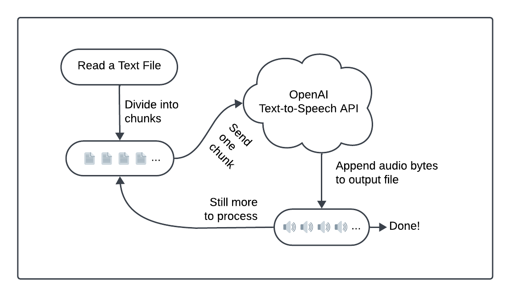

## Introduction

For many people, audiobooks are a staple of daily life.
Spoken content helps people pass time, learn new things, and stay entertained without tying themselves to a screen or a book.
Imagine turning your daily commute, workout sessions, or household chores into opportunities to catch up on _all_ your reading -- not just books.
You can grab text from emails, from the web, or even that report you need to "read" for work.
With the rise of advanced text-to-speech (TTS) technology, it's not just possible, it's quick to build in Go with simple APIs.

For years, text-to-speech solutions have supported the assistive community by transforming words on the page into accessible engagement.
However, until recently, robotic voices and unnatural rhythms made TTS unappealing for casual listeners.
If you didn't need TTS, you probably wouldn't have used TTS.
Now, companies like [OpenAI](https://openai.com/api/) have revolutionized speech synthesis.
They created voices that sound like humans and not androids and released affordable APIs.
Using these large language models (LLMs), you can enjoy warm, nuanced narration.
So, wouldn't it be great to use this kind of tech to transform any text into an audiobook?

In this tutorial, you'll use LLM voices to transform any text into audiobooks.
You'll build a robust text-to-speech system with OpenAI APIs and Temporal Technology's error mitigation.
Forget about manually checking statuses or handling errors.
Just focus on converting text while Temporal makes sure everything runs smoothly.
When complete, you'll be able to reliably convert any plain text file into an audiobook.

Ready to transform your text into immersive audiobooks?
Get started by checking that you have the necessary understanding, tools, and environment set up.

## Prerequisites

You can build the project by following this tutorial, or just grab the ready-to-go source from its [GitHub repo](https://github.com/temporalio/build-audiobook-go).
This repository has the full source code and can serve as a guide or a fallback if you encounter issues when working through this tutorial.
If you want to play first and explore later, you can come back and read through the how-to and background.
Here's what you need to get going:

1. **A local Go development environment**:
   Follow ["Set up a local development environment"](/getting_started/go/dev_environment/) so you're ready to build Temporal applications with Go.
   Ensure a local Temporal Service is running and that you can access the Temporal Web UI from port `8080`.
   These services are necessary for you to build and run this project.

1. **Basic understanding of the Temporal Go SDK**:
   Work through the [Hello World in Go](/getting_started/go/hello_world_in_go/) tutorial.
   This covers the basics of getting a Temporal Go SDK project up and running.

1. **OpenAI API access**:
   Sign up for your [OpenAI API developer account](https://openai.com/api/) and create a bearer token.
   You need this token to access OpenAI services for text-to-speech conversion in your project.

Once caught up with prerequisites, you can build out your Go project directory.

:::info CAUTIONS

This tutorial is written to be run on a single system, with a single Worker, using the local file system.
This is a tutorial project and its implementation is suited for personal and hobbyist use.
In production, you wouldn't read or write from a single database file or system.
This approach isn't durable so you wouldn't develop durable software with them.

Durable execution refers to maintaining state and progress even in the face of failures, crashes, or server outages. 
For durable execution, you must be able to rebuild progress state and store information somewhere more reliable.
If you expand on this project, consider a API-based Cloud storage solution.

For single-host work, check out [this sample](https://github.com/temporalio/samples-go/tree/main/fileprocessing), which shows how to pick up work off a shared Task Queue to start a Workflow, and then use a host-specific Task Queue for the following Activity tasks.

:::

## Create your Go project structure

1. Set up your project directory:
   Set up your source code folder hierarchy by issuing this directory creation command:

   ```sh
   mkdir -p TTSWorker/worker
   ```

   Your directory structure should now look like this:

   ```text
   TTSWorker
   └── worker
   ```
   
2. Move to the root directory:
   
  ```sh
   cd TTSWorker
   ```

3. Create `go.mod` by entering:

   ```sh
   go mod init audiobook/app
   ```
   
   The file contents are initialized to:
   
   ```sh
   module audiobook/app

   go 1.22.2
   ```
   
4. Edit your new `go.mod` file to add two requirements:

   ```sh
   module audiobook/app

   go 1.22.2

   require (
       go.temporal.io/sdk v1.17.0
       github.com/stretchr/testify v1.8.0
   )
   ```
   
   Your dependencies include:
   
   * **go.temporal.io/sdk v1.17.0**: Temporal's open source failure mitigation Go SDK.
   * **github.com/stretchr/testify v1.8.0**: Write tests with assertions and mocks.

## Create your OpenAI conversion code

Create `TTSActivities.go` in your root folder and include the following file contents.
This interface is responsible for the text-to-speech work in your project:

<details>

<summary>
TTSActivities Source
</summary>

<!--SNIPSTART audiobook-project-go-tts-activities-->
<!--SNIPEND-->

</details>

Now that you've built the Activities file, you'll explore some of its functionality and how these pieces work together.

[Activities](https://docs.temporal.io/activities) handle potentially unreliable parts of your code, such as calling APIs or working with file systems.
Temporal uses Activities for any action that is prone to failure, allowing them to be retried.
Imagine that the network goes down or your service provider (OpenAI in this case) is temporarily doing maintenance.
Temporal provides a Retry Policy to support "do-overs" for error mitigation.
Activities add check-in points for your application state in your [Event History](https://docs.temporal.io/workflows#event-history).
When retried, an Activity picks up state from just before it was first called, so it's like the failed attempt never happened.

The `TTSActivities` interface handles text-to-speech operations with the following methods:

- **`ReadFile`**: Reads from the specified `fileInputPath` and returns the contents as a chunked array of strings, for well-sized API calls.
- **`CreateTemporaryFile`**: Creates a temporary file for audio output in a designated folder that is typically cleaned up on system reboots.
- **`Process`**: Sends a text chunk to OpenAI for processing, retrieves the TTS audio segment, and appends it to an output file.
- **`MoveOutputFileToPlace`**: Moves an audio file to a safe, versioned location in the same folder as the original text file.

Here is how the Activities help in the overall conversion process:


### Prepare your text with `ReadFile`

The `ReadFile` Activity reads and processes text from a file.
Before and during the read, it performs a series of safety checks, such as making sure the file exists and it's readable.
If it encounters any file system issues, it returns an application error.
A corrupt file system can't be reasonably retried.

The `ReadFile` Activity reads and processes text from a file.
It performs safety checks to ensure the file exists and is readable.
If file system issues are encountered, it returns an error.
Errors related to file system issues indicate fundamental issues that can't be resolved through retries.

The following code appears at the end of the Activity.
It splits the text into "chunks", each containing part of the source material:

```go
const (
    apiEndpoint          = "https://api.openai.com/v1/audio/speech"
    contentType          = "application/json"
    requestTimeout       = 30 * time.Second
    maxTokens            = 512
    averageTokensPerWord = 1.33
    fileExtension        = ".mp3"
)

...

trimmedContent := strings.TrimSpace(string(content))
words := strings.Fields(trimmedContent)
chunks := []string{}
chunk := strings.Builder{}

for _, word := range words {
    if float64(chunk.Len()+len(word))*averageTokensPerWord <= maxTokens {
        if chunk.Len() > 0 {
            chunk.WriteString(" ")
        }
        chunk.WriteString(word)
    } else {
        chunks = append(chunks, chunk.String())
        chunk.Reset()
        chunk.WriteString(word)
    }
}

if chunk.Len() > 0 {
    chunks = append(chunks, chunk.String())
}

return chunks, nil

```

Tokens quantify the data processed by OpenAI requests and all OpenAI endpoints use token limits.
This code creates chunks with approximately 512 token for each API request.
Although the OpenAI token limit is higher than this, this code is conservative to reduce bandwidth for the returned audio bytes.

As a rule-of-thumb, a typical English word uses 1.33 OpenAI tokens, which is how this code defines the `AVERAGE_TOKENS_PER_WORD` constant.
When working with other languages, adjust that value to fit with typical word lengths.

After building a method to process string data, you'll add code to build an output file in the next steps.

### Build a temporary file to store output with `CreateTemporaryFile`

The `CreateTemporaryFile` Activity requests that the system create a new temporary file.
This file stores intermediate results so your work won't affect the main file system:

```go
func (a *Activities) CreateTemporaryFile(ctx context.Context) (string, error) {
    tempFile, err := os.CreateTemp("", "*.tmp")
    if err != nil {
        return "", temporal.NewApplicationError("Unable to create temporary work file", "FILE_ERROR", err)
    }

    if err := tempFile.Close(); err != nil {
        return "", temporal.NewApplicationError("Unable to close temporary work file", "FILE_ERROR", err)
    }

    return tempFile.Name(), nil
}
```

### Convert text to audio with `Process`

The `Process` Activity handles text-to-speech work.
Each time it's called, it sends a chunk of text to the OpenAI and appends those results to your output file.
You call it with a `string` to process and the output destination.
Should the text-to-speech conversion request fail, Temporal can retry the request:

```go
func (a *Activities) Process(ctx context.Context, chunk, outputPath string) error {
    reqBody := fmt.Sprintf(`{
        "model": "tts-1",
        "input": %q,
        "voice": "nova",
        "response_format": "mp3"
    }`, chunk)

    client := &http.Client{
        Timeout: requestTimeout,
    }

    req, err := http.NewRequestWithContext(ctx, "POST", apiEndpoint, strings.NewReader(reqBody))
    if err != nil {
        return temporal.NewApplicationError("Failed to create request", "REQUEST_ERROR", err)
    }

    req.Header.Set("Authorization", "Bearer "+a.BearerToken)
    req.Header.Set("Content-Type", contentType)

    resp, err := client.Do(req)
    if err != nil {
        return temporal.NewApplicationError("Failed to execute request", "REQUEST_ERROR", err)
    }
    defer resp.Body.Close()

    if resp.StatusCode != http.StatusOK {
        return temporal.NewApplicationError(fmt.Sprintf("Received Unexpected status code: %d", resp.StatusCode), "REQUEST_ERROR", nil)
    }

    if resp.Header.Get("Content-Type") != "audio/mpeg" {
        return temporal.NewApplicationError("Received unexpected content type", "RESPONSE_ERROR", nil)
    }

    body, err := io.ReadAll(resp.Body)
    if err != nil {
        return temporal.NewApplicationError("Failed to read response body", "RESPONSE_ERROR", err)
    }

    if len(body) == 0 {
        return temporal.NewApplicationError("Received empty response body", "RESPONSE_ERROR", nil)
    }

    file, err := os.OpenFile(outputPath, os.O_APPEND|os.O_WRONLY, 0644)
    if err != nil {
        return temporal.NewApplicationError("Unable to open file for appending", "FILE_ERROR", err)
    }
    defer file.Close()

    _, err = file.Write(body)
    if err != nil {
        return temporal.NewApplicationError("Unable to write data to file", "FILE_ERROR", err)
    }

    return nil
}
```

When creating the HTTP request body, customizable [endpoint options](https://platform.openai.com/docs/api-reference/audio/createSpeech) shape the way your audio gets built:

- **model** (required): You'll use the basic low-latency 'tts-1' model in this project.
  Visit [OpenAI TTS](https://platform.openai.com/docs/models/tts) to read about its available models, which include both standard and high quality options.
- **input** (required): The maximum length of this string is set at 4096 characters.
- **voice** (required): The 'nova' voice has a high energy "lively tone".
  You can listen to samples of other voices at the [OpenAI Voice Options](https://platform.openai.com/docs/guides/text-to-speech/voice-options) page.
- **response_format**: You'll use the highly portable mp3 output format.

You may want to set additional options by further tweaking the request body.
An optional **speed** parameter (from 0.5 to 4.0, defaults to 1) lets you speed up or slow down the output so the results can be shorter to listen to or elongated for those with audio processing issues.
To tune the results to a specific language so the model takes advantage of native inflections.
Set **language** to an [ISO-639](https://en.wikipedia.org/wiki/List_of_ISO_639_language_codes) code.
OpenAI offers over fifty [supported languages](https://platform.openai.com/docs/guides/text-to-speech/supported-languages).

After fully processing your data, you'll need to move the complete audio file from the temporary folder.

### Find a location for your output file

In this project, you'll move your output audio file to the same directory as your input text.
The `MoveOutputFileToPlace` Activity handles this process by versioning the output path to prevent overwriting an existing file:

```go
func (a *Activities) MoveOutputFileToPlace(ctx context.Context, tempPath, originalPath string) (string, error) {
    baseName := strings.TrimSuffix(filepath.Base(originalPath), filepath.Ext(originalPath))
    parentDir := filepath.Dir(originalPath)
    newPath := filepath.Join(parentDir, baseName+fileExtension)

    a.fileMutex.Lock()
    defer a.fileMutex.Unlock()

    for i := 1; ; i++ {
        if _, err := os.Stat(newPath); os.IsNotExist(err) {
            break
        }
        newPath = filepath.Join(parentDir, fmt.Sprintf("%s-%d%s", baseName, i, fileExtension))
    }

    tempFile, err := os.Open(tempPath)
    if err != nil {
        return "", temporal.NewApplicationError("Unable to open temporary file", "FILE_ERROR", err)
    }
    defer tempFile.Close()

    fileInfo, err := tempFile.Stat()
    if err != nil {
        return "", temporal.NewApplicationError("Unable to get file info", "FILE_ERROR", err)
    }

    err = os.Rename(tempPath, newPath)
    if err != nil {
        return "", temporal.NewApplicationError("Unable to move output file to destination", "FILE_ERROR", err)
    }

    err = os.Chmod(newPath, fileInfo.Mode())
    if err != nil {
        return "", temporal.NewApplicationError("Unable to set file permissions", "FILE_ERROR", err)
    }

    return newPath, nil
}
```

The code iterates through potential new paths, adding suffix counters (`-1`, `-2`, etc) as needed to avoid path conflicts.
Once found, it uses `File.move` to bring the file out of the temporary folder and into place.

This section talked about Activities, the individual and potentially unreliable processes that perform work that might fail.
Next, you'll create a Workflow, which sets the overall business logic for your application.

## Define your Workflow with Temporal

You've seen the pieces that perform the conversion work but you haven't tied the process together.
In this section, you'll build a Temporal Workflow to process a text-to-speech conversion from start to finish.
[Workflows](https://docs.temporal.io/workflows) create the overall flow of your application's business process.
It's essentially a sequence of steps written in your programming language.

[Workflows](https://docs.temporal.io/workflows) coordinate [Activities](https://docs.temporal.io/activities), which are the methods you created in the previous section.
You use Activities to make API requests, access the file system, or perform other non-deterministic operations.
In contrast, every Workflow [must be deterministic](https://docs.temporal.io/workflows#deterministic-constraints) so you perform all your non-deterministic work in Activities.

Create `TTSWorkflow.go` in your root folder and add the following code.
This is the complete business logic code for this application:

<!--SNIPSTART audiobook-project-go-tts-workflow-->
<!--SNIPEND-->

The `TTSWorkflow` function defines a complete business logic flow, in this case transforming the text within a file pointed to by the `fileInputPath` parameter, into spoken audio.
As you see, this code reads the source file, creates the temporary file, processes each chunk, and finally moves the output file into place.
The function returns the file output path for the generated mp3 results.

`ActivityOptions` set the policies Temporal uses for retrying failed Activities.
This function uses these to build the Workflow context, which allows your application to run Activities as they are managed by the Temporal system.
Temporal management (called "orchestration") enables the Temporal Service to track Workflow and Activity progress and state, and to manage Activities when they encounter errors.

This progress is stored centrally on the Temporal Service, so it can resume if interrupted.
That means you can always find ways to fix problems and keep going and reliably deliver your results.
Temporal calls this Durable Execution.
It allows your application to mitigate errors and keep going without repeating work you've already done.
That makes your apps both reliable and efficient.

A Query handler called `fetchMessage` returns the current `message` string.  
Some conversion tasks take a while to complete.
Queries can "peek" at running processes and fetch information about how that work is proceeding.
This handler returns the status stored in the `message` variable.
This message is updated at each stage of the conversion process.

With your Workflows and Activities in place, you can now write a [Worker application](https://docs.temporal.io/workers#worker-program).
A [Worker](https://docs.temporal.io/workers) hosts your Activities and Workflows and polls a Temporal Service-provided Task Queue looking for work to do.

## Create your Worker

Add the following file contents to a new `worker/main.go` file:

<!--SNIPSTART audiobook-project-go-worker-->
<!--SNIPEND-->

Every Worker polls [Task Queues](https://docs.temporal.io/workers#task-queue) to pick up Workflow and Activity Tasks.
The Task Queue for this project is named `tts-task-queue`.
You'll use this queue to submit conversion requests.
Normally you'd build a dedicated full stack solution that submits requests to the Temporal Service and retrieves the results when they're complete.
For this project, you issue your request through the command-line.

A few more things about this code:

- As a standalone application, this Worker has a `main` method.
- The app starts by checking for an OpenAI bearer token and stores it as a static variable in the `app` package.
- Next, it builds a [Client](https://docs.temporal.io/develop/go/temporal-clients), a class that can communicate with the Temporal service.
- It uses the client and the Task Queue to create a new Worker, which registers the Workflow and Activities it can manage.
- Finally, it runs the Worker, which starts polling for Tasks.

Your complete project structure will now look like this:

```sh
.
├── TTSActivities.go
├── TTSWorkflow.go
├── go.mod
└── worker
    └── main.go
```

After creating this project, it's time to try it out.
Start by running the Worker application.

## Run the Worker

Follow these steps to get your Worker up and running.

### Run the Development Server

Make sure the Temporal development server is running and using a persistent store.
Interrupted work can be picked up and continued without repeating steps, even if you experience server interruptions:

```sh
temporal server start-dev \
    --ui-port 8080 \
    --db-filename /path/to/your/temporal.db
```

Once running, connect to the [Temporal Web UI](http://localhost:8080/) and verify that the server is working.

### Run the Worker application

Assuming you're running Bash, enter this at the command line.
Substitute in your bearer token for YOUR-BEARER-TOKEN:

```
OPEN_AI_BEARER_TOKEN=YOUR-BEARER-TOKEN go run worker/main.go
```

Otherwise set the OPEN_AI_BEARER_TOKEN in your shell and run the app.
Now that the Worker is running, you can submit jobs for text-to-speech processing.

:::note Your Bearer Token

The application checks for the OPEN_AI_BEARER_TOKEN token environment variable. 
If not set, the application will error.

:::

## Submit narration jobs

For this tutorial, use the Temporal CLI tool to build audio from text files.
Open a new terminal window.
You'll use the Workflow `execute` subcommand to watch the execution in real time from your command line:

```sh
temporal workflow execute \
    --type TTSWorkflow \
    --task-queue tts-task-queue \
    --input '"/path/to/your/text-file.txt"' \
    --workflow-id "your-workflow-id"
```

* **type**: The name of this text-to-speech Workflow is `TTSWorkflow`.
* **task-queue**: This Worker polls the "tts-task-queue" Task Queue.
* **input**: Pass a quoted JSON string with a `/path/to/your/input/text-file`.
* **workflow-id**: Set a descriptive name for your Workflow Id.
  This makes it easier to track your Workflow Execution in the Web UI.
  The identifier you set doesn't affect the input text file or the output audio file names.

For example, you might run:

```sh
temporal workflow execute \
    --type TTSWorkflow \
    --task-queue tts-task-queue \
    --input '"~/Desktop/chapter-1.txt"' \
    --workflow-id "chapter-1-tts"
```

### Find your output file

Your output is collected in a system-provided temporary file.
After, your generated MP3 audio is moved into the same folder as your input text file.
It uses the same name replacing the `txt` extension with `mp3`.
If an output file already exists, the project versions it to prevent name collisions.

The `TTSWorkflow` returns a string, the `/path/to/your/output/audio-file`.
Check the Web UI Input and Results section after the Workflow completes.
The results path is also displayed as part of the CLI's `workflow execute` command output and in the Worker logs.

:::tip Cautions and notes

- Do not modify your input or output files while the Workflow is running.
- The Workflow fails if you don't pass a valid text file named with a `txt` extension.

:::

### Check your progress

This project includes a Query to check progress during long processes.
Run it in a separate terminal window or tab:

```
temporal workflow query \
    --type fetchMessage \
    --workflow-id "your-workflow-id"
```

The Query returns a status reporting how many chunks have completed.
For example,

```
% workflow query --type fetchMessage --workflow-id chapter-1
Query result:
  QueryResult  "Processing part 8 of 47"
%
```

This Workflow has completed about 17% of its work.

### Validate your audio output

The open source [checkmate](https://github.com/Sjord/checkmate) app validates MP3 files for errors.

```
$ mpck -v chapter-1.mp3

SUMMARY: chapter-1.mp3
    version                       MPEG v2.0
    layer                         3
    bitrate                       160000 bps
    samplerate                    24000 Hz
    frames                        23723
    time                          9:29.352
    unidentified                  0 b (0%)
    stereo                        yes
    size                          11120 KiB
    ID3V1                         no
    ID3V2                         no
    APEV1                         no
    APEV2                         no
    last frame
        offset                    11386560 b (0xadbec0)
        length                    480
    errors                        none
    result                        Ok
```

With no errors found, your audio is ready to use.
Fire up your favorite player and listen to your creation.

## Conclusion

In this tutorial, you created an OpenAI solution that converts text files into audio.
You used Temporal error mitigation to make sure that failed API requests could be retried and catastrophic events could be recovered.
With just a few source files, you created a complete working solution, building a durable, reliable system that builds audiobooks from simple text files.

:::info What's next?

Now that you've completed this tutorial, check out some other great [Temporal Go projects](https://learn.temporal.io/tutorials/Go/) or learn more about Temporal by taking our [free courses](https://learn.temporal.io/courses).
We provide hands-on projects for supported SDK languages including Go, Java, Python, TypeScript, and PHP.

:::
