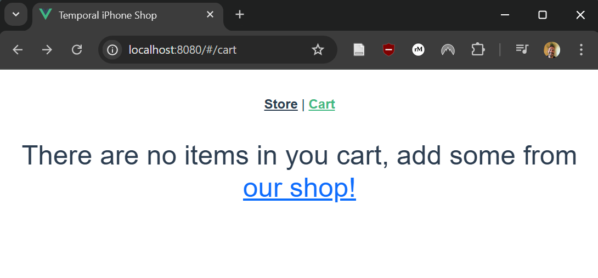

## Introduction

In this tutorial, you'll implement a web shopping cart using Temporal Workflows and Signals. 
The example patterns here use the [Mailgun](https://www.mailgun.com/) and [Stripe](https://stripe.com/) APIs, so you will need a developer account on both platforms to follow along.

### Prerequisites

You can build the project by following this tutorial, or just grab the ready-to-go source from its [GitHub repo](https://github.com/temporalio/temporal-ecommerce).
This repository has the full source code and can serve as a guide or a fallback if you encounter issues when working through this tutorial.
If you want to play first and explore later, you can come back and read through the how-to and background.

If you're new to Temporal, follow ["Set up a local development environment"](/getting_started/go/dev_environment/) so you're ready to build Temporal applications with Go.
Ensure a local Temporal Service is running (e.g. with [the Temporal CLI](https://github.com/temporalio/cli)) and that you can access the Temporal Web UI from port `8233`.
These services are necessary for you to build and run this project.

## Create the Shopping cart Workflow

In a typical web app, a user's shopping cart would be stored as a row or document in a database.
While you can store shopping carts in a separate database using Temporal, you have another option: you can represent a shopping cart as a [long-lived Workflow](https://temporal.io/blog/very-long-running-workflows). This way, you get the benefits of state tracking without needing to sync from external storage.

In the Go SDK, a Temporal Workflow is a function that takes 2 parameters: a Temporal Workflow context `ctx` and an arbitrary `value`.
Temporal can handle pausing and restarting the Workflow as needed -- a Workflow is a durable construct.
Begin by mocking out a `workflow.go` with `CartItem` and `CartState` structs, and a main Workflow function called `CartWorkflow`.

```go
package app

import (
	"go.temporal.io/sdk/workflow"
)

type (
	CartItem struct {
		ProductId int
		Quantity  int
	}

	CartState struct {
		Items []CartItem
		Email string
	}
)

func CartWorkflow(ctx workflow.Context, state CartState) error {
	logger := workflow.GetLogger(ctx)
}
```

This will be your starting point. Next, you'll add some features to the `CartWorkflow`.

### Add Signal Handling for your cart

To support adding and removing elements from the cart, the Workflow needs to respond to different types of [Signals](https://docs.temporal.io/encyclopedia/workflow-message-passing).
Signals are a way to notify Workflows of external events.
In the Go SDK, you use Signal channels to listen for messages that either add or remove items from a shopping cart.
Add these to within your `CartWorkflow` block:

```go
channel := workflow.GetSignalChannel(ctx, "cartMessages")
selector := workflow.NewSelector(ctx)

selector.AddReceive(channel, func(c workflow.ReceiveChannel, _ bool) {
	var signal interface{}
	c.Receive(ctx, &signal)

	var routeSignal RouteSignal
	err := mapstructure.Decode(signal, &routeSignal)
	if err != nil {
		logger.Error("Invalid signal type %v", err)
		return
	}

	switch {
	case routeSignal.Route == RouteTypes.ADD_TO_CART:
		var message AddToCartSignal
		err := mapstructure.Decode(signal, &message)
		if err != nil {
			logger.Error("Invalid signal type %v", err)
			return
		}
		AddToCart(&state, message.Item)

	case routeSignal.Route == RouteTypes.REMOVE_FROM_CART:
		var message RemoveFromCartSignal
		err := mapstructure.Decode(signal, &message)
		if err != nil {
			logger.Error("Invalid signal type %v", err)
			return
		}
		RemoveFromCart(&state, message.Item)
})

// Stop blocking once one condition is satisfied
for {
	selector.Select(ctx)
}
```

Using Signals with the Go SDK usually blocks a Workflow and waits for input. 
The use of a Go `selector` allows your Workflow to wait for any of several conditions -- in this case, the `ADD_TO_CART` or `REMOVE_FROM_CART` Signals.
All the `AddToCart()` and `RemoveFromCart()` functions need to do is modify the `state.Items` array.
Temporal is responsible for persisting and distributing `state`.

These Signals handlers call some helper functions called `AddToCart` and `RemoveFromCart`. Add these functions to `workflow.go`, someplace outside of the `CartWorkflow` block.

```go
func (state *CartState) AddToCart(item CartItem) {
	for i := range state.Items {
		if state.Items[i].ProductId != item.ProductId {
			continue
		}

		state.Items[i].Quantity += item.Quantity
		return
	}

	state.Items = append(state.Items, item)
}

func (state *CartState) RemoveFromCart(item CartItem) {
	for i := range state.Items {
		if state.Items[i].ProductId != item.ProductId {
			continue
		}

		state.Items[i].Quantity -= item.Quantity
		if state.Items[i].Quantity <= 0 {
			state.Items = append(state.Items[:i], state.Items[i+1:]...)
		}
		break
	}
}
```

Finally, you'll want to add a Query handler to your `CartWorkflow`.
Queries are read-only operations that can be used to get Workflow state.
Unlike Signals, they do not modify Workflow state.
You can add this Query handler near the top of your `CartWorkflow`, right after instantiating the logger:

```go
  err := workflow.SetQueryHandler(ctx, "getCart", func(input []byte) (CartState, error) {
      return state, nil
  })
  if err != nil {
      logger.Info("SetQueryHandler failed.", "Error", err)
      return err
  }
```

Next, you'll look at a case where Temporal's long-running Workflows shine: sending a reminder email if the user abandons their cart.

## Check for an abandoned cart

In eCommerce, an abandoned cart is a shopping cart that has items, but which the user hasn't added any new items to or checked out after a few hours.
In a traditional web app architecture, abandoned cart notifications can be complicated.

You might need to use a job queue like [Celery](https://en.wikipedia.org/wiki/Celery_(software)) in Python or [Machinery](https://github.com/RichardKnop/machinery) in Go. Then, you would schedule a job that checks if the cart is abandoned, and reschedule that job every time the cart is updated.

With Temporal, you don't need a separate job queue. Instead, you define a selector with two event handlers: one that responds to a Workflow Signal and one that responds to a Timer.

By creating a new selector on each iteration of the `for` loop, you're telling Temporal to handle the next update cart Signal it receives or send an abandoned cart email if it doesn't receive a Signal for `abandonedCartTimeout`.
Wrap your existing Signal handling in a loop like this:

```go
channel := workflow.GetSignalChannel(ctx, "cartMessages")
sentAbandonedCartEmail := false

for {
  // Create a new Selector on each iteration of the loop means Temporal will pick the first
  // event that occurs each time: either receiving a signal, or responding to the timer.
selector := workflow.NewSelector(ctx)
selector.AddReceive(channel, func(c workflow.ReceiveChannel, _ bool) {
	var signal interface{}
	c.Receive(ctx, &signal)

	// Move your existing signals for adding or removing items from the cart to here
})

  // If the user doesn't update the cart for `abandonedCartTimeout`, send an email
  // reminding them about their cart. Only send the email once.
if !sentAbandonedCartEmail && len(state.Items) > 0 {
	selector.AddFuture(workflow.NewTimer(ctx, abandonedCartTimeout), func(f workflow.Future) {
		sentAbandonedCartEmail = true
		ao := workflow.ActivityOptions{
			StartToCloseTimeout:   10 * time.Second,
		}

		ctx = workflow.WithActivityOptions(ctx, ao)

      // More on SendAbandonedCartEmail in the next section
		err := workflow.ExecuteActivity(ctx, SendAbandonedCartEmail, state.Email).Get(ctx, nil)
		if err != nil {
			logger.Error("Error sending email %v", err)
			return
		}
	})
}

selector.Select(ctx)
}
```

You do not need to implement a job queue, write a separate Worker, or handle rescheduling jobs.
All you need to do is create a new Selector after every Signal and use `selector.AddFuture()` to defer code that needs to happen after the associated timeout is selected.

Temporal does the hard work of persisting and distributing the state of your Workflow for you.

Next, let's take a closer look at Activities and the `ExecuteActivity()` call above that's responsible for sending the abandoned cart email.

## Send emails from an Activity

You can think of Activities as an abstraction for side effects in Temporal.
[Workflows need to be deterministic functions](https://docs.temporal.io/workflows) to enable Temporal to re-run a Workflow to recreate the Workflow's state.
Any side effects, like HTTP requests to the Mailgun API, should be in an Activity.

Create another file named `activities.go` and define a function called `SendAbandonedCartEmail`.
The function takes two parameters: the Workflow context and the email as a string.
You'll also add your `MailgunDomain` and `MailgunKey` API params here, since your Activity is what contacts the Mailgun API. 

```go
package app

import (
	"context"
	"fmt"
	"github.com/mailgun/mailgun-go"
)

type Activities struct {
	MailgunDomain string
	MailgunKey    string
}

func (a *Activities) SendAbandonedCartEmail(_ context.Context, email string) error {
	if email == "" {
		return nil
	}
	mg := mailgun.NewMailgun(a.MailgunDomain, a.MailgunKey)
	m := mg.NewMessage(
		"noreply@"+a.MailgunDomain,
		"You've abandoned your shopping cart!",
		"Go to http://localhost:8080 to finish checking out!",
		email,
	)
	_, _, err := mg.Send(m)
	if err != nil {
		fmt.Println("Mailgun err: " + err.Error())
		return err
	}

	return err
}
```

This way, when your Workflow calls `workflow.ExecuteActivity(ctx, SendAbandonedCartEmail, state.Email)`, you'll get all the benefits of Temporal [Activities](https://docs.temporal.io/activities), like a configurable [Retry Policy](https://docs.temporal.io/encyclopedia/retry-policies).


### Add a Checkout function

Now that you've added an Activity that contacts the Mailgun API, you'll also want an activity that contacts the Stripe API upon checkout.
Add another Signal `selector.AddReceive()` case to `workflow.go`:

```go
selector.AddReceive(checkoutChannel, func(c workflow.ReceiveChannel, _ bool) {
	var signal interface{}
	c.Receive(ctx, &signal)

	var message CheckoutSignal
	err := mapstructure.Decode(signal, &message)
	if err != nil {
		logger.Error("Invalid signal type %v", err)
		return
	}

	state.Email = message.Email

	ao := workflow.ActivityOptions{
		StartToCloseTimeout: time.Minute,
	}

	ctx = workflow.WithActivityOptions(ctx, ao)

	err = workflow.ExecuteActivity(ctx, a.CreateStripeCharge, state).Get(ctx, nil)
	if err != nil {
		logger.Error("Error creating stripe charge: %v", err)
		return
	}

	checkedOut = true
})
```

This way, a `CheckoutSignal` will cause your Workflow to call a `CreateStripeCharge` Activity.
Let's add that Activity to `activities.go`.
First, add a `StripeKey` to the struct that contains your Mailgun API credentials:

```go
type Activities struct {
	StripeKey     string
	MailgunDomain string
	MailgunKey    string
}
```

Next, add that Activity.
Of course, this is a minimal example, and you can refer to the Stripe API docs to add more functionality.

```go
func (a *Activities) CreateStripeCharge(_ context.Context, cart CartState) error {
	stripe.Key = a.StripeKey
	var amount float32 = 0
	var description string = ""
	for _, item := range cart.Items {
		var product Product
		for _, _product := range Products {
			if _product.Id == item.ProductId {
				product = _product
				break
			}
		}
		amount += float32(item.Quantity) * product.Price
		if len(description) > 0 {
			description += ", "
		}
		description += product.Name
	}

	_, err := charge.New(&stripe.ChargeParams{
		Amount:       stripe.Int64(int64(amount * 100)),
		Currency:     stripe.String(string(stripe.CurrencyUSD)),
		Description:  stripe.String(description),
		Source:       &stripe.SourceParams{Token: stripe.String("tok_visa")},
		ReceiptEmail: stripe.String(cart.Email),
	})

	if err != nil {
		fmt.Println("Stripe err: " + err.Error())
	}

	return err
}
```

With this, you're almost done creating your application.
You're just missing a couple of essential Temporal application components -- a Worker and a Stater.

## Define a Worker and a Starter 

Temporal Workers are the processes that actually execute your Workflow and Activity code.
You can deploy them in a fleet, and there are many ways to [scale your Worker deployment](https://temporal.io/blog/scaling-temporal-the-basics) in different environments.
You can define a Worker by creating a Temporal client and telling it which [Task Queues](https://docs.temporal.io/workers) to listen on and which Workflows and Activities to execute.
Workers should also bootstrap the various API secrets that your application needs access to, which is what you populate the struct in `activities.go` from.
Define a Worker in a file called `worker/main.go`:

```go
package main

import (
	"log"
	"go.temporal.io/sdk/client"
	"go.temporal.io/sdk/worker"
	"os"
	"temporal-ecommerce/app"
)

var (
	stripeKey     = os.Getenv("STRIPE_PRIVATE_KEY")
	mailgunDomain = os.Getenv("MAILGUN_DOMAIN")
	mailgunKey    = os.Getenv("MAILGUN_PRIVATE_KEY")
)

func main() {
	// Create the client object just once per process
	c, err := client.NewClient(client.Options{})
	if err != nil {
		log.Fatalln("unable to create Temporal client", err)
	}
	defer c.Close()
	// This worker hosts both Worker and Activity functions
	w := worker.New(c, "CART_TASK_QUEUE", worker.Options{})

	if stripeKey == "" {
		log.Fatalln("Must set STRIPE_PRIVATE_KEY environment variable")
	}
	if mailgunDomain == "" {
		log.Fatalln("Must set MAILGUN_DOMAIN environment variable")
	}
	if mailgunKey == "" {
		log.Fatalln("Must set MAILGUN_PRIVATE_KEY environment variable")
	}

	a := &app.Activities{
		StripeKey: stripeKey,
		MailgunDomain: mailgunDomain,
		MailgunKey: mailgunKey,
	}

	w.RegisterActivity(a.CreateStripeCharge)
	w.RegisterActivity(a.SendAbandonedCartEmail)

	w.RegisterWorkflow(app.CartWorkflow)
	// Start listening to the Task Queue
	err = w.Run(worker.InterruptCh())
	if err != nil {
		log.Fatalln("unable to start Worker", err)
	}
}
```

The last thing you need is a Workflow Starter.
A Starter is the interface that actually kicks off your Workflow.
Because this application models each shopping cart as its own Workflow, your Starter will run for every new session.
You can also use it to boostrap some aspects of each session, by running Signals or Queries upon creation.
Create a Starter as `start/main.go`:

```go
package main

import (
    "context"
    "fmt"
    "log"
    "time"

    "temporal-ecommerce/app"

    "go.temporal.io/sdk/client"
)

func main() {
    c, err := client.NewClient(client.Options{})
    if err != nil {
        log.Fatalln("unable to create Temporal client", err)
    }
    defer c.Close()

    workflowID := "CART-" + fmt.Sprintf("%d", time.Now().Unix())

    options := client.StartWorkflowOptions{
        ID:        workflowID,
        TaskQueue: "CART_TASK_QUEUE",
    }

    state := app.CartState{Items: make([]app.CartItem, 0)}
    we, err := c.ExecuteWorkflow(context.Background(), options, app.CartWorkflow, state)
    if err != nil {
        log.Fatalln("unable to execute workflow", err)
    }

    update := app.AddToCartSignal{Route: app.RouteTypes.ADD_TO_CART, Item: app.CartItem{ProductId:0, Quantity: 1}}
    err = c.SignalWorkflow(context.Background(), workflowID, "", "ADD_TO_CART_CHANNEL", update)

    resp, err := c.QueryWorkflow(context.Background(), workflowID, "", "getCart")
    if err != nil {
        log.Fatalln("Unable to query workflow", err)
    }
    var result interface{}
    if err := resp.Get(&result); err != nil {
        log.Fatalln("Unable to decode query result", err)
    }
    // Prints a message similar to:
    // 2021/03/31 15:43:54 Received query result Result map[Email: Items:[map[ProductId:0 Quantity:1]]]
    log.Println("Received query result", "Result", result)
}
```

You now have a completed Temporal app.
However, what you don't yet have are any tests, or a way for users to actually interface with this app.
You'll complete those in the rest of this tutorial.

## Write Workflow tests

Temporal Workflows also make your code easier to test. Temporal provides testing utilities that help you stub out external services and programmatically advance time, which lets you unit test your Workflows. For an example, take a look at how [Descript uses Temporal](https://temporal.io/case-studies/descript-case-study).
Temporal's testing environment also provides utilities for mocking Activities and testing logic that executes after a delay. That makes it less complicated to unit test Workflows that depend on external services or Workflows that involve long timeouts.

To learn how to implement tests for this application, you can refer to [workflow_test.go](https://github.com/temporalio/temporal-ecommerce/blob/main/workflow_test.go) and [Notes on Testing](https://github.com/temporalio/temporal-ecommerce?tab=readme-ov-file#notes-on-testing) in the Github repo for this tutorial, or watch this walkthrough video:

import { ResponsivePlayer } from '@site/src/components'

<ResponsivePlayer url='https://www.youtube.com/watch?v=-GKxFDQSlEU' />

Finally, you'll need some kind of public interface to your app, like a REST API in a web app.

## Create a REST API

You can build a RESTful API on top of Temporal by making HTTP POST requests create Workflows, GET requests execute Queries, and PUT requests execute Signals.

Because all of the work of updating your shopping cart happens in the Worker process, you can scale your API servers independently of your Worker processes, and rely on the Temporal server to handle the distributed computing.

### API Setup

For this tutorial, you'll be using [httpx](https://github.com/bojanz/httpx) along with [mux](https://github.com/gorilla/mux) for routing and [handlers](https://github.com/gorilla/handlers) for CORS.

Create another file called `webapp/main.go` and add some httpx routes:

```go
package main

import (
	"context"
	"github.com/bojanz/httpx"
	"github.com/gorilla/handlers"
	"github.com/gorilla/mux"
	"net/http"
	"os"
)

func main() {
	var err error

	// Set up CORS for frontend
	var cors = handlers.CORS(handlers.AllowedHeaders([]string{"X-Requested-With", "Content-Type", "Authorization"}), handlers.AllowedMethods([]string{"GET", "POST", "PUT", "HEAD", "OPTIONS"}), handlers.AllowedOrigins([]string{"*"}))

	http.Handle("/", cors(r))
	server := httpx.NewServer(":"+HTTPPort, http.DefaultServeMux)
	server.WriteTimeout = time.Second * 240

	err = server.Start()
	if err != nil {
		log.Fatal(err)
	}
}
```

The API endpoints will be able to create Workflows and execute Signals and Queries.
For the purposes of this app, HTTP GET requests execute Queries, HTTP PUT or PATCH requests send Signals, and HTTP POST requests create new Workflows.

```go
// Create a new cart
r.Handle("/cart", http.HandlerFunc(CreateCartHandler)).Methods("POST")
// Get the state of an existing cart
r.Handle("/cart/{workflowID}", http.HandlerFunc(GetCartHandler)).Methods("GET")

// Add a new item to the cart
r.Handle("/cart/{workflowID}/add", http.HandlerFunc(AddToCartHandler)).Methods("PUT")
// Remove an item from the cart
r.Handle("/cart/{workflowID}/remove", http.HandlerFunc(RemoveFromCartHandler)).Methods("PUT")
// Update the cart's associated email address
r.Handle("/cart/{workflowID}/email", http.HandlerFunc(UpdateEmailHandler)).Methods("PUT")
// Check out
r.Handle("/cart/{workflowID}/checkout", http.HandlerFunc(CheckoutHandler)).Methods("PUT")
```

Your new Web API server and the [Temporal Worker](https://docs.temporal.io/workers) are totally separate processes.
Your API server is just an intermediary between the Temporal server and your API server's clients.
The [Event History](https://docs.temporal.io/workflows#event-history) representing the cart is stored in the Temporal server.

### Handler Functions

Take a look at the `POST /cart` endpoint. Since an individual shopping cart is represented as a Workflow, the `CreateCartHandler()` function will create a new Workflow using `ExecuteWorkflow()`.
For the purposes of this app, we need to make sure each `POST /cart` call creates a Workflow creates a unique `workflowID`.

```go
func CreateCartHandler(w http.ResponseWriter, r *http.Request) {
  // In production you should use uuids or something similar, but the
  // current time is enough for this example. Make sure the Workflow ID
  // is unique every time the user creates a new cart!
	workflowID := "CART-" + fmt.Sprintf("%d", time.Now().Unix())

	options := client.StartWorkflowOptions{
		ID:        workflowID,
		TaskQueue: "CART_TASK_QUEUE",
	}

	cart := app.CartState{Items: make([]app.CartItem, 0)}
	we, err := temporal.ExecuteWorkflow(context.Background(), options, app.CartWorkflow, cart)
	if err != nil {
		WriteError(w, err)
		return
	}

  // Return the `workflowID` so clients can use it with other endpoints
	res := make(map[string]interface{})
	res["cart"] = cart
	res["workflowID"] = we.GetID()

	w.WriteHeader(http.StatusCreated)
	json.NewEncoder(w).Encode(res)
}
```

Now you have a `POST /cart` endpoint that creates a new empty cart, and returns the `workflowID` that uniquely identifies this Workflow.

The next endpoint is `GET /cart/{workflowID}`, which returns the current state of the cart with the given `WorkflowID`.
Below is the `GetCartHandler()` function, which gets the `workflowID` from the URL and executes a Query for the current state of the cart.

```go
func GetCartHandler(w http.ResponseWriter, r *http.Request) {
	vars := mux.Vars(r)
	response, err := temporal.QueryWorkflow(context.Background(), vars["workflowID"], "", "getCart")
	if err != nil {
		WriteError(w, err)
		return
	}
	var res interface{}
	if err := response.Get(&res); err != nil {
		WriteError(w, err)
		return
	}

	w.WriteHeader(http.StatusOK)
	json.NewEncoder(w).Encode(res)
}
```

### PUT Requests and Signals

For this app, HTTP PUT requests correspond to Temporal Signals.
That means, in addition to the `workflowID`, you need to send Signal arguments.

```go
type AddToCartSignal struct {
	Route string
	Item  CartItem
}
```

The `PUT /cart/{workflowID}/add` handler needs to convert the HTTP request body into an `AddToCartSignal` as shown below.

```go
func AddToCartHandler(w http.ResponseWriter, r *http.Request) {
	vars := mux.Vars(r)
	var item app.CartItem
	err := json.NewDecoder(r.Body).Decode(&item)
	if err != nil {
		WriteError(w, err)
		return
	}

	update := app.AddToCartSignal{Route: app.RouteTypes.ADD_TO_CART, Item: item}

	err = temporal.SignalWorkflow(context.Background(), vars["workflowID"], "", "ADD_TO_CART_CHANNEL", update)
	if err != nil {
		WriteError(w, err)
		return
	}

	w.WriteHeader(http.StatusOK)
	res := make(map[string]interface{})
	res["ok"] = 1
	json.NewEncoder(w).Encode(res)
}
```

The `PUT /cart/{workflowID}/remove` and `PUT /cart/{workflowID}/email` handlers are almost identical, except they send `RemoveFromCartSignal` and `UpdateEmailSignal`, not `AddToCartSignal`.

```go
func UpdateEmailHandler(w http.ResponseWriter, r *http.Request) {
	vars := mux.Vars(r)

	var body UpdateEmailRequest
	err := json.NewDecoder(r.Body).Decode(&body)
	if err != nil {
		WriteError(w, err)
		return
	}

	updateEmail := app.UpdateEmailSignal{Route: app.RouteTypes.UPDATE_EMAIL, Email: body.Email}

	err = temporal.SignalWorkflow(context.Background(), vars["workflowID"], "", "UPDATE_CART_CHANNEL", updateEmail)
	if err != nil {
		WriteError(w, err)
		return
	}

	w.WriteHeader(http.StatusOK)
	res := make(map[string]interface{})
	res["ok"] = 1
	json.NewEncoder(w).Encode(res)
}
```

With that, you should have a complete REST API interface to your eCommerce application.
From here, you can build a user-friendly frontend, or continue to add features.
The [Github repo](https://github.com/temporalio/temporal-ecommerce/tree/main/frontend) for this tutorial contains an example of a frontend that you can take from here.



## Conclusion

In this tutorial, you created a shopping cart Workflow.
You used Temporal Signals and Queries to handle state tracking without needing to write to an external database for each eCommerce session.

:::info What's next?

Now that you've completed this tutorial, check out some other great [Temporal Go projects](https://learn.temporal.io/tutorials/Go/) or learn more about Temporal by taking our [free courses](https://learn.temporal.io/courses).
We provide hands-on projects for supported SDK languages including Go, Java, Python, TypeScript, and PHP.

:::
