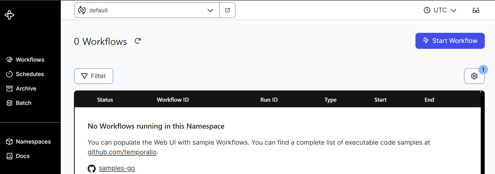

### Introduction

There are many ways of deploying a Temporal Service. For a large-scale deployment, you can use [Docker](https://github.com/temporalio/docker-compose) or [Kubernetes](https://github.com/temporalio/helm-charts) to configure multiple pods with the ability to scale horizontally. For local development, you can use the `server` subcommand of the [Temporal CLI client](https://docs.temporal.io/cli/server) to run a single-user server.

If you need a deployment that fits in between these options -- for example, if you need to scale for multiple users, with fine-grained control over your deployment parameters, but without the overhead of Kubernetes -- you can deploy a Temporal Service using the official server binaries.

In this tutorial, you'll learn how to configure and deploy the two binaries needed for a complete Temporal Service (the core server and the UI server). You'll create `systemd` unit files to gracefully run and restart the Temporal Service automatically upon server startup, and you'll deploy an Nginx reverse proxy to handle web traffic ingress. This will give you everything you need to run a production Temporal Service, and evaluate how to scale further or [migrate to Temporal Cloud](https://temporal.io/cloud). Let's get started.

## Prerequisites

- A Linux server with SSH access and the Nginx web server installed. This can be a new Ubuntu server instance with no additional configuration performed. However, you will need a version of Nginx built with HTTP/2 support (at least version 1.25.1), which may not be available by default in some environments. On Ubuntu, you can use [this PPA](https://launchpad.net/~ondrej/+archive/ubuntu/nginx) to install a compatible Nginx.
- To enable HTTPS in the browser, you will need SSL certificates and your own domain name pointing to the server.

## Obtaining the Temporal Binaries

You'll begin by downloading and configuring the Temporal Server binaries.

The Temporal Core Server can be obtained from its [Github Releases Page](https://github.com/temporalio/temporal/releases/). The Temporal Core Server is responsible for orchestrating all tasks regarding the execution of Temporal Workflows, such as maintaining the Event History, maintaining Task Queues, responding to commands and more. Download the newest binary for your operating system (probably `linux_amd64`) and extract it on the command line using `curl` and `tar`:

```bash
curl -OL https://github.com/temporalio/temporal/releases/download/v1.24.2/temporal_1.24.2_linux_amd64.tar.gz
tar -xzf temporal_1.24.2_linux_amd64.tar.gz
```

The extracted binary will be called `temporal-server`. Move it to the `/usr/bin/` directory on your path and make it executable:

```bash
sudo mv temporal-server /usr/bin/temporal-server
sudo chmod +x /usr/bin/temporal-server
```

You'll also need the Temporal UI server. The Temporal UI Server hooks in to a Temporal Core Server and provides a web-based UI for displaying information about Workflow Executions. It is a standalone binary that can also be obtained from its [Github Releases page](https://github.com/temporalio/ui-server/releases). Download the latest binary for your operating system and extract it on the command line using `curl` and `tar`:

```bash
curl -OL https://github.com/temporalio/ui-server/releases/download/v2.28.0/ui-server_2.28.0_linux_amd64.tar.gz
tar -xzf ui-server_2.28.0_linux_amd64.tar.gz
```

The extracted binary will be called `ui-server`. Move it to the `/usr/bin` directory on your path:

```bash
sudo mv ui-server /usr/bin/temporal-ui-server
sudo chmod +x /usr/bin/temporal-ui-server
```

At this point, you've downloaded everything you need. The last thing to do is create a `temporal` user on your server that has the appropriate permissions to run the Temporal Service, and a directory accessible to this user to store your data in. Run the following commands:

```bash
sudo useradd temporal
sudo mkdir /etc/temporal
sudo chown temporal /etc/temporal
```

Next, you'll create configuration files for both the Temporal Server and the UI Server in the `/etc` directory.

## Configuring the Temporal Binaries

In this tutorial, you'll configure a connection to a SQLite database, since it doesn't require any additional dependencies. Using your favorite text editor, open a new file called `/etc/temporal-server.yaml`:

```bash
sudo vim /etc/temporal-server.yaml
```

Paste the following contents into the file for a starting configuration. You can update any of these values later.

```
log:
  stdout: true
  level: info

persistence:
  defaultStore: sqlite-default
  visibilityStore: sqlite-visibility
  numHistoryShards: 1
  datastores:
    sqlite-default:
      sql:
        pluginName: "sqlite"
        databaseName: "/etc/temporal/default.db"
        connectAddr: "localhost"
        connectProtocol: "tcp"
        connectAttributes:
          cache: "private"
          setup: true

    sqlite-visibility:
      sql:
        pluginName: "sqlite"
        databaseName: "/etc/temporal/visibility.db"
        connectAddr: "localhost"
        connectProtocol: "tcp"
        connectAttributes:
          cache: "private"
          setup: true

global:
  membership:
    maxJoinDuration: 30s
    broadcastAddress: "127.0.0.1"
  pprof:
    port: 7936

services:
  frontend:
    rpc:
      grpcPort: 7233
      membershipPort: 6933
      bindOnLocalHost: true
      httpPort: 7243

  matching:
    rpc:
      grpcPort: 7235
      membershipPort: 6935
      bindOnLocalHost: true

  history:
    rpc:
      grpcPort: 7234
      membershipPort: 6934
      bindOnLocalHost: true

  worker:
    rpc:
      grpcPort: 7239
      membershipPort: 6939
      bindOnLocalHost: true

clusterMetadata:
  enableGlobalNamespace: false
  failoverVersionIncrement: 10
  masterClusterName: "active"
  currentClusterName: "active"
  clusterInformation:
    active:
      enabled: true
      initialFailoverVersion: 1
      rpcName: "frontend"
      rpcAddress: "localhost:7233"
      httpAddress: "localhost:7243"

dcRedirectionPolicy:
  policy: "noop"
```

Save and close the file. Next, you'll create the configuration file for the UI Server. Using your favorite text editor, open a new file called `/etc/temporal-ui-server.yaml`:

```bash
sudo vim /etc/temporal-ui-server.yaml
```

Paste the following contents into the file.

```
temporalGrpcAddress: 127.0.0.1:7233
port: 8233
enableUi: true
cors:
  allowOrigins:
    - http://localhost:8233
defaultNamespace: default
```

Save and close the file.

You can now run a Temporal Service on this server by running the following commands in two separate terminals, to start the Core Server and the UI Server:

```bash
sudo su temporal -c `temporal-server -c /etc -e temporal-server start`
```

```bash
sudo su temporal -c `temporal-ui-server -c /etc -e temporal-ui-server start`
```

However, you aren't ready to handle external connections yet -- at this point, your Temporal Service is only available on `localhost`, meaning it is not scalable or accessible outside the localhost network. Use `Ctrl+C` in each terminal to stop the running process. In the remainder of this tutorial, you'll configure this server for production use.

## Creating and Registering System Services

Because you installed Temporal directly from binaries, you need to run it manually from the command line. To run them automatically, you'll need to set up your own background services.

To do this, you’ll create `unit` files that can be used by your server’s `init` system. On nearly all modern Linux distributions, the init system is called **systemd**, and you can interact with it by using the `systemctl` command.

Using your favorite text editor, open a new file called `/etc/systemd/system/temporal.service`:

```bash
sudo vim /etc/systemd/system/temporal.service
```

Your unit file needs, at minimum, a `[Unit]` section, a `[Service]` section, and an `[Install]` section:

```
[Unit]
Description=Temporal Service
After=network.target

[Service]
User=temporal
Group=temporal
ExecStart=temporal-server -c /etc -e temporal-server start

[Install]
WantedBy=multi-user.target
```

This file can be broken down as follows:

- The `[Unit]` section contains a plaintext description of your new service, as well as an `After` hook that specifies when it should be run at system startup, in this case after your server’s networking interfaces have come up.
- The `[Service]` section specifies which command should actually be run, as well as which user should be running it. In this case, `temporal` is the user you created, and `temporal-server` is the command from the last step.
- The `[Install]` section contains only the `WantedBy=multi-user.target` line, which works together with the `After` line in the `[Unit]` section to ensure that the service is started when the server is ready to accept user logins.

Save and close the file. You can now `start` your new Temporal service, and `enable` it to run on boot automatically:

```bash
sudo systemctl start temporal
sudo systemctl enable temporal
```

Use systemctl status temporal to verify that it started successfully. You should receive similar output to when you first ran the command in a terminal.

```bash
sudo systemctl status temporal
```

```output
● temporal.service - Temporal Service
     Loaded: loaded (/etc/systemd/system/temporal.service; disabled; vendo>
     Active: active (running) since Mon 2024-07-08 11:24:40 PDT; 4s ago
   Main PID: 19925 (temporal-server)
      Tasks: 22 (limit: 18707)
     Memory: 62.7M
     CGroup: /system.slice/temporal.service
             └─19925 temporal-server -c /etc -e temporal-server start

Jul 08 11:24:42 Omelas temporal-server[19925]: {"level":"info","ts":"2024->
Jul 08 11:24:42 Omelas temporal-server[19925]: {"level":"info","ts":"2024->
Jul 08 11:24:42 Omelas temporal-server[19925]: {"level":"info","ts":"2024-
```

Next, repeat these steps for the UI server. Open a new file called `/etc/systemd/system/temporal-ui.service`:

```bash
sudo vim /etc/systemd/system/temporal-ui.service
```

Add the following contents:

```
[Unit]
Description=Temporal UI Server
After=network.target

[Service]
User=temporal
Group=temporal
ExecStart=temporal-ui-server -c /etc -e temporal-ui-server start

[Install]
WantedBy=multi-user.target
```

Save and close the file, then `start` the UI Server service, and `enable` it to run on boot automatically:

```bash
sudo systemctl start temporal-ui
sudo systemctl enable temporal-ui
```

Use systemctl status temporal to verify that it started successfully:

```bash
sudo systemctl status temporal-ui
```

Both services should now be running in the background. 

## Deploying an Nginx Reverse Proxy with an SSL Certificate

To complete this step, you should have already obtained your own domain name and SSL certificates. One way to do that is by using [certbot](https://certbot.eff.org/instructions?ws=other&os=ubuntufocal).

When `certbot` retrieves certificates, by default, it stores them in `/etc/letsencrypt/live/your_domain`. Check to make sure that you have them:

```bash
sudo ls /etc/letsencrypt/live/your_domain
```

```
README  cert.pem  chain.pem  fullchain.pem  privkey.pem
```

Now, you can configure an Nginx *reverse proxy* to expose your Temporal Service to external connections. Putting a web server such as Nginx in front of other web-facing applications can improve performance and make it much more straightforward to secure a site. Nginx can take care of restricting access and securely handling requests from your clients to Temporal. This time, you'll configure the UI server first, which uses regular HTTP (web) traffic:

Nginx allows you to add per-site configurations to individual files in a subdirectory called `sites-available/`. Using your favorite text editor, create a new Nginx configuration at `/etc/nginx/sites-available/temporal-ui`:

```bash
sudo vim /etc/nginx/sites-available/temporal-ui
```

Paste the following into the new configuration file, being sure to replace `your_domain` with your domain name.

```
server {
    listen 80 default_server;
    listen [::]:80 default_server;
    server_name your_domain www.your_domain

    access_log /var/log/nginx/temporal.access.log;
    error_log /var/log/nginx/temporal.error.log;

    location / {
        proxy_pass http://127.0.0.1:8233;
        proxy_http_version 1.1;
        proxy_read_timeout 300;
        proxy_set_header Upgrade $http_upgrade;
        proxy_set_header Connection "upgrade";
        proxy_set_header Host $http_host;
        proxy_set_header X-Real-IP $remote_addr;
        proxy_set_header X-Real-PORT $remote_port;
        allow your_ip_addresses;
        deny all;
    }

    listen 443 ssl;
    # RSA certificate
    ssl_certificate /etc/letsencrypt/live/your_domain/fullchain.pem;
    ssl_certificate_key /etc/letsencrypt/live/your_domain/privkey.pem;

    # Redirect non-https traffic to https
    if ($scheme != "https") {
        return 301 https://$host$request_uri;
    }
}
```

You can read this configuration as having three main “blocks” to it. The first block, coming before the `location /` line, contains a boilerplate Nginx configuration for serving a website on the default HTTP port, 80. The `location /` block contains a configuration for proxying incoming connections to the Temporal Web UI, running on port 8233 internally, while preserving SSL. The configuration at the end of the file, after the `location /` block, loads your LetsEncrypt SSL keypairs and redirects HTTP connections to HTTPS.

Note the `allow your_ip_address;` line. You should replace this with the IP address that you'll need to access the Temporal Web UI from. You can add additional addresses in the same range using [CIDR notation](https://www.digitalocean.com/community/tutorials/understanding-ip-addresses-subnets-and-cidr-notation-for-networking), or add additional consecutive `allow` lines for multiple IPs. The `deny all;` on the following line will block traffic to all but the specified IPs. Because Temporal does not use any kind of authentication by default, restricting traffic by IP address is the least complex way of providing secure access.

Save and close the file. Next, you’ll need to activate this new configuration. Nginx’s convention is to create symbolic links (like shortcuts) from files in `sites-available/` to another folder called `sites-enabled/` as you decide to enable or disable them. Using full paths for clarity, make that link:

```bash
sudo ln -s /etc/nginx/sites-available/temporal-ui /etc/nginx/sites-enabled/temporal-ui
```

By default, Nginx includes another configuration file at `/etc/nginx/sites-available/default`, linked to `/etc/nginx/sites-enabled/default`, which also serves its default index page. You’ll need to disable that rule by removing it from `/sites-enabled`, because it conflicts with your new Temporal configuration:

```bash
sudo rm /etc/nginx/sites-enabled/default
```

Before reloading Nginx with this new configuration, you'll create another reverse proxy for gRPC API connections to Temporal itself. Create another Nginx configuration at `/etc/nginx/sites-available/temporal`:

```bash
sudo vim /etc/nginx/sites-available/temporal
```

Paste the following into the new configuration file, being sure to replace `your_domain` with your domain name.

```
server {
    listen 7233;
    listen [::]:7233;
    server_name your_domain

    http2 on;

    location / {
        grpc_pass localhost:7233;
        allow your_client_ip_address;
        deny all;
    }
}
```

This configuration is shorter than the previous one, because Nginx only needs to use the `grpc_pass` directive to send gRPC traffic to the server using the same external port (7233) that Temporal's gRPC API runs on. Again, don't forget the the `allow your_client_ip_address;` line. In this case, you'll need an `allow` statement or IP range for everywhere that you plan to run your Temporal Workers, or any other Temporal Client, or connect via the `temporal` CLI.

Save and close the file, and create a symbolic link as before:

```bash
sudo ln -s /etc/nginx/sites-available/temporal /etc/nginx/sites-enabled/temporal
```

Now you can restart your Nginx service, so it will reflect your new configuration:

```bash
sudo systemctl restart nginx
```

Navigate to **your_domain** in a web browser, and you should receive the Temporal Web UI. At this point, you're finished with configuration. In the final step, you'll review the logs generated by your Temporal Service, as well as your options for connecting to it from the Temporal CLI or SDK.

## Interacting with the Temporal Service

In the last step, when you configured your Nginx reverse proxy, you added logging to `access_log /var/log/nginx/temporal.access.log;`. You can check this file if you ever need to review access logs to the Temporal Web UI.

You can also use `journalctl` to access logs from the Temporal Server itself. `journalctl -u service-name.service` allows you to view the full logs of any service running through `systemd`.

If you ever need to restart the Temporal Service after making a configuration change, use `systemctl restart temporal` or `systemctl restart temporal-ui`. If you need to reload your Nginx configuration after adding additional IP addresses to your allow list, use `systemctl reload nginx` to reload without potentially disrupting network traffic with a restart.

Finally, you should now be able to interact with your Temporal Service as if it were running locally. Just include `--address your_server:7233` with your CLI commands as needed. The first thing you'll likely need to do is create a `default` namespace, since this is not done automatically:

```bash
temporal --address your_server:7233 operator namespace create default
```

After that, you can visit the Web UI to ensure that it loads the `default` namespace correctly by visting `your_server` in a browser:



From then on, you can run commands like so:

```bash
temporal --address your_server:7233 workflow list 
```

Refer to the [Temporal documentation](https://docs.temporal.io/) for more.

## Conclusion

In this tutorial, you configured and deployed a baseline Temporal Service. Next, you can read about Temporal's [Visiblity features](https://docs.temporal.io/visibility) which require adding ElasticSearch to your deployment. You can also [learn more about the Temproal platform by following our self-paced online courses](https://learn.temporal.io/courses/), or talk to an expert about [Temporal Cloud](https://temporal.io/cloud). 