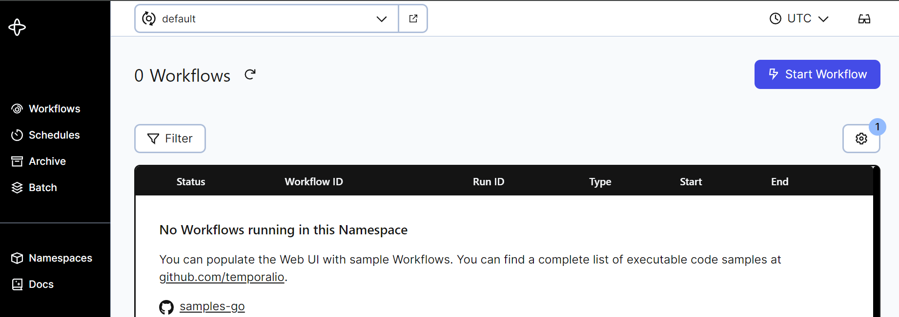

### Introduction

There are many ways of deploying a Temporal Service. For a large-scale deployment, you can use [Docker](https://github.com/temporalio/docker-compose) or [Kubernetes](https://github.com/temporalio/helm-charts) to configure multiple pods with the ability to scale horizontally. For local development, you can use the `server` subcommand of the [Temporal CLI client](https://docs.temporal.io/cli/server) to run a single-user server.

If you need a deployment that fits in between these options -- for example, if you need to scale for multiple users, with fine-grained control over your deployment parameters, but without the overhead of Kubernetes -- you can deploy a Temporal Service using the official server binaries.

In this tutorial, you'll learn how to configure and deploy the two binaries needed for a complete Temporal Service (the core server and the UI server). You'll create `systemd` unit files to gracefully run and restart the Temporal Service automatically upon server startup, and you'll deploy an Envoy edge proxy to handle web traffic ingress. This will give you everything you need to run a production Temporal Service, and evaluate how to scale further or [migrate to Temporal Cloud](https://temporal.io/cloud). Let's get started.

## Prerequisites

- A Linux server with SSH access and the Envoy proxy installed. This can be a new Ubuntu server instance with no additional configuration performed. To install Envoy, refer to [the Envoy documentation](https://www.envoyproxy.io/docs/envoy/latest/start/install#install-envoy-on-debian-gnu-linux)
- To enable HTTPS in the browser, you will need SSL certificates and your own domain name pointing to the server.

## Obtaining the Temporal Binaries

You'll begin by downloading and configuring the Temporal Server binaries.

The Temporal Core Server can be obtained from its [Github Releases Page](https://github.com/temporalio/temporal/releases/). The Temporal Core Server is responsible for orchestrating all tasks regarding the execution of Temporal Workflows, such as maintaining the Event History, maintaining Task Queues, responding to commands and more. Download the newest binary for your operating system (probably `linux_amd64`) and extract it on the command line using `curl` and `tar`:

```bash
curl -OL https://github.com/temporalio/temporal/releases/download/v1.24.2/temporal_1.24.2_linux_amd64.tar.gz
tar -xzf temporal_1.24.2_linux_amd64.tar.gz
```

The extracted binary will be called `temporal-server`. Move it to the `/usr/bin/` directory on your path and make it executable:

```bash
sudo mv temporal-server /usr/bin/temporal-server
sudo chmod +x /usr/bin/temporal-server
```

You'll also need the Temporal UI server. The Temporal UI Server hooks in to a Temporal Core Server and provides a web-based UI for displaying information about Workflow Executions. It is a standalone binary that can also be obtained from its [Github Releases page](https://github.com/temporalio/ui-server/releases). Download the latest binary for your operating system and extract it on the command line using `curl` and `tar`:

```bash
curl -OL https://github.com/temporalio/ui-server/releases/download/v2.28.0/ui-server_2.28.0_linux_amd64.tar.gz
tar -xzf ui-server_2.28.0_linux_amd64.tar.gz
```

The extracted binary will be called `ui-server`. Move it to the `/usr/bin` directory on your path:

```bash
sudo mv ui-server /usr/bin/temporal-ui-server
sudo chmod +x /usr/bin/temporal-ui-server
```

At this point, you've downloaded everything you need. The last thing to do is create a `temporal` user on your server that has the appropriate permissions to run the Temporal Service, and a directory accessible to this user to store your data in. Run the following commands:

```bash
sudo useradd temporal
sudo mkdir /etc/temporal
sudo chown temporal /etc/temporal
```

Next, you'll create configuration files for both the Temporal Server and the UI Server in the `/etc/temporal/` directory.

## Configuring the Temporal Binaries

In this tutorial, you'll configure a connection to a SQLite database, since it doesn't require any additional dependencies. Using your favorite text editor, open a new file called `/etc/temporal/temporal-server.yaml`:

```bash
sudo vim /etc/temporal/temporal-server.yaml
```

Paste the following contents into the file for a starting configuration. You can update any of these values later.

```
log:
  stdout: true
  level: info

persistence:
  defaultStore: sqlite-default
  visibilityStore: sqlite-visibility
  numHistoryShards: 4
  datastores:
    sqlite-default:
      sql:
        pluginName: "sqlite"
        databaseName: "/etc/temporal/default.db"
        connectAddr: "localhost"
        connectProtocol: "tcp"
        connectAttributes:
          cache: "private"
          setup: true

    sqlite-visibility:
      sql:
        pluginName: "sqlite"
        databaseName: "/etc/temporal/visibility.db"
        connectAddr: "localhost"
        connectProtocol: "tcp"
        connectAttributes:
          cache: "private"
          setup: true

global:
  membership:
    maxJoinDuration: 30s
    broadcastAddress: "127.0.0.1"
  pprof:
    port: 7936

services:
  frontend:
    rpc:
      grpcPort: 7236
      membershipPort: 6933
      bindOnLocalHost: true
      httpPort: 7243

  matching:
    rpc:
      grpcPort: 7235
      membershipPort: 6935
      bindOnLocalHost: true

  history:
    rpc:
      grpcPort: 7234
      membershipPort: 6934
      bindOnLocalHost: true

  worker:
    rpc:
      membershipPort: 6939

clusterMetadata:
  enableGlobalNamespace: false
  failoverVersionIncrement: 10
  masterClusterName: "active"
  currentClusterName: "active"
  clusterInformation:
    active:
      enabled: true
      initialFailoverVersion: 1
      rpcName: "frontend"
      rpcAddress: "localhost:7236"
      httpAddress: "localhost:7243"

dcRedirectionPolicy:
  policy: "noop"
```

Save and close the file. Next, you'll create the configuration file for the UI Server. Using your favorite text editor, open a new file called `/etc/temporal/temporal-ui-server.yaml`:

```bash
sudo vim /etc/temporal/temporal-ui-server.yaml
```

Paste the following contents into the file.

```
temporalGrpcAddress: 127.0.0.1:7236
host: 127.0.0.1
port: 8233
enableUi: true
cors:
  allowOrigins:
    - http://localhost:8233
defaultNamespace: default
```

If you are using your own domain name, replace `localhost` in the `allowOrigins` property. Then save and close the file.

You can now run a Temporal Service on this server by running the following commands in two separate terminals, to start the Core Server and the UI Server:

```bash
sudo su temporal -c `temporal-server -r / -c etc/temporal/ -e temporal-server start`
```

```bash
sudo su temporal -c `temporal-ui-server -r / -c etc/temporal/ -e temporal-ui-server start`
```

However, you aren't ready to handle external connections yet -- at this point, your Temporal Service is only available on `localhost`, meaning it is not scalable or accessible outside the localhost network.

Use `Ctrl+C` in each terminal to stop the running process, then delete the temporary DBs that were created:

```bash
sudo rm /etc/temporal/default.db
sudo rm /etc/temporal/visibility.db
```

In the remainder of this tutorial, you'll configure this server for production use.

## Creating and Registering System Services

Because you installed Temporal directly from binaries, you need to run it manually from the command line. To run them automatically, you'll need to set up your own background services.

To do this, you’ll create `unit` files that can be used by your server’s `init` system. On nearly all modern Linux distributions, the init system is called **systemd**, and you can interact with it by using the `systemctl` command.

Using your favorite text editor, open a new file called `/etc/systemd/system/temporal.service`:

```bash
sudo vim /etc/systemd/system/temporal.service
```

Your unit file needs, at minimum, a `[Unit]` section, a `[Service]` section, and an `[Install]` section:

```
[Unit]
Description=Temporal Service
After=network.target

[Service]
User=temporal
Group=temporal
ExecStart=temporal-server -r / -c etc/temporal/ -e temporal-server start

[Install]
WantedBy=multi-user.target
```

This file can be broken down as follows:

- The `[Unit]` section contains a plaintext `Description` of your new service, as well as an `After` hook that specifies when it should be run at system startup, in this case, it will be run after your server’s networking interfaces have come up.
- The `[Service]` section specifies which command (`ExecStart`) should actually be run, as well as which `User` and `Group` the command should be running as. In this case, you will use the `temporal` user you created, and the `temporal-server` command from the previous step.
- The `[Install]` section contains only the `WantedBy=multi-user.target` line, which works together with the `After` line in the `[Unit]` section to ensure that the service is started when the server is ready to accept user logins.

Save and close the file. You can now `start` your new Temporal service, and `enable` it to run on boot automatically:

```bash
sudo systemctl start temporal
sudo systemctl enable temporal
```

Use the `systemctl` command to verify that `temporal` started successfully. You should receive similar output to when you first ran the command in a terminal.

```bash
sudo systemctl status temporal
```

```output
● temporal.service - Temporal Service
     Loaded: loaded (/etc/systemd/system/temporal.service; disabled; vendo>
     Active: active (running) since Mon 2024-07-08 11:24:40 PDT; 4s ago
   Main PID: 19925 (temporal-server)
      Tasks: 22 (limit: 18707)
     Memory: 62.7M
     CGroup: /system.slice/temporal.service
             └─19925 temporal-server -r / -c etc/temporal/ -e temporal-server

Jul 08 11:24:42 Omelas temporal-server[19925]: {"level":"info","ts":"2024->
Jul 08 11:24:42 Omelas temporal-server[19925]: {"level":"info","ts":"2024->
Jul 08 11:24:42 Omelas temporal-server[19925]: {"level":"info","ts":"2024-
```

Next, repeat these steps for the UI server. Open a new file called `/etc/systemd/system/temporal-ui.service`:

```bash
sudo vim /etc/systemd/system/temporal-ui.service
```

Add the following contents:

```
[Unit]
Description=Temporal UI Server
After=network.target

[Service]
User=temporal
Group=temporal
ExecStart=temporal-ui-server -r / -c etc/temporal/ -e temporal-ui-server start

[Install]
WantedBy=multi-user.target
```

Save and close the file, then `start` the UI Server service, and `enable` it to run on boot automatically:

```bash
sudo systemctl start temporal-ui
sudo systemctl enable temporal-ui
```

Use the `systemctl` command to verify that `temporal-ui` started successfully:

```bash
sudo systemctl status temporal-ui
```

Both services should now be running in the background. 

## Deploying an Envoy Edge Proxy

*To complete this step, you should have already obtained your own domain name and SSL certificates. One way to do that is by using [certbot](https://certbot.eff.org/instructions?ws=other&os=ubuntufocal).*
While your Temporal Service is currently running, it is still only available on the internal `localhost` network. Next you should make it available externally and secure connections to it.
When `certbot` retrieves certificates, by default, it stores them in `/etc/letsencrypt/live/your_domain`. Check to make sure that you have them:

```bash
sudo ls /etc/letsencrypt/live/your_domain
```

```
README  cert.pem  chain.pem  fullchain.pem  privkey.pem
```

Now, you can configure an Envoy *edge proxy* to expose your Temporal Service to external connections. Putting a proxy server such as Envoy in front of other web-facing applications can improve performance and reduce the complexity of securing a site. Envoy can take care of restricting access and securely handling requests from your clients to Temporal.

Using your favorite text editor, create an Envoy configuration file at `/etc/envoy-temporal.yaml`:

```bash
sudo vim /etc/envoy-temporal.yaml
```

Paste the following into the new configuration file:

```
admin:
  access_log:
  - name: envoy.access_loggers.stdout
    typed_config:
      "@type": type.googleapis.com/envoy.extensions.access_loggers.stream.v3.StdoutAccessLog

static_resources:
  listeners:
    - name: webui
      address:
        socket_address : { address: '::', port_value: 80, ipv4_compat: true }
      filter_chains:
      - name: webui_filter_chain
        filters:
        - name: envoy.filters.network.http_connection_manager
          typed_config:
            "@type": type.googleapis.com/envoy.extensions.filters.network.http_connection_manager.v3.HttpConnectionManager
            stat_prefix: http_connection_manager
            route_config:
              virtual_hosts:
              - name: webui_localhost
                domains: ["*"]
                routes:
                - name: webui-exporter-route
                  match: {prefix: "/"}
                  route:
                    cluster: webui-cluster-server
                    timeout: 0s
                    idle_timeout: 0s
            http_filters:
            - name: envoy.filters.http.rbac
              typed_config:
                "@type": type.googleapis.com/envoy.extensions.filters.http.rbac.v3.RBAC       
                rules:
                  action: ALLOW
                  policies:
                    "allowed-user":
                      permissions:
                        - any: true
                      principals:
                        - remote_ip: {"address_prefix": 1.1.1.1} # Update to your allowed Web UI IP addresses
            - name: envoy.filters.http.router
              typed_config:
                "@type": type.googleapis.com/envoy.extensions.filters.http.router.v3.Router
    # Uncomment the below lines and update with `your_domain` if using HTTPS
    #  - filter_chain_match:
    #      server_names: ["your_domain", "www.your_domain"]
    #    transport_socket:
    #      name: envoy.transport_sockets.tls
    #      typed_config:
    #        "@type": type.googleapis.com/envoy.extensions.transport_sockets.tls.v3.DownstreamTlsContext
    #        common_tls_context:
    #          tls_certificates:
    #          - certificate_chain: {filename: "/ets/letsencrypt/live/your_domain/cert.pem"}
    #            private_key: {filename: "/ets/letsencrypt/live/your_domain/privkey.pem"}
    #          alpn_protocols: ["h2,http/1.1"]
    #  listener_filters:
    #  - name: "envoy.filters.listener.tls_inspector"
    #    typed_config:
    #      "@type": type.googleapis.com/envoy.extensions.filters.listener.tls_inspector.v3.TlsInspector
    - name: temporal_grpc
      address:
        socket_address: { address: '::', port_value: 7233, ipv4_compat: true }
      filter_chains:
        - filters:
            - name: envoy.filters.network.http_connection_manager
              typed_config:
                '@type': type.googleapis.com/envoy.extensions.filters.network.http_connection_manager.v3.HttpConnectionManager
                codec_type: auto
                stat_prefix: ingress_http
                route_config:
                  name: grpc_route
                  virtual_hosts:
                    - name: grpc_localhost
                      domains: ['*']
                      routes:
                        - match: { prefix: '/' }
                          route:
                            cluster: grpc_service
                            timeout: 0s
                            max_stream_duration:
                              grpc_timeout_header_max: 0s
                      cors:
                        allow_origin_string_match:
                          - prefix: '*'
                        allow_methods: GET, PUT, DELETE, POST, OPTIONS
                        allow_headers: keep-alive,user-agent,cache-control,content-type,content-transfer-encoding,x-accept-content-transfer-encoding,x-accept-response-streaming,x-user-agent,x-grpc-web,grpc-timeout
                        max_age: '1728000'
                        expose_headers: grpc-status,grpc-message
                http_filters:
                  - name: envoy.filters.http.rbac
                    typed_config:
                      "@type": type.googleapis.com/envoy.extensions.filters.http.rbac.v3.RBAC       
                      rules:
                        action: ALLOW
                        policies:
                          "allowed-user":
                            permissions:
                              - any: true
                            principals:
                              - remote_ip: {"address_prefix": 1.1.1.1} # Update to your allowed client IP addresses
                  - name: envoy.filters.http.grpc_web
                  - name: envoy.filters.http.cors
                  - name: envoy.filters.http.router

  clusters:
    - name: webui-cluster-server
      type: static
      connect_timeout: 2s
      load_assignment:
        cluster_name: webui-cluster-server
        endpoints:
        - lb_endpoints:
          - endpoint:
              address:
                socket_address: { address: 127.0.0.1, port_value: 8233, ipv4_compat: true }
    - name: grpc_service
      type: logical_dns
      connect_timeout: 1s
      http2_protocol_options: {}
      lb_policy: round_robin
      load_assignment:
        cluster_name: grpc_service
        endpoints:
          - lb_endpoints:
              - endpoint:
                  address:
                    socket_address: { address: 127.0.0.1, port_value: 7236, ipv4_compat: true }
```

This is an Envoy YAML configuration file that provides an edge proxy deployment for your Temporal Service and Web UI.

Envoy configuration can be complex, and going through this file line by line is out of scope for this tutorial. You can refer to the [Envoy configuration reference](https://www.envoyproxy.io/docs/envoy/latest/configuration/configuration) for more detail. However, there are still a few changes you'll need to make for your own deployment.

First, if you're using your own domain name, make sure to uncomment all of the indicated lines above, and replace `your_domain` with your domain name.

Next, find the `# Update to your allowed Web UI IP addresses` comment. Replace the IP address on this line with the IP address that you'll need to access the Temporal Web UI from. You can add additional addresses in the same range using [CIDR notation](https://www.digitalocean.com/community/tutorials/understanding-ip-addresses-subnets-and-cidr-notation-for-networking), following the [Envoy documentation](https://www.envoyproxy.io/docs/envoy/latest/api-v3/config/core/v3/address.proto#envoy-v3-api-msg-config-core-v3-cidrrange).

Finally, you also need to update the IP address provided with the `# Update to your allowed client IP addresses` comment. Here, you'll need an to provide an IP range for everywhere that you plan to run your Temporal Workers, or any other Temporal Client, or connect via the `temporal` CLI.

Save and close the file. Next, you’ll need to create a system service for Envoy, as you did with the Temporal Service and Web UI. Open a new file called `/etc/systemd/system/envoy.service`:

```bash
sudo vim /etc/systemd/system/envoy.service
```

Add the following contents:

```
[Unit]
Description=Envoy edge proxy
After=network.target

[Service]
User=temporal
Group=temporal
ExecStart=envoy -c /etc/envoy-temporal.yaml

[Install]
WantedBy=multi-user.target
```

Save and close the file. Now you can start your Envoy service, and `enable` it to run on boot automatically::

```bash
sudo systemctl start envoy
sudo systemctl enable envoy
```

Navigate to **your_domain** in a web browser, and you should receive the Temporal Web UI. At this point, you're finished with configuration. Keep in mind that Envoy has much more sophisticated [load balancing](https://www.envoyproxy.io/docs/envoy/latest/intro/arch_overview/upstream/load_balancing/overview) features and other capabilities that you may want to explore as you expand on your deployment.

In the final step, you'll review the logs generated by your Temporal Service, as well as your options for connecting to it from the Temporal CLI or SDK.

## Interacting with the Temporal Service

In the last step, when you configured your Envoy edge proxy, you enabled access logging on `stdout`. You can use `journalctl -u envoy.service` to view the logging output from Envoy. 

You can also use `journalctl` to access logs from the Temporal Server itself. `journalctl -u service-name.service` allows you to view the full logs of any service running through `systemd`.

If you ever need to restart the Temporal Service after making a configuration change, use `systemctl restart temporal` or `systemctl restart temporal-ui`. If you need to reload your Envoy configuration after adding additional IP addresses to your allow list, use `systemctl restart envoy`.

Finally, you should now be able to interact with your Temporal Service as if it were running locally. Just include `--address your_server:7233` with your CLI commands as needed. The first thing you'll likely need to do is create a `default` namespace, since this is not done automatically:

```bash
temporal --address your_server:7233 operator namespace create default
```

After that, you can visit the Web UI to ensure that it loads the `default` namespace correctly by visting `your_server` in a browser:



From then on, you can run commands like so:

```bash
temporal --address your_server:7233 workflow list 
```

Refer to the [Temporal documentation](https://docs.temporal.io/) for more.

## Conclusion

In this tutorial, you configured and deployed a baseline Temporal Service. Next, you can read about Temporal's [Visiblity features](https://docs.temporal.io/visibility) which require adding ElasticSearch to your deployment. You can also [learn more about the Temporal platform by following our self-paced online courses](https://learn.temporal.io/courses/), or talk to an expert about [Temporal Cloud](https://temporal.io/cloud). 