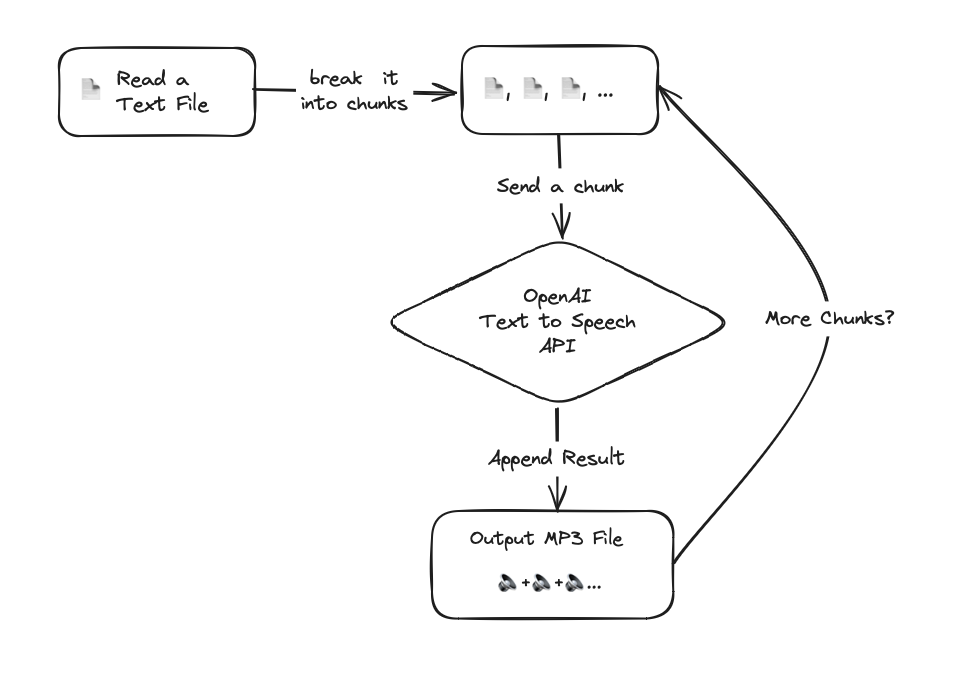

## Introduction

For many people, audiobooks are a staple of daily life.
Spoken content helps people pass time, learn new things, and stay entertained without tying themselves to a screen or a book.
Imagine turning your daily commute, workout sessions, or household chores into opportunities to catch up on _all_ your reading -- not just books.
You can grab text from emails, from the web, or even that report you need to "read" for work.
With the rise of advanced text-to-speech (TTS) technology, it's not just possible, it's quick to build in Java with simple APIs.

For years, text-to-speech solutions supported the assistive community by transforming words on the page into accessible engagement.
However, until recently, robotic voices and unnatural rhythms made TTS unappealing for casual listeners.
If you didn't need TTS, you probably wouldn't have used TTS.

Now, companies like [OpenAI](https://openai.com/api/) revolutionized speech synthesis.
They created voices that sound like humans and not androids and released affordable APIs.
Using these large language models (LLMs), you can enjoy warm, nuanced narration.
So, wouldn't it be great to use this kind of tech to transform any text into an audiobook?

In this tutorial, you'll use LLM voices to transform any text into audiobooks.
You'll build a robust text-to-speech system with OpenAI APIs and Temporal Technology's error mitigation.
Forget about manually checking statuses or handling errors.
Just focus on converting text while Temporal makes sure everything runs smoothly.
When complete, you'll have the skills to reliably convert any plain text file into an audiobook.

Ready to transform your text into immersive audiobooks?
Get started by checking that you have the necessary understanding, tools, and environment set up.

## Prerequisites

You can build the project by following this tutorial or, if you're feeling impation, just grab the ready-to-go source from its [GitHub repo](https://github.com/temporalio/build-audiobook-java).
We won't judge you if you want to get going.
You can come back and read through the how-to and background after playing with the toys first.
Here's what you need to get going:

### 1. A local Java development environment

Follow ["Set up a local development environment"](/getting_started/java/dev_environment/index.md) so you're ready to build Temporal applications with Java.
Ensure a local Temporal Service is running and that you can access the Temporal Web UI from port `8233`.
These services are necessary for you to build and run this project.

### 2. Basic understanding of the Temporal Java SDK

Review the "Hello World in Java" Tutorial. Work through the [Hello World in Java](/getting_started/java/hello_world_in_java/index.md) tutorial.
This covers the basics of getting a Temporal Java SDK project up and running.

### 3. OpenAI API access

Sign up for your [OpenAI API developer account](https://openai.com/api/) and create a bearer token.
You need this token to access OpenAI services for text-to-speech conversion in your project.

### 4. Reference Repository

Whether, you're curious or you want to skip straight to the completed project, check out the [reference repo](https://github.com/temporalio/build-audiobook-java) on GitHub.
This repository contains the full source code and can serve as a guide or a fallback if you encounter issues when working through this tutorial.

If you're all with the prerequisites, it's time to build out your Java project directory.

## Create your Java project structure

### 1. Set Up Your Project Directory

Set up your source code folder hierarchy by issuing this directory creation command:

```sh
mkdir -p TTSWorker/src/main/java/ttsworker
```

Your directory structure should now look like this:

```text
TTSWorker
└── src
    └── main
        └── java
            └── ttsworker
```

You can check it with the Unix `tree` command.
If tree is not native to your system, you can install it with standard package managers like Homebrew and apt-get.

### 2. Initialize Version Control

This is a good time to set up version control if you want to use it with this project.
Using Git, you can initialize your repository:

```sh
cd TTSWorker
git init
```

Version control helps you manage changes and collaborate with others efficiently.
Just like Temporal, it also provides a way to provide check-in points so you can back up if needed and retry your project development. 

3. Create Your Build File

In your root folder, create a build.gradle file and add the following contents.
Feel free to swap in Maven if you prefer:

<!--SNIPSTART audiobook-project-java-Gradle-build-file-->
[build.gradle](https://github.com/temporalio/build-audiobook-java/blob/main/build.gradle)
```gradle
group 'ttspackage'; version '0.0.1'
repositories { mavenCentral() }
apply plugin: 'java'
sourceSets.main.java.srcDirs 'src'

dependencies {
    implementation 'io.temporal:temporal-sdk:1.22.2'
    implementation 'org.slf4j:slf4j-nop:2.0.6' // logging suppression
    implementation 'commons-io:commons-io:2.11.0'
    implementation 'com.squareup.okhttp3:okhttp:4.9.3'
    implementation 'org.json:json:20210307'
}

// Run the App
task run(type: JavaExec) {
    classpath = sourceSets.main.runtimeClasspath
    mainClass = 'ttspackage.TTSWorkerApp'
    standardOutput = System.out
}
```
<!--SNIPEND-->

The run task starts your TTS application using gradle run.

4. Understand Your Dependencies
Your dependencies include Temporal's Java SDK, and a few basic libraries:

com.squareup.okhttp3:okhttp:4.9.3: OkHttp is a basic HTTP client for network requests.
org.json:json:20210307: Parse and manipulate JSON data.
commons-io:commons-io:2.11.0: Perform file tasks with common input/output routines.
org.slf4j:slf4j-nop:2.0.6: Minimizes unnecessary output with logging suppression.
io.temporal:temporal-sdk:1.22.2: Add error mitigation.


Your dependencies include Temporal's [Java SDK](https://github.com/temporalio/sdk-java), and a few basic libraries:

- **com.squareup.okhttp3:okhttp:4.9.3**: OkHttp is a basic HTTP client for network requests.
- **org.json:json:20210307**: Parse and manipulate JSON data.
- **commons-io:commons-io:2.11.0**: Perform file tasks with common input/output routines.
- **org.slf4j:slf4j-nop:2.0.6**: Minimizes unnecessary output with logging suppression.
- **io.temporal:temporal-sdk:1.22.2**: Add error mitigation.

The `run` task starts your TTS application using `gradle run`.

Optionally, create a `bearer.sh` utility and make it executable with `chmod +x`.
Store this wherever you keep similar secure items:

```
#! /bin/sh

setenv OPEN_AI_BEARER_TOKEN 'your-secret-bearer-token'
```

This 'bearer.sh' script sets your OpenAI bearer token as an environment variable.
You must `source /path/to/bearer.sh` to set the variable into your current shell.
Environment variables let you skip hard coding your bearer token into projects.

:::note Your Bearer Token

When using your application, you must set your `OPEN_AI_BEARER_TOKEN` environment variable in the same shell before execution.
The application checks for the token and if it's not set, it will error.

:::

## Create your OpenAI conversion code

Create an interface-implementation pair of files named `TTSActivities.java` and `TTSActivitiesImpl.java`.
Add these to 'src/main/java/ttsworker' and include the following file contents.
This class is responsible for the text-to-speech work in your project:

<details>

<summary>
TTSActivities Source
</summary>

<Tabs groupId="TTSActivities-sources" queryString>
  <TabItem value="TTSActivitiesinterface" label="TTSActivities.java">

<br />
Hover your cursor over the code block to reveal the copy-code option.
<br />
<br />

<!--SNIPSTART audiobook-project-java-tts-interface-->
<!--SNIPEND-->

  </TabItem>
  <TabItem value="TTSActivitiesimplementation" label="TTSActivitiesImpl.java">
  
<br />
Hover your cursor over the code block to reveal the copy-code option.
<br />
<br />

<!--SNIPSTART audiobook-project-java-tts-implementation-->
<!--SNIPEND-->

  </TabItem>
</Tabs>

</details>

Activities, like the `TTSActivities` class, handle potentially unreliable parts of your code, such as calling APIs or working with file systems.
Temporal uses Activities for any action that might have to be retried.
Imagine that the network goes down or your service provider (OpenAI in this case) is temporarily doing maintenance.
Activities add check-in points for your application state, which are maintained in the Temporal system and become part of your conversion history.
Activities let you try your call again in a few seconds, a few minutes, or even later.
The work automatically picks up 

The `TTSActivities` class reads strings from files and converts those strings to audio.
The class contains four activities:

- **`readFile`**: Pass an `inputPath` to a file, and it returns a chunked list of the contents for well-sized API calls.
- **`createTemporaryFile`**:  Ask the system to build a temporary file for audio output in a safe folder that normally cleans itself on reboots.
- **`process`**: Send a text chunk to OpenAI, retrieve the TTS audio segment, and append it to the output file.
- **`moveOutputFileToPlace`**: Find a safe, versioned location for the audio in the same folder as the original text, and move it there.

### Convert text to audio

The `process` activity is the entry point for the TTS process.
It calls `textToSpeech` and appends the result to your output file.
You call it with a string to process and the output destination:

```java
public void process(String chunk, Path outputPath) {
    byte[] audio;

    try {
        audio = textToSpeech(chunk);
    } catch (IOException e) {
        throw new RuntimeException(e);
    }

    try {
        Files.write(outputPath, audio, 
                        java.nio.file.StandardOpenOption.CREATE,
                        java.nio.file.StandardOpenOption.APPEND);
    } catch (IOException e) {
        throw fail("Unable to write to output file", "FILE_ERROR");
    }
}
```

Should the text-to-speech conversion request fail, it uses Temporal to retry its request.
The actual request lives in its own method to make the code cleaner and easier to follow.
Your API request won't work without your OpenAI bearer token, so make sure to set your environment variable before running this app.
The app _will_ check and error early if you forget.
The `TTSActivities` class stores both the bearer token and a canonical path to your input file.
This lets you know where to move your output file after your conversion is done: 

```java
public class TTSActivitiesImpl implements TTSActivities {
    public static String bearerToken = null;
    Path canonicalPath = null;
...
```

```
byte[] textToSpeech(String text) throws IOException {
    String apiEndpoint = "https://api.openai.com/v1/audio/speech";

    OkHttpClient client = new OkHttpClient();
        
    JSONObject json = new JSONObject();
    json.put("model", "tts-1");
    json.put("input", text);
    json.put("voice", "nova"); // see https://platform.openai.com/docs/guides/text-to-speech/voice-options
    json.put("response_format", "mp3");

    MediaType mediaType = MediaType.get("application/json; charset=utf-8");
    RequestBody body = RequestBody.create(json.toString(), mediaType);

    Request request = new Request.Builder()
        .url(apiEndpoint)
        .post(body)
        .addHeader("Authorization", "Bearer " + bearerToken)
        .build();

    try (Response response = client.newCall(request).execute()) {
        if (!response.isSuccessful()) {
            throw new IOException("Unexpected code " + response);
        }
        return response.body().bytes();
    }
}
```

Your `textToSpeech` method calls out to OpenAI to convert a `String` into a `byte[]` array.
It creates the request body, and performs a POST operation to the OpenAI endpoint defined at the class level.

When creating the HTTP request body, customizable [endpoint options](https://platform.openai.com/docs/api-reference/audio/createSpeech) shape the way your audio is built:

- **model** (required): You use the basic low-latency 'tts-1' model in this project.
  Visit [OpenAI TTS](https://platform.openai.com/docs/models/tts) to read about the currently available models, which include both standard and high quality options.
- **input** (required): The maximum length of this string is set at 4096 characters.
- **voice** (required): The 'nova' voice has a high energy "lively tone".
  You can listen to samples of other voices at the [OpenAI Voice Options](https://platform.openai.com/docs/guides/text-to-speech/voice-options) page.
- **response_format**: You'll use the highly portable mp3 output format.

You may want to tweak the request body further.
Some people like to speed up their audio so they get through it quicker.
An optional **speed** parameter (from 0.5 to 4.0, defaults to 1) lets you speed up or slow down the output.
To tune the results to a specific languge so the model takes advantage of native inflections.
Set **language** to an [ISO-639](https://en.wikipedia.org/wiki/List_of_ISO_639_language_codes) code.
OpenAI offers over fifty [supported languages](https://platform.openai.com/docs/guides/text-to-speech/supported-languages).

With the conversion class created, next you'll build two support classes for managing file access and reading and writing data.

## Create file and data handling utility classes

To use your TTS class, you'll need to manage routine tasks of reading and writing data.
For example, you'll want to make sure your input file exists, isn't empty, and can be read.
Also, your project will build your output in a temporary folder using a system-supplied temporary file.
These and other kinds of basic file and data management are handled by your project utility classes.

Create two utility files named FileUtility.java and DataUtility.java in 'src/main/java/ttsworker/utility' and add the content below in the folded Utility Sources.

<details>

<summary>
Utility Sources
</summary>

<Tabs groupId="utiltysources" queryString>
  <TabItem value="fileutilityjava" label="FileUtility.java">

<br />
Hover your cursor over the code block to reveal the copy-code option.
<br />
<br />

<!--SNIPSTART audiobook-project-java-file-utility-class-->
[src/main/java/ttsworker/utility/FileUtility.java](https://github.com/temporalio/build-audiobook-java/blob/main/src/main/java/ttsworker/utility/FileUtility.java)
```java
package ttspackage;

import java.io.IOException;

import java.nio.file.Files;
import java.nio.file.InvalidPathException;
import java.nio.file.LinkOption;
import java.nio.file.Path;
import java.nio.file.Paths;
import java.nio.file.StandardCopyOption;

import java.util.Optional;

import org.apache.commons.io.FilenameUtils;

public class FileUtility {

    /**
     * Validate the input file path as a readable text file.
     *
     * - Creates a canonical path, bypassing symbolic links and file system shortcut symbols.
     * - Checks for `.txt` file extension.
     * - Checks that the file exists and is readable.
     * - Checks that the file is not empty.
     *
     * @param inputPath A String pointing to a text input file.
     * @return An `Optional<Path>` with the validated path, otherwise empty
     */
    public static Optional<Path> validateInputFile(String inputPath) {
        Path filePath;

        if (inputPath == null || inputPath.isEmpty()) {
            return Optional.empty();
        }

        // Resolve ~ and symbolic links if used
        try {
            if (inputPath.startsWith("~")) {
                String home = System.getProperty("user.home");
                inputPath = home + inputPath.substring(1);
            }

            filePath = Paths.get(inputPath)
            .toAbsolutePath().normalize()
            .toRealPath(LinkOption.NOFOLLOW_LINKS);

        } catch (InvalidPathException | IOException e) {
            return Optional.empty();
        }

        // Ensure this is a 'txt' file, exists, and can be read
        if (!inputPath.endsWith(".txt") ||
            !Files.exists(filePath) ||
            !Files.isReadable(filePath)) {
            return Optional.empty();
        }

        // Don't process empty files
        try {
            if (Files.size(filePath) == 0) {
                return Optional.empty();
            }
        } catch (IOException e) {
            return Optional.empty();
        }

        return Optional.of(filePath);
    }

    /**
     * Fetch the content of a text file.
     *
     * - Reads and returns the file contents as a `String`.
     *
     * @param inputPath A `Path` pointing to a text input file.
     * @return An `Optional<String>` with the file contents, otherwise empty.
     */
    public static Optional<String> fetchFileContent(Path inputPath) {
        try {
            String content = Files.readString(inputPath);
            return Optional.of(content);
        } catch (IOException e) {
            return Optional.empty();
        }
    }

    /**
     * Create a temporary file
     *
     * - Uses the System's default temporary-file directory.
     *
     * @return If successful, an `Optional<Path>`, otherwise an empty `Optional`.
     */
    public static Optional<Path> createTemporaryFile() {
        try {
            Path tempFile = Files.createTempFile(null, null);
            return Optional.of(tempFile);
        } catch (IOException e) {
            e.printStackTrace(); // Log the exception if needed
            return Optional.empty();
        }
    }

    /**
     * Replace a `Path` extension with a new extension
     *
     * - Assumes a pre-normalized path.
     *
     * @param inputPath The source file path.
     * @param newExtension The new extension to use.
     * @return An `Optional<Path>` pointing to the updated file, otherwise empty.
     */
    public static Optional<Path> replaceExtension(Path inputPath, String newExtension) {
        try {
            // Get the parent directory
            Path parentDir = inputPath.getParent();

            // Extract the file name without extension
            String baseName = FilenameUtils.getBaseName(inputPath.toString());

            // Create the new file name with the new extension
            String newFileName = baseName + newExtension;

            // Create the new path
            Path newPath = parentDir.resolve(newFileName);
            return Optional.of(newPath);
        } catch (InvalidPathException e) {
            return Optional.empty();
        }
    }

    /**
     * Returns a unique file name by appending a numeric suffix if the proposed path already exists.
     *
     * @param proposedPath The proposed file path as a Path object.
     * @param extension The file extension to use.
     * @return An Optional containing the unique Path if successful, otherwise an empty Optional.
     */
    public static Optional<Path> findUniqueName(Path proposedPath, String extension) {
        if (proposedPath == null || extension == null) {
            return Optional.empty();
        }

        try {
            int suffixCounter = 1;
            String baseName = FilenameUtils.getBaseName(proposedPath.toString());
            Path parentDir = proposedPath.getParent();
            Path newPath = parentDir.resolve(Paths.get(baseName + extension));

            while (Files.exists(newPath)) {
                String newFileName = baseName + "-" + suffixCounter + extension;
                newPath = parentDir.resolve(newFileName);
                suffixCounter += 1;
            }

            return Optional.of(newPath);
        } catch (Exception e) {
            return Optional.empty();
        }
    }

    /**
     * Move a file from the source path to the destination path.
     *
     * @param source the `Path` of the file to be moved.
     * @param destination the `Path` where the file should be moved to.
     * @throws IOException if an error occurs while moving the file.
     */
    public static void moveFile(Path source, Path destination) throws IOException {
        Files.move(source, destination, StandardCopyOption.REPLACE_EXISTING);
    }

}
```
<!--SNIPEND-->

  </TabItem>
  <TabItem value="datautilityjava" label="DataUtility.java">

<br />
Hover your cursor over the code block to reveal the copy-code option.
<br />

<!--SNIPSTART audiobook-project-java-data-utility-class-->
[src/main/java/ttsworker/utility/DataUtility.java](https://github.com/temporalio/build-audiobook-java/blob/main/src/main/java/ttsworker/utility/DataUtility.java)
```java
package ttspackage;

import java.io.File;
import java.io.FileOutputStream;
import java.io.IOException;

import java.nio.file.Files;
import java.nio.file.Path;
import java.nio.file.Paths;

import java.util.ArrayList;
import java.util.List;
import java.util.Optional;
import java.util.StringJoiner;

/**
 * Utility class for chunking and appending data.
 */
public class DataUtility {
    /**
     * The maximum number of tokens allowed in a single text chunk for OpenAI text-to-speech processing.
     *
     * This constant defines the upper limit on the number of tokens that a single chunk of text can contain.
     * This relatively low value reduces the size of the returned audio data.
     */
    private static final int MAX_TOKENS = 512;

    /**
     * The average number of tokens per word used for estimating the size of text chunks.
     *
     * This constant provides an estimate of the average number of tokens per word in the text.
     * This approximates the number of tokens in a given text chunk, helping to split the text efficiently
     * without exceeding the token limit defined by {@code MAX_TOKENS}.
     */
    private static final float AVERAGE_TOKENS_PER_WORD = 1.33f;

    /**
     * Splits the given text into chunks, each chunk not exceeding the max token limit.
     *
     * - Uses an average token per word estimate to split text appropriately.
     * - Ensures that no chunk exceeds the specified max tokens limit.
     *
     * @param text The text to be split into chunks.
     * @return A list of text chunks.
     */
    public static List<String> splitText(String text) {
        List<String> chunks = new ArrayList<>();
        String[] words = text.split("\\s+");
        StringJoiner chunk = new StringJoiner(" ");

        for (String word : words) {
            if ((chunk.length() + word.length()) * AVERAGE_TOKENS_PER_WORD <= MAX_TOKENS) {
                chunk.add(word);
            } else {
                chunks.add(chunk.toString());
                chunk = new StringJoiner(" ");
                chunk.add(word);
            }
        }

        if (chunk.length() > 0) {
            chunks.add(chunk.toString());
        }

        return chunks;
    }

    /**
     * Appends the given data to the specified file.
     *
     * - Uses Path and Files classes for file handling.
     * - Ensures that data is appended to the file.
     *
     * @param data The data to append to the file.
     * @param filePath The path of the file to append to.
     * @throws IOException If an I/O error occurs.
     */
    public static void appendToFile(byte[] data, Path filePath) throws IOException {
        Files.write(filePath, data, java.nio.file.StandardOpenOption.CREATE, java.nio.file.StandardOpenOption.APPEND);
    }
}
```
<!--SNIPEND-->

  </TabItem>
</Tabs>

</details>

The two utility classes have different responsibilities.

- `FileUtility` manages file-system specific tasks. It can:
  - Check if a file exists and can be read
  - Fetch a file's contents
  - Create a temporary system file to store intermediate results
  - Work with file extensions so the input file and the output file share the same base name, such as mytext.txt and mytext.mp3
  - Apply name versioning so you don't overwrite files when you move them
  - Move files so you can take the temporary file and move it next to the input file
- `DataUtility` handles task-specific chores:
  - It breaks down a source string into a list of string chunks of smaller size
  - It knows how to append binary data to an output file

Each of these methods plays into the cycle of processing the text into audio.
Here's an overview of what that process looks like:

<!--  -->

The routines in the classes you just created help you read in a text file, divide it into chunks, send them to OpenAI, and append the audio data results to a file.

As a rule-of-thumb, a typical English word uses 1.33 OpenAI tokens, which is why your code defines that constant.
When working with other languages, you'll want to adjust that value.
Tokens quantify the data processed by OpenAI requests.
All OpenAI endpoints have token limits.
The `DataUtility` class's `splitText` method creates chunks with approximately 512 token for each API request.
Although the OpenAI token limit is higher than this, a conservative approach helps reduce risk:

```java
private static final float AVERAGE_TOKENS_PER_WORD = 1.33f;

public static List<String> splitText(String text) {
    List<String> chunks = new ArrayList<>();
    String[] words = text.split("\\s+");
    StringJoiner chunk = new StringJoiner(" ");

    for (String word : words) {
        if ((chunk.length() + word.length()) * AVERAGE_TOKENS_PER_WORD <= MAX_TOKENS) {
            chunk.add(word);
        } else {
            chunks.add(chunk.toString());
            chunk = new StringJoiner(" ");
            chunk.add(word);
        }
    }

    if (chunk.length() > 0) {
        chunks.add(chunk.toString());
    }

    return chunks;
}
```

Although you haven't yet built the actual flow, all the pieces that power your business logic are in place and ready to be used.
Before you create that flow, you'll need to build two small data classes for your input payload and your process status.
You'll start with the payload.

## Create your input payload data type

Your "payload" for this project is the path to a text file.
This simple datatype is used to start your conversion tasks.
Create InputPayload.java in 'src/main/java/ttsworker/model' and add the following contents:

<!--SNIPSTART audiobook-project-java-InputPayload-data-type-->
[src/main/java/ttsworker/model/InputPayload.java](https://github.com/temporalio/build-audiobook-java/blob/main/src/main/java/ttsworker/model/InputPayload.java)
```java
package ttspackage;

import com.fasterxml.jackson.databind.annotation.JsonDeserialize;

@JsonDeserialize(as = InputPayload.class)
public class InputPayload {
    public String path;

    public InputPayload() { } // support Jackson deserialization

    public InputPayload(String path) {
        this.path = path;
    }
}
```
<!--SNIPEND-->

Next, you'll add the data type for the status.

## Create your status data type

The second data type tracks details used by your utility classes as well as your workflow classes.
It stores Java `Path` fields for the input file, the output file, and the temporary file you'll build during the creation process.
It also stores the text chunks from the original text and a user-facing status `messsage` so you can ask the application how the conversion is going.
You'll use the `message` with a Temporal [Query](https://docs.temporal.io/workflows#query), which lets you peek into ongoing processes.
Create ConversionStatus.java in 'src/main/java/ttsworker/model' and add these contents:

<!--SNIPSTART audiobook-project-java-Conversion-Status-data-type-->
[src/main/java/ttsworker/model/ConversionStatus.java](https://github.com/temporalio/build-audiobook-java/blob/main/src/main/java/ttsworker/model/ConversionStatus.java)
```java
package ttspackage;

import java.nio.file.Path;
import java.util.List;
import com.fasterxml.jackson.databind.annotation.JsonDeserialize;

@JsonDeserialize(as = ConversionStatus.class)
public class ConversionStatus {
    public String inputPathString; // Provided by Workflow input
    public Path inputPath = null; // Source file path
    public Path tempOutputPath = null; // Work file Path
    public Path outputPath = null; // Results file Path
    public List<String> chunks = null; // Batched input text
    public int chunkCount = 1; // Number of text chunks
    public int count = 0; // Number of chunks processed
    public String message = "Text to speech request received"; // User-facing Query text

    public ConversionStatus() {} // Jackson

    public ConversionStatus(String inputPath) {
        this.inputPathString = inputPath;
    }

}
```
<!--SNIPEND-->

With your utility and model files built, there's only one piece left of this project.
It's time to start building your workflow using Temporal's hassle-free error mitigation.

## Define your Workflow with Temporal

You'll use Temporal to power your text-to-speech operation.
A Temporal Workflow will process each conversion.

[Workflows](https://docs.temporal.io/workflows) define the overall flow of your business process.
Conceptually, a Workflow is a sequence of steps written in your programming language.

Workflows orchestrate [Activities](https://docs.temporal.io/activities), which is how you interact with the outside world in Temporal.
You use Activities to make API requests, access the file system, or perform other non-deterministic operations.

The Workflow you'll create in this tutorial uses three activities:

- `setupStatus`: Initializes a process status data type and prepares the data to begin the process.
- `process`: Processes a single chunk of text into audio.
- `moveAudio`: Moves audio from your system's temporary work directory to its destination.


