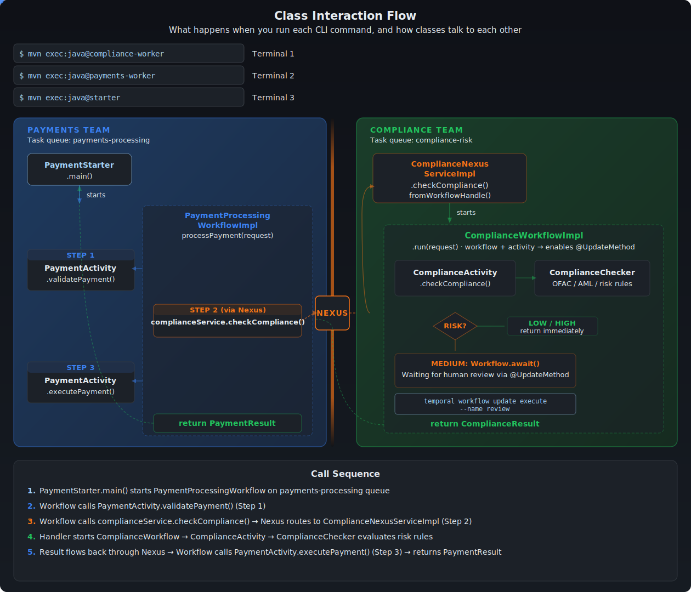
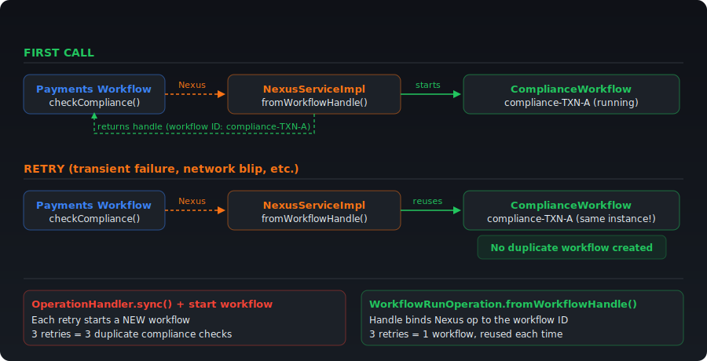
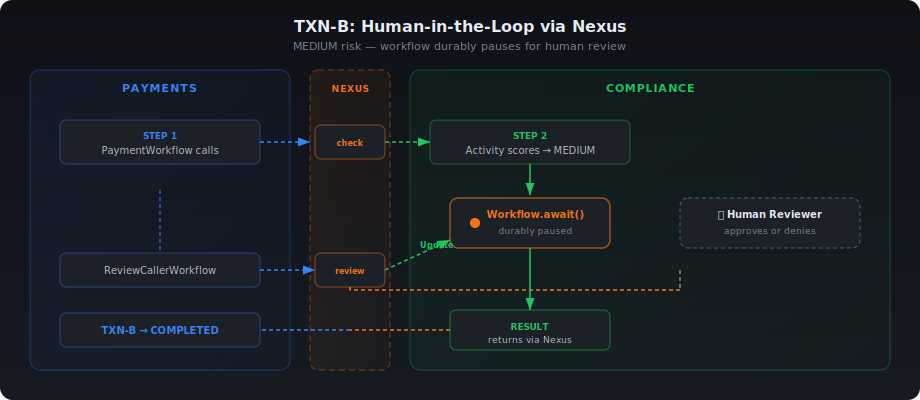

# Decoupling Temporal Services with Nexus

##### Author: Nikolay Advolodkin    |   Editor: Angela Zhou

In this walkthrough, you'll take a monolithic Temporal application — where Payments and Compliance share a single Worker — and split it into two independently deployable services connected through [Temporal Nexus](https://docs.temporal.io/nexus). 

You'll define a shared service contract, implement a synchronous Nexus handler, and rewire the caller — all while keeping the exact same business logic and workflow behavior. By the end, you'll understand how Nexus lets teams decouple without sacrificing durability.

## What you'll learn

- Register a Nexus Endpoint using the Temporal CLI
- Define a shared Nexus Service contract between teams with `@Service` and `@Operation`
- Implement a synchronous Nexus handler with `@ServiceImpl` and `@OperationImpl`
- Swap a local Activity call for a durable cross-team Nexus call
- Inspect Nexus operations in the Web UI Event History

## Prerequisites

Before you begin this walkthrough, ensure you have:

- Knowledge of Java
- Knowledge of Temporal including [Workflows](https://docs.temporal.io/workflows), [Activities](https://docs.temporal.io/activities), and [Workers](https://docs.temporal.io/workers)
- Clone this [repository](https://github.com/temporalio/edu-nexus-code/)

## Scenario

You work at a bank where every payment flows through **three steps**:

1. **Validate** the payment (amount, accounts)
2. **Check compliance** (risk assessment, sanctions screening)
3. **Execute** the payment (call the gateway)

Two teams split this work:

<table>
<tr>
<th>Team</th>
<th>Owns</th>
<th>Task Queue</th>
</tr>
<tr>
<td><strong>Payments</strong></td>
<td>Steps 1 &amp; 3 — validate and execute</td>
<td><code>payments-processing</code></td>
</tr>
<tr>
<td><strong>Compliance</strong></td>
<td>Step 2 — risk assessment &amp; regulatory checks</td>
<td><code>compliance-risk</code></td>
</tr>
</table>

### The Problem

Right now, **both teams' code runs on the same Worker**. One process. One deployment. One blast radius. 

<iframe src="/html/nexus-decouple.html" width="100%" height="900" style={{border: 'none', borderRadius: '8px'}} title="Interactive: Monolith vs Nexus architecture"></iframe>

Compliance ships a bug at 3 AM. Their code crashes. But it's running on the Payments Worker — so **Payments goes down too**. Same blast radius. Same 3 AM page. Two teams, one shared fate.

The obvious fix is microservices with REST calls — but then you're writing retry loops, circuit breakers, and dead letter queues. You've traded one problem for three.

### The Solution: Temporal Nexus

[**Nexus**](https://docs.temporal.io/nexus) gives you team boundaries **with** durability. Each team gets its own Worker, its own deployment pipeline, its own security perimeter, its own blast radius — while Temporal manages the durable, type-safe calls between them.

The Payments workflow calls the Compliance team through a Nexus operation. If the Compliance Worker goes down mid-call, the payment workflow just...waits. When Compliance comes back, it picks up exactly where it left off. No retry logic. No data loss. No 3am page for the Payments team.

The best part? The code change is almost invisible:

```java
// BEFORE (monolith — direct activity call):
ComplianceResult compliance = complianceActivity.checkCompliance(compReq);

// AFTER (Nexus — durable cross-team call):
ComplianceResult compliance = complianceService.checkCompliance(compReq);
```

Same method name. Same input. Same output. Completely different architecture.

Here's what happens when the Compliance Worker goes down mid-call — and why it doesn't matter:



<details>
<summary>Why Nexus over REST or a shared Activity?</summary>

You could split Payments and Compliance into microservices with REST calls. But then you'd write your own retry loops, circuit breakers, and dead letter queues. Here's how the options compare:

| | REST / HTTP | Direct Temporal Activity | Temporal Nexus |
|---|---|---|---|
| **Worker goes down** | Request lost, manual retry | Same crash domain | Workflow pauses, auto-resumes |
| **Retry logic** | Write it yourself | Temporal retries within team | Built-in across the boundary |
| **Type safety** | OpenAPI + code gen | Java interface | Shared Java interface |
| **Human review** | Custom callback URLs | Couple teams together | `@UpdateMethod`, durable wait |
| **Team independence** | Shared failure domain | Shared deployment | Separate Workers, blast radii |
| **Code change** | Full rewrite | — | One-line stub swap |

</details>

> **New to Nexus?** Try the [Nexus Quick Start](https://docs.temporal.io/nexus) for a faster path. Come back here for the full decoupling exercise.

---

## Overview



_The Payments team owns validation and execution (left). The Compliance team owns risk assessment, isolated behind a Nexus boundary (right). Data flows left-to-right — and if the Compliance side goes down mid-check, the payment resumes when it comes back._

<details><summary>What You'll Build</summary>

You'll start with a monolith where everything — the payment workflow, payment activities, and compliance checks — runs on a single Worker. By the end, you'll have two independent Workers: one for Payments and one for Compliance, communicating through a Nexus boundary. 

```text
BEFORE (Monolith):                    AFTER (Nexus Decoupled):
┌─────────────────────────┐           ┌──────────────┐    ┌──────────────┐
│   Single Worker         │           │  Payments    │    │  Compliance  │
│   ─────────────         │           │  Worker      │    │  Worker      │
│   Workflow              │           │  ──────      │    │  ──────      │
│   PaymentActivity       │    →      │  Workflow    │◄──►│  NexusHandler│
│   ComplianceActivity    │           │  PaymentAct  │    │  Checker     │
│                         │           │              │    │              │
│   ONE blast radius      │           │  Blast #1    │    │  Blast #2    │
└─────────────────────────┘           └──────────────┘    └──────────────┘
                                                   ▲ Nexus ▲
```

</details>

---

## Checkpoint 0: Run the Monolith

:::tip
Don't forget to clone [this repository](https://github.com/temporalio/edu-nexus-code/) for the exercise!
:::

Before changing anything, let's see the system working. You need **3 terminal windows** and a running Temporal server. Navigate into the [`java/decouple-monolith/exercise`](https://github.com/temporalio/edu-nexus-code/tree/main/java/decouple-monolith/exercise) directory.

**Terminal 0 — Temporal Server** (if not already running):
```bash
temporal server start-dev
```

**Create namespaces** (one-time setup):
```bash
temporal operator namespace create --namespace payments-namespace
temporal operator namespace create --namespace compliance-namespace
```

**Terminal 1 — Start the monolith Worker:**
```bash
cd exercise
mvn compile exec:java@payments-worker
```

You should see:
```log
Payments Worker started on: payments-processing
Registered: PaymentProcessingWorkflow, PaymentActivity
            ComplianceActivity (monolith — will decouple)
```

**Terminal 2 — Run the starter:**
```bash
cd exercise
mvn compile exec:java@starter
```

**Change the namespace in Temporal UI**. You'll find this on the top of the Web UI.


**Expected results:**

<table>
<tr>
<th>Transaction</th>
<th>Amount</th>
<th>Route</th>
<th>Risk</th>
<th>Result</th>
</tr>
<tr>
<td><code>TXN-A</code></td>
<td>$250</td>
<td>US &#x2192; US</td>
<td>LOW</td>
<td><code>COMPLETED</code></td>
</tr>
<tr>
<td><code>TXN-B</code></td>
<td>$12,000</td>
<td>US &#x2192; UK</td>
<td>MEDIUM</td>
<td><code>COMPLETED</code></td>
</tr>
<tr>
<td><code>TXN-C</code></td>
<td>$75,000</td>
<td>US &#x2192; US</td>
<td>HIGH</td>
<td><code>DECLINED_COMPLIANCE</code></td>
</tr>
</table>

**Checkpoint 0 passed** if all 3 transactions complete with the expected results. The system works! Now let's decouple it.

> **Stop the Worker** (Ctrl+C in Terminal 1) before continuing.

:::tip
** Are you enjoying this tutorial?** [Sign up here](https://pages.temporal.io/get-updates-education) to get notified when we drop new educational content!
:::

---

<details>
<summary>Nexus Building Blocks</summary>

Before diving into code, here's a quick map of the 4 Nexus concepts you'll encounter:

```text
Service    →    Operation    →    Endpoint      →      Registry
(contract)      (method)          (routing rule)      (directory)
```

- [**Nexus Service**](https://docs.temporal.io/nexus/services) — A named collection of operations — the contract between teams. In this tutorial, that's the `ComplianceNexusService` interface. Think of it like the Activity interface you already have, but shared across services instead of internal to one Worker.
- [**Nexus Operation**](https://docs.temporal.io/nexus/operations) — A single callable method on a Service, marked with `@Operation` (e.g., `checkCompliance`). This is the Nexus equivalent of an Activity method — the actual work the other team exposes.
- [**Nexus Endpoint**](https://docs.temporal.io/nexus/endpoints) — A named routing rule that connects a caller to the right Namespace and Task Queue, so the caller doesn't need to know where the handler lives. You create `compliance-endpoint` and point it at the `compliance-risk` task queue.
- [**Nexus Registry**](https://docs.temporal.io/nexus/registry) — The directory in Temporal where all Endpoints are registered. You register the endpoint once; callers look it up by name.

</details>

<details>
<summary>Quick match — test yourself!</summary>

Can you match each Nexus concept to what it represents in our payments scenario?

<iframe src="/html/nexus-quick-match.html" width="100%" height="680" style={{border: 'none', borderRadius: '8px'}} title="Nexus Building Blocks — Quick Match"></iframe>

</details>

---

<details>
<summary>The TODOs</summary>

> **Pre-provided:** The [`ComplianceWorkflow`](https://github.com/temporalio/edu-nexus-code/blob/main/java/decouple-monolith/exercise/src/main/java/compliance/temporal/workflow/ComplianceWorkflow.java) interface and [implementation](https://github.com/temporalio/edu-nexus-code/blob/main/java/decouple-monolith/exercise/src/main/java/compliance/temporal/workflow/ComplianceWorkflowImpl.java) are already complete in the exercise. They use Temporal patterns you've already seen — `@WorkflowMethod`, `@UpdateMethod`, and `Workflow.await()`. Your work starts at **TODO 1** — the Nexus-specific parts.

| # | File | Action | Key Concept |
|---|---|---|---|
| **1** | [`shared/nexus/ComplianceNexusService.java`](https://github.com/temporalio/edu-nexus-code/blob/main/java/decouple-monolith/exercise/src/main/java/shared/nexus/ComplianceNexusService.java) | Your work | `@Service` + `@Operation` on both operations |
| **2** | [`compliance/temporal/ComplianceNexusServiceImpl.java`](https://github.com/temporalio/edu-nexus-code/blob/main/java/decouple-monolith/exercise/src/main/java/compliance/temporal/ComplianceNexusServiceImpl.java) | Your work | `fromWorkflowHandle` (async) + `OperationHandler.sync` (sync) |
| **3** | [`compliance/temporal/ComplianceWorkerApp.java`](https://github.com/temporalio/edu-nexus-code/blob/main/java/decouple-monolith/exercise/src/main/java/compliance/temporal/ComplianceWorkerApp.java) | Your work | Register workflow + Activity + Nexus handler |
| **4** | [`payments/temporal/PaymentProcessingWorkflowImpl.java`](https://github.com/temporalio/edu-nexus-code/blob/main/java/decouple-monolith/exercise/src/main/java/payments/temporal/PaymentProcessingWorkflowImpl.java) | Modify | Replace Activity stub → Nexus stub |
| **5** | [`payments/temporal/PaymentsWorkerApp.java`](https://github.com/temporalio/edu-nexus-code/blob/main/java/decouple-monolith/exercise/src/main/java/payments/temporal/PaymentsWorkerApp.java) | Modify | Add `NexusServiceOptions`, remove `ComplianceActivity` |

**Teaching order:** Service interface (1) → Both handlers (2) → Worker (3, CLI) → Caller (4-5) → Run the human review path.

</details>

---

## What we're building

### Class Interaction Flow



## The Compliance Workflow (already in the exercise)

**Files:** [`compliance/temporal/workflow/ComplianceWorkflow.java` ](https://github.com/temporalio/edu-nexus-code/blob/main/java/decouple-monolith/exercise/src/main/java/compliance/temporal/workflow/ComplianceWorkflow.java) and [`ComplianceWorkflowImpl.java`](https://github.com/temporalio/edu-nexus-code/blob/main/java/decouple-monolith/exercise/src/main/java/compliance/temporal/workflow/ComplianceWorkflowImpl.java)

<details><summary><code>ComplianceWorkflowImpl</code> (condensed)</summary>

```java
public class ComplianceWorkflowImpl implements ComplianceWorkflow {

    @Override // @WorkflowMethod
    public ComplianceResult run(ComplianceRequest request) {
        // Step 1: Run automated compliance check
        autoResult = complianceActivity.checkCompliance(request);

        // 10s durable sleep — gives you a window to test Nexus durability (Checkpoint 3)
        Workflow.sleep(Duration.ofSeconds(10));

        // Step 2: LOW or HIGH risk → return immediately
        if (!"MEDIUM".equals(autoResult.getRiskLevel())) {
            return autoResult;
        }

        // Step 3: MEDIUM risk → wait for human review via Update
        Workflow.await(() -> reviewResult != null);
        return reviewResult;
    }

    @Override // @UpdateMethod
    public ComplianceResult review(boolean approved, String explanation) {
        // Stores the decision and unblocks run()
        this.reviewResult = new ComplianceResult(..., approved, "MEDIUM", explanation);
        return reviewResult;
    }

    @Override // @UpdateValidatorMethod
    public void validateReview(boolean approved, String explanation) {
        // Rejects reviews that arrive at the wrong time
        if (autoResult == null || !"MEDIUM".equals(autoResult.getRiskLevel()))
            throw new IllegalStateException("Workflow is not awaiting review");
        if (reviewResult != null)
            throw new IllegalStateException("Review already submitted");
    }
}
```

</details>

Read the code - you'll see the human-in-the-loop pattern you'll wire up through Nexus later. The three methods:

- **`run()`** — Scores risk via Activity, sleeps 10s (for the durability demo), then either auto-decides (LOW/HIGH) or durably pauses for human review (MEDIUM).
- **`review()`** — Receives the reviewer's approve/deny decision, stores it, and unblocks `run()`.
- **`validateReview()`** — Guards against reviews arriving before the workflow is waiting or after a decision was already made.

:::note
**Why a workflow, not just an Activity?** Using a workflow unlocks [`@UpdateMethod`](https://www.javadoc.io/doc/io.temporal/temporal-sdk/latest/io/temporal/workflow/UpdateMethod.html) for MEDIUM-risk transactions - the workflow can pause and wait durably for a human reviewer's decision. A plain Activity can't do that. In the future, simple cases might just use an Activity, but a workflow gives you durability and human escalation for free.
:::

> **Your work starts below at TODO 1.**

---

## TODO 1: Create the Nexus Service Interface

**File:** [`shared/nexus/ComplianceNexusService.java`](https://github.com/temporalio/edu-nexus-code/blob/main/java/decouple-monolith/exercise/src/main/java/shared/nexus/ComplianceNexusService.java)

This is the **shared contract** between teams — like an OpenAPI spec, but durable. Both teams depend on this interface.

**What to add for TODO 1:**
1. `@Service` annotation on the interface - this registers the interface as a Nexus Service so Temporal knows it's a cross-team contract, not just a regular Java interface.
2. `@Operation` annotation on **both** methods - this marks each method as a callable Nexus Operation. Without it, the method is just a Java method signature that Temporal won't expose through the Nexus boundary.

:::warning
The Nexus runtime validates **all** methods in a `@Service` interface at Worker startup. Every method must have `@Operation` — even ones you won't call right away — or the Worker will fail with `Missing @Operation annotation`.
:::

**Pattern to follow:**
```java
@Service
public interface ComplianceNexusService {
    @Operation
    ComplianceResult checkCompliance(ComplianceRequest request);

    @Operation
    ComplianceResult submitReview(ReviewRequest request);
}
```

:::tip
Look in the [solution directory](https://github.com/temporalio/edu-nexus-code/tree/main/java/decouple-monolith/solution) of the exercise repository if you need a hint!
:::

---

## TODO 2: Implement the Nexus Handlers

**File:** [`compliance/temporal/ComplianceNexusServiceImpl.java`](https://github.com/temporalio/edu-nexus-code/blob/main/java/decouple-monolith/exercise/src/main/java/compliance/temporal/ComplianceNexusServiceImpl.java)

This class implements **both** Nexus operations. You'll use two different handler patterns — one for starting a long-running workflow, one for interacting with an already-running workflow.

:::warning
Just like the interface needs `@Operation` on every method, the handler class needs an `@OperationImpl` method for every operation — or the Worker will fail at startup with `Missing handlers for service operations`.
:::

**What to add for TODO 2:**
1. `@ServiceImpl(service = ComplianceNexusService.class)` on the class — this links the handler to its service interface so Temporal can route incoming Nexus operations to the correct implementation.
2. `@OperationImpl` on each handler method — this marks the method as the handler for a specific Nexus operation. Without it, Temporal won't know which method handles which operation.

<details><summary>Complete implementation of <code>ComplianceNexusServiceImpl.java</code></summary>

```java
@ServiceImpl(service = ComplianceNexusService.class)
public class ComplianceNexusServiceImpl {

    @OperationImpl
    public OperationHandler<ComplianceRequest, ComplianceResult> checkCompliance() {
        return WorkflowRunOperation.fromWorkflowHandle((ctx, details, input) -> {
            WorkflowClient client = Nexus.getOperationContext().getWorkflowClient();
            ComplianceWorkflow wf = client.newWorkflowStub(
                    ComplianceWorkflow.class,
                    WorkflowOptions.newBuilder()
                            .setTaskQueue("compliance-risk")
                            .setWorkflowId("compliance-" + input.getTransactionId())
                            .build());

            return WorkflowHandle.fromWorkflowMethod(wf::run, input);
        });
    }

    @OperationImpl
    public OperationHandler<ReviewRequest, ComplianceResult> submitReview() {
        return OperationHandler.sync((ctx, details, input) -> {
            WorkflowClient client = Nexus.getOperationContext().getWorkflowClient();
            ComplianceWorkflow wf = client.newWorkflowStub(
                    ComplianceWorkflow.class,
                    "compliance-" + input.getTransactionId());
            return wf.review(input.isApproved(), input.getExplanation());
        });
    }
}
```

</details>

This class has two handlers that use different patterns:

- **`checkCompliance`** uses `WorkflowRunOperation.fromWorkflowHandle` — the pattern for **starting** a long-running workflow. It returns a *handle* that binds the Nexus operation to that workflow's ID. On retries (transient failures), Temporal matches on the handle and reuses the existing workflow instead of starting a duplicate.
- **`submitReview`** uses `OperationHandler.sync` — the pattern for **interacting** with an already-running workflow. It looks up the `compliance-{transactionId}` workflow and sends a `review` Update. Sync handlers must complete within 10 seconds — fine here because the Update returns immediately.



<details><summary>Key differences between the two handlers:</summary>

| | `checkCompliance` | `submitReview` |
|---|---|---|
| Pattern | `fromWorkflowHandle` | `OperationHandler.sync` |
| What it does | Starts a new long-running workflow | Sends Update to an existing workflow |
| Durability | Async — workflow runs independently | Sync — must complete in 10 seconds |
| Retry behavior | Retries reuse the same workflow | Update is idempotent if workflow ID is stable |
</details>

### Quick Check

<details>
<summary>Q1: What does <code>@ServiceImpl(service = ComplianceNexusService.class)</code> tell Temporal?</summary>
<code>@ServiceImpl</code> links the handler class to its Nexus service interface. Temporal uses this to route incoming Nexus operations to the correct handler.
</details>

<details><summary>Q2: Why does the handler start a workflow instead of calling <code>ComplianceChecker.checkCompliance()</code> directly?</summary>
Handlers should only use Temporal primitives (workflow starts, queries, updates). Business logic belongs in activities, which are invoked by workflows. This keeps the handler thin and the architecture consistent.</details>

---

## TODO 3: Create the Compliance Worker

**File:** [`compliance/temporal/ComplianceWorkerApp.java`](https://github.com/temporalio/edu-nexus-code/blob/main/java/decouple-monolith/exercise/src/main/java/compliance/temporal/ComplianceWorkerApp.java)

Standard **CRWL** pattern, but now with **three registrations**. Open the file - you'll see the Connect, Factory, and Launch steps are already written. The registration lines are commented out. 

```text
C — Connect to Temporal
R — Create factory and Worker on "compliance-risk"
W — Wire:
    1. worker.registerWorkflowImplementationTypes(ComplianceWorkflowImpl.class)
    2. worker.registerActivitiesImplementations(new ComplianceActivityImpl(new ComplianceChecker()))
    3. worker.registerNexusServiceImplementation(new ComplianceNexusServiceImpl())
L — Launch
```

**Uncomment the three lines** inside the "Wire" section:

```java
// TODO: W — Register workflow, activity, and Nexus handler
worker.registerWorkflowImplementationTypes(ComplianceWorkflowImpl.class);
worker.registerActivitiesImplementations(new ComplianceActivityImpl(new ComplianceChecker()));
worker.registerNexusServiceImplementation(new ComplianceNexusServiceImpl());
```

The first two are patterns you already know. The third is new - `registerNexusServiceImplementation` registers your Nexus handler so the Worker can receive incoming Nexus calls. Same shape, different method name.

The **task queue name** is `compliance-risk` — remember this value. You'll use it again in Checkpoint 1.5 when you create the Nexus endpoint. The endpoint routes incoming Nexus calls to a task queue; the Worker polls that same queue to pick them up. They must match.

---

## Checkpoint 1: Compliance Worker Starts

```bash
cd exercise
mvn compile exec:java@compliance-worker
```

**Checkpoint 1 passed** if you see:
```log
Compliance Worker started on: compliance-risk
```

:::danger
If it fails to compile or crashes at startup, check:
- TODO 1: Does `ComplianceNexusService` have `@Service` and `@Operation` on **both** methods?
- TODO 2: Does `ComplianceNexusServiceImpl` have `@ServiceImpl` and `@OperationImpl` on **both** handlers (`checkCompliance` and `submitReview`)?
- TODO 3: Are you registering the Workflow, Activity, and Nexus service?
:::

> **Keep the compliance Worker running** — you'll need it for Checkpoint 2.

---

## Checkpoint 1.5: Create the Nexus Endpoint

Now that the compliance side is built, register the Nexus endpoint with Temporal. This tells Temporal: *"When someone calls `compliance-endpoint`, route it to the `compliance-risk` task queue in `compliance-namespace`."*

```bash
temporal operator nexus endpoint create \
  --name compliance-endpoint \
  --target-namespace compliance-namespace \
  --target-task-queue compliance-risk
```

You should see:
```log
Endpoint compliance-endpoint created.
```

> **Analogy:** This is like adding a contact to your phone. The endpoint name is the contact name; the task queue + namespace is the phone number. You only do this once.

Without this, the Payments Worker (TODO 5) won't know where to route `ComplianceNexusService` calls.

---

## TODO 4: Replace Activity Stub with Nexus Stub

**File:** [`payments/temporal/PaymentProcessingWorkflowImpl.java`](https://github.com/temporalio/edu-nexus-code/blob/main/java/decouple-monolith/exercise/src/main/java/payments/temporal/PaymentProcessingWorkflowImpl.java)

You're replacing the local Activity stub with a Nexus stub — same method call, but it now crosses a team boundary instead of running in-process.

**What to change for TODO 4:**
1. Replace the `ComplianceActivity` Activity stub with a `ComplianceNexusService` Nexus stub — this swaps the in-process Activity call for a durable cross-team Nexus call. The stub uses `Workflow.newNexusServiceStub` instead of `Workflow.newActivityStub`.
2. Change `complianceActivity.checkCompliance(compReq)` to `complianceService.checkCompliance(compReq)` — same method name, same input, same output.

**BEFORE:**
```java
private final ComplianceActivity complianceActivity =
    Workflow.newActivityStub(ComplianceActivity.class, ACTIVITY_OPTIONS);

// In processPayment():
ComplianceResult compliance = complianceActivity.checkCompliance(compReq);
```

**AFTER:**
```java
private final ComplianceNexusService complianceService = Workflow.newNexusServiceStub(
    ComplianceNexusService.class,
    NexusServiceOptions.newBuilder()
        .setOperationOptions(NexusOperationOptions.newBuilder()
            .setScheduleToCloseTimeout(Duration.ofMinutes(10))
            .build())
        .build());

// In processPayment():
ComplianceResult compliance = complianceService.checkCompliance(compReq);
```

- `Workflow.newNexusServiceStub` replaces `Workflow.newActivityStub` — instead of calling a local Activity, the workflow now makes a durable Nexus call across the team boundary.
- `NexusServiceOptions` with `scheduleToCloseTimeout` replaces `ActivityOptions` with `startToCloseTimeout` — same idea (how long to wait), different scope (cross-team vs in-process).
- The method call (`checkCompliance`) stays identical — the workflow doesn't know or care that the implementation moved to a different Worker.

**What changed:** Drag each Nexus replacement to its monolith equivalent:

<iframe src="/html/nexus-match-change.html" width="100%" height="900" style={{border: 'none', borderRadius: '8px'}} title="Match the Change — Monolith to Nexus"></iframe>

:::tip
**Your feedback shapes what we make next**. Use the Feedback widget on the side to tell us what’s working and what’s missing!
:::

---

## TODO 5: Update the Payments Worker

**File:** [`payments/temporal/PaymentsWorkerApp.java`](https://github.com/temporalio/edu-nexus-code/blob/main/java/decouple-monolith/exercise/src/main/java/payments/temporal/PaymentsWorkerApp.java)

**What to change for TODO 5:**
1. Replace the simple `registerWorkflowImplementationTypes` call with one that includes `NexusServiceOptions` — this maps the `ComplianceNexusService` interface to the `compliance-endpoint` you created in Checkpoint 1.5, so the Worker knows where to route Nexus calls. Register both `PaymentProcessingWorkflowImpl` and `ReviewCallerWorkflowImpl` in the same call.
2. Delete the `ComplianceActivityImpl` registration — compliance now runs on its own Worker via Nexus, so the Payments Worker no longer needs it.

**CHANGE 1:** Register both workflows with `NexusServiceOptions` (maps service to endpoint):
```java
worker.registerWorkflowImplementationTypes(
    WorkflowImplementationOptions.newBuilder()
        .setNexusServiceOptions(Collections.singletonMap(
            "ComplianceNexusService",      // interface name (no package)
            NexusServiceOptions.newBuilder()
                .setEndpoint("compliance-endpoint")  // matches CLI endpoint
                .build()))
        .build(),
    PaymentProcessingWorkflowImpl.class,
    ReviewCallerWorkflowImpl.class);       // both workflows use the same Nexus endpoint
```

Notice the workflow (TODO 4) never references this endpoint — only the Worker does. This keeps the workflow portable: you can point it at a different endpoint in staging vs production without changing workflow code.

**CHANGE 2:** Remove `ComplianceActivityImpl` registration:
```java
// DELETE these lines:
ComplianceChecker checker = new ComplianceChecker();
worker.registerActivitiesImplementations(new ComplianceActivityImpl(checker));
```

> **Analogy:** You're removing the compliance department from your building and adding a phone extension to their new office. The workflow dials the same number (`checkCompliance`), but the call now routes across the street.

<details><summary>New <code>PaymentsWorkerApp.java</code> Code</summary>

```java
package payments.temporal;

import io.temporal.client.WorkflowClient;
import io.temporal.client.WorkflowClientOptions;
import io.temporal.serviceclient.WorkflowServiceStubs;
import io.temporal.worker.Worker;
import io.temporal.worker.WorkerFactory;
import io.temporal.worker.WorkflowImplementationOptions;
import io.temporal.workflow.NexusServiceOptions;
import payments.PaymentGateway;
import payments.Shared;
import payments.temporal.activity.PaymentActivityImpl;

import java.util.Collections;

/**
 * DECOUPLED VERSION — Payments worker with Nexus endpoint mapping.
 *
 * Changes from monolith:
 *   1. Workflow registered with NexusServiceOptions (endpoint mapping)
 *   2. ComplianceActivityImpl registration removed (lives on compliance worker now)
 */
public class PaymentsWorkerApp {

    public static void main(String[] args) {
        // C — Connect to Temporal (payments-namespace)
        WorkflowServiceStubs service = WorkflowServiceStubs.newLocalServiceStubs();
        WorkflowClientOptions clientOptions = WorkflowClientOptions.newBuilder()
                .setNamespace("payments-namespace")
                .build();
        WorkflowClient client = WorkflowClient.newInstance(service, clientOptions);

        // R — Register with Nexus endpoint mapping
        WorkerFactory factory = WorkerFactory.newInstance(client);
        Worker worker = factory.newWorker(Shared.TASK_QUEUE);

        worker.registerWorkflowImplementationTypes(
                WorkflowImplementationOptions.newBuilder()
                        .setNexusServiceOptions(Collections.singletonMap(
                                "ComplianceNexusService",
                                NexusServiceOptions.newBuilder()
                                        .setEndpoint("compliance-endpoint")
                                        .build()))
                        .build(),
                PaymentProcessingWorkflowImpl.class,
                ReviewCallerWorkflowImpl.class);

        // A — Activities (payment only — compliance moved to its own worker)
        PaymentGateway gateway = new PaymentGateway();
        worker.registerActivitiesImplementations(new PaymentActivityImpl(gateway));

        // L — Launch
        factory.start();

        System.out.println("=========================================================");
        System.out.println("  Payments Worker started on: " + Shared.TASK_QUEUE);
        System.out.println("  Namespace: payments-namespace");
        System.out.println("  Registered: PaymentProcessingWorkflow, ReviewCallerWorkflow, PaymentActivity");
        System.out.println("  Nexus: ComplianceNexusService → compliance-endpoint");
        System.out.println("=========================================================");
    }
}
```
</details>

---

## Checkpoint 2: Decoupled End-to-End (Automated Decisions)

You need **4 terminal windows** now:

**Terminal 1:** Temporal server (already running)

**Terminal 2 — Compliance Worker** (already running from Checkpoint 1, or restart):
```bash
cd exercise
mvn compile exec:java@compliance-worker
```

**Terminal 3 — Payments Worker** (restart with your changes):
```bash
cd exercise
mvn compile exec:java@payments-worker
```

**Terminal 4 — Starter:**
```bash
cd exercise
mvn compile exec:java@starter
```

- **TXN-A and TXN-C** take ~10 seconds each (the compliance workflow includes a durable sleep for the Checkpoint 3 demo).
- **TXN-B** is MEDIUM risk — its workflow durably pauses (`Workflow.await()`) until a human reviewer submits a decision. It will stay waiting until you complete the human review path after Checkpoint 3.



**Checkpoint 2 passed** if you see these results:

<table>
<tr>
<th>Transaction</th>
<th>Risk</th>
<th>Result</th>
<th>How</th>
</tr>
<tr>
<td><code>TXN-A</code></td>
<td>LOW</td>
<td><code>COMPLETED</code></td>
<td>Auto-approved (~10s)</td>
</tr>
<tr>
<td><code>TXN-B</code></td>
<td>MEDIUM</td>
<td>Waiting</td>
<td>Paused for human review (you'll complete this after Checkpoint 3)</td>
</tr>
<tr>
<td><code>TXN-C</code></td>
<td>HIGH</td>
<td><code>DECLINED_COMPLIANCE</code></td>
<td>Auto-denied (~10s, amount &gt; $50K)</td>
</tr>
</table>

Two Workers, two blast radii, two independent teams. The automated compliance path works end-to-end through Nexus.

> **Check the Temporal UI** at http://localhost:8233 — you should see Nexus operations in the workflow Event History!

---

## Checkpoint 3: Durability Across the Boundary

This is where it gets fun. Let's prove that Nexus is **durable**.

Both Workers should still be running from Checkpoint 2. If you stopped them, restart them now (`mvn compile exec:java@compliance-worker` and `mvn compile exec:java@payments-worker`). Make sure any previous workflows have completed or been terminated before continuing.

**Terminal 3 — Run the starter:**
```bash
cd exercise
mvn compile exec:java@starter
```

The starter runs TXN-A first. TXN-A has a 10-second durable sleep in `ComplianceWorkflowImpl`. **During that 10-second window:**

**Terminal 1 — Kill the compliance Worker (Ctrl+C)**

Now watch what happens:

1. **Terminal 3 (starter)** — hangs. It's waiting for the TXN-A result. No crash, no error.
2. **Temporal UI** (http://localhost:8233) — open the `payment-TXN-A` workflow. You'll see the Nexus operation in a **backing off** state. Temporal knows the compliance Worker is gone and is waiting for it to come back.

**Terminal 1 — Restart the compliance Worker:**
```bash
cd exercise
mvn compile exec:java@compliance-worker
```

Now watch:

3. **Terminal 1 (compliance Worker)** — picks up the work immediately. You'll see `[ComplianceChecker] Evaluating TXN-A` in the logs.
4. **Terminal 3 (starter)** — TXN-A completes with `COMPLETED`. The starter moves on to TXN-B and TXN-C as if nothing happened.
5. **Temporal UI** — the Nexus operation shows as completed. No retries of the payment workflow. No duplicate compliance checks. The system just resumed.

**Checkpoint 3 passed** if TXN-A completes successfully after you restart the compliance Worker.

**What just happened:** The payment workflow didn't crash. It didn't timeout. It didn't lose data. It didn't need retry logic. It just... waited. When the compliance Worker came back, Temporal automatically routed the pending Nexus operation to it. Durability extends across the team boundary — that's the whole point of Nexus.

---

## Complete the Human Review Path

You already implemented both handlers in TODO 2 — `checkCompliance` (async, `fromWorkflowHandle`) and `submitReview` (sync, `OperationHandler.sync`). Now let's use `submitReview` to approve TXN-B's MEDIUM-risk transaction.

### How the review path works

Three pre-provided files work together to send a human review decision through the Nexus boundary:

**[`ReviewStarter.java`](https://github.com/temporalio/edu-nexus-code/blob/main/java/decouple-monolith/exercise/src/main/java/payments/temporal/ReviewStarter.java)** — Client code that starts the review workflow:
```java
ReviewRequest request = new ReviewRequest("TXN-B", true, "Approved after manual review");
ReviewCallerWorkflow workflow = client.newWorkflowStub(ReviewCallerWorkflow.class, ...);
ComplianceResult result = workflow.submitReview(request);
```

**[`ReviewCallerWorkflowImpl.java`](https://github.com/temporalio/edu-nexus-code/blob/main/java/decouple-monolith/exercise/src/main/java/payments/temporal/ReviewCallerWorkflowImpl.java)** — A thin workflow that calls `submitReview` through the Nexus stub:
```java
public ComplianceResult submitReview(ReviewRequest request) {
    return complianceService.submitReview(request);  // Nexus call
}
```

**Why a workflow instead of calling `temporal workflow update` directly?** Team boundaries. The Payments team doesn't need to know the Compliance team's workflow IDs or internal method names. The review goes through the same Nexus endpoint as `checkCompliance` — the Compliance team controls what's exposed.

The full flow:
1. `ReviewStarter` starts a `ReviewCallerWorkflow` in the **payments** namespace
2. The workflow calls `complianceService.submitReview()` via the Nexus stub
3. Nexus routes to the Compliance team's sync handler (TODO 2b)
4. The handler looks up the `compliance-TXN-B` workflow and sends the `review()` Update
5. The `ComplianceWorkflow` unblocks, returns the result back through Nexus

### Checkpoint: Approve TXN-B via Nexus

Make sure both Workers are running and TXN-B is still waiting from Checkpoint 2. If you need to restart, run the starter again first.

**Terminal 4 — Approve TXN-B via Nexus:**
```bash
cd exercise
mvn compile exec:java@review-starter
```

> **Want to deny instead?** Edit `ReviewStarter.java`, change `true` to `false`, and re-run.

You should see the review result returned in Terminal 4, and back in Terminal 3, TXN-B completes with `COMPLETED`.

**Checkpoint passed** if TXN-B completes with `COMPLETED` after running the review starter.

---

## Quiz

Test your understanding before moving on:

<details><summary>Q1: Where is the Nexus endpoint name (<code>compliance-endpoint</code>) configured?</summary>
In <code>PaymentsWorkerApp</code>, via <code>NexusServiceOptions</code> → <code>setEndpoint("compliance-endpoint")</code>. The workflow only knows the service interface. The Worker knows the endpoint. This separation keeps the workflow portable.
</details>

<details><summary>Q2: What happens if the Compliance Worker is down when the Payments workflow calls <code>checkCompliance()</code>?</summary>
The Nexus operation will be retried by Temporal until the <code>scheduleToCloseTimeout</code> expires (10 minutes in our case). If the Compliance Worker comes back within that window, the operation completes successfully. The Payment workflow just waits — no crash, no data loss.</details>

<details>
<summary>Q3: What's the difference between <code>@Service</code><code>/</code><code>@Operation</code> and <code>@ServiceImpl</code><code>/</code><code>@OperationImpl</code>?</summary>

<ul>
<li><code>@Service</code> / <code>@Operation</code> go on the interface — the shared contract both teams depend on</li>
<li><code>@ServiceImpl</code> / <code>@OperationImpl</code> go on the handler class — the implementation that only the Compliance team owns</li>
</ul>

Think of it as: the interface is the menu (shared), the handler is the kitchen (private).
</details>

<details><summary>Q4: What's wrong with using <code>OperationHandler.sync()</code> to back a Nexus operation with a long-running workflow?</summary>

<code>sync()</code> starts a workflow and blocks for its result in a single handler call. If the Nexus operation retries (which happens during timeouts or transient failures), the handler runs again from scratch — starting a duplicate workflow each time.

The fix is <code>WorkflowRunOperation.fromWorkflowHandle()</code>, which returns a handle (like a receipt number) binding the Nexus operation to that workflow's ID. On retries, the infrastructure sees the handle and reuses the existing workflow instead of creating a new one.

**Bad (creates duplicates on retry):**
```java
OperationHandler.sync((ctx, details, input) -> {
    WorkflowClient client = Nexus.getOperationContext().getWorkflowClient();
    ComplianceWorkflow wf = client.newWorkflowStub(...);
    WorkflowClient.start(wf::run, input);
    return WorkflowStub.fromTyped(wf).getResult(ComplianceResult.class);
});
```

**Good (retries reuse the same workflow):**
```java
WorkflowRunOperation.fromWorkflowHandle((ctx, details, input) -> {
    WorkflowClient client = Nexus.getOperationContext().getWorkflowClient();
    ComplianceWorkflow wf = client.newWorkflowStub(...);
    return WorkflowHandle.fromWorkflowMethod(wf::run, input);
});
```

</details>

<details><summary>Q5: Why does the handler start a workflow instead of calling <code>ComplianceChecker.checkCompliance()</code> directly?</summary>

Sync handlers should only contain **Temporal primitives** — workflow starts and queries. Running arbitrary Java code (like <code>ComplianceChecker.checkCompliance()</code>) in a handler bypasses Temporal's durability guarantees.

The handler starts a ComplianceWorkflow and waits for its result. The actual business logic runs inside an Activity within the workflow, where it gets retries, timeouts, and heartbeats for free. Plus, the workflow can pause for human review via <code>@UpdateMethod</code> — something a direct call could never support.

</details>

---

## What You Built

You started with a monolith and ended with two independent services connected through Nexus:

```text
BEFORE (Monolith):                    AFTER (Nexus Decoupled):
┌─────────────────────────┐           ┌──────────────┐    ┌──────────────┐
│   Single Worker         │           │  Payments    │    │  Compliance  │
│   ─────────────         │           │  Worker      │    │  Worker      │
│   Workflow              │           │  ──────      │    │  ──────      │
│   PaymentActivity       │    →      │  Workflow    │◄──►│  NexusHandler│
│   ComplianceActivity    │           │  PaymentAct  │    │  Checker     │
│                         │           │              │    │              │
│   ONE blast radius      │           │  Blast #1    │    │  Blast #2    │
└─────────────────────────┘           └──────────────┘    └──────────────┘
                                                   ▲ Nexus ▲
```

**Key concepts you used:**

| Concept | What you did |
|---|---|
| `@Service` + `@Operation` | Defined the shared contract between teams |
| `@ServiceImpl` + `@OperationImpl` | Implemented the handler on the Compliance side |
| `fromWorkflowHandle` | Backed a Nexus operation with a long-running workflow (retry-safe) |
| `OperationHandler.sync` | Sent a workflow Update through the Nexus boundary |
| `Workflow.newNexusServiceStub` | Replaced the Activity stub with a Nexus stub (one-line swap) |
| `NexusServiceOptions` | Mapped the service interface to the endpoint in the Worker |
| Nexus Endpoint (CLI) | Registered the routing rule: endpoint name to namespace + task queue |

The fundamental pattern: **same method call, different architecture**. The workflow still calls `checkCompliance()` - but the call now crosses a team boundary with full durability.

## What's Next?

From here you can explore more advanced patterns - multi-step compliance pipelines, async human escalation chains, or cross-namespace Nexus operations. See the [Nexus documentation](https://docs.temporal.io/nexus) to go deeper.

Don't forget to [sign up here](https://pages.temporal.io/get-updates-education) to get notified when we drop new educational content!