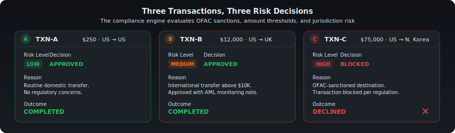
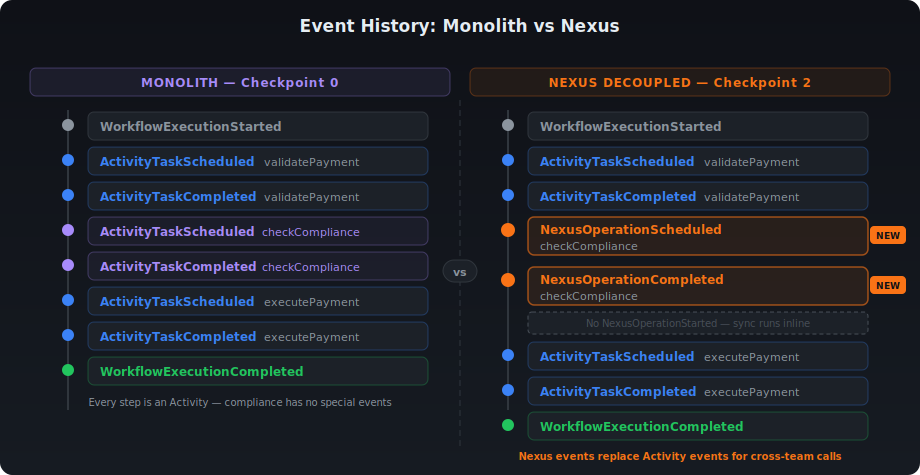

# Decoupling Temporal Services with Nexus

##### Author: Nikolay Advolodkin    |   Editor: Angela Zhou

In this walkthrough, you'll take a monolithic Temporal application — where Payments and Compliance share a single Worker — and split it into two independently deployable services connected through [Temporal Nexus](https://docs.temporal.io/nexus). 

You'll define a shared service contract, implement a synchronous Nexus handler, and rewire the caller — all while keeping the exact same business logic and workflow behavior. By the end, you'll understand how Nexus lets teams decouple without sacrificing durability.

## What you'll learn

- Register a Nexus Endpoint using the Temporal CLI
- Define a shared Nexus Service contract between teams with `@Service` and `@Operation`
- Implement a synchronous Nexus handler with `@ServiceImpl` and `@OperationImpl`
- Swap a local Activity call for a durable cross-team Nexus call
- Inspect Nexus operations in the Web UI event history

## Prerequisites

Before you begin this walkthrough, ensure you have:

- Knowledge of Java
- Knowledge of Temporal including [Workflows](https://docs.temporal.io/workflows), [Activities](https://docs.temporal.io/activities), and [Workers](https://docs.temporal.io/workers)
- Clone this [repository](https://github.com/nadvolod/temporal-warmups/tree/1300a-java/exercise-1300a-nexus-sync/exercise)

## Scenario

You work at a bank where every payment flows through **three steps**:

1. **Validate** the payment (amount, accounts)
2. **Check compliance** (risk assessment, sanctions screening)
3. **Execute** the payment (call the gateway)

Two teams split this work:

<table>
<tr>
<th>Team</th>
<th>Owns</th>
<th>Task Queue</th>
</tr>
<tr>
<td><strong>Payments</strong></td>
<td>Steps 1 &amp; 3 — validate and execute</td>
<td><code>payments-processing</code></td>
</tr>
<tr>
<td><strong>Compliance</strong></td>
<td>Step 2 — risk assessment &amp; regulatory checks</td>
<td><code>compliance-risk</code></td>
</tr>
</table>

### The Problem

Right now, **both teams' code runs on the same Worker**. One process. One deployment. One blast radius. Toggle the interactive diagram below to **Monolith mode** to see what this looks like — click on any component to explore how the pieces fit together:

<iframe src="/html/nexus-decouple.html" width="100%" height="900" style={{border: 'none', borderRadius: '8px'}} title="Interactive: Monolith vs Nexus architecture"></iframe>

That's a problem because the Compliance team deals with sensitive regulatory work — OFAC sanctions screening, anti-money laundering (AML) monitoring, risk decisions — that requires stricter access controls, separate audit trails, and its own release cycle. Payments has none of those constraints. But because both teams share a single process, they're forced into the same failure domain, the same security perimeter, and the same deploy pipeline.

In practice, that shared fate plays out like this: Compliance ships a bug at 3 AM. Their code crashes. But it's running on the Payments Worker — so **Payments goes down too**. Same blast radius. Same 3 AM page. Two teams, one shared fate.

The obvious fix is splitting them into microservices with REST calls. But that introduces a new problem: if Compliance is down when Payments calls it, the request is lost. No retries. No durability. You're writing your own retry loops, circuit breakers, and dead letter queues. You've traded one problem for three.

### The Solution: Temporal Nexus

[**Nexus**](https://docs.temporal.io/nexus) gives you team boundaries **with** durability. Each team gets its own Worker, its own deployment pipeline, its own security perimeter, its own blast radius — while Temporal manages the durable, type-safe calls between them.

The Payments workflow calls the Compliance team through a Nexus operation. If the Compliance Worker goes down mid-call, the payment workflow just...waits. When Compliance comes back, it picks up exactly where it left off. No retry logic. No data loss. No 3am page for the Payments team.

The best part? The code change is almost invisible:

```java
// BEFORE (monolith — direct activity call):
ComplianceResult compliance = complianceActivity.checkCompliance(compReq);

// AFTER (Nexus — durable cross-team call):
ComplianceResult compliance = complianceService.checkCompliance(compReq);
```

Same method name. Same input. Same output. Completely different architecture.

---

## Overview


_The Payments team owns validation and execution (left). The Compliance team owns risk assessment, isolated behind a Nexus boundary (right). Data flows left-to-right — and if the Compliance side goes down mid-check, the payment resumes when it comes back._

### What You'll Build

You'll start with a monolith where everything — the payment workflow, payment activities, and compliance checks — runs on a single Worker. By the end, you'll have two independent Workers: one for Payments and one for Compliance, communicating through a Nexus boundary. 

```text
BEFORE (Monolith):                    AFTER (Nexus Decoupled):
┌─────────────────────────┐           ┌──────────────┐    ┌──────────────┐
│   Single Worker         │           │  Payments    │    │  Compliance  │
│   ─────────────         │           │  Worker      │    │  Worker      │
│   Workflow              │           │  ──────      │    │  ──────      │
│   PaymentActivity       │    →      │  Workflow    │◄──►│  NexusHandler│
│   ComplianceActivity    │           │  PaymentAct  │    │  Checker     │
│                         │           │              │    │              │
│   ONE blast radius      │           │  Blast #1    │    │  Blast #2    │
└─────────────────────────┘           └──────────────┘    └──────────────┘
                                              ▲ Nexus ▲
```

---

## Checkpoint 0: Run the Monolith

Before changing anything, let's see the system working. Open the repository you've cloned, then open **3 terminal windows** and a running Temporal server.

**Terminal 0 — Temporal Server** (if not already running):
```bash
temporal server start-dev
```

**Terminal 1 — Start the monolith worker:**
```bash
cd exercise-1300a-nexus-sync/exercise
mvn compile exec:java@payments-worker
```

You should see:
```log
Payments Worker started on: payments-processing
Registered: PaymentProcessingWorkflow, PaymentActivity
            ComplianceActivity (monolith — will decouple)
```

**Terminal 2 — Run the starter.** The starter kicks off **three executions** of the same `PaymentProcessingWorkflow` — each with a different transaction that exercises a different risk level:
```bash
cd exercise-1300a-nexus-sync/exercise
mvn compile exec:java@starter
```

You'll see **three completed executions** of the `PaymentProcessingWorkflow`:



**Expected results:**

<table>
<tr>
<th>Transaction</th>
<th>Amount</th>
<th>Route</th>
<th>Risk</th>
<th>Result</th>
</tr>
<tr>
<td><code>TXN-A</code></td>
<td>$250</td>
<td>US &#x2192; US</td>
<td>LOW</td>
<td><code>COMPLETED</code></td>
</tr>
<tr>
<td><code>TXN-B</code></td>
<td>$12,000</td>
<td>US &#x2192; UK</td>
<td>MEDIUM</td>
<td><code>COMPLETED</code></td>
</tr>
<tr>
<td><code>TXN-C</code></td>
<td>$75,000</td>
<td>US &#x2192; North Korea</td>
<td>HIGH</td>
<td><code>DECLINED_COMPLIANCE</code></td>
</tr>
</table>

**Checkpoint 0 passed** if all 3 transactions complete with the expected results. The system works! Now let's decouple it.

> **Stop the Worker** (Ctrl+C in Terminal 1) before continuing.

:::tip
** Are you enjoying this tutorial?** Feel free to leave feedback with the Feedback widget on the side and [sign up here](https://pages.temporal.io/get-updates-education) to get notified when we drop new educational content!
:::

---

## Nexus Building Blocks

You already know how to expose logic as an **Activity** on a Worker. Nexus adds four concepts that let you expose that same logic **across team boundaries**:

```text
Service    →    Operation    →    Endpoint    →    Registry
(contract)      (method)          (routing rule)    (directory)
```

- [**Nexus Service**](https://docs.temporal.io/nexus/services) — A named collection of operations — the contract between teams. In this tutorial, that's the `ComplianceNexusService` interface. Think of it like the Activity interface you already have, but shared across services instead of internal to one Worker.
- [**Nexus Operation**](https://docs.temporal.io/nexus/operations) — A single callable method on a Service, marked with `@Operation` (e.g., `checkCompliance`). This is the Nexus equivalent of an Activity method — the actual work the other team exposes.
- [**Nexus Endpoint**](https://docs.temporal.io/nexus/endpoints) — A named routing rule that connects a caller to the right Namespace and Task Queue, so the caller doesn't need to know where the handler lives. You create `compliance-endpoint` and point it at the `compliance-risk` task queue.
- [**Nexus Registry**](https://docs.temporal.io/nexus/registry) — The directory in Temporal where all Endpoints are registered. You register the endpoint once; callers look it up by name.

In this exercise, you'll define a **Service** with an **Operation** (TODOs 1-2), then create an **Endpoint** in the **Registry** (Checkpoint 0.5) so the Payments team can reach it.

### Quick match

**Test yourself**: can you match each Nexus concept to what it represents in our payments scenario?

<iframe src="/html/nexus-quick-match.html" width="100%" height="700" style={{border: 'none', borderRadius: '8px'}} title="Nexus Building Blocks — Quick Match"></iframe>

---

## Your 5-Step Decoupling Plan

In this exercise, you're going to pull Compliance out of the Payments Worker and into its own independent Worker, connected through a Nexus boundary. Steps 1-3 build the Compliance side (contract, handler, Worker), and steps 4-5 rewire the Payments side to call it through Nexus instead of a local Activity.

<table>
<tr>
<th>#</th>
<th>File</th>
<th>Action</th>
<th>Key Concept</th>
</tr>
<tr>
<td><strong>1</strong></td>
<td><code>shared/nexus/ComplianceNexusService.java</code></td>
<td>Create</td>
<td>Shared contract between teams</td>
</tr>
<tr>
<td><strong>2</strong></td>
<td><code>compliance/temporal/ComplianceNexusServiceImpl.java</code></td>
<td>Create</td>
<td>Compliance handles incoming Nexus calls</td>
</tr>
<tr>
<td><strong>3</strong></td>
<td><code>compliance/temporal/ComplianceWorkerApp.java</code></td>
<td>Create</td>
<td>Compliance gets its own worker</td>
</tr>
<tr>
<td><strong>4</strong></td>
<td><code>payments/temporal/PaymentProcessingWorkflowImpl.java</code></td>
<td>Modify</td>
<td>One-line swap changes the architecture</td>
</tr>
<tr>
<td><strong>5</strong></td>
<td><code>payments/temporal/PaymentsWorkerApp.java</code></td>
<td>Modify</td>
<td>Payments points to the new endpoint</td>
</tr>
</table>

---

## Checkpoint 0.5: Create the Nexus Endpoint

Before implementing the TODOs, register a [Nexus endpoint](https://docs.temporal.io/glossary#nexus-endpoint) with Temporal. This creates the routing rule that connects the endpoint name (`compliance-endpoint`) to the Compliance Worker's task queue (`compliance-risk`) — without it, the Payments workflow has no way to reach the Compliance side.

```bash
temporal operator nexus endpoint create \
  --name compliance-endpoint \
  --target-namespace default \
  --target-task-queue compliance-risk
```

You should see:
```log
Endpoint compliance-endpoint created.
```

> **Analogy:** This is like adding a contact to your phone. The endpoint name is the contact name; the task queue is the phone number. You only do this once.

---

## TODO 1: Create the Nexus Service Interface

**File:** `shared/nexus/ComplianceNexusService.java`

This is the **shared contract** between teams — like an OpenAPI spec, but durable. Both teams depend on this interface; neither needs to know about the other's internals.

**What to add:**
1. `@Service` annotation on the interface — marks this as a Nexus service that Temporal can discover and route to
2. One method: `checkCompliance(ComplianceRequest) → ComplianceResult` — the single operation the Compliance team exposes
3. `@Operation` annotation on that method — marks it as a callable Nexus operation (a service can have multiple operations, but we only need one here)

:::tip
Look in the `solution` directory if you need a hint.
:::

**Pattern to follow:**
```java
@Service
public interface ComplianceNexusService {
    @Operation
    ComplianceResult checkCompliance(ComplianceRequest request);
}
```

:::tip 
**Tip:** The `@Service` and `@Operation` annotations come from `io.nexusrpc`, NOT from `io.temporal`. Nexus is a protocol — Temporal implements it, but the interface annotations are protocol-level.
:::
---

## TODO 2: Implement the Nexus Handler

**File:** `compliance/temporal/ComplianceNexusServiceImpl.java`

_This is the **waiter** that takes orders from the Payments team and passes them to the **chef** (ComplianceChecker)._

**Two new annotations:**
- `@ServiceImpl(service = ComplianceNexusService.class)` — goes on the class; tells Temporal "this is the implementation of the contract from TODO 1"
- `@OperationImpl` — goes on each handler method; pairs it with the matching `@Operation` in the interface

**What to implement:**
1. Add `@ServiceImpl` annotation pointing to the interface
2. Add a `ComplianceChecker` field and accept it via constructor — the handler receives requests but delegates the actual work to the checker
3. Create a `checkCompliance()` method that returns `OperationHandler<ComplianceRequest, ComplianceResult>` — this is Nexus's wrapper type that lets Temporal handle retries, timeouts, and routing for you
4. Inside that method, return `WorkflowClientOperationHandlers.sync((ctx, details, client, input) -> checker.checkCompliance(input))` — `sync` means the operation runs inline and returns a result right away, as opposed to `async` which would kick off a full workflow (you'll see that in a later exercise).

:::tip
**Key insight:** The handler method name must **exactly match** the interface method name. `checkCompliance` in the interface = `checkCompliance()` in the handler. Temporal matches by name.
:::

:::tip
**Common trap:** Don't write `class ComplianceNexusServiceImpl implements ComplianceNexusService`. The handler does **not** implement the interface — the signatures are completely different. The interface method returns `ComplianceResult`, but the handler method returns `OperationHandler<ComplianceRequest, ComplianceResult>`. The link between them is the `@ServiceImpl` annotation, not Java's `implements`.
:::

### Quick Check

<details>
<summary>
What does <code>@ServiceImpl(service = ComplianceNexusService.class)</code> tell Temporal?
</summary>

`@ServiceImpl` links the handler class to its Nexus service interface. Temporal uses this to route incoming Nexus operations to the correct handler.

</details>

<details>
<summary>Why does <code>checkCompliance()</code> return <code>OperationHandler&lt;ComplianceRequest, ComplianceResult&gt;</code> instead of returning <code>ComplianceResult</code> directly?</summary>

The method returns an `OperationHandler` — a description of *how* to process the operation (sync vs async, which lambda to run). Temporal calls this handler when a request arrives. Think of it as returning a recipe, not the meal.

</details>

---

## TODO 3: Create the Compliance Worker

**File:** `compliance/temporal/ComplianceWorkerApp.java`

Standard **CRAWL** pattern with one new step:

```text
C — Connect to Temporal
R — Register (no workflows in this Worker)
A — Activities (none — logic lives in the Nexus handler)
W — Wire the Nexus service implementation  ← NEW
L — Launch
```

**The key new method:**
```java
worker.registerNexusServiceImplementation(
    new ComplianceNexusServiceImpl(new ComplianceChecker())
);
```

Compare to what you already know:
```java
// Activities (you've done this before):
worker.registerActivitiesImplementations(...)

// Nexus (new — same shape, different method name):
worker.registerNexusServiceImplementation(...)
```

**Task queue:** `"compliance-risk"` — must match the `--target-task-queue` from the CLI endpoint creation.

---

## Checkpoint 1: Compliance Worker Starts

```bash
cd exercise-1300a-nexus-sync/exercise
mvn compile exec:java@compliance-worker
```

**Checkpoint 1 passed** if you see:
```log
Compliance Worker started on: compliance-risk
```

:::warning
If it fails to compile, check:
- `TODO 1`: Does `ComplianceNexusService` have `@Service` and `@Operation`?
- `TODO 2`: Does `ComplianceNexusServiceImpl` have `@ServiceImpl` and `@OperationImpl`?
- `TODO 3`: Are you connecting to Temporal and registering the Nexus service?
:::

> **Keep the compliance Worker running** — you'll need it for Checkpoint 2.

---

## TODO 4: Replace Activity Stub with Nexus Stub

**File:** `payments/temporal/PaymentProcessingWorkflowImpl.java`

This is the **key teaching moment**. Instead of calling compliance as a local Activity (which runs on the same Worker), you'll call it through a Nexus service stub (which routes the request across the Nexus boundary to the Compliance Worker). The workflow code barely changes — you're swapping *how* the call is routed, not *what* is being called.

**BEFORE — local Activity call (runs on this Worker):**
```java
private final ComplianceActivity complianceActivity =
    Workflow.newActivityStub(ComplianceActivity.class, ACTIVITY_OPTIONS);

// In processPayment():
ComplianceResult compliance = complianceActivity.checkCompliance(compReq);
```

**AFTER — Nexus call (routes to the Compliance Worker):**
```java
private final ComplianceNexusService complianceService = Workflow.newNexusServiceStub(
    ComplianceNexusService.class,
    NexusServiceOptions.newBuilder()
        .setOperationOptions(NexusOperationOptions.newBuilder()
            .setScheduleToCloseTimeout(Duration.ofMinutes(2))
            .build())
        .build());

// In processPayment():
ComplianceResult compliance = complianceService.checkCompliance(compReq);
```

The `scheduleToCloseTimeout` is how long the workflow is willing to wait for the Nexus operation to complete. If the Compliance Worker is slow or down, the workflow waits up to this limit before failing. Think of it like the Activity `startToCloseTimeout`, but for cross-boundary calls.

**What changed:**

<table>
<tr>
<th>Before (Monolith)</th>
<th>After (Nexus)</th>
</tr>
<tr>
<td><code>Workflow.newActivityStub()</code></td>
<td><code>Workflow.newNexusServiceStub()</code></td>
</tr>
<tr>
<td><code>ComplianceActivity.class</code></td>
<td><code>ComplianceNexusService.class</code></td>
</tr>
<tr>
<td><code>ActivityOptions</code></td>
<td><code>NexusServiceOptions</code> + <code>scheduleToCloseTimeout</code></td>
</tr>
<tr>
<td><code>complianceActivity.</code></td>
<td><code>complianceService.</code></td>
</tr>
</table>

**What stayed the same:**
- `.checkCompliance(compReq)` — identical call
- `ComplianceResult` — same return type
- All surrounding logic — untouched

> **Where does the endpoint come from?** Not here! The workflow only knows the **service** (`ComplianceNexusService`). The **endpoint** (`"compliance-endpoint"`) is configured in the worker (TODO 5). This keeps the workflow portable.

### Quick Check

<details>
<summary>Why does the workflow use <code>ComplianceNexusService.class</code> but NOT specify the endpoint name <code>"compliance-endpoint"</code>?</summary>

The workflow only knows the **service contract** (the interface). The **endpoint** (where the call actually routes) is configured in the Worker (TODO 5). This separation keeps the workflow portable — you could point it at a different endpoint (staging, production) without changing workflow code.

</details>

---

## TODO 5: Update the Payments Worker

**File:** `payments/temporal/PaymentsWorkerApp.java`

Two changes:

**CHANGE 1:** Register the workflow with `NexusServiceOptions`:
```java
worker.registerWorkflowImplementationTypes(
    WorkflowImplementationOptions.newBuilder()
        .setNexusServiceOptions(Collections.singletonMap(
            "ComplianceNexusService",      // interface name (no package)
            NexusServiceOptions.newBuilder()
                .setEndpoint("compliance-endpoint")  // matches CLI endpoint
                .build()))
        .build(),
    PaymentProcessingWorkflowImpl.class);
```

**CHANGE 2:** Remove `ComplianceActivityImpl` registration:
```java
// DELETE these lines:
ComplianceChecker checker = new ComplianceChecker();
worker.registerActivitiesImplementations(new ComplianceActivityImpl(checker));
```

> **Analogy:** You're removing the compliance department from your building and adding a phone extension to their new office. The workflow dials the same number (`checkCompliance`), but the call now routes across the street.

---

## Checkpoint 2: Full Decoupled End-to-End

You need **4 terminal windows** now:

**Terminal 0:** Temporal server (already running)

**Terminal 1 — Compliance worker** (already running from Checkpoint 1, or restart):
```bash
cd exercise-1300a-nexus-sync/exercise
mvn compile exec:java@compliance-worker
```

**Terminal 2 — Payments worker** (restart with your changes):
```bash
cd exercise-1300a-nexus-sync/exercise
mvn compile exec:java@payments-worker
```

**Terminal 3 — Starter:**
```bash
cd exercise-1300a-nexus-sync/exercise
mvn compile exec:java@starter
```

**Checkpoint 2 passed** if you get the **exact same results** as Checkpoint 0:

<table>
<tr>
<th>Transaction</th>
<th>Risk</th>
<th>Result</th>
</tr>
<tr>
<td><code>TXN-A</code></td>
<td>LOW</td>
<td><code>COMPLETED</code></td>
</tr>
<tr>
<td><code>TXN-B</code></td>
<td>MEDIUM</td>
<td><code>COMPLETED</code></td>
</tr>
<tr>
<td><code>TXN-C</code></td>
<td>HIGH</td>
<td><code>DECLINED_COMPLIANCE</code></td>
</tr>
</table>

Same results, completely different architecture. Two workers, two blast radii, two independent teams.

**What just happened at runtime?** Your Payments workflow scheduled a Nexus operation → Temporal looked up `compliance-endpoint` in the Registry → routed the request to the `compliance-risk` task queue → the Compliance worker picked up the Nexus task, ran `checkCompliance()`, and returned the result → Temporal recorded it in the caller's workflow history. All durable, all automatic.

> **Check the Temporal UI** at http://localhost:8233. Open any completed workflow's Event History. You'll see two new event types that weren't there in Checkpoint 0:
> - [`NexusOperationScheduled`](https://docs.temporal.io/references/events#nexusoperationscheduled) — the workflow asked Temporal to route a call
> - [`NexusOperationCompleted`](https://docs.temporal.io/references/events#nexusoperationcompleted) — the result came back
>
> Notice there's no [`NexusOperationStarted`](https://docs.temporal.io/references/events#nexusoperationstarted) event. That's because this is a **sync** operation — it ran inline and returned immediately. In the next exercise (async), you'll see all three events.



---

## Victory Lap: Durability Across the Boundary

This is where it gets fun. Let's prove that Nexus is **durable** — not just a fancy RPC.

1. **Start both workers** (if not already running)
2. **Run the starter** in another terminal
3. **While TXN-B is processing**, kill the compliance worker (Ctrl+C in Terminal 1)
4. Watch the payment workflow **pause** — it's waiting for the Nexus operation to complete
5. **Restart the compliance worker**
6. Watch the payment workflow **resume and complete**

The payment workflow didn't crash. It didn't timeout. It didn't lose data. It just... waited. Because Temporal + Nexus handles this automatically.

> **Try this with REST:** Kill the compliance service mid-request. What happens? Connection reset. Transaction lost. 3am page. With Nexus, the workflow simply picks up where it left off.

---
## Bonus Exercise: What Happens When You Wait Too Long?

You saw the workflow **wait** for the compliance worker to come back. But what if it never comes back?

**Try this:**

1. Start both Workers and the Starter
2. Kill the compliance Worker while a transaction is processing
3. **Don't restart it.** Wait and watch the Temporal UI at http://localhost:8233

<details>
<summary>What eventually happens to the payment Workflow?</summary>

The Nexus operation fails with a `SCHEDULE_TO_CLOSE` timeout after 2 minutes. The workflow's `catch` block handles it — the payment gets status `FAILED` instead of hanging forever.

This is the `scheduleToCloseTimeout` you set in TODO 4:

```java
NexusOperationOptions.newBuilder()
    .setScheduleToCloseTimeout(Duration.ofMinutes(2))
```

**The lesson:** Nexus gives you durability, not infinite patience. You control how long the workflow is willing to wait. In production, you'd set this based on your SLA — maybe 30 seconds for a real-time payment, or 24 hours for a batch compliance review.

</details>

## Quiz

<details>
<summary>Where is the Nexus endpoint name <code>(compliance-endpoint)</code> configured?</summary>

In `PaymentsWorkerApp`, via `NexusServiceOptions` → `setEndpoint("compliance-endpoint")`. The **workflow** only knows the service interface. The **worker** knows the endpoint. This separation keeps the workflow portable.

</details>

<details>
<summary>What happens if the Compliance worker is down when the Payments workflow calls <code>checkCompliance()</code>?</summary>

The Nexus operation will be retried by Temporal until the `scheduleToCloseTimeout` expires (2 minutes in our case). If the Compliance worker comes back within that window, the operation completes successfully. The Payment workflow just waits — no crash, no data loss.

</details>

<details>
<summary>What's the difference between <code>@Service/@Operation</code> and <code>@ServiceImpl/@OperationImpl</code>?
</summary>

- `@Service` / `@Operation` (from `io.nexusrpc`) go on the **interface** — the shared contract both teams depend on
- `@ServiceImpl` / `@OperationImpl` (from `io.nexusrpc.handler`) go on the **handler class** — the implementation that only the Compliance team owns

Think of it as: the interface is the **menu** (shared), the handler is the **kitchen** (private).

</details>

<details>
<summary>What if <code>ComplianceChecker.checkCompliance()</code> throws an exception instead of returning <code>approved=false?</code></summary>

The Nexus Machinery treats unknown errors as **retryable** by default. It will automatically retry the operation with backoff until the `scheduleToCloseTimeout` (2 minutes) expires. If you want to fail immediately (no retries), throw a non-retryable `ApplicationFailure`. Same principle as Activities, but with a built-in retry policy you don't configure yourself.

</details>

---

## What's Next?

You've just learned the fundamental Nexus pattern: **same method call, different architecture**.

From here you can explore **async Nexus handlers** using `fromWorkflowMethod()` — where the Compliance side starts a full Temporal workflow instead of running inline. That's where Nexus truly shines: long-running, durable operations across team boundaries. See the [Nexus documentation](https://docs.temporal.io/nexus) to go deeper.