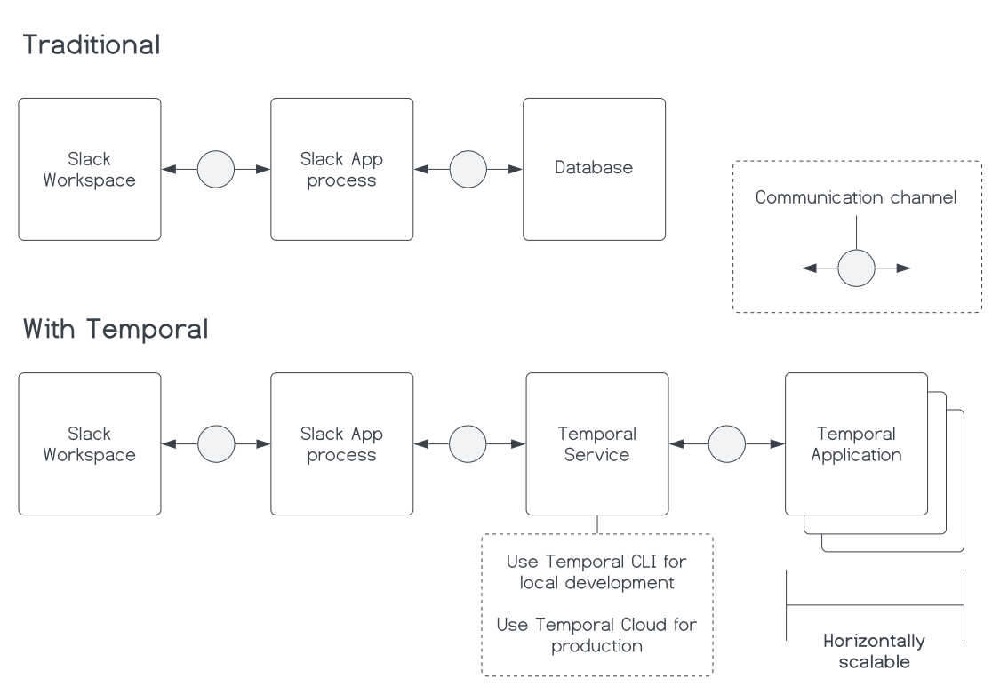
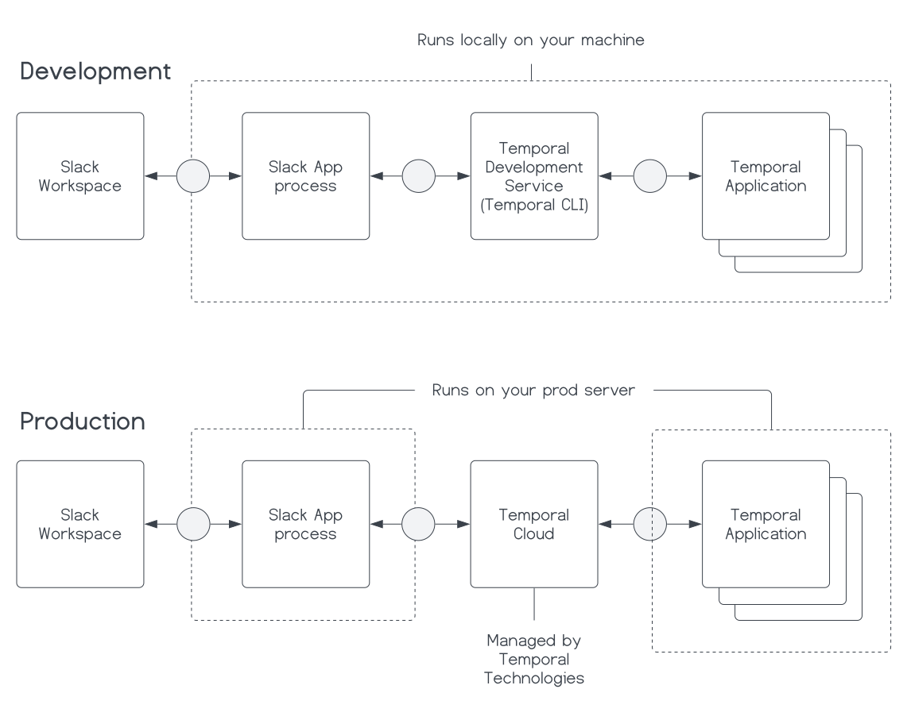
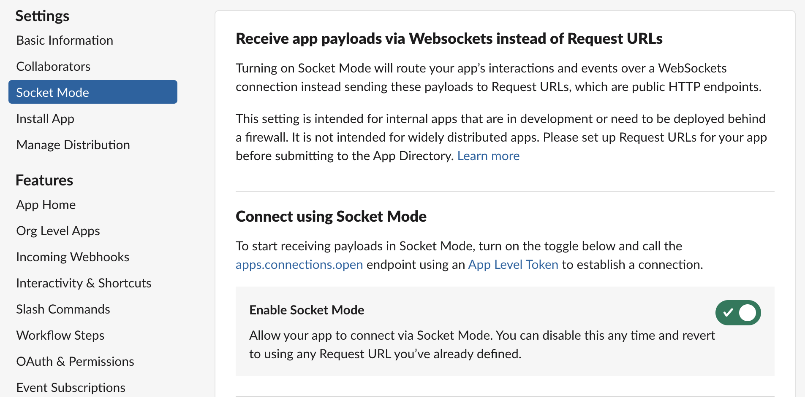
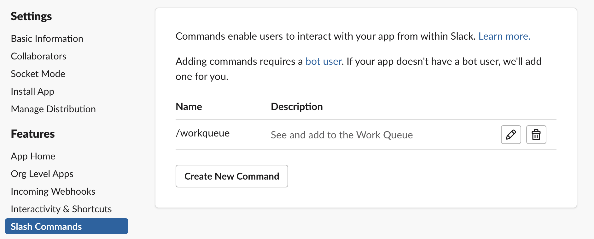
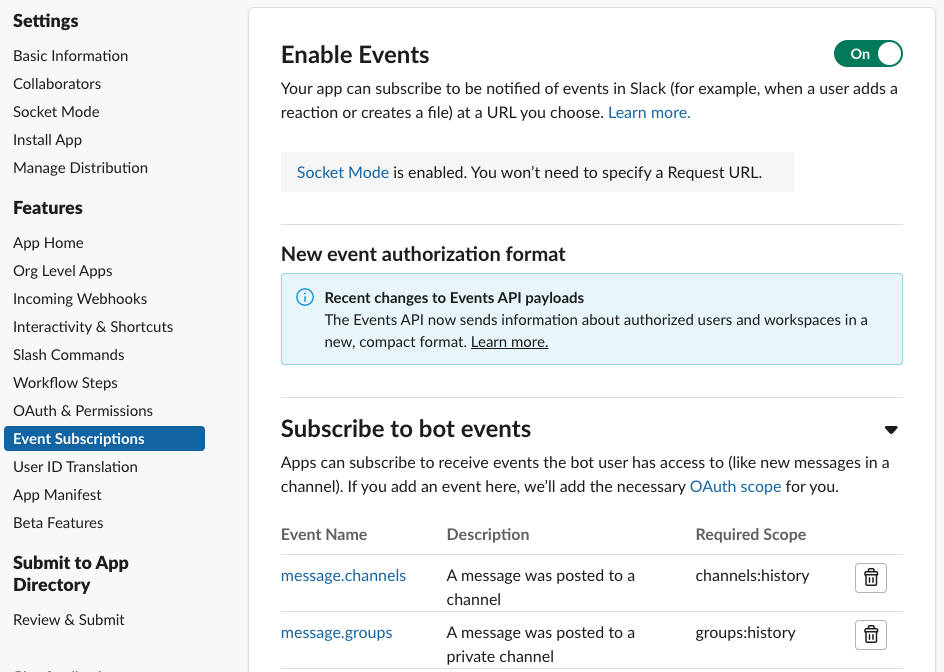
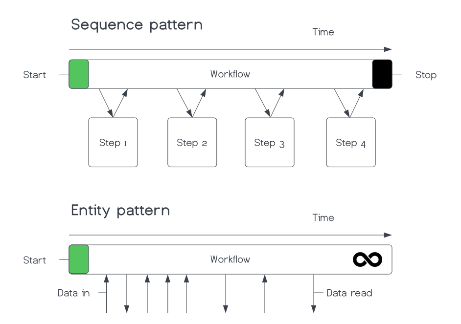
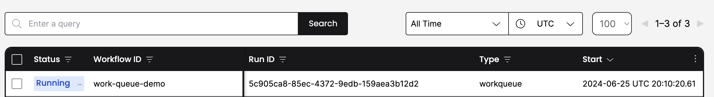

### Introduction

A Slash Command Slack App allows Slack users to interact with an application using a Slash Command (`/<command>`) in a Slack channel.
Slash Commands prevent message clutter in Slack channels and default to messages visible only to the user who initiated the command.
This feature makes them ideal for Slack Channel add-on capabilities.
Slack's built-in `/remind` command is a great example.
The Slash command doesn't create a new message in the channel, and only the person who sets the reminder sees the reminder confirmation.

When you create a Slash Command Slack App, you might need to persist data between interactions.
The `/remind` command serves as another example. When you set a reminder, you need to store that reminder data somewhere so that it triggers at the right time.
Traditionally, you would directly connect to a database to do this.
With a Temporal Application, you can store that data directly within a function that's resilient to process crashes and can be horizontally scaled.

**In this tutorial, you will build a Work Queue Slash Command Slack App.**
Imagine an organization with many teams.
Each team provides a service to the organization and has a Slack channel.
While a common task tracking system might be in place, many micro-tasks don't warrant a full task entry.
For example, an engineer might need a review on a Pull Request from another team they're integrating services with.
Often, these micro-task requests occur through Slack conversations.
Each team might have a dedicated on-call person responsible for handling these requests.
On a busy day, tracking all the requests in the Slack channel could become challenging.
A standard method for submitting requests and managing them would be beneficial.

By the end of this tutorial, you will have built a Slash command Slack App to submit and manage general "work" requests in a Slack channel that responds to interactive block elements.
You will implement an "entity" pattern Temporal Workflow using the Temporal TypeScript SDK to manage the state of your Slack App without a traditional database.
Once finished, you will have a fully functioning Slack App that deployable to a production environment without needing a traditional database.

## Prerequisites

Before starting this tutorial [Set up a local development environment for Temporal and TypeScript](/getting_started/typescript/dev_environment/).

Review or complete the [Run your first Temporal application with the TypeScript SDK](/getting_started/typescript/first_program_in_typescript/) tutorial to get a basic understanding of how Temporal works.

## Overview of the application

Before you start building, take a moment to understand the application and its requirements.

Let's examine the components of the system and how they're arranged.

The system includes a Slack Workspace, a Slack App, a Temporal Service, and a Temporal Application.

Traditionally, you would need a database to maintain the state of your Slack App between interactions in case the Slack App process crashes or goes down.
However, by using Temporal, you can maintain the state of your Slack App directly within a Temporal Application.
The Temporal Workflow maintains state even if the process crashes.
In fact, it can rebuild and resume on a different process on a different machine.



The preceding diagram abstracts Slack's back end as a communication channel between the Slack App and the Slack Workspace.
The diagram could also abstract the Temporal Service as a communication channel.
However, for folks learning Temporal, it's helpful to understand that the Temporal Service is a separate service from the Temporal Application.

**Is trading off a database for Temporal worth it?**

When you use Temporal, you actually get the database for free, and you also gain the benefits of the coding paradigm, reliable Workflows, scalable Workflows, and observable Workflows.

During the development process, instead of a managing a database, you will run a Temporal Service locally alongside your Temporal Application.
You should already have it running if you completed the [Prerequisite steps](#prerequisites).

So, during development, you will manage three things: your Temporal Application, the Slack bot, and the Temporal Service.
However, after the development process, if you use Temporal Cloud as your Temporal Service, you only need to deploy the Temporal Application the same way you would your Slack App.
Then, your Temporal Application replaces an entire database with less than 70 lines of code, plus you get the benefits of Temporal.



To use Temporal Cloud in production, see the [Deploy your application to DigitalOcean](/tutorials/typescript/work-queue-slack-app/deploy) part of the tutorial for more information.

Next, review the functional requirements for the application:

1. A user can submit a work request with a Slash Command.
2. A user can see all the work requests for the channel with a Slash Command.
3. When viewing all the work requests for the channel, a user can click a button to claim a work request.
4. When viewing all the work requests for the channel, a user can click a button to mark a work request as complete.
5. A user can delete the Work Queue for the channel with a Slash Command.

Below is a demonstration of the application's functionality:


Now it's time to start setting things up.

## Create a new Slack App configuration

Before you write any code, you need to configure your application with Slack to get your API tokens.
You'll use these to connect your app to the Slack API.

Go to https://api.slack.com/apps?new_app=1 and create an app "From scratch." Name the app whatever you want, and select a workspace that you intend to install it to.

Once you've done this, click "Create App."

Next, enable **Socket Mode**.

Under Settings in the navigation bar, select **Socket Mode** and toggle ON socket mode for this application.



Socket Mode means that we don't have to setup and expose a HTTP server to receive events from Slack.
When you enable **Socket Mode**, Slack gives you an application token that you will need when you start the app.
This token will typically start with `xapp`.
It is located under **App-Level Tokens** in **Basic Information**.

Now, create a Slash Command.

Select **Slash Commands** in the sidebar navigation, and click **Create New Command**.
Add a new command for `/workqueue`.
Since you have **Socket Mode** enabled, you won't need to add a request URL.



Next, Subscribe to Events

You need to subscribe to specific events for your Slack App to receive them.
Under **Features** in the navigation bar, select **Event Subscriptions** and ensure **Enable Events** is turned ON.
Then navigate to the section under **Subscribe to bot events** and add subscriptions for:

- `message.groups`
- `message.im`
- `message.channels`



Once you've done this, click **Save Changes**.

Next, set up **OAuth & Permissions** to authorize your app to access specific data within Slack.

Under **Features** in the navigation bar, go to **OAuth & Permissions**.

You'll need to enable the following Bot Token Scopes:

- `channels:history`
- `channels:read`
- `chat:write`
- `groups:history`
- `groups:read`
- `im:history`
- `mpim:history`

After you've done this, install the app in Slack by going to **Install App** under Settings in the navigation bar.

Lastly, you will need **Signing Secret** and **App Level Token** from the Basic Information page.
You will also need the **Bot User OAuth Token** from the Install App page, which is also available on the OAuth & Permissions page.
Record these strings for now so you can use them to configure your app later.

Now you will move on to setting up TypeScript projects and writing code.

## Create TypeScript Projects for the Slack App

You need two TypeScript projects for this Slack application.
The first of these can just be named `temporal-application`.
If you recently completed the [Set up a local development environment for Temporal and TypeScript](/getting_started/typescript/dev_environment/) tutorial, you can reuse that project structure.
The other project should be called `bot`.

You can create a new TypeScript project for the bot by running the following commands in your terminal:

```
mkdir bot
cd bot
npm init
tsc --init
```

Those commands create a new directory for the bot project, initialize a new `npm` project, and create a new `tsconfig.json` file for TypeScript.

:::note Project structure

This tutorial assumes that your TypeScript projects are organized like this:

```plaintext
-- your-workqueue-slack-app
  |-- temporal-application # This is the Temporal Application project
  |   |-- .env
  |   |-- src
  |   |   |-- workflows
  |   |   |   |-- workqueue.ts
  |   |   |-- index.ts
  |   |-- package.json
  |   |-- tsconfig.json
  |-- bot # This is the Slack bot project
  |   |-- .env
  |   |-- src
  |   |   |-- index.ts
  |   |-- package.json
  |   |-- tsconfig.json
  |-- common-types # These types are shared by both projects
      |-- types.ts
```

:::

In the `temporal-application` project, install `dependencies` and `devDependencies` with the following commands:

```shell
npm install @temporalio/worker dotenv path
npm install --save-dev typescript ts-node @types/node
```

Similarly, in the `bot` project, install the dependencies with the following commands:

```shell
npm install @slack/bolt @slack/web-api @temporalio/client crypto date-fns dotenv
npm install --save-dev typescript ts-node @types/node
```

Next, define your environment variables.

Your bot application will be using your Slack tokens to authenticate.
Per the [12 Factor App methodology](https://12factor.net/config), you shouldn't commit these to your project repository, hard code them in your application in any way, or store them in configuration files.
Instead, you should store your credentials in environment variables.
Specifically, you will store them in an `.env` file in your project root, and add that `.env` file to a `.gitignore` file in the project root so that they will not be accidentally committed.

#### Slack bot environment variables {#slack-env-variables}

Grab the [Slack credentials](#credentials) you got from the Slack App configuration, and in the project root of the bot application, add them to a `.env` file:

```plaintext
SLACK_SIGNING_SECRET="<slack-signing-secret>"
SLACK_BOT_TOKEN="<slack-bot-token>"
SLACK_APP_TOKEN="<slack_app_token>"
SLACK_WORKSPACE="<slack_workspace>"
ENV="dev"
```

Also add your Slack Workspace and an `ENV` variable.
You can find yor Slack Workspace in the dropdown in the top left of your Slack Window, or in the URL when you are logged into Slack.
It is the part of the URL that comes after `https://` and before `.slack.com`, e.g. `<your-workspace>.slack.com`.

The `ENV` variable is prepended to the Task Queue name for your Temporal Application.
This enables you to use the same Temporal Namespace locally and in production without worrying about production Tasks getting executed on your local machine.

#### Temporal Application environment variables {#worker-env-variables}

In the `temporal-application` project, make sure you have a `.env` file in the root of the project and add the `ENV` variable:

```plaintext
ENV="dev"
```

Next, define the common types used across the application.

Create a file `types.ts` in the `common-types` directory and define a Work Item data object and its statuses:

<!--SNIPSTART typescript-slack-app-common-types-->

[docs/tutorials/typescript/work-queue-slack-app/build/code/common-types/types.ts](https://github.com/temporalio/temporal-learning/blob/edu-2636-workqueue-slackbot-tut/docs/tutorials/typescript/work-queue-slack-app/build/code/common-types/types.ts)

```ts
export interface WorkqueueData {
  id: string;
  timestamp: string;
  channelName: string;
  channelId: string;
  userId: string;
  work: string;
  status: WorkqueueStatus;
  claimantId?: string;
  // Add more properties as needed
}

export enum WorkqueueStatus {
  Backlog = 1,
  InProgress = 2,
  Done = 3,
}
```

<!--SNIPEND-->

Now that that is set up, you can start building the Work Queue Workflow.

## Create a Work Queue Workflow {#create-work-queue-workflow}

Before you start building the Slack bot, you need to create a Temporal Workflow to persist the state of the Work Queue.

This Workflow will be long running (a business process that could live for days, weeks, or years) and any given instance of it will map directly to a specific Slack channel.
This pattern is often referred to as the Entity Workflow pattern.

This is in contrast to a "Sequence pattern" where the Workflow is expected to execute a set of steps and then return.
Our "Entity pattern" Workflow won't ever return except to return a "Cancellation" error when it receives a Cancellation request.



Other very common use cases for an entity pattern Workflow are:

- Customers
- Shopping carts
- Orders
- Users

In fact, depending on the goal of the business process, you might find it convenient to represent any significant long living object as an Entity Workflow.
This could be especially true if a distributed set of services needs to access that object.

To craft the Entity Workflow pattern you will use the handy `condition` API that comes with the Temporal TypeScript SDK.
You can use this to await on a specific condition before continuing.

In this case the Workflow awaits on a [Continue-As-New](https://docs.temporal.io/workflows#continue-as-new) suggestion from the Temporal Service.
This is a suggestion to essentially create a new instance of the Workflow with a fresh Event History because the current one is too large.

With Temporal, state and the state transitions, persist inside the Workflow's Event History.
As you add and remove work items from the Work Queue, the Event History grows.

When you continue the Workflow as a new one, you will pass the latest Work Queue data to the new Workflow instance, leaving the old Event History behind, but retaining the state of the Work Queue.

<!--SNIPSTART typescript-slack-app-temporal-application-workqueue-workflow {"selectedLines": ["1-5", "9-10", "21-22", "51-66"]}-->

[docs/tutorials/typescript/work-queue-slack-app/build/code/temporal-application/src/workflows/workqueue.ts](https://github.com/temporalio/temporal-learning/blob/edu-2636-workqueue-slackbot-tut/docs/tutorials/typescript/work-queue-slack-app/build/code/temporal-application/src/workflows/workqueue.ts)

```ts
import {
  isCancellation,
  continueAsNew,
  workflowInfo,
  condition,
  // ...
} from "@temporalio/workflow";
import {WorkqueueData} from "../../../common-types/types";
// ...
export async function workqueue(existingData?: WorkqueueData[]): Promise<void> {
  const wqdata: WorkqueueData[] = existingData ?? [];
  // ...
  try {
    // Await until suggestion to Continue-As-New due to History size
    // If a Cancellation request exists, the condition call will throw the Cancellation error
    await condition(() => workflowInfo().continueAsNewSuggested);
  } catch (e) {
    // Catch a Cancellation error
    if (isCancellation(e)) {
      // Set the Workflow status to Cancelled by throwing the CancelledFailure error
      throw e;
    } else {
      // Handle other types of errors
      throw e;
    }
  }
  await continueAsNew<typeof workqueue>(wqdata);
}
```

<!--SNIPEND-->

What's also handy about the `condition` API is that if there is a Cancellation request, the condition call will throw a Cancellation error.
This means you don't have to explicitly check for a Cancellation request in the code.

In the context of Temporal, the preceding will create a Workflow Execution that stays running until it's explicitly told to stop.
In other words, your Work Queue will persist indefinitely until you delete it.

Next, you will want to define message handlers within the Workflow.
With Temporal, than means handling Signals and Queries.

**[Signals](https://docs.temporal.io/encyclopedia/application-message-passing#signals)** are a way to send data into a Workflow.
**[Queries](https://docs.temporal.io/encyclopedia/application-message-passing#queries)** are a way to read the state of a Workflow.

You will use a Signal to add work to the Work Queue, a Signal to claim work, and a Signal to complete work.
You will use a Query to get the current state of the Work Queue.

It is a good practice to define the Signals and Queries outside of the Workflow and handle them right after declaring local state variables within the Workflow.

<!--SNIPSTART typescript-slack-app-temporal-application-workqueue-workflow {"selectedLines": ["1", "6-9", "12-21", "24-49", "66"]}-->

[docs/tutorials/typescript/work-queue-slack-app/build/code/temporal-application/src/workflows/workqueue.ts](https://github.com/temporalio/temporal-learning/blob/edu-2636-workqueue-slackbot-tut/docs/tutorials/typescript/work-queue-slack-app/build/code/temporal-application/src/workflows/workqueue.ts)

```ts
import {
  // ...
  defineQuery,
  defineSignal,
  setHandler,
} from "@temporalio/workflow";
// ...
export const getWorkqueueDataQuery =
  defineQuery<WorkqueueData[]>("getWorkqueueData");
export const addWorkToQueueSignal =
  defineSignal<[WorkqueueData]>("addWorkqueueData");
export const claimWorkSignal =
  defineSignal<[{workId: string; claimantId: string}]>("claimWork");
export const completeWorkSignal =
  defineSignal<[{workId: string}]>("completeWork");

export async function workqueue(existingData?: WorkqueueData[]): Promise<void> {
  // ...
  // Register a Query handler for 'getWorkqueueData'
  setHandler(getWorkqueueDataQuery, () => {
    return wqdata;
  });

  // Register the Signal handler for adding work
  setHandler(addWorkToQueueSignal, (data: WorkqueueData) => {
    wqdata.push(data);
  });

  // Register Signal handler for claiming work
  setHandler(claimWorkSignal, ({workId, claimantId}) => {
    const workItem = wqdata.find((item) => item.id === workId);
    if (workItem) {
      workItem.claimantId = claimantId;
      workItem.status = 2;
    }
  });

  // Register Signal handler for completing work
  setHandler(completeWorkSignal, ({workId}) => {
    const index = wqdata.findIndex((item) => item.id === workId);
    if (index !== -1) {
      wqdata.splice(index, 1);
    }
  });
  // ...
}
```

<!--SNIPEND-->

Now, register your Workflow with a Temporal Worker.

A Temporal Worker is effectively synonymous with a Temporal Application.
It is the "bundled" code of your application that runs in a process.
You need the Worker code to run your Workflow code.

If you don't already have it, create `worker.ts` inside of `temporal-application/src` and add the following code:

<!--SNIPSTART typescript-slack-app-temporal-application-dev-worker-->

[docs/tutorials/typescript/work-queue-slack-app/build/code/temporal-application/src/dev-worker.ts](https://github.com/temporalio/temporal-learning/blob/edu-2636-workqueue-slackbot-tut/docs/tutorials/typescript/work-queue-slack-app/build/code/temporal-application/src/dev-worker.ts)

```ts
import "dotenv/config";
import path from "path";
import {Worker, NativeConnection} from "@temporalio/worker";

async function run() {
  try {
    const worker = await Worker.create({
      namespace: process.env.TEMPORAL_DEV_NAMESPACE || "",
      workflowsPath: path.resolve(__dirname, "./workflows"),
      taskQueue: `${process.env.ENV}-temporal-iq-task-queue`,
    });

    await worker.run();
  } catch (err) {
    console.error(err);
    process.exit(1);
  }
}

run();
```

<!--SNIPEND-->

Make sure your `package.json` file in the `temporal-application` project has a script to run the Worker:

```json
{
  // ...
  "scripts": {
    "start": "ts-node src/worker.ts"
  }
  // ...
}
```

Then from the root of the `temporal-application` project, run it using the following command:

```shell
npm start
```

Leave the Worker running while you develop the Slack bot.

:::note

If you make any changes to the Workflow code you will need to restart the Worker.

:::

Now that you have the Work Queue Workflow in place, you can start building the interactive bot portion of the application.

## Develop your Slack Bot {#develop-slack-bot}

To develop the Slack bot, you create two modules, one for the Temporal Client, and one that interacts with the Work Queue Workflow.
Your main `slack_bot.ts` file will initialize the Slack App and the Temporal Client, and pass off interactions to the Work Queue module.

First, you will need to create and export a Temporal Client in `bot/modules/temporal-client.ts`.

<!--SNIPSTART typescript-slack-app-dev-temporal-client-->

[docs/tutorials/typescript/work-queue-slack-app/build/code/bot/modules/dev-temporal-client.ts](https://github.com/temporalio/temporal-learning/blob/edu-2636-workqueue-slackbot-tut/docs/tutorials/typescript/work-queue-slack-app/build/code/bot/modules/dev-temporal-client.ts)

```ts
import "dotenv/config";
import {Client, Connection} from "@temporalio/client";

export let temporalClient: Client;

export async function initializeTemporalClient() {
  const connection = await Connection.connect();

  temporalClient = new Client({
    connection,
    namespace: process.env.TEMPORAL_DEV_NAMESPACE!,
  });
}
```

<!--SNIPEND-->

Now, you can initialize the Slack App in `bot/slack_bot.ts`.

In the root of the `bot` project, create a file called `slack_bot.ts` and initialize the Slack bot, making sure to import and initialize the Temporal Client module:

<!--SNIPSTART typescript-slack-app-workqueue-slackbot-bot {"selectedLines": ["1-3", "8-9", "16-22", "65-83"]}-->

[docs/tutorials/typescript/work-queue-slack-app/build/code/bot/slack_bot.ts](https://github.com/temporalio/temporal-learning/blob/edu-2636-workqueue-slackbot-tut/docs/tutorials/typescript/work-queue-slack-app/build/code/bot/slack_bot.ts)

```ts
import "dotenv/config";
import {
  App,
  // ...
} from "@slack/bolt";
import {initializeTemporalClient} from "./modules/dev-temporal-client";
// ...
// Initializes your app with your bot token, app token, and signing secret
const app = new App({
  token: process.env.SLACK_BOT_TOKEN!,
  signingSecret: process.env.SLACK_SIGNING_SECRET!,
  socketMode: true,
  appToken: process.env.SLACK_APP_TOKEN!,
});
// ...
// Register Slack bot error handler
app.error(async ({error}: {error: Error}) => {
  if (error instanceof Error) {
    console.error(`Error: ${error.name}, Message: ${error.message}`);
  } else {
    console.error("An unknown error occurred", error);
  }
});

// Start the app
(async () => {
  try {
    await app.start();
    await initializeTemporalClient();
    console.log("⚡️ Bolt app is running!");
  } catch (error) {
    console.error("Failed to start Bolt app:", error);
  }
})();
```

<!--SNIPEND-->

Now, you can create the `workqueue` module that interact with the Work Queue Workflow.

Create a new file `bot/modules/workqueue.ts`.
This is where a majority of the Slack Command, work claiming, and work completing handling logic will live.

Here you will export a function that looks at the command text and decides what to do based on the text.

<!--SNIPSTART typescript-slack-app-bot-workqueue-module {"selectedLines":["2-5","7-9","18","20-36"]}-->

[docs/tutorials/typescript/work-queue-slack-app/build/code/bot/modules/workqueue.ts](https://github.com/temporalio/temporal-learning/blob/edu-2636-workqueue-slackbot-tut/docs/tutorials/typescript/work-queue-slack-app/build/code/bot/modules/workqueue.ts)

```ts
// ...
import {
  SayFn,
  RespondFn,
  SlackCommandMiddlewareArgs,
  // ...
} from "@slack/bolt";
import {WorkqueueData, WorkqueueStatus} from "../../common-types/types";
import {temporalClient} from "./dev-temporal-client";
// ...
import {WorkflowExecutionAlreadyStartedError} from "@temporalio/client";
// ...
// Handles and routes all incoming Work Queue Slash Commands
export async function handleWorkqueueCommand(
  command: SlackCommandMiddlewareArgs["command"],
  say: SayFn,
  respond: RespondFn
) {
  const commandText = command.text?.trim();

  if (commandText === "!delete") {
    await deleteWorkqueue(command, say);
  } else if (commandText === "") {
    await displayWorkQueue(command, respond);
  } else {
    await addWorkToQueue(command, say);
  }
  return;
}
```

<!--SNIPEND-->

In the preceeding snippet you can see that the there are three possible ways to use the `workqueue` Slash Command.

1. `workqueue !delete` - This will delete the Work Queue for the channel.
   To achieve this you will need to send a Cancellation request to the Work Queue Workflow.
2. `workqueue` - This will display the current Work Queue for the channel.
   To achieve this you will need to send a Query to the Work Queue Workflow.
3. `workqueue <work>` - This will add a new work item to the Work Queue for the channel.
   To achieve this you will need to send a Signal to the Work Queue Workflow.

To display the Work Queue, first you need to ensure that a Work Queue exists for this channel.
If one already exists you will get a "Workflow already started" error.
If it does, then in this case you will just ignore the error and Query the Workflow.

Define three functions, `displayWorkQueue`, `createNewWorkqueue`, and `queryWorkqueue` in the `workqueue.ts` module.

<!--SNIPSTART typescript-slack-app-bot-workqueue-module {"selectedLines":["67-117"]}-->

[docs/tutorials/typescript/work-queue-slack-app/build/code/bot/modules/workqueue.ts](https://github.com/temporalio/temporal-learning/blob/edu-2636-workqueue-slackbot-tut/docs/tutorials/typescript/work-queue-slack-app/build/code/bot/modules/workqueue.ts)

```ts
// ...
// Display the Work Queue for the channel
// Creates a new Work Queue if it does not exist
async function displayWorkQueue(
  command: SlackCommandMiddlewareArgs["command"],
  respond: RespondFn
) {
  // Get the channel name in plain text
  const channelName = command.channel_name;
  // Create a new Work Queue for the channel
  await createNewWorkQueue(channelName);
  // If the Work Queue already exists, Query it
  const data = await queryWorkQueue(channelName, respond);
  await replyEphemeral(
    respond,
    "Work Queue cannot display",
    formatWorkqueueDataForSlack(channelName, data)
  );
}

// Create a new Work Queue for the channel if one does not exist
async function createNewWorkQueue(workflowid: string): Promise<void> {
  try {
    await temporalClient.workflow.start("workqueue", {
      taskQueue: `${process.env.ENV}-temporal-iq-task-queue`,
      workflowId: workflowid,
    });
  } catch (e) {
    if (e instanceof WorkflowExecutionAlreadyStartedError) {
      console.log("Workflow already started");
    } else {
      throw e;
    }
  }
}

// Read the state of the Work Queue for the channel using a Query
async function queryWorkQueue(
  workflowId: string,
  say: SayFn
): Promise<WorkqueueData[]> {
  try {
    const handle = temporalClient.workflow.getHandle(workflowId);
    const result = await handle.query<WorkqueueData[]>(getWorkqueueDataQuery);
    console.log("Current workqueue data:", result);
    return result;
  } catch (error) {
    console.error("Error querying workqueue data:", error);
    await say("An error occurred while Querying the Work Queue.");
    return [];
  }
}
```

<!--SNIPEND-->

In the preceding snippet, the `createNewWorkqueue` function attempts to start a new Work Queue Workflow.
If there is a Workflow already running for the channel, it will catch the WorkflowExecutionAlreadyStartedError, but ignore it and continue.
The `queryWorkqueue` function then sends a Query to the Work Queue Workflow for the channel and returns the data.
This pattern reduces the need to explictly check if a Workflow exists before sending the Query.

Next, add the functionality to add work to the Work Queue.

To add work to the Work Queue, define a function `addWorkToQueue` in the `workqueue.ts` module.
This function needs to build the Work Item data object and call another function to actually send the Signal to the Workflow.

Click the link at the top of the code snippet to visit the source code and see the full code implementation for building the Work Item data object.

<!--SNIPSTART typescript-slack-app-bot-workqueue-module {"selectedLines":["119-131", "182-194"]}-->

[docs/tutorials/typescript/work-queue-slack-app/build/code/bot/modules/workqueue.ts](https://github.com/temporalio/temporal-learning/blob/edu-2636-workqueue-slackbot-tut/docs/tutorials/typescript/work-queue-slack-app/build/code/bot/modules/workqueue.ts)

```ts
// ...
// Add work to the queue using a Signal
async function addWorkToQueue(
  command: SlackCommandMiddlewareArgs["command"],
  say: SayFn
) {
  // Get the channel name in plain text
  const channelId = command.channel_id;
  const channelName = command.channel_name;
  const wqdata = buildWQData(command, channelId, channelName);
  await signalAddWork(wqdata, say);
  // Reply to the message directly in the thread
  await reply(say, `Added Work ${wqdata.id} to the Queue.`);
}
// ...
async function signalAddWork(params: WorkqueueData, say: SayFn): Promise<void> {
  try {
    await temporalClient.workflow.signalWithStart("workqueue", {
      workflowId: params.channelName,
      taskQueue: `${process.env.ENV}-temporal-iq-task-queue`,
      signal: addWorkToQueueSignal,
      signalArgs: [params],
    });
  } catch (error) {
    console.error("Error signaling workqueue data:", error);
    await say("An error occurred while Signaling the Work Queue.");
  }
}
```

<!--SNIPEND-->

The key part of this functionality is using the Temporal Client's `signalWithStart` API.
This API enables you to start the Workflow if it doesn't exist and then send the Signal with Work Item data.
Essentially, this one API makes it so you don't have to check whether the Workflow exists before sending the Signal.

Next, implement the functionality that will allow a user to claim a work item from the Work Queue.

In the `slack_bot.ts` file, you will need to add a listener for the `wq_claim` button click event.

<!--SNIPSTART typescript-slack-app-workqueue-slackbot-bot {"selectedLines": ["10","12","14","30-46"]}-->

[docs/tutorials/typescript/work-queue-slack-app/build/code/bot/slack_bot.ts](https://github.com/temporalio/temporal-learning/blob/edu-2636-workqueue-slackbot-tut/docs/tutorials/typescript/work-queue-slack-app/build/code/bot/slack_bot.ts)

```ts
// ...
import {
  // ...
  signalClaimWork,
  // ...
} from "./modules/workqueue";
// ...
// Listen for Work Item Claim
app.action<BlockAction<BlockElementAction>>(
  "wq_claim",
  async ({ack, say, body}) => {
    await ack();
    // Ensure the body.actions[0] is a ButtonAction
    const action = body.actions[0] as ButtonAction;
    if (action.value) {
      const [channelName, workId, userId] = action.value.split("_");
      const claimantId = body.user.id;
      // Send signal to the Temporal workflow to claim the work
      await signalClaimWork(channelName, workId, claimantId, userId, say);
    } else {
      console.error("Action value is undefined.");
    }
  }
);
```

<!--SNIPEND-->

Then, in `workqueue.ts` module, define a `claimWork` function that sends a Signal to the Work Queue Workflow to claim the work item.

<!--SNIPSTART typescript-slack-app-bot-workqueue-module {"selectedLines":["196-214"]}-->

[docs/tutorials/typescript/work-queue-slack-app/build/code/bot/modules/workqueue.ts](https://github.com/temporalio/temporal-learning/blob/edu-2636-workqueue-slackbot-tut/docs/tutorials/typescript/work-queue-slack-app/build/code/bot/modules/workqueue.ts)

```ts
// ...
export async function signalClaimWork(
  channelName: string,
  workId: string,
  claimantId: string,
  userId: string,
  say: SayFn
) {
  try {
    const handle = temporalClient.workflow.getHandle(channelName);
    await handle.signal(claimWorkSignal, {workId, claimantId});
    console.log(`Work item ${workId} claimed by ${claimantId}`);
    await reply(
      say,
      `<@${userId}> Work item ${workId} claimed by <@${claimantId}>.`
    );
  } catch (error) {
    console.error("Failed to signal claim work:", error);
  }
}
```

<!--SNIPEND-->

When someone finishes working on the task they will need to be able to mark it as complete.

In the `slack_bot.ts` file, you will need to add a listener for the`wq_complete` button click event.

<!--SNIPSTART typescript-slack-app-workqueue-slackbot-bot {"selectedLines": ["10", "13-14", "48-63"]}-->

[docs/tutorials/typescript/work-queue-slack-app/build/code/bot/slack_bot.ts](https://github.com/temporalio/temporal-learning/blob/edu-2636-workqueue-slackbot-tut/docs/tutorials/typescript/work-queue-slack-app/build/code/bot/slack_bot.ts)

```ts
// ...
import {
  // ...
  signalCompleteWork,
} from "./modules/workqueue";
// ...
// Listen for Work Item Completion
app.action<BlockAction<BlockElementAction>>(
  "wq_complete",
  async ({ack, say, body}) => {
    await ack();
    const action = body.actions[0] as ButtonAction;
    if (action.value) {
      const [channelName, workId, userId] = action.value.split("_");
      const message = body.message as GenericMessageEvent;
      // Send signal to the Temporal workflow to complete the work
      await signalCompleteWork(channelName, workId, message, userId, say);
    } else {
      console.error("Action value is undefined.");
    }
  }
);
```

<!--SNIPEND-->

Then, in the `workqueue.ts` module, define a function `completeWork` that sends a Signal to the Work Queue Workflow to mark the work item as complete.

<!--SNIPSTART typescript-slack-app-bot-workqueue-module {"selectedLines":["216-231"]}-->

[docs/tutorials/typescript/work-queue-slack-app/build/code/bot/modules/workqueue.ts](https://github.com/temporalio/temporal-learning/blob/edu-2636-workqueue-slackbot-tut/docs/tutorials/typescript/work-queue-slack-app/build/code/bot/modules/workqueue.ts)

```ts
// ...
export async function signalCompleteWork(
  channelId: string,
  workId: string,
  message: GenericMessageEvent,
  userId: string,
  say: SayFn
) {
  try {
    const handle = temporalClient.workflow.getHandle(channelId);
    await handle.signal(completeWorkSignal, {workId});
    console.log(`Work item ${workId} marked as complete`);
    await reply(say, `<@${userId}> Work item ${workId} marked as complete.`);
  } catch (error) {
    console.error("Failed to signal complete work:", error);
  }
}
```

<!--SNIPEND-->

Lastly, you will want to have the compatibility to delete a Work Queue for the channel.
This is useful if you just want to start fresh with a new Work Queue, especially if you are testing out the App,
because otherwise you will need to constantly visit the Temporal UI or use the Temporal CLI to terminate the Workflow.

To send a Cancellation Request, in the `workqueue.ts` module, define a function that uses the Temporal Client to get the handle of Workflow using the Workflow ID.
This Slack App assumes that the Slack channel name is unique and therefor can be used as the Workflow ID.

<!--SNIPSTART typescript-slack-app-bot-workqueue-module {"selectedLines":["133-148"]}-->

[docs/tutorials/typescript/work-queue-slack-app/build/code/bot/modules/workqueue.ts](https://github.com/temporalio/temporal-learning/blob/edu-2636-workqueue-slackbot-tut/docs/tutorials/typescript/work-queue-slack-app/build/code/bot/modules/workqueue.ts)

```ts
// ...
// Delete the Work Queue for the channel with a Cancellation Request
export async function deleteWorkqueue(
  command: SlackCommandMiddlewareArgs["command"],
  say: SayFn
): Promise<void> {
  const workflowId = command.channel_name;
  try {
    const handle = temporalClient.workflow.getHandle(workflowId);
    await handle.cancel();
    console.log(`Workflow with ID ${workflowId} has been cancelled.`);
    await reply(say, `Work Queue has been deleted for this channel.`);
  } catch (error) {
    console.error(`Failed to cancel workflow with ID ${workflowId}:`, error);
    await reply(say, `Failed to delete Work Queue for this channel.`);
  }
}
```

<!--SNIPEND-->

By using the Slack channel name as the Workflow ID, you can tell which Workflow corresponds to which channel in the Temporal UI if you need to do any debugging.



Now you can run your Slack bot.

Make sure your `package.json` file in the `bot` project has a script to run the Slack bot:

```json
{
  // ...
  "scripts": {
    "start": "ts-node src/slack_bot.ts"
  }
  // ...
}
```

Then from the root of the `bot` project, run the Slack bot:

```shell
npm start
```

Once running the bot will be listening for the `workqueue` Slash Command, the `wq_claim` button click event, and the `wq_complete` button click event in your Slack workspace.

## Test the Workflow with Jest framework (Optional) {#test-workflow}

As an optional step, you can test the Work Queue Workflow using the Jest testing framework.
This is a good practice to ensure that your Workflow is working as expected.

To test your Work Queue Workflow, create `workqueue.test.ts` in the `temporal-application/src/__tests__` directory.

Ensure you have the following devDependencies in your `package.json`:

```json
{
  // ...
  "devDependencies": {
    "@temporalio/client": "^1.10.1",
    "@temporalio/nyc-test-coverage": "^1.10.1",
    "@temporalio/testing": "^1.10.1",
    "@types/jest": "^29.5.12",
    "@types/node": "^20.14.2",
    "jest": "^29.7.0",
    "ts-jest": "^29.1.4",
    "ts-node": "^10.9.2",
    "typescript": "^5.4.5"
    // Any other packages needed for testing logic
  }
  // ...
}
```

The Temporal TypeScript SDK comes equipped with a Test Suite and a pattern for testing Workflows.

Set up the Test Suite like this:

<!--SNIPSTART typescript-slack-app-workqueue-workflow-tests {"selectedLines": ["1-3", "14-29", "171"]}-->

[docs/tutorials/typescript/work-queue-slack-app/build/code/temporal-application/src/**tests**/workqueue.test.ts](https://github.com/temporalio/temporal-learning/blob/edu-2636-workqueue-slackbot-tut/docs/tutorials/typescript/work-queue-slack-app/build/code/temporal-application/src/__tests__/workqueue.test.ts)

```ts
import {TestWorkflowEnvironment} from "@temporalio/testing";
import {WorkflowCoverage} from "@temporalio/nyc-test-coverage";
import {Worker, Runtime, DefaultLogger} from "@temporalio/worker";
// ...
describe("Work Queue Workflow", () => {
  let testEnv: TestWorkflowEnvironment;
  const workflowCoverage = new WorkflowCoverage();

  beforeAll(async () => {
    Runtime.install({logger: new DefaultLogger("WARN")});
    testEnv = await TestWorkflowEnvironment.createLocal();
  });

  afterAll(async () => {
    await testEnv?.teardown();
  });

  afterAll(() => {
    workflowCoverage.mergeIntoGlobalCoverage();
  });
  // ...
});
```

<!--SNIPEND-->

You can test for many scenarios.
For example, you could test for the following:

- Adding work to the queue
- Claiming work in the queue
- Completing work in the queue
- Continuing-As-New when event count is high

The basic pattern to test adding work to the Work Queue looks like this:

<!--SNIPSTART typescript-slack-app-workqueue-workflow-tests {"selectedLines": ["31-41", "43-50", "58-66"]}-->

[docs/tutorials/typescript/work-queue-slack-app/build/code/temporal-application/src/**tests**/workqueue.test.ts](https://github.com/temporalio/temporal-learning/blob/edu-2636-workqueue-slackbot-tut/docs/tutorials/typescript/work-queue-slack-app/build/code/temporal-application/src/__tests__/workqueue.test.ts)

```ts
// ...
test("should add work to the queue", async () => {
  // Get a test environment Temporal Client
  const {client, nativeConnection} = testEnv;
  // Create a test environment Worker
  const worker = await Worker.create(
    workflowCoverage.augmentWorkerOptions({
      connection: nativeConnection,
      taskQueue: "test",
      workflowsPath: require.resolve("../workflows"),
    })
  );
  // ...
  // Run the Worker
  await worker.runUntil(async () => {
    const handle = await client.workflow.start(workqueue, {
      args: [],
      workflowId: workflowId,
      taskQueue: "test",
    });
    const workItem: WorkqueueData = {
      // ...
    };
    // Add work to the queue
    await handle.signal(addWorkToQueueSignal, workItem);
    // Check to see if the data is there
    const result = await handle.query(getWorkqueueDataQuery);
    // Compare the data
    expect(result).toContainEqual(workItem);
  });
});
```

<!--SNIPEND-->

For more test examples, see the Work Queue Workflow test file by clicking the link at the top of the preceding code snippet.

## Conclusion

In this tutorial, you built a Slack App that uses Temporal to manage a Work Queue.
You created a Work Queue Workflow, sent messages to the Workflow, and tested the Temporal Application.

This Slack App is a great example of how you can use Temporal as a backend for your application without having to manage a database.
Plus, the backend is scalable and you can observe it and debug it using the Temporal UI.

**Next, [Deploy your TypeScript Slack App to production on a DigitalOcean Droplet using Temporal Cloud](/tutorials/typescript/work-queue-slack-app/deploy)**.
