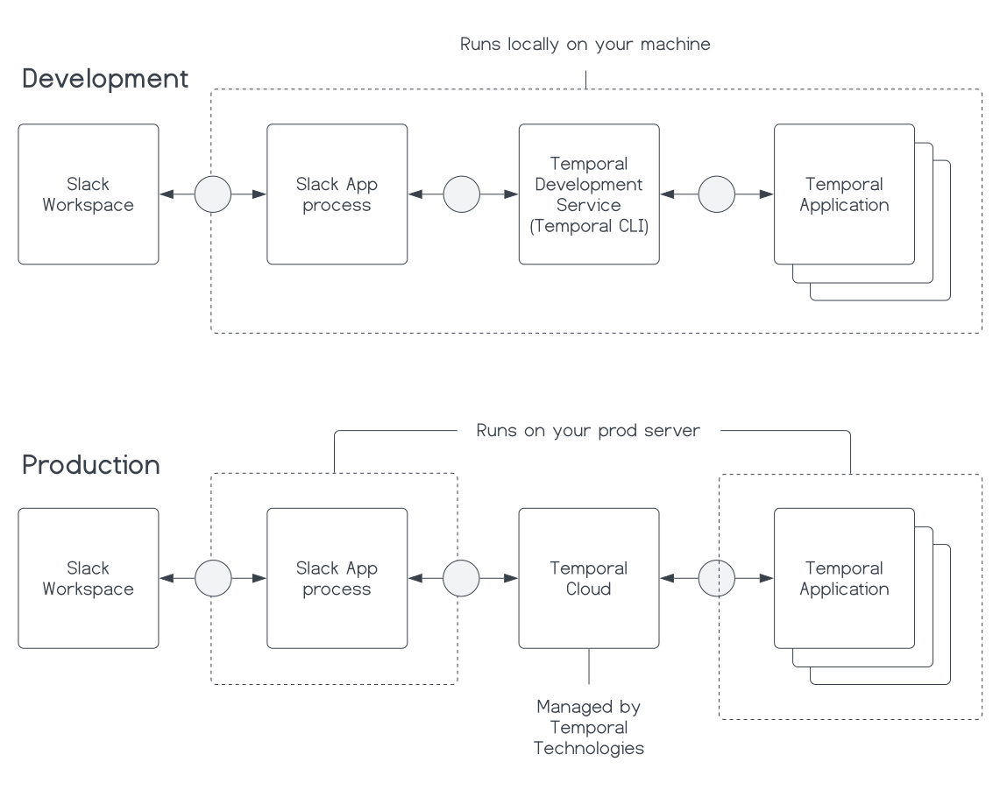

### Introduction

When you are ready to deploy your TypeScript based Slack App to production, you need a server to host it.
You will also need to connect to a Temporal Service to orchestrate and supervise your Temporal Application.

In development, you can use a local Temporal Service to orchestrate your Temporal Application.
However, in production, you will want to use a Temporal Service that can handle scale, like Temporal Cloud.



DigitalOcean provides flexible Cloud servers called Droplets that you can use to host your Slack bot and Temporal Application.
You can then use Temporal Cloud to orchestrate your Temporal Application.

In this tutorial you'll deploy your Temporal backed Slack App to a DigitalOcean Droplet while using Temporal Cloud as your Temporal Application's orchestrator.

## Prerequisites

Before you begin, you will need the following:

- **Complete the [Build a Work Queue Slack App with TypeScript and Temporal](/tutorials/typescript/work-queue-slack-app/build) tutorial:** This tutorial builds on the previous tutorial, so you need to have completed it.
  However, you should be able to refer to these steps generically for any TypeScript Temporal Application you have built.
- **A DigitalOcean account:** You need a [DigitalOcean account](https://cloud.digitalocean.com/login) to create a Droplet.
- **A domain name:** You need a domain, because you need to have a valid SSL certificate for the Temporal Application to communicate with Temporal Cloud.
- **A Temporal Cloud account:** You need a [Temporal Cloud account](https://cloud.temporal.io) from which to create a Namespace.
- **A Temporal Cloud Namespace:** You need a [Namepsace](https://docs.temporal.io/cloud/namespaces#create-a-namespace) in which to register a certificate for your Temporal Application to communicate with Temporal Cloud.
- **A Temporal Cloud Namespace Certificate:** You will need a certificate to authenticate the communication between your Temporal Client, Temporal Workers, and Temporal Cloud.
  You can use tcld to generate the certificate.
  Follow the [steps to install tcld](https://docs.temporal.io/cloud/tcld#install-tcld).
  Then, follow the [steps to generate a Temporal Cloud certificate using tcld](https://docs.temporal.io/cloud/certificates#use-tcld-to-generate-certificates).
  Make sure you have saved your certificate to your Temporal Cloud Namespace.

## Prepare your app for Temporal Cloud {#prepare-app}

First, you need to update each of your `.env` files with your Temporal Cloud credentials so you can test your application locally to ensure it works with Temporal Cloud.
You should have a `.env` file in the root of your `temporal-application` and `bot` directories.

Add your PEM (certificate), Private Key, Temporal Address, and Temporal Cloud Namespace to your `.env` file as environment variables.

Example:

```shell
TEMPORAL_CLOUD_ADDRESS="<your-temporal-cloud-address>"
TEMPORAL_CLOUD_NAMESPACE="<your-temporal-cloud-namespace>"
# Note that you will want to retain the multiline format for the PEM and Private Key
TEMPORAL_CLOUD_PEM="<your-temoral-cloud-namespace-pem>"
TEMPORAL_CLOUD_PRIVATE_KEY="<your-temporal-cloud-namespace-key>"
```

Then, update your code to use Temporal Cloud.

Connecting to Temporal Cloud requires a few changes to your Temporal Client and Worker, using the environment variables you set in the `.env` file.

You will need to update your Temporal Client and your Temporal Worker code.

When developing locally, your Temporal Client, located in `bot/modules/temporal-client.ts`, looks like this:

<!--SNIPSTART typescript-slack-app-dev-temporal-client-->

[docs/tutorials/typescript/work-queue-slack-app/build/code/bot/modules/dev-temporal-client.ts](https://github.com/temporalio/temporal-learning/blob/edu-2636-workqueue-slackbot-tut/docs/tutorials/typescript/work-queue-slack-app/build/code/bot/modules/dev-temporal-client.ts)

```ts
import "dotenv/config";
import {Client, Connection} from "@temporalio/client";

export let temporalClient: Client;

export async function initializeTemporalClient() {
  const connection = await Connection.connect();

  temporalClient = new Client({
    connection,
    namespace: process.env.TEMPORAL_DEV_NAMESPACE!,
  });
}
```

<!--SNIPEND-->

To use Temporal Cloud, change the Temporal Client code to read your Namespace certificate key and pem env variables.
Then change the connection object to includes the Namespace and certificate information:

<!--SNIPSTART typescript-slack-app-cloud-temporal-client-->

[docs/tutorials/typescript/work-queue-slack-app/build/code/bot/modules/cloud-temporal-client.ts](https://github.com/temporalio/temporal-learning/blob/edu-2636-workqueue-slackbot-tut/docs/tutorials/typescript/work-queue-slack-app/build/code/bot/modules/cloud-temporal-client.ts)

```ts
import "dotenv/config";
import {Client, Connection} from "@temporalio/client";

export let temporalClient: Client;

export async function initializeTemporalClient() {
  const key = Buffer.from(process.env.TEMPORAL_CLOUD_PRIVATE_KEY!, "utf-8");
  const cert = Buffer.from(process.env.TEMPORAL_CLOUD_PEM!, "utf-8");
  const address = process.env.TEMPORAL_CLOUD_ADDRESS!;
  const namespace = process.env.TEMPORAL_CLOUD_NAMESPACE!;
  const connection = await Connection.connect({
    address: address,
    tls: {
      clientCertPair: {
        crt: cert,
        key: key,
      },
    },
  });

  temporalClient = new Client({
    connection,
    namespace: namespace,
  });
}
```

<!--SNIPEND-->

Then update the code for the Temporal Worker to change how it connects.

When developing locally, your Temporal Worker, located in `temporal-application/src/worker.ts`, looks like this:

<!--SNIPSTART typescript-slack-app-temporal-application-dev-worker-->

[docs/tutorials/typescript/work-queue-slack-app/build/code/temporal-application/src/dev-worker.ts](https://github.com/temporalio/temporal-learning/blob/edu-2636-workqueue-slackbot-tut/docs/tutorials/typescript/work-queue-slack-app/build/code/temporal-application/src/dev-worker.ts)

```ts
import "dotenv/config";
import path from "path";
import {Worker, NativeConnection} from "@temporalio/worker";

async function run() {
  try {
    const worker = await Worker.create({
      namespace: process.env.TEMPORAL_DEV_NAMESPACE || "",
      workflowsPath: path.resolve(__dirname, "./workflows"),
      taskQueue: `${process.env.ENV}-temporal-iq-task-queue`,
    });

    await worker.run();
  } catch (err) {
    console.error(err);
    process.exit(1);
  }
}

run();
```

<!--SNIPEND-->

To use Temporal Cloud, you'll change the connection information for your Worker in the same way you changed your client.
Read the certificate env variables and update the connection object to include the Namespace and certificate information.
Alter the `worker.ts` file so it looks like the following:

<!--SNIPSTART typescript-slack-app-temporal-application-cloud-worker-->

[docs/tutorials/typescript/work-queue-slack-app/build/code/temporal-application/src/cloud-worker.ts](https://github.com/temporalio/temporal-learning/blob/edu-2636-workqueue-slackbot-tut/docs/tutorials/typescript/work-queue-slack-app/build/code/temporal-application/src/cloud-worker.ts)

```ts
import "dotenv/config";
import path from "path";
import {Worker, NativeConnection} from "@temporalio/worker";

async function run() {
  try {
    const key = Buffer.from(
      process.env.TEMPORAL_CLOUD_PRIVATE_KEY || "",
      "utf-8"
    );
    const cert = Buffer.from(process.env.TEMPORAL_CLOUD_PEM || "", "utf-8");
    const connection = await NativeConnection.connect({
      address: process.env.TEMPORAL_CLOUD_ADDRESS || "",
      tls: {
        clientCertPair: {
          crt: cert,
          key: key,
        },
      },
    });

    const worker = await Worker.create({
      connection,
      namespace: process.env.TEMPORAL_CLOUD_NAMESPACE || "",
      workflowsPath: path.resolve(__dirname, "./workflows"),
      taskQueue: `${process.env.ENV}-temporal-iq-task-queue`,
    });

    await worker.run();
  } catch (err) {
    console.error(err);
    process.exit(1);
  }
}

run();
```

<!--SNIPEND-->

You can now run your application locally to ensure it works with Temporal Cloud.
If it does, then you can move on to setting up your Droplet.

## Create and set up Droplet {#create-droplet}

Create a new Droplet and choose the Ubuntu 20.04 image or Ubuntu 22.04 image.

Once, created ensure the domain's A record points to the droplet's IP address.

Then, set up the following things on your Droplet so you can run your app:

- Configure SSH
- Install Node.js
- Install TypeScript and TS Node
- Set up Nginx as a reverse proxy
- Create a domain certificate

First, set up SSH so you can set up your server from your local terminal.
You can do that by following the [Add SSH Key to Droplet tutorial](https://docs.digitalocean.com/products/droplets/how-to/add-ssh-keys/).

If you already have a private key on your local machine and you need to force SSH to use the new key, you can force it with the `-i` flag, for example:

```
ssh -i ~/.ssh/id_rsa_digitalocean root@your-droplet-ip
```

Since you are going to be deploying a TypeScript application, you need to install TypeScript into this environment.
Next, install Node.js, a JavaScript runtime for server-side programming.

There are several options for installing Node.js. The most straightforward is to install from your system package manager.
For example, on Ubuntu:

```shell
sudo apt update
sudo apt install nodejs
```

This will install the newest stable version from Ubuntu sources.
If you need to install a different version of Node.js for compatibility reasons, refer to these tutorials respectively:

- [How To Install Node.js on Ubuntu 20.04](https://www.digitalocean.com/community/tutorials/how-to-install-node-js-on-ubuntu-20-04)
- [How To Install Node.js on Ubuntu 22.04](https://www.digitalocean.com/community/tutorials/how-to-install-node-js-on-ubuntu-22-04)

Next, use the Node.js package manager, `npm`, to install some packages that provide TypeScript compatibility.
Install the `typescript` and `ts-node` packages globally, using the `-g` flag:

```
sudo npm install -g typescript ts-node
```

Because you'll be deploying an application that handles external requests over HTTP/S, we strongly recommend also using Nginx reverse proxy.
You'll use Nginx to handle requests and hand them off to your Node.js application.

Node.js applications typically bind to `localhost`.
This means by default, your application will only be accessible locally on the machine it resides on.
While you can specify a different port to allow access through the internet, Node.js's built in application server provides fairly minimal security and configurability.
Using a reverse proxy isolates the application server from direct internet access, allows you to centralize firewall protection, and minimizes the attack surface for common threats such as denial of service attacks.

From a client’s perspective, interacting with a reverse proxy is no different from interacting with the application server directly. It is functionally the same, and the client cannot tell the difference. A client requests a resource and then receives it, without any extra configuration required by the client. Nginx, a popular open source web server, can act as a reverse proxy with a nearly drop-in configuration.

Follow these tutorials, for Ubuntu 20.04 or 22.04 respectively, including setting up the server blocks:

- [Set up Nginx for Ubuntu 20.04](https://www.digitalocean.com/community/tutorials/how-to-install-nginx-on-ubuntu-20-04)
- [Set up Nginx for Ubuntu 22.04](https://www.digitalocean.com/community/tutorials/how-to-configure-nginx-as-a-reverse-proxy-on-ubuntu-22-04)

Next, you can use **Let's Encrypt certbot** to create a certificate for your domain.
This will effectively enable HTTPS for your domain and your DigitalOcean Droplet.

Follow the tutorial for your Ubuntu version:

- [How To Secure Nginx with Let's Encrypt on Ubuntu 20.04](https://www.digitalocean.com/community/tutorials/how-to-secure-nginx-with-let-s-encrypt-on-ubuntu-20-04)
- [How To Secure Nginx with Let's Encrypt on Ubuntu 22.04](https://www.digitalocean.com/community/tutorials/how-to-secure-nginx-with-let-s-encrypt-on-ubuntu-22-04)

Now that you have your Droplet set up, and you have your Temporal Cloud certificate, you can set up your Slack App on the Droplet.

## Configure your Slack App on the Droplet {#configure-app}

Using Git, you can clone the droplet and install the dependencies.

```shell
git clone <your-repo>
cd <your-repo>/temporal-application
npm install
cd ..
cd <your-repo>/bot
npm install
```

:::note Private repos require an access token

If your repo is public then these steps will work.
However, if your repo is private, you will need to use an access token to clone the repo.

:::

Since your `.env` files should be in your `.gitignore`, you will need to create new ones on the Droplet.
Copy and paste the information from your local `.env` files into the respective files that you have created on the Droplet.

Now you can run your application on the Droplet.
Start the slack bot and the Temporal Worker to make sure everything is running as expected.
Go to your Slack workspace and test your Slack App.

If everything is running as expected, then move on to starting everything with `pm2`.

````shell
## Use `pm2` to run your Worker {#use-pm2}

`pm2` is a process manager for Node.js applications, and will ensure that your TypeScript application runs continuously on your Droplet.

```shell
sudo npm install -g pm2
````

Change directory into your project and run your Temporal Worker with `pm2`.

```shell
pm2 start <your-app-entry>.ts --interpreter ts-node
```

You can review your application logs with the `pm2 logs` command.

## Optional - Automate your deployment with a Shell script {#automate-deployment}

You can automate the deployment of your application to your Droplet by creating a shell script that will clone your repository, install dependencies, and start your application with `pm2`.

```shell
#!/bin/bash

set -e

# The URL of your git repository
REPO_URL="https://github.com/<your-org>/<your-repo>"

# The directory you want to clone into
CLONE_DIR="your-workqueue-slack-app"

# Environment variables
SLACK_SIGNING_SECRET="<your-slack-signing-secret"
SLACK_BOT_TOKEN="<your-slack-bot-token>"
SLACK_APP_TOKEN="<your-slack-app-token>"
ENV="prod"
TEMPORAL_CLOUD_ADDRESS="<your-temporal-cloud-address>"
TEMPORAL_CLOUD_NAMESPACE="<your-temporal-cloud-namespace>"
# Note that you will want to retain the multiline format for the PEM and Private Key
TEMPORAL_CLOUD_PEM="<your-temoral-cloud-namespace-pem>"
TEMPORAL_CLOUD_PRIVATE_KEY="<your-temporal-cloud-namespace-key>"

# Remove directory if it exists
rm -rf $CLONE_DIR

# Clone the repository
git clone $REPO_URL $CLONE_DIR

# Kill all the current processes
pm2 kill

# Move into the temporal-application directory
cd $CLONE_DIR/temporal-application

# Create the .env file and populate it with the environment variables
echo "ENV=$ENV" > .env
echo "TEMPORAL_CLOUD_NAMESPACE=$TEMPORAL_CLOUD_NAMESPACE" >> .env
echo "TEMPORAL_CLOUD_ADDRESS=$TEMPORAL_CLOUD_ADDRESS" >> .env
echo "TEMPORAL_CLOUD_PEM=\"$TEMPORAL_CLOUD_PEM\"" >> .env
echo "TEMPORAL_CLOUD_PRIVATE_KEY=\"$TEMPORAL_CLOUD_PRIVATE_KEY\"" >> .env

npm install

pm2 start  ./api_server.js
# Sleep provides a delay to ensure the process is started before saving
sleep 1
pm2 save
sleep 1

cd ..

cd bot

# Create the .env file and populate it with the environment variables
echo "ENV=$ENV" > .env
echo "SLACK_SIGNING_SECRET=$SLACK_SIGNING_SECRET" >> .env
echo "SLACK_BOT_TOKEN=$SLACK_BOT_TOKEN" >> .env
echo "SLACK_APP_TOKEN=$SLACK_APP_TOKEN" >> .env
echo "TEMPORAL_CLOUD_NAMESPACE=$TEMPORAL_CLOUD_NAMESPACE" >> .env
echo "TEMPORAL_CLOUD_ADDRESS=$TEMPORAL_CLOUD_ADDRESS" >> .env
echo "TEMPORAL_CLOUD_PEM=\"$TEMPORAL_CLOUD_PEM\"" >> .env
echo "TEMPORAL_CLOUD_PRIVATE_KEY=\"$TEMPORAL_CLOUD_PRIVATE_KEY\"" >> .env

npm install

pm2 start ./slack_bot.js
sleep 1
pm2 save

echo "The repository has been cloned, .env files have been created successfully, and processes have been started."
```

Run the script with `./<your-script>.sh`.

## Conclusion

You now have a TypeScript based Temporal Application and Slack bot running on a DigitalOcean Droplet using Temporal Cloud as your Temporal Application's orchestrator.
