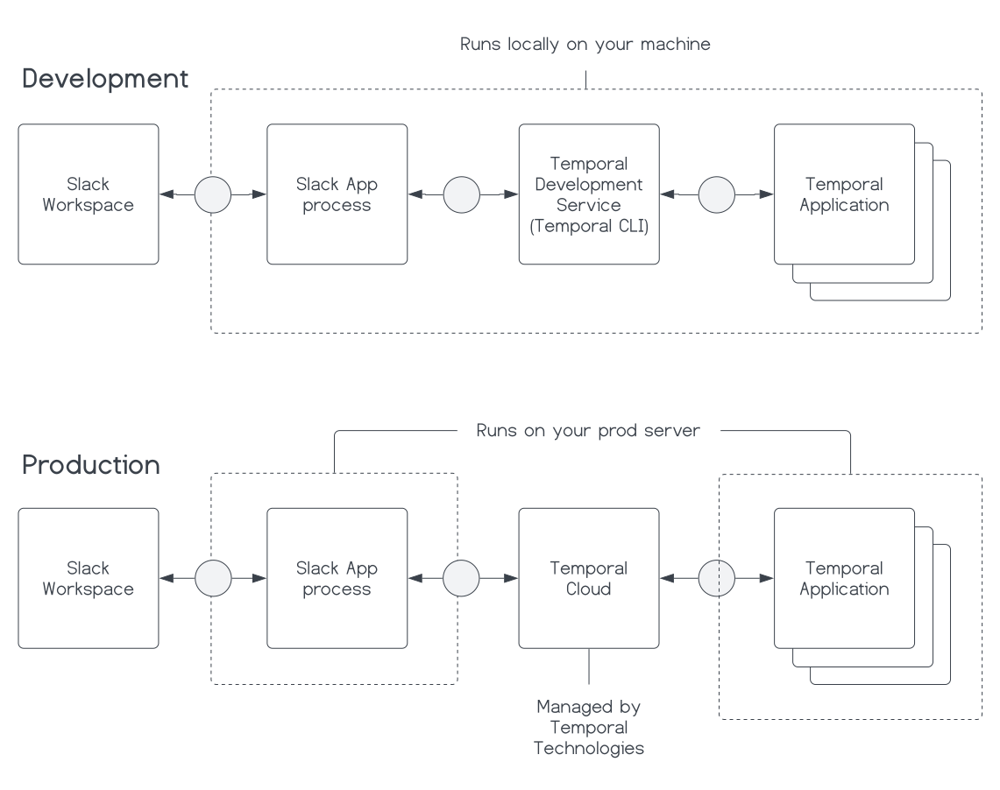

### Introduction

When you're creating a Slash command Slack App, you might need to persist data between interactions.
Traditionally, you would connect directly to a database to do this.
With a Temporal Application, you can persist that data directly within a function that's resilient to process crashes and can be horizontally scaled.

By the end of this tutorial, you will be able to create a Slash command Slack App that responds to interactive block elements.
You will be able to implement an "entity" pattern Temporal Workflow using the Temporal TypeScript SDK to manage the state of your Slack App without a traditional database.
You will gain experience sending and handling application messages, such as Signals and Queries.
And, you will gain experience sending and handling business process Cancellation requests, and use the Continue-As-New feature.
When you're finished, you will have a fully functioning Slack App deployable to a production environment without the need for a traditional database.

## Prerequisites

Before starting this tutorial [Set up a local development environment for Temporal and TypeScript](/getting_started/typescript/dev_environment/).

## Overview of the application

Before you start building, take a moment to understand the application and its requirements.

### Use case

**What's the application you are building a what's the use case?**

You are building a Work Queue Slack App.

Imagine an organization with dozens and dozens of teams.
Each team provides a service to the organization, and each team has a Slack channel.
While there may be a common task tracking system in place, there are often many micro tasks that don't warrant a full task in the task tracking system.
For example, an engineer may need a review on a Pull Request from another team they're integrating services with.
Often these micro task requests come through Slack conversations.
Each team might have a dedicated on-call person responsible for handling these requests.
On a busy day, it could be possible to lose track of all the requests in the Slack channel.
It would be nice to have a standard way for folks to submit requests and for the on-call person to manage them.

The application you are building today is a Slash command Slack App to submit and manage general "work" requests in a Slack channel.

### System architecture

**What are the components of the system and how are they arranged?**

The system consists of a Slack Workspace, a Slack App, a Temporal Service, and a Temporal Application.

Traditionally, you would need a database to persist the state of your Slack App between interactions in case the Slack App process crashes or goes down.
If you use Temporal, you can persist the state of your Slack App directly within a Temporal Application.


The preceding diagram abstracts Slack's back end as a communication channel between the Slack App and the Slack Workspace.
The diagram could also abstract the Temporal Service as a communication channel.
However, for folks learning Temporal, it's helpful to understand that the Temporal Service is a separate service from the Temporal Application.

**Is trading off a database for Temporal worth it?**

Setting up and managing your database can be more overhead.
During the development process instead of a managing a database, you will run a Temporal Service locally alongside your Temporal Application.
You should already have it running if you completed the [Prerequisite steps](#prerequisites).
So, during development it will seem like you're managing two things instead of one.

However, after the development process, if you use Temporal Cloud as your Temporal Service, you only need to deploy the Temporal Application the same way as you would your Slack App.
Then, your Temporal Application replaces an entire database with less than 70 lines of code.



To use Temporal Cloud in production, see the [Deploy your TypeScript application to Digital Ocean](/tutorials/typescript/digital-ocean-deployment) tutorial for more information.

### Functional requirements

**What are the functional requirements of the application?**

1. Using a Slash command, a user can submit a work request.
2. Using a Slash command, a user can see all the work requests for the channel.
3. When viewing all the work requests for the channel, a user can click a button to claim a work request.
4. When viewing all the work requests for the channel, a user can click a button to mark a work request as complete.
5. Using a Slash command, a user can delete the Work Queue for the channel.


## Create a new Slack App configuration

Go to https://api.slack.com/apps?new_app=1 and create an app "From scratch." Name the app whatever you want, and select a workspace that you intend to install it to.

Once you've done this, click "Create App."

### Enable Socket Mode

Under Settings in the navigation bar, select Socket Mode and toggle ON socket mode for this application.


When you enable Socket Mode, Slack gives you an application token that you will need when you start the app.
This token will typically start with `xapp`.
It is located under App-Level Tokens in Basic Information.

### Create a Slash Command

Select "Slash Commands" in the sidebar navigation, and click "Create New Command".
Add a new command for `/workqueue`.
Since you have Socket Mode enabled, you won't need to add a request URL.


### Event Subscriptions

Under Features in the navigation bar, select Event Subscriptions and ensure Enable Events is turned ON.
The navigate to the section under "Subscribe to bot events" and add subscriptions for:

- `message.groups`
- `message.im`
- `message.channels`


Once you've done this, click "Save Changes"

### OAuth & Permissions

Under Features in the navigation bar, go to OAuth & Permissions.

You'll need to enable the following Bot Token Scopes:

- `channels:history`
- `channels:read`
- `chat:write`
- `groups:history`
- `groups:read`
- `im:history`
- `mpim:history`

### Install App

After you've done this, install the app in Slack by going to Install App under Settings in the navigation bar.

### Credentials

You will need **Signing Secret** and **App Level Token** from the Basic Information page.
And you will need the **Bot User OAuth Token** from the Install App page, which is also available on the OAuth & Permissions page.

## Create TypeScript projects for the Slack App

You need two TypeScript projects for this Slack application.
You may have already created the first one for the Temporal Application in the [Prerequisite steps](/getting_started/typescript/dev_environment/).
Here, make sure you have the second one for the Slack bot logic.

This tutorial assumes that your TypeScript projects will be organized like this:

```plaintext
-- your-workqueue-slack-app
  |-- temporal-application # This is the Temporal Application project
  |   |-- .env
  |   |-- src
  |   |   |-- workflows
  |   |   |   |-- work-queue.ts
  |   |   |-- index.ts
  |   |-- package.json
  |   |-- tsconfig.json
  |-- bot # This is the Slack bot project
  |   |-- .env
  |   |-- src
  |   |   |-- index.ts
  |   |-- package.json
  |   |-- tsconfig.json
  |-- common-types # These types are shared by both projects
      |-- types.ts
```

This tutorial uses `npm` as the package manager.

```
npm init
```

And ensures there is a `tsconfig.json` file in each project root.

```
tsc --init
```

### Dependencies for the projects

**Temporal Application dependencies**

In the `temporal-application` project, you will need the following dependencies in your `package.json`:

```json
{
  // ...
  "dependencies": {
    "@temporalio/worker": "^1.10.1",
    "dotenv": "^16.1.3",
    "path": "^0.12.7"
  },
  "devDependencies": {
    "@types/node": "^20.14.7",
    "ts-node": "^10.9.2",
    "typescript": "^5.4.5"
  }
  // ...
}
```

**Slack bot dependencies**

In the `bot` project, you will need the following dependencies in your `package.json`:

```json
{
  // ...
  "dependencies": {
    "@slack/bolt": "^3.19.0",
    "@slack/web-api": "^6.12.0",
    "@temporalio/client": "^1.7.4",
    "crypto": "^1.0.1",
    "date-fns": "^3.6.0",
    "dotenv": "^16.0.3"
  },
  "devDependencies": {
    "@types/node": "^20.14.7",
    "ts-node": "^10.9.2",
    "typescript": "^5.4.5"
  }
  // ...
}
```

### Environment variables

First, make sure you have `.env` added to your `.gitignore` file to avoid committing your credentials.

**Slack bot environment variables**

Grab the [Slack credentials](#credentials) you got from the Slack App configuration and add them to a `.env` file in the `bot` project:

```plaintext
SLACK_SIGNING_SECRET="<slack-signing-secret>"
SLACK_BOT_TOKEN="<slack-bot-token>"
SLACK_APP_TOKEN="<slack_app_token>"
SLACK_WORKSPACE="<slack_workspace>"
ENV="dev"
```

Also add your Slack Workspace and an `ENV` variable.
The `ENV` variable is prepended to the Task Queue name for your Temporal Application.
This enables you to use the same Temporal Namespace locally and in production without worrying about production Tasks getting executed on your local machine.

**Temporal Application environment variables**

In the `temporal-application` project, make sure you have a `.env` file and for now, just add the `ENV` variable:

```plaintext
ENV="dev"
```

### Define commone types

Create a file `types.ts` in the `common-types` directory and define a Work Item data object and its statuses:

<!--SNIPSTART typescript-slack-app-common-types-->

[docs/tutorials/typescript/work-queue-slack-app/code/common-types/types.ts](https://github.com/temporalio/temporal-learning/blob/edu-2636-workqueue-slackbot-tut/docs/tutorials/typescript/work-queue-slack-app/code/common-types/types.ts)

```ts
export interface WorkqueueData {
  id: string;
  timestamp: string;
  channelName: string;
  channelId: string;
  userId: string;
  work: string;
  status: WorkqueueStatus;
  claimantId?: string;
  // Add more properties as needed
}

export enum WorkqueueStatus {
  Backlog = 1,
  InProgress = 2,
  Done = 3,
}
```

<!--SNIPEND-->

## Work Queue Workflow

Before you start building the Slack bot, you need to create a Temporal Workflow to persist the state of the Work Queue.

This Workflow will be "long living" and any given instance of it will map directly to a specific Slack channel.
This pattern is often referred to as the "Entity Workflow" pattern.

This is in contrast to a "Sequence pattern" where the Workflow is expected to execute a set of steps and then return.
Our "Entity pattern" Workflow won't ever return except to return a "Cancellation" error when it receives a Cancellation request.


Other very common use cases for an entity pattern Workflow are:

- Customers
- Shopping carts
- Orders
- Users

In fact, depending on the goal of the business process, you might find it convenient to represent any significant long living object as an Entity Workflow.
This could especially be true if that object needs to be accessed by a distributed set of services.

### Craft the Entity pattern

The Temporal TypeScript SDK comes with a handy `condition` API.
You can use this to await on a specific condition before continuing.

In this case the Workflow awaits on a [Continue-As-New](https://docs.temporal.io/workflows#continue-as-new) suggestion from the Temporal Service.
This is a suggestion to essentially create a new instance of the Workflow with a fresh Event History because the current one is too large.
When we continue the Workflow as a new one, we pass the existing Work Queue data to the new Workflow instance.

<!--SNIPSTART typescript-slack-app-temporal-application-workqueue-workflow {"selectedLines": ["1-5", "9-10", "21-22", "51-66"]}-->

[docs/tutorials/typescript/work-queue-slack-app/code/temporal-application/src/workflows/workqueue.ts](https://github.com/temporalio/temporal-learning/blob/edu-2636-workqueue-slackbot-tut/docs/tutorials/typescript/work-queue-slack-app/code/temporal-application/src/workflows/workqueue.ts)

```ts
import {
  isCancellation,
  continueAsNew,
  workflowInfo,
  condition,
  // ...
} from "@temporalio/workflow";
import {WorkqueueData} from "../../../common-types/types";
// ...
export async function workqueue(existingData?: WorkqueueData[]): Promise<void> {
  const wqdata: WorkqueueData[] = existingData ?? [];
  // ...
  try {
    // Await until suggestion to Continue-As-New due to History size
    // If a Cancellation request exists, the condition call will throw the Cancellation error
    await condition(() => workflowInfo().continueAsNewSuggested);
  } catch (e) {
    // Catch a Cancellation error
    if (isCancellation(e)) {
      // Set the Workflow status to Cancelled by throwing the CancelledFailure error
      throw e;
    } else {
      // Handle other types of errors
      throw e;
    }
  }
  await continueAsNew<typeof workqueue>(wqdata);
}
```

<!--SNIPEND-->

What is also handy about the `condition` API is that if a Cancellation request is made to the Workflow, the condition call will throw a Cancellation error.

In the context of Temporal, the code above will create a Workflow Execution that stays running until it is explicitly told to stop.

### Send data in and out of the Workflow

Next, you will want to define and handle Signals and Queries.

**[Signals](https://docs.temporal.io/encyclopedia/application-message-passing#signals)** are a way to send data into a Workflow.
**[Queries](https://docs.temporal.io/encyclopedia/application-message-passing#queries)** are a way to read the state of a Workflow.

<!--SNIPSTART typescript-slack-app-temporal-application-workqueue-workflow {"selectedLines": ["1", "9-10", "21-22", "51-66"]}-->
<!--SNIPEND-->

### Add unit tests
