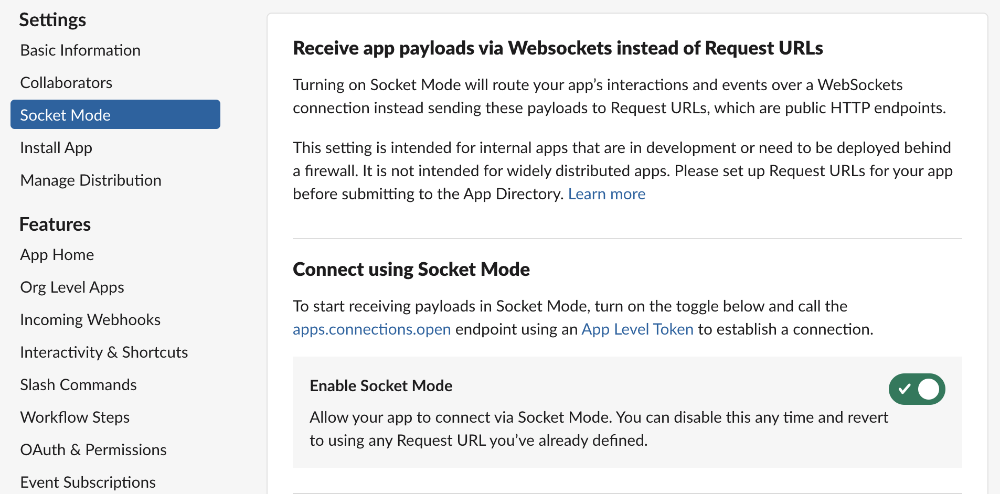

One of the pre-requisites for this tutorial is having a Slack App set up.
If you don't have one, you can follow these instructions to set one up.

## Create a new Slack App

Go to https://api.slack.com/apps?new_app=1 and create an app "From scratch." Name the app whatever you want, and select a workspace that you intend to install it to.

Once you've done this, click "Create App."

## Socket Mode

Under Settings in the navigation bar, select Socket Mode and toggle ON socket mode for this application.

When you enable Socket Mode, Slack gives you an application token that you will need when you start the app.
This token will typically start with `xapp`.
It is located under App-Level Tokens in Basic Information.

## Event Subscriptions

Under Features in the navigation bar, select Event Subscriptions and ensure Enable Events is turned ON.
The navigate to the section under "Subscribe to bot events" and add subscriptions for:

message.groups
message.im
message.channels

Once you've done this, click "Save Changes"

## OAuth & Permissions

Under Features in the navigation bar, go to OAuth & Permissions.

You'll need to enable the following Bot Token Scopes:

- `channels:history`
- `channels:read`
- `chat:write`
- `groups:history`
- `groups:read`
- `im:history`
- `mpim:history`

## Install App

After you've done this, install the app in Slack by going to Install App under Settings in the navigation bar.

## Credentials

You will need **Signing Secret** and **App Level Token** from the Basic Information page.
And you will need the **Bot User OAuth Token** from the Install App page, which is also available on the OAuth & Permissions page.
